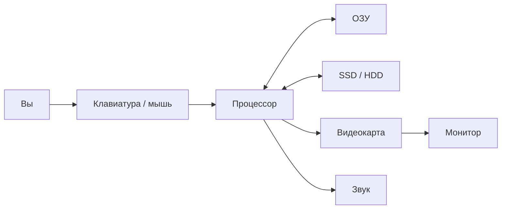

import ExternalPlayEmbed from '@site/src/components/ExternalPlayEmbed';

# Физические компоненты

  ОБЯЗАТЕЛЬНО
  ДЛЯ НОВИЧКОВ

Начальный уровень

---

## Что внутри коробки?

Компьютер — как **конструктор** — из деталей собирается машина, которая хранит файлы, считает и показывает картинку на экране. Снаружи Вы видите монитор, клавиатуру и "системник" (или ноутбук целиком). Внутри — платы, чипы и провода. Сейчас разберём главное **без** формул и квантовой физики.

  
Интерактив

  

  Сначала — спектакль "пробуждения" компьютера, потом — сравни типы ноутбуков и потыкай устройства ввода-вывода.

  

<ExternalPlayEmbed example="about/computer-architecture-play" title="Computer Architecture" />

<ExternalPlayEmbed example="basics/laptop-explorer-play" title="Laptop Explorer" />

---

### Четыре друга любого компьютера

Без этих четырёх частей устройство не считается полноценным компьютером — хоть это телефон, хоть приставка:

| Часть | За что отвечает | Простая метафора |
|--------|------------------|------------------|
| **Процессор (CPU)** | Выполняет команды программы | Мозг / дирижёр |
| **Оперативная память (RAM)** | Хранит то, с чем работаем *прямо сейчас* | Рабочий стол |
| **Накопитель (SSD/HDD)** | Хранит файлы и программы надолго | Шкаф с папками |
| **Ввод и вывод** | Клавиатура, мышь, экран, динамики | Уши, руки, глаза |

Процессор **не помнит** Ваши фото годами — для этого есть диск. А оперативная память **забывает всё**, когда выключили питание: как стол, который убрали к уроку.

---

### Снаружи — с чем Вы общаетесь

**Клавиатура и мышь** — Вы "говорите" компьютеру — буква, клик, прокрутка.  
**Монитор и колонки** — компьютер "отвечает": картинка, звук.  
**Системный блок** — корпус, где живут процессор, память и диск. В ноутбуке всё это спрятано под клавиатурой.

<ExternalPlayEmbed example="about/io-devices-play" title="Io Devices" />

---

### Энергия

Ничего не работает без электричества. В розетку воткнут **блок питания** — он раздаёт "ровный" ток по деталям, как умный распределитель. В телефоне и ноутбуке роль запасного источника играет **аккумулятор**.

> Не включай ПК мокрыми руками и не лей воду на клавиатуру — это реальная опасность, не шутка из игры.

---

### Материнская плата — главная "доска"

На **материнской плате** сидят процессор, планки памяти, разъёмы для диска и видеокарты. Это как игровое поле, по которому бегают сигналы между деталями. Маленькая батарейка на плате (CR2032) помнит время и настройки, даже когда компьютер выключен.

Когда жмёте кнопку **Power**, сначала просыпается прошивка **BIOS/UEFI** — она проверяет: "память на месте? диск виден?" — и только потом загружает **Windows**, **Linux** или другую систему.

---

### Видеокарта и звук

Если играете в 3D или монтируете видео, помогает **видеокарта (GPU)** — она быстро рисует миллионы точек на экране. В простых задачах (текст, браузер) часто хватает встроенной графики в процессоре.

Звук идёт через **звуковую карту** (часто тоже встроенную) — наушники, микрофон, колонки.

---

### Почему компьютер греется и шумит

Процессор и видеокарта при работе нагреваются. На них ставят **радиатор** и **вентилятор** — как обдув для спортсмена. Если вентилятор шумит как пылесос — возможно, пора почистить пыль (взрослому, с выключенным питанием).

---

### Как всё связано (схема)

Стрелки — "куда текут данные". Вы нажали клавишу → процессор понял, что открыта игра → взял картинку из памяти → видеокарта обновила экран. Всё это — за доли секунды.

---

### Мини-задания

**1. Кто это?**  
Калькулятор с кнопками — компьютер? **Да**, маленький и специальный.  
Механические часы с пружиной — **нет**, там нет программы, которую можно поменять.  
Наушники с шумоподавлением — **да**, внутри чип считает звук.

**2. Где живёт Windows?**  
На диске — как книга на полке. При включении копируется в оперативную память — как раскрыть книгу на столе. Выключил — "стол убрали", несохранённое в блокноте может пропасть.

**3. Соберите из коробки** (в уме):  
Плата с надписью Snapdragon — **процессор**. Полоска зелёных чипов — **RAM**. Чёрный прямоугольник "512 GB" — **диск**. Экран с кнопками — **ввод и вывод**.

---

### Если хотите копнуть глубже

Взрослая энциклопедия на этом же сайте рассказывает про PCIe, NVMe и сборку ПК — загляните в раздел "Как работает компьютер", когда будете готов. Здесь мы остановились на том, **что за что отвечает**, чтобы Вы не боялся открыть боковую крышку (с разрешения взрослых) и узнали знакомые слова — CPU, RAM, SSD.

---
