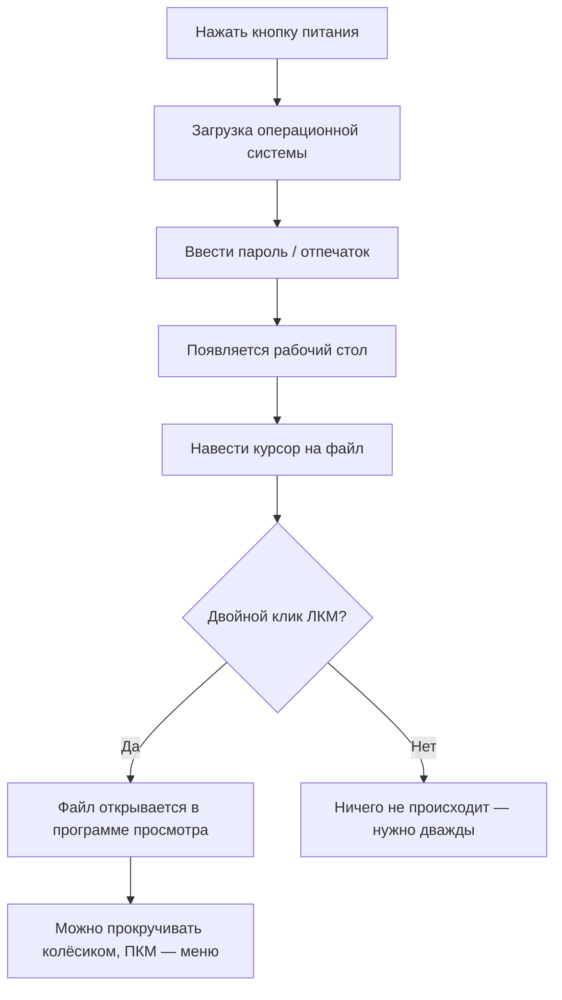

import ExternalPlayEmbed from '@site/src/components/ExternalPlayEmbed';


# Простые действия

<div class="article-tags">
  <span class="tag tag-required">ОБЯЗАТЕЛЬНО</span>
  <span class="tag tag-beginner">ДЛЯ НОВИЧКОВ</span>
</div>

<span class="complexity-badge">Начальный уровень</span>

<div class="callout callout--tip">
  <div class="callout-title">Интерактив</div>

  <div class="callout-body">
  Демо ниже — нажимайте кнопки и смотрите, как это устроено. Ничего на компьютере не меняется.
</div>
  </div>


<ExternalPlayEmbed example="about/keyboard-play" title="Keyboard" />

<ExternalPlayEmbed example="basics/mouse-interactions-play" title="Mouse Interactions" />

---

## Простые действия


Компьютер — это *инструмент*, как велосипед, микроскоп или кисточка для рисования. И как с любым инструментом, с ним нужно научиться *работать*: сначала — очень простыми действиями, а потом — всё сложнее и интереснее.

Эта глава — как первые шаги на велосипеде с боковыми колёсиками. Мы не будем сразу кодить игры или рисовать мультфильмы. Мы познакомимся с тем, *как вообще можно управлять компьютером* — как его "разбудить", как "погладить" мышкой, как "нажимать буквы" и зачем нужны разные кнопки. Это фундамент — прочный, надёжный, и без него дальше не пройти.

---

### Просыпайся, компьютер! Включение и выключение

Любая встреча начинается с приветствия. С компьютером — тоже.


---

#### Включение (запуск системы)

Чтобы компьютер начал работать, его нужно *включить*.  
Обычно это делается кнопкой на системном блоке (у настольного ПК) или на корпусе ноутбука. Кнопка часто светится, когда компьютер включён, и гаснет — когда выключен.

Когда Вы нажимаете кнопку включения:
- компьютер "просыпается": вентиляторы начинают шуметь, экран загорается.
- запускается **операционная система** — это такая "невидимая хозяйка", которая управляет всем внутри — показывает окна, запускает программы, следит, чтобы ничего не сломалось. Например, Windows, macOS, Linux — это разные "хозяйки".
- через несколько секунд появляется **экран входа** (логин-экран).

---

#### Вход в систему

Компьютер — как дверь в дом. Чтобы войти, нужен *ключ*.  
Ключом может быть:
- **пароль** (секретное слово, которое знаете только Вы),
- **PIN-код** (цифровой пароль — короче, но тоже секретный),
- **отпечаток пальца** или **лицо** (если у компьютера есть специальные датчики).

> **Важно** — никогда не сообщайте свой пароль никому — даже другу, даже "техподдержке", которая позвонила сама. Настоящая поддержка *никогда* не спрашивает пароли.

После ввода правильного ключа компьютер открывает *рабочий стол* — главный "стол", на котором лежат иконки (значки программ), часы, панель задач. Это ваша "база".

---

#### Выключение

Компьютер нельзя просто выдернуть из розетки — это как остановить поезд резким торможением: можно повредить вагоны (файлы) и рельсы (систему).  

Правильный порядок:
1. Нажмите на значок **Пуск** (или Apple-меню на Mac).
2. Найдите кнопку **Выключить** (или *Завершение работы*).
3. Выберите:  
   - **Выключить** — полная остановка. Компьютер "засыпает" до следующего утра.  
   - **Перезагрузить** — выключить и сразу снова включить. Нужно, если что-то "зависло" или после установки обновлений.  
   - **Спящий режим** / **Гибернация** — "лёгкий сон": компьютер быстро проснётся, но почти не тратит энергию.

> 🎯 **Аналогия**:  
> Включение — как запуск автомобиля: ключ → зажигание → двигатель заработал.  
> Выключение — как глушение мотора и постановка на ручник.  
> Просто выдернуть вилку — это как выскочить из движущейся машины.

---

### Мышка и клавиатура

Компьютер не слышит голос (пока что — хотя современные помощники вроде Алисы или Siri уже умеют), но он отлично понимает **мышку** и **клавиатуру**. Через них Вы *объясняете*, что хотите.

---

#### Мышка

Мышка — это "палец", которым Вы *указываете* на экран. То, куда Вы наводите мышку, на экране показывает **курсор** — обычно белая стрелка (→), но может быть и другим: например, пальцем (🖱️) на ссылках или часами (🕒) при загрузке.

---

##### Левая кнопка мыши (ЛКМ)

- **Одиночный клик** — *выбрать* что-то (файл, иконку). Как указать пальцем: "Вот это!"
- **Двойной клик** — *открыть* что-то (программу, папку). Быстро нажать два раза подряд.  
  > ⚠️ Не путайте: *один* клик — "посмотреть", *два* — "зайти внутрь".
- **Зажать и перетащить (Drag & Drop)** — *перенести* что-то. Например:  
  1. Наведите курсор на файл.  
  2. Нажмите и *удерживайте* ЛКМ.  
  3. Ведите мышку в другое место (курсор тащит файл за собой).  
  4. Отпустите кнопку — файл "упал" на новое место.  
  Это работает с окнами, значками, текстом — как перетаскивать игрушки с полки на стол.

---

##### Правая кнопка мыши (ПКМ)

Правая кнопка *не выполняет действие сама* — она вызывает **контекстное меню**: список того, *что можно сделать с этим объектом прямо сейчас*.

Например:
- на пустом месте рабочего стола ПКМ → "Создать", "Обновить", "Параметры экрана";
- на файле ПКМ → "Открыть", "Переименовать", "Копировать", "Удалить".

Это как спросить у друга: "Что мы можем сделать с этим?" — и он сразу подскажет варианты.

---

##### Колесо прокрутки

Это маленькое колёсико посередине мышки (у большинства моделей).  
- **Прокрутка вверх/вниз** — листать страницу в браузере, документ в Word, список в почте.  
  Чем быстрее крутите — тем дальше "проскакивает" страница.
- **Нажатие на колесо (как кнопка)** — в некоторых программах включает режим *плавной прокрутки* или *открытия ссылки в новой вкладке* (в браузере).
- У некоторых мышек колесо можно *наклонять влево-вправо* — тогда листается по горизонтали (например, в таблицах Excel).

---

#### Клавиатура

Клавиатура — это *панель управления*, где каждая клавиша — отдельная команда. Даже когда Вы печатаете, Вы отдаёте приказы:  
> "Вставьте букву А", "Сделайте пробел", "Идите на новую строку".


Когда пользователь компьютера нажимает на клавиши, то система формирует набор кода, который отправляется в систему.

Ниже — ключевые "группы" клавиш.

---

##### Основные "рабочие" клавиши

| Клавиша       | Назначение | Пример использования |
|---------------|------------|----------------------|
| **Пробел** (␣) | Делает промежуток между словами | "Привет␣мир" → *Привет мир* |
| **Enter** (↵)  | Подтверждение, новая строка | В чате — отправить сообщение; в тексте — перенос на новую строку |
| **Backspace** (←) | Стереть *предыдущий* символ (слева от курсора) | Написали "примерр" → курсор после "р" → Backspace → "пример" |
| **Delete** (Del) | Стереть *следующий* символ (справа от курсора) | Написали "прример" → курсор между "р" и "р" → Delete → "пример" |
| **Стрелки** (↑↓←→) | Переместить курсор по тексту или интерфейсу | Чтобы не стирать всё с начала, просто подведите курсор к ошибке |
| **Tab** (↹) | Сделать "табуляцию" — большой отступ (часто 4–8 пробелов) | В списках, таблицах, коде — для структуры текста |
| **Caps Lock** | ВКЛ/ВЫКЛ режима ЗАГЛАВНЫХ букв | Включили → все буквы ПИШУТСЯ ТАК. Выключили → снова строчные. Индикатор на клавиатуре покажет состояние. |
| **Shift** (⇧) | Временно сделать ЗАГЛАВНУЮ букву или "верхний" символ | Нажимаете Shift + а → "А"; Shift + 2 → "@" (на русской раскладке — """) |

> 🔍 **Заметка**:  
> - **Shift** работает *только пока Вы держите её*. Отпустили — снова строчные буквы.  
> - **Caps Lock** — переключатель: нажали один раз → включено, ещё раз → выключено.  
> - На некоторых клавиатурах есть отдельная клавиша **fn** (function) — она нужна для управления яркостью, звуком, Wi-Fi (обычно совмещена с F1–F12). Редко используется в простых задачах.

---

##### Ctrl

Клавиша **Ctrl** (Control — "управление") почти *никогда не используется одна*. Она — как магический ключ: нажимаете её *вместе* с другой клавишей — и происходит действие:

| Сочетание | Действие | Где работает |
|-----------|----------|--------------|
| **Ctrl + C** | **Копировать** выделенное | Текст, файлы, изображения |
| **Ctrl + X** | **Вырезать** (скопировать + удалить оригинал) | — |
| **Ctrl + V** | **Вставить** скопированное | — |
| **Ctrl + Z** | **Отменить** последнее действие | Текст, рисунки, действия в программах |
| **Ctrl + Y** | **Повторить** отменённое (редко — Ctrl + Shift + Z) | — |
| **Ctrl + A** | **Выделить всё** | Текст в поле, файлы в папке |
| **Ctrl + S** | **Сохранить** документ | Word, блокноты, рисовалки |
| **Ctrl + P** | **Печать** | Любой документ или страница |

> **Как запомнить?**  
> - **C** — *Copy* (копировать)  
> - **X** — как ножницы (вырезать)  
> - **V** — как вилка, которой "втыкают" текст обратно (вставить)  
> - **Z** — *забыть* (отменить, как "забрать назад")

---

### Как это всё работает вместе?

Вот как происходит простейшее действие — например, *открыть файл с картинкой*:



Эта схема показывает:  
- каждое действие — *последовательность шагов*,  
- компьютер *ждёт команды*,  
- ошибка в одном звене (например, одинарный клик вместо двойного) — и цепочка обрывается.

---

### Шпаргалки для быстрого старта

#### Мышка

| Действие | Как сделать | Результат |
|---------|-------------|-----------|
| Выбрать объект | Один клик ЛКМ | Подсвечивается рамкой или выделяется |
| Открыть файл/папку | Быстрый двойной клик ЛКМ | Запускается программа или открывается содержимое |
| Переместить объект | Нажать ЛКМ → удерживать → двигать → отпустить | Объект "переехал" |
| Вызвать меню | Один клик ПКМ | Появляется список возможных действий |
| Пролистать вниз | Покрутить колесо от себя | Страница движется вверх, Вы "уходите вниз" |
| Пролистать вверх | Покрутить колесо к себе | Страница движется вниз, Вы "поднимаетесь" |

---

#### Клавиши

| Клавиша | Если нажать один раз | Если нажать с Ctrl |
|--------|----------------------|-------------------|
| **C** | Буква "с" | **Ctrl+C** — копировать |
| **V** | Буква "в" | **Ctrl+V** — вставить |
| **Z** | Буква "з" | **Ctrl+Z** — отменить |
| **S** | Буква "с" | **Ctrl+S** — сохранить |
| **A** | Буква "а" | **Ctrl+A** — выделить всё |
| **Tab** | Один большой отступ | **Ctrl+Tab** — переключиться на следующую вкладку (в браузере) |
| **Shift** | Следующая буква — заглавная | **Ctrl+Shift+Esc** — открыть Диспетчер задач (Windows) |

---

### Как компьютер "думает"

Компьютер не обижается, не злится и не устает. Но он *всегда* сообщает — *как он вас понял*. Главное — научиться это замечать.

---

#### Курсор

Курсор — "язык тела" компьютера. Он *меняется*, чтобы подсказать:  
- что сейчас возможно сделать,  
- ожидает ли система ответа,  
- или что-то пошло не так.

Вот самые важные формы:

| Вид курсора | Что означает | Что делать |
|-------------|--------------|------------|
| ➤ (обычная стрелка) | Можно кликать, выбирать, работать | Продолжайте — всё в порядке |
| ✎ (карандаш) | Готов к вводу текста | Начинайте печатать |
| 🕒 (песочные часы / кружок) | Компьютер занят — ждите | Не нажимайте повторно! Подождите 5–10 сек. |
| ⊝ (стрелка + круг) | Загрузка в фоне (например, открытие файла) | Можно работать в другом окне |
| ↕ / ↔ (стрелка + двойная линия) | Можно изменить размер окна или столбца | Наведите на край → зажмите ЛКМ → тяните |
| ✋ (рука с поднятым пальцем) | Ссылка — клик откроет что-то новое | Нажмите ЛКМ, чтобы перейти |
| ✖ (крестик) | Объект можно закрыть, удалить или отменить | Часто над кнопкой "Закрыть" |

> **Практический совет**:  
> Если курсор "завис" в виде часов — *не Выкайте наугад*. Подождите. Если прошло 30+ секунд — нажмите **Ctrl+Alt+Del** (Windows) или **Cmd+Option+Esc** (Mac), чтобы открыть диспетчер задач и проверить — не "зависла" ли какая-то программа.

---

#### Звуковая и визуальная обратная связь

Современные системы используют:
- **Звуки** (щелчок при клике, звонок при ошибке, звук уведомления),
- **Всплывающие уведомления** (в правом нижнем углу — Windows/macOS),
- **Анимации** (плавное появление окон, выделение при копировани).

Это не "украшательства" — это *подтверждение действия*.  
Например:  
- скопировали текст → послышался тихий звук *и* появилось окошко "Скопировано".  
- удалили файл → он "улетает" в корзину с анимацией → если не увидели — возможно, клик не сработал.

> ⚠️ **Важно** — если звуки/анимации отключены (например, на школьных компьютерах), Вы *должны полагаться только на курсор и интерфейс*. Тренируйтесь замечать мелочи: изменился ли цвет кнопки? Появилась ли галочка? Пропал ли файл из списка?

---

### Тихие команды

Кроме Ctrl, есть и другие *модификаторы* — клавиши, которые "меняют смысл" других нажатий. Они редко подписаны в интерфейсе, но делают работу в разы быстрее.

---

#### Esc — "стоп", "отмена", "выйти"

- Закрывает всплывающие окна (настройки, поиск, уведомления).  
- Отменяет выделение (если выделили лишнее — нажмите Esc).  
- В играх — вызывает меню паузы.  
- В браузере — останавливает загрузку страницы.

---

#### Alt — "меню без мыши"

- **Alt + Tab** — переключение между открытыми окнами. Зажмите Alt, нажимайте Tab → появляется панель с иконками. Отпустите — выбранное окно на переднем плане.  
- **Alt + F4** — закрыть *текущее* окно (даже если оно "зависло").  
- **Alt + Пробел** — открыть системное меню окна ("Свернуть", "Развернуть", "Закрыть") — работает, даже если заголовок окна скрыт.

---

#### Win (Windows) / Cmd (macOS) — "главное меню"

- **Win / Cmd** — открыть/закрыть меню "Пуск" / Launchpad.  
- **Win + D** — *свернуть все окна* → показать рабочий стол. Повторное нажатие — вернуть окна.  
- **Win + E** — открыть Проводник (файлы).  
- **Win + L** — *немедленно заблокировать* компьютер (без выключения!) — полезно, если отошли от стола.  
- **Cmd + Tab** (macOS) — аналог Alt+Tab.

> **Почему это важно?**  
> Мыши бывают неудобными (старые, без колеса), сенсорные панели — капризными. А клавиатура *всегда с вами*. Умение управлять без мыши — признак продвинутого пользователя.

---

### Типичные ошибки новичков — и как их избегать

Важно знать: все делают одни и те же ошибки. Знать их — значит пройти половину пути к уверенности.

| Ошибка | Почему происходит | Как избежать / исправить |
|--------|-------------------|--------------------------|
| **Одинарный клик вместо двойного** | Слишком медленно или слишком быстро | Тренируйте ритм: "тик-так" — два чётких удара за 0.3–0.5 сек. |
| **Путаница Backspace/Delete** | Не видно курсора | Всегда сначала *наведите курсор* на место ошибки (стрелками!), *потом* стирайте. |
| **Нажали Delete — файл исчез!** | Не знали, что файл уходит в Корзину | Корзина — "временное хранилище". Откройте её (иконка на рабочем столе) → можно *восстановить* файл. Только "Очистка корзины" — безвозвратное удаление. |
| **Caps Lock включён, а печатается ВСЁ ЗАГЛАВНЫМИ** | Не заметили индикатор (лампочку на клавиатуре) | Перед вводом пароля проверяйте: горит ли лампочка Caps? Если да — нажмите Caps Lock один раз. |
| **Закрыли окно, а не свернули** | Нажали крестик (×), а хотели свернуть (—) | Кнопки в правом верхнем углу:   — (слева) — *свернуть*,   □ — *развернуть/восстановить*,   × — *закрыть*. |
| **Пропало окно: "Куда оно делось?"** | Окно уехало за край экрана (при подключении второго монитора) | Нажмите **Alt + Пробел → M → Стрелка → Enter** — окно "прилипнет" к курсору, и Вы сможете вернуть его на экран. |

---

### Безопасность на этапе освоения

Даже простые действия требуют осторожности. Вот правила, которые *нельзя нарушать*:

1. **Никогда не нажимайте "Да" или "ОК", не прочитав текст**.  
   Пример:  
   > ❌ *"Вы уверены, что хотите удалить файл?"* → автоматически жмёте Enter.  
   > ✅ Читаете: *"Удалить 12 файлов из папки “Диплом”"* → только тогда решаете.

2. **Не удаляйте файлы, названия которых не понимаете** (особенно в папках `Windows`, `Program Files`, `System32`). Это как выкидывать детали из работающего двигателя.

3. **Перед экспериментами — делайте копию**.  
   Например: хотите переименовать папку с фотографиями? Сначала скопируйте её — `Фото_копия` — и тренируйтесь там.

4. **Если компьютер "тормозит" — не включайте ещё 10 программ**.  
   Откройте Диспетчер задач (**Ctrl+Shift+Esc**) → вкладка "Процессы" → сортировка по "ЦП" или "Память". Если какая-то программа "съедает" 90% — выберите её → "Снять задачу".

---

### Как избежать ошибки при удалении

```mermaid
flowchart TD
    A[Хочу удалить файл] --> B{Файл важный?}
    B -->|Да| C[Сначала сделать копию]
    B -->|Нет| D[Выделить файл]
    C --> D
    D --> E[Нажать Delete]
    E --> F[Появилось окно "Удалить?"]
    F --> G{Прочитал текст?}
    G -->|Нет| H[Остановись! Прочитай.]
    G -->|Да| I[Нажать "Да"]
    I --> J[Файл в Корзине]
    J --> K{Нужно ли вернуть?}
    K -->|Да| L[Открыть Корзину → Восстановить]
    K -->|Нет| M[Позже можно очистить Корзину]
```

Эта схема учит:  
- **удаление — двухэтапный процесс**,  
- **Корзина — ваш друг**,  
- **чтение — обязательное условие**.

---
