import ExternalPlayEmbed from '@site/src/components/ExternalPlayEmbed';


# Основы безопасности

<div class="article-tags">
  <span class="tag tag-required">ОБЯЗАТЕЛЬНО</span>
  <span class="tag tag-beginner">ДЛЯ НОВИЧКОВ</span>
</div>

<span class="complexity-badge">Начальный уровень</span>

<div class="callout callout--tip">
  <div class="callout-title">Интерактив</div>

  <div class="callout-body">
  Демо ниже — нажимайте кнопки и смотрите, как это устроено. Ничего на компьютере не меняется.
</div>
  </div>


<ExternalPlayEmbed example="system-network/authentication-flow" title="Поток аутентификации" />

---

## Основы безопасности

*Как стать "цифровым следопытом" и защитить себя и других*

Интернет — это огромный город. В нём есть школы, библиотеки, магазины, площадки для игр и даже музеи. Но, как и в любом большом городе, здесь бывают не только друзья и помощники — иногда встречаются и те, кто хочет обмануть, украсть или просто напугать.  

Это не значит, что интернет плохой. Напротив — он один из самых удивительных инструментов, созданных человеком. Просто, как Вы не открыл бы дверь незнакомцу без вопросов, так и в интернете нужно уметь отличать **надёжное** от **опасного**.

Давайте разберёмся по порядку.

---

### Почему вообще нужна безопасность?

Когда Вы впервые сел за компьютер или взял в руки телефон, Вам, скорее всего, не объяснили, что некоторые действия могут привести к неприятным последствиям:

- Вы можете потерять доступ к своей учётной записи в игре или в школьной платформе.  
- Ваши личные фотографии или сообщения могут увидеть посторонние.  
- Ваш компьютер или планшет может "заболеть" — как человек, только вирусами другого рода — *компьютерными*.  
- В худшем случае — взрослые (родители, учителя) могут понести убытки, если злоумышленник получит доступ к банковским данным или начнёт действовать от их имени.

Но не пугайся: всё это — как правила дорожного движения. Знать их не страшно, а наоборот — спокойно. Потому что Вы *понимаете*, чего избегать и как действовать.

---

### Не нажимайте на незнакомые ссылки

Ссылка — это как дверь в другой дом. Она может вести:

- в официальный магазин (например, `https://shop.lego.com`)  
- в школьный портал (`https://school72.ru`)  
- или… в поддельный "магазин", где вместо конструктора Вас ждут троян и фишинг.

> **Троян** — это программа, которая притворяется чем-то полезным (игрой, картинкой), но на самом деле крадёт данные или портит устройство.  
> **Фишинг** (произносится *фи-шинг*, как "рыбалка") — это попытка выманить у Вас пароль, имя, телефон, выдавая себя за кого-то другого (например, за "поддержку YouTube").

---

#### Как распознать подозрительную ссылку?

Вот несколько признаков:

| Признак | Пример | Почему подозрительно? |
|--------|--------|----------------------|
| Слишком длинная, с цифрами и символами | `https://bit.ly/3xK9q!a?ref=21837` | Короткие ссылки скрывают, куда ведут. А символ `!` в URL почти никогда не бывает на официальных сайтах. |
| Похоже на официальный сайт, но с ошибкой | `https://youtub.com` (без **e**) | Такие сайВы называются *тайпсквоттинг* — специально делают опечатку, чтобы обмануть. |
| Приходит от "незнакомца" или в неожиданном контексте | "Привет! Вы выиграли приз! Жмите сюда 👉" в личных сообщениях от незнакомого аккаунта | Настоящие призы не раздают по случайным сообщениям. |

> ✅ **Правило следопыта**: *Всегда проверяй адрес сайта в строке браузера — не только то, что написано в письме или сообщении.*  
> Если сомневаетесь — не кликайте по ссылке из "поздравления".

---

### Почему важны пароли

Пароль — это ключ от Вашей цифровой комнаты — почты, аккаунта в игре, школьного дневника. Если ключ простой (например, `123456` или `qwerty`), его легко подобрать — как открыть дверь отвёрткой.

---

#### Что делает пароль *надёжным*?

- **Длина** — чем длиннее, тем безопаснее. 10+ символов — уже хорошо.  
- **Разнообразие** — буквы (заглавные и строчные), цифры и знаки (`!`, `?`, `$`).  
- **Уникальность** — *один пароль — одна учётная запись*. Не используйте один и тот же пароль везде.

> ❗ Пример плохих паролей:  
> - `password`  
> - `timur2010` (имя + год рождения — легко угадать)  
> - `11111111`  
> 
> ✅ Пример хорошего пароля:  
> `Голубой_Енот_Прыгает_7!`  
> (Легко запомнить, сложно угадать. И да — можно использовать русские буквы в большинстве систем.)

---

#### Почему нельзя говорить пароли вслух?

Даже если рядом "друг" — кто-то может подслушать. Или записать. Или просто случайно запомнить.  

Пароль — это *личное*. Как номер банковской карты. Как ключ от дома. Его не дают никому — даже если просят "всего на минутку" или "чтобы проверить".

> Совет — используйте **менеджер паролей** (например, Bitwarden, KeePass). Это как цифровой сейф — хранит все пароли под одним *главным* надёжным паролем ("мастер-паролем"). Но мастер-пароль нужно запомнить или записать в надёжное *физическое* место — не на рабочем столе компьютера!

---

### Почему нельзя хранить пароли на рабочем столе

Многие думают: "Напишу в блокноте `passwords.txt` — так удобнее". Это как оставить ключ от квартиры под ковриком у двери.

Почему это опасно:

1. Если Ваш компьютер заразится вирусом — он может прочитать этот файл.  
2. Если к компьютеру подойдёт кто-то другой (друг, брат, гость) — он увидит всё.  
3. Если файл называется `пароли.docx` — его легко найти даже без специальных знаний.

> ✅ **Правило**:  
> - Пароли — в менеджере паролей (защищён шифрованием).  
> - Или — на *бумаге*, в *запертом ящике*, с *условным названием* (например, "Список книг").  
> - Никогда — в открытом файле на компьютере или в облаке без пароля.

---

### Как отличить настоящий сайт от поддельного

Вот пошаговый алгоритм, как проверить сайт — как детектив:

---

#### Шаг 1. Посмотрите на адрес (URL)
- Должен начинаться с `https://` (буква **s** в конце — от *secure*, "безопасный").  
- Рядом со строкой адреса — значок 🔒 (замок). Кликните на него: должно быть написано "Соединение защищено" и название компании (например, *Google LLC* для `google.com`).

---

#### Шаг 2. Проверьте написание
- `mail.ru` — правильно  
- `mail-ru.com`, `mailru.net`, `mai1.ru` — подделка  
- Особенно внимательно с `o` и `0` (нуль), `l` (эль) и `I` (заглавная i), `rn` и `m`.

---

#### Шаг 3. Посмотрите на дизайн

Поддельные сайВы часто:
- Выглядят "немного криво" — шрифВы не те, логотип размытый, кнопки криво расположены.  
- Много ошибок в тексте.  
- Всплывают странные окна: "Срочно введите пароль!", "Ваш аккаунт заблокирован!" — официальные сайВы *никогда* не требуют ввести пароль прямо на главной странице.

---

#### Шаг 4. Перейдите вручную

Если сомневаетесь — закройте вкладку. Откройте браузер заново. Наберите адрес *вручную*: `https://vk.com`, `https://gmail.com`. Не кликайте по ссылкам из писем!

---

### Почему нельзя писать в интернете "Скачать что-то"

Фраза *"скачать [название игры/фильма/программы] бесплатно"* — это как крик: "Я ищу пиратский контент!". Почему это плохо:

1. **Юридически** — это нарушение авторских прав. Авторы (программисты, художники, композиторы) не получают плату за свою работу.  
2. **Технически** — 99% таких сайтов:
   - Полны рекламы, которая может содержать вирусы  
   - Предлагают "установщики", которые на самом деле — трояны  
   - Спрашивают "подтвердить возраст" или "ввести номер телефона" — и начинают списывать деньги  
   - Перенаправляют на фишинговые страницы

> ✅ Правильный подход:  
> - Ищите официальные магазины: **Google Play**, **App Store**, **Steam**, **Microsoft Store**, сайВы разработчиков (`https://jetbrains.com`, `https://minecraft.net`).  
> - Если программа платная, но Вам не по карману — ищите бесплатные аналоги:  
>   - `LibreOffice` вместо Microsoft Office  
>   - `GIMP` вместо Photoshop  
>   - `VS Code` — бесплатный и мощный редактор кода  

Уважение к чужому труду — часть цифровой грамотности.

---

### Как работает "атака" и как ей противостоять

Ниже — схема в формате **Mermaid**, которую можно вставить в HTML-версию книги. Она показывает, как типичная фишинговая атака доходит до жертвы — и на каких этапах можно её остановить.

```mermaid
flowchart TD
    A[Злоумышленник] -->|1. Отправляет письмо/сообщение\n"Вы выиграли приз!"| B(Вы)
    B -->|2. Кликаете по ссылке| C[Поддельный сайт\nвыглядит как YouTube]
    C -->|3. Вводите логин и пароль| D[Данные уходят злоумышленнику]
    D --> E[Он заходит в Ваш аккаунт]

    style A fill:#f99,stroke:#333
    style E fill:#f99,stroke:#333

    subgraph Защита
        B -.->|✅ Не кликайте на ссылки от незнакомцев| F[Проверьте отправителя]
        C -.->|✅ Посмотрите на адрес: youtube-login.ru ❌| G[Настоящий YouTube — youtube.com ✅]
        C -.->|✅ Нет замка 🔒? — закройте вкладку!| H[Безопасное соединение?]
        D -.->|✅ Включена двухфакторная аутентификация? — вход невозможен| I[Дополнительная защита]
    end

    F -->|Решаете игнорировать| Z[Атака провалилась!]
    G --> Z
    H --> Z
    I --> Z

    style Z fill:#9f9,stroke:#090,stroke-width:2px
```

> **Объяснение схемы для ребёнка**:  
> Каждая стрелка слева — шаг атаки. Каждая пунктирная стрелка (с ✅) — Ваш *ответный ход*. Даже если злоумышленник сделали 3 шага, *один* Ваш правильный выбор — и атака останавливается.

---

### Как работает защита

Вы — капитан космического корабля. Ваш корабль — это Ваш аккаунт, телефон или компьютер. Правила безопасности — это *системы жизнеобеспечения* — воздушные фильтры, дублирующие двигатели, аварийные протоколы. Они делают его *возможным*.

Давайте разберём три ключевые системы:

---

### Двухфакторная аутентификация (2FA)

#### Что это?

Обычный вход в систему — это **один фактор**: *знание* (пароль).  
Двухфакторная аутентификация — это **два фактора**:  
1. **Знание** — пароль  
2. **Владение** — что-то, что есть *только у Вас*:  
   - телефон (SMS или приложение)  
   - USB-ключ (например, YubiKey)  
   - отпечаток пальца или лицо (биометрия — тоже "владение телом")

> **Важно: "владение" ≠ "сохранённый пароль в браузере". Это должны быть *отдельный* элемент.

---

#### Как это работает на практике?

1. Вы вводите логин и пароль — как обычно.  
2. Сайт спрашивает: *"Отправить код в SMS?"* или *"Подтвердите в приложении Google Authenticator"*.  
3. Вы вводите код или нажимаете "Разрешить" на своём телефоне.  
4. Только после этого вход разрешён.

> ✅ Пример:  
> Вы пытаетесь зайти в аккаунт Gmail с нового устройства.  
> Вводите пароль → Google отправляет уведомление в приложение **Google Prompt** на Ваш телефон → Вы видите: *"Войти в аккаунт? Устройство: Windows, Москва"* → нажимаете ✅ или ❌.  
> Даже если кто-то украл пароль — без Вашего телефона он не пройдёт.

---

#### Как включить 2FA?

Большинство крупных сервисов поддерживают это:

| Сервис | Где найти настройки 2FA |
|--------|------------------------|
| Google (Gmail, YouTube) | Аккаунт → Безопасность → Двухэтапная проверка |
| ВКонтакте | Настройки → Безопасность → Двухфакторная аутентификация |
| GitHub | Settings → Password and authentication → 2FA |
| Microsoft (Outlook, Xbox) | Аккаунт Microsoft → Безопасность → Дополнительная проверка |

> Совет: **не используйте SMS как единственный способ**. Его можно перехватить. Лучше — приложения-аутентификаторы:  
> - **Google Authenticator**  
> - **Microsoft Authenticator**  
> - **Authy** (сохраняет резервные копи)  
> - **Aegis** (на Android, открытый код)

Они генерируют коды, которые *не зависят от связи* и *не передаются по сети* — значит, их почти невозможно украсть.

---

#### Что делать, если потерял второй фактор?

Хорошие сервисы дают **резервные коды** — 10 одноразовых кодов, которые Вы скачиваете и сохраняете *на бумаге*. Их нужно положить в конверт и спрятать (например, в книге или сейфе). Никогда — в облако без шифрования.

---

### Антивирусы и брандмауэры

Ваш организм защищён от бактерий иммунной системой — белые кровяные тельца, антитела, кожа как барьер. Компьютер — тоже. Только вместо клеток — программы и настройки.

---

#### Антивирус

Современный антивирус — это комплекс:

| Компонент | Как работает | Пример из жизни |
|----------|--------------|----------------|
| **Сгнатурный анализ** | Сравнивает файлы с базой известных вирусов ("портреВы преступников") | Как полицейский сверяет лицо по фото в базе |
| **Эвристический анализ** | Ищет *подозрительное поведение*: файл пытается скрыться, изменить системные настройки, отправить данные наружу | Как охранник замечает: "Почему этот человек копается в замке чужой двери?" |
| **Песочница (Sandbox)** | Запускает файл в изолированной среде — как в лаборатори под колпаком. Смотрит, что он делает, *не заражая* систему | Как учёный проверяет новое вещество в перчаточном боксе |

> ❗ Важно: даже лучший антивирус не поможет, если *Вы сам* разрешите вредоносу работать. Например:  
> - Откроете `.exe`-файл из письма  
> - Нажмёте "Разрешить" в запросе на административный доступ  
> - Отключите защиту "для удобства"

---

#### Брандмауэр (Firewall)

Брандмауэр — это не антивирус. Он не ищет вирусы. Он решает: *какие программы могут общаться с интернетом*.

- Разрешили браузеру — он может загружать страницы.  
- Запретил неизвестной программе `svch0st.exe` — она не сможет отправить Ваши файлы на сервер злоумышленника.

> В Windows и macOS брандмауэр включён по умолчанию.  
> Но: многие программы (игры, торрент-клиенты) просят "разрешить доступ в сеть" при первом запуске. *Всегда читайте, что разрешаете.*

---

### Что делать, если уже нажали на подозрительную ссылку?

Ошибка — не катастрофа. Катастрофа — *не знать, что делать дальше*. Ниже — пошаговый "аварийный протокол".

---

#### Шаг 1. Не паникуй. Сохраните доказательства.

- Сделайте **скриншот страницы**, на которую попал.  
- Запишите **адрес из строки браузера** (даже если он странный).  
- Если вводил что-то — запомни, *что именно* (логин? пароль? номер телефона?).

---

#### Шаг 2. Закройте вкладку. Не закрывай браузер полностью — вдруг нужно посмотреть историю.

#### Шаг 3. Проверь, не установилось ли что-то.

- Откройте **Диспетчер задач** (Ctrl+Shift+Esc на Windows) → вкладка "Процессы".  
- Ищите подозрительные названия:  
  - `svch0st.exe` (с нулём вместо "o")  
  - `Adobe_Flash_Update.exe` (Flash уже не существует!)  
  - `Browser_Defender`, `SystemOptimizer` и т.п. — фальшивые "антивирусы"  

Если нашёл — *не завершай процесс вручную*. Используйте антивирус.

---

#### Шаг 4. Запусти проверку.

- Windows: откройте **Безопасность Windows** → "Проверка на наличие угроз" → "Полная проверка".  
- macOS: перезагрузи, зажав `Cmd + R` → "УтилиВы → Защита от вредоносных программ Apple".

---

#### Шаг 5. Смени пароли — *но только после проверки*.

Если Вы ввели пароль на подозрительном сайте:
1. Сначала убедись, что компьютер "чист".  
2. Затем зайди на *настоящий* сайт (вручную!) и смени пароль.  
3. Включите 2FA.

---

#### Шаг 6. Сообщить.

- Если использовал школьный аккаунт — скажите учителю информатики или администратору.  
- Если ввёл данные родителей — сообщи им *сразу*.  
- В Росси — можно отправить жалобу в [Роскомнадзор](https://rkn.gov.ru/) или на [safe.kaspersky.ru](https://safe.kaspersky.ru/) (сервис "КиберБезопасность для детей").

> 🌟 Главное правило:  
> **Лучше перестраховаться и "напрасно" потратить 10 минут — чем молчать и потерять аккаунт через неделю.**

---

### Цифровая гигиена

```mermaid
flowchart LR
    A[Утро] --> B[Обновил ОС и приложения?]
    B -->|Да| C[Проверил, включён ли брандмауэр]
    C --> D[Использую менеджер паролей?]
    D --> E[Включена 2FA на важных аккаунтах?]
    E --> F[Не открываю вложения от незнакомцев]
    F --> G[Перед скачиванием — проверяю источник]
    G --> H[Вечером — перезагружаю устройство]

    style A fill:#e6f7ff,stroke:#1890ff
    style H fill:#e6f7ff,stroke:#1890ff
    style B fill:#f6ffed,stroke:#52c41a
    style C fill:#f6ffed,stroke:#52c41a
    style D fill:#f6ffed,stroke:#52c41a
    style E fill:#f6ffed,stroke:#52c41a
    style F fill:#fff7e6,stroke:#fa8c16
    style G fill:#fff7e6,stroke:#fa8c16

    classDef safe fill:#f6ffed,stroke:#52c41a;
    classDef caution fill:#fff7e6,stroke:#fa8c16;
    class B,C,D,E safe;
    class F,G caution;
```



> 💬 Пояснение:  
> Зелёные блоки — *рутинная защита*, как чистка зубов.  
> Оранжевые — *моменВы принятия решений*, где нужна внимательность.  
> Привычка — лучшая защита. Через месяц Вы будете делать это автоматически.

---

### Цифровой след, этика и безопасность как привычка

Каждый раз, когда Вы что-то делаете в интернете — оставляете *отпечаток пальца на стекле*.  
Кто-то может его не заметить. Но если посмотреть под правильным углом — он будет виден.  
Иногда — даже спустя годы.

Это не страшилка. Это факт. И как с отпечатками в реальном мире, важно понимать:  
*что* Вы оставляете,  
*кому* это может быть доступно,  
и *почему* это имеет значение — не только для Вас, но и для других.

---

### Цифровой след

#### Что такое цифровой след?

Это вся информация, которая связана с Вами в интернете — *прямо или косвенно*:

| Тип следа | Примеры | Насколько постоянен? |
|-----------|---------|----------------------|
| **Активный след** | ПосВы в соцсетях, комментари, загруженные видео, сообщения в чатах | Очень постоянен: даже "удалённое" может быть сохранено скриншотами, кэшем, архивами |
| **Пассивный след** | IP-адрес при входе на сайт, время просмотра, данные о браузере, история поиска (если не в приватном режиме) | Собирается автоматически. Хранится у провайдера, на серверах сайтов, в аналитике |
| **Производный след** | Выводы, которые делают алгоритмы: "Тимур любит программирование и космос", "часто заходит в 20:00", "живёт в Уфе" | Не виден напрямую, но влияет на рекламу, рекомендации, даже решения кредитных организаций в будущем |

> **Факт:  
> Даже если Вы удалите аккаунт в TikTok через год — видео, которое кто-то сохранил и перезалил, останется.  
> Даже если Вы сидите "инкогнито" — сайт всё равно видит, откуда Вы зашёли и с какого устройства.

---

#### Почему это важно?

Потому что информация не исчезает. А через 5–10 лет:

- Вы подаёте заявку в университет — прикладывается портфолио. А в поиске всплывает старый пост с оскорблениями.  
- Вы хотите устроиться на стажировку в IT-компанию — HR-менеджер видит, что в 12 лет Вы писали в чате: "взломал школьный сайт".  
- Кто-то использует Ваше старое фото (из публичного альбома) в фишинговой рассылке: "Ваш друг Тимур прислал Вам подарок!"

> ✅ Правило цифрового следопыта:  
> **Прежде чем отправить — спросите себя: "Хочу ли я, чтобы это увидели мой учитель? Родитель? Я сам через 10 лет?"**  
> Если хоть один ответ — "нет", — не отправляй.

---

#### Как уменьшить след?

- Используйте приватные аккаунВы (в Instagram, Telegram и т.д.)  
- Не публикуй реальное имя, школу, адрес, номер класса в открытых профилях  
- В настройках Google: [myactivity.google.com](https://myactivity.google.com) → "Удалить активность"  
- Регулярно проверяй: что видно, если вбить Ваше имя в поисковик? (Попробуйте — в режиме инкогнито!)

> Интересный опыт:  
> Попроси взрослого создать *новый* аккаунт в Google и вбить Ваше имя. Что покажет поиск? Это — Ваш *публичный* след. Остальное — скрытое, но не исчезнувшее.

---

### Безопасность и этика

Вы нашли ключ от чужого велосипеда. Вы *можете* его открыть, покататься, даже "проверить, как он едет".  
Но ведь Вы не сделаете этого — потому что это *не Ваш* велосипед.

То же самое — в интернете.

---

#### Почему "взломать для интереса" — плохо?

1. **Это нарушает закон**  
   В Росси статья 272.1 УК РФ ("Неправомерный доступ к компьютерной информации") применяется *независимо от цели*: даже если "ничего не украл и не сломал".  
   Суды рассматривают такие дела — и подростки получают ограничения, вплоть до обязательных работ.

2. **Это вредит другим**  
   — Школьный сайт упал на день перед сдачей проектов.  
   — Учитель не смог выставить оценки, потому что система "странно себя вела".  
   — Родители потеряли данные, потому что антивирус отключился после "теста".

3. **Это разрушает доверие**  
   Если однажды кто-то поймёт, что Вы *можете* взломать — он перестанет делиться с Вами идеями, кодом, проектами. Потому что не будет уверен: а вдруг Вы *заглянете*?

---

#### А что делать, если очень хочется "проверить защиту"?

Есть этичный путь:

**Песочницы и лаборатории**  
— [TryHackMe](https://tryhackme.com/) — игровые комнаВы для обучения хакингу *в контролируемой среде*  
— [Hack The Box: Starting Point](https://www.hackthebox.com/starting-point) — бесплатные виртуальные машины для практики  
— [OverTheWire: Bandit](https://overthewire.org/wargames/bandit/) — квесВы по Linux-безопасности

**Баг-баунти (поиск уязвимостей)**  
Крупные компании (Google, Яндекс, VK) платят за обнаруженные уязвимости — *если сообщить официально и по правилам*.  
Например, программа [Yandex Bug Bounty](https://yandex.com/Безопасность/) принимает отчёВы даже от несовершеннолетних (с согласия родителей).

> **Главный принцип этичного хакинга:  
> **"Получи разрешение — до того, как коснёшься системы"**.  
> Нет разрешения — нет эксперимента.

---

### Безопасность как привычка

Любой навык — езда на велосипеде, игра на гитаре, написание кода — сначала требует усилия. Потом становится автоматическим.  

Безопасность — тоже навык. Вот как превратить её в привычку:

| Действие | Первые 2 недели | Через месяц | Через полгода |
|---------|------------------|-------------|---------------|
| Ввод пароля | Проверяю URL, ищу 🔒, вспоминаю правило "не вслух" | Делаю автоматически — рука сама тянется к менеджеру паролей | Даже в сонном состояни замечаю `http://` вместо `https://` |
| Получение ссылки | Пугаюсь, зову взрослого | Анализирую отправителя, длину, домен | Вижу паттерн "раздача призов" — сразу удаляю |
| Загрузка программы | Качаю с первого попавшегося сайта | Ищу официальный сайт, проверяю сертификат | Читаю отзывы, проверяю хэш файла (если знаю, как) |

> 🧠 Нейропластичность: мозг учится на повторении. Каждое правильное решение — это "усиление дорожки" в нейронной сети. Через время *небезопасное* действие будет вызывать лёгкое внутреннее "нет" — как запах гнилого молока.

---

#### Мини-ритуалы для закрепления

- **"Правило 5 секунд"** — перед кликом — пауза, взгляд на URL, вопрос: *"Это ожидаемо?"*  
- **"Утро понедельника"**: каждое утро — одна минута на обновление паролей/проверку 2FA  
- **"Код чести"**: напишите на листочке 3 правила, которые *никогда* не нарушите. Подпиши, повесь над столом.

---

### Полезные ресурсы и "цифровые тренажёры"

Знания — в действи. Ниже — проверенные, бесплатные, адаптированные для возраста 8–16 лет инструменты.

---

#### Обучающие игры и симуляторы

| Ресурс | Описание | Возраст | Примечание |
|--------|----------|---------|-----------|
| [Google: Безопасность в Интернете](https://beinternetsmart.withgoogle.com/ru) | Интерактивный курс от Google: 5 "законов" цифрового мира (Будь вежлив, Будь осторожен и др.) | 8+ | На русском, с мультфильмами и тестами |
| [Internet Detective](https://jisc.rsc-cpd.org/internetdetective/) | Игра-расследование: как проверять достоверность сайтов | 10+ | На английском, но интуитивно понятна |
| [CyberStart Go](https://joincyberstart.com/go) | Бесплатные квесВы по криптографи, стеганографи, анализу | 13+ | От британской NCSC — реальные задачи, как в CTF |
| [Безопасный интернет от Лаборатори Касперского](https://safe.kaspersky.ru/) | Тесты, комиксы, совеВы по фишингу, кибербуллингу | 7+ | Специально для РФ, учёта законодательства |

---

#### Книги и руководства (бесплатные)

- **"Цифровая гигиена для школьников"** — PDF от РАНХиГС, 2024 (научпоп-уровень, без жаргона)  
- **"Как не попасть в сеть"** — серия брошюр Минцифры Росси ([digital.gov.ru](https://digital.gov.ru/ru/popular/))  
- **"Интернет: инструкция по применению"** — проект "Росмолодёжь", адаптировано под 10–14 лет

---

#### 🛠️ Инструменты для практики

- **Bitwarden** — менеджер паролей с детской инструкцией ([bitwarden.com/help/family/](https://bitwarden.com/help/family/))  
- **uBlock Origin** — блокировщик рекламы и трекеров (уменьшает пассивный след)  
- **Privacy Badger** (от EFF) — автоматически блокирует невидимые "следящие" скрипВы  
- **DuckDuckGo** — поисковик без профилирования (режим `!ducky` даёт отвеВы как голосовой помощник)

> ✅ Все перечисленные инструменты:  
> — бесплатны  
> — не требуют регистрации  
> — не собирают данные  
> — имеют открытый исходный код (можно проверить)

---
