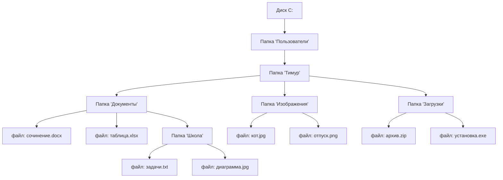

import ExternalPlayEmbed from '@site/src/components/ExternalPlayEmbed';


# Файловая система

<div class="article-tags">
  <span class="tag tag-required">ОБЯЗАТЕЛЬНО</span>
  <span class="tag tag-beginner">ДЛЯ НОВИЧКОВ</span>
</div>

<span class="complexity-badge">Начальный уровень</span>

<div class="callout callout--tip">
  <div class="callout-title">Интерактив</div>

  <div class="callout-body">
  Демо ниже — нажимайте кнопки и смотрите, как это устроено. Ничего на компьютере не меняется.
</div>
  </div>


<ExternalPlayEmbed example="basics/read-write-play" title="Read Write" />

---

## Файловая система

**Файловая система** — способ организовать данные на диске: именованные **файлы** лежат в **папках** (каталогах), папки могут вкладываться друг в друга. ОС по этой структуре сохраняет документы, фото, программы и служебные файлы.

Ниже — что такое файл и папка, зачем у имён бывают суффиксы вроде `.txt` и `.jpg`, и чем отличаются распространённые файловые системы.

---

### Что такое файл?

Файл — это **именованная последовательность данных**, записанная на устройстве хранения (например, на жёстком диске, SSD или флешке).

Звучит сложно? Давайте переведём:

- Вы написали стихотворение в "Блокноте" и сохранил его как `стих_про_море.txt`.  
  → Это файл.
- Вы сфотографировали друга на телефон, перекинул снимок на компьютер и назвал его `друг_на_пляже.jpg`.  
  → Это тоже файл.
- Вы скачали игру, и в папке появился файл `game_setup.exe`.  
  → Опять файл.

Всё, что можно *сохранить*, *открыть* и *передать* — это файл. Даже если внутри него — всего одна буква. Даже если там миллион строк кода.

**Важно понять**: файл — это *реальная запись на диске*. Имя файла (`стих_про_море`), его содержимое (текст стихотворения) и дополнительные метаданные (когда создан, сколько весит, кто владелец) — всё хранится вместе.

---

### Что такое папка?

Папка — это **контейнер**, в который можно складывать файлы и другие папки.

Если файл — это лист бумаги, то папка — это скоросшиватель. Если файл — книга, то папка — стеллаж.

Но! В отличие от бумажных папок, **папки в компьютере не имеют физического объёма**, не "весат" ничего сами по себе — это лите *логическое разделение*. Внутри диска нет "отдельных ящиков" для каждой папки. Всё хранится как единый поток байтов, а файловая система *просто помнит*, какие файлы относятся к какой папке.

Например:

```
Документы/
├── Школа/
│   ├── Математика/
│   │   ├── задачи_5класс.txt
│   │   └── контрольная_по_дробям.pdf
│   └── Литература/
│       └── сочинение_про_героя.docx
└── Личное/
    ├── фото_отпуска/
    │   └── море_2025.jpg
    └── список_желаний.txt
```

Здесь `Документы`, `Школа`, `Математика`, `Литература`, `Личное`, `фото_отпуска` — всё это **папки**. А остальное — файлы.

Кстати:  
- В Windows папки называются *папками*.  
- В macOS и Linux их чаще называют *директориями* (от англ. *directory*), но суть та же.  
- Внутри одной папки **не может быть двух файлов с одинаковыми именами** — иначе компьютер запутается: "Какой из них открыть?"

---

1. **Имя** — `домашка_по_информатике`  

Посмотрите на имя файла: `домашка_по_информатике.docx`.  
Оно состоит из двух частей:

1. **Имя** — `домашка_по_информатике`  
2. **Расширение** — `.docx`

Расширение — это маленькая подсказка для компьютера:  
> "Эй, система! Этот файл сделан по определённому правилу. Пожалуйста, откройте его соответствующей программой".

Вот несколько примеров:

| Расширение | Что обычно внутри | Какая программа открывает |
|------------|-------------------|---------------------------|
| `.txt`     | Простой текст, без форматирования | Блокнот, Notepad++, VS Code |
| `.docx`    | Текст с форматированием (шрифты, картинки) | Microsoft Word, LibreOffice |
| `.jpg`, `.png` | Изображения | Просмотр фотографий, Paint, Photoshop |
| `.mp3`, `.wav` | Звук | Проигрыватель, Audacity |
| `.pdf`     | Документ "как печать" — не редактируется легко | Adobe Reader, браузер |
| `.exe`     | **Исполняемая программа** — код, который компьютер может запустить | Не открывается — *запускается*! |

**Очень важно**: расширение определяет, *как интерпретировать* содержимое файла.

> **Пример:  
> Допустим, Вы переименовали `важный_файл.exe` в `важный_файл.txt`.  
> Вы не превратил программу в текст! Вы просто *обманул* систему. При открыти в Блокноте Вы увидите бессвязный набор символов — потому что это всё ещё машинный код, просто "притворяющийся" текстом. А если дважды кликнуть — система, видя `.txt`, *не запустит* его, и это хорошо: иначе Вы мог бы случайно запустить вредоносную программу.

---

### Как включить отображение расширений в Windows (и зачем это нужно)

По умолчанию Windows скрывает расширения известных типов файлов. Это сделано "для удобства" — но на деле **сильно мешает безопасности и пониманию**.

Почему? Потому что зловреды часто маскируются:  
`фото_кота.jpg.exe` → Windows покажет как `фото_кота.jpg`, но на самом деле это `.exe`! Вы думаете, открываете картинку — а запускаете вирус.

Чтобы этого избежать, **всегда включай отображение расширений**.

---

#### Как включить (Windows 10 / 11)

1. Откройте **Проводник** (любую папку).
2. Вверху нажмите вкладку **"Вид"** (View).
3. Справа — кнопка **"Параметры"** → **"Изменить параметры папок и поиска"**.
   *(Или: вкладка "Вид" → пункт "Показать" → галочка "Расширения имён файлов" — в новых версиях проще.)*
4. В открывшемся окне перейдите на вкладку **"Вид"**.
5. **Сними галочку** с пункта:  
   *"Скрывать расширения для зарегистрированных типов файлов"*.
6. Нажмите **"Применить"**, потом **"ОК"**.

Теперь все файлы будут отображаться *целиком*:  
`список_дел.txt`, `план_урока.docx`, `игра.exe` — никакого обмана.

> ✅ Сделайте это один раз — и забудь. Это как пристегнуть ремень безопасности: не мешает, а спасает.

---

### Осторожнее с `.exe` — и не только

Файлы с расширением `.exe` — это **исполняемые программы**. Когда Вы дважды кликаете по ним, компьютер не просто *читает* содержимое — он **запускает код**, содержащийся внутри.

Это как если бы Вы получили по почте не письмо, а… робота. И как только Вы открыли коробку — робот *ожил* и начал действовать. Он может:
- Установить игру (хорошо),
- Обновить драйверы (хорошо),
- Но также — украсть пароли, удалить файлы, зашифровать диск (плохо).

Поэтому:

- Никогда не запускай `.exe`, полученные из ненадёжных источников (странные сайты, письма от "банка", флешки незнакомцев).
- Даже если иконка выглядит как документ или картинка — смотрите на **расширение**, а не на значок!
- Современные ОС спрашивают разрешения перед запуском — не нажимайте "Да", если не увереныыы.

Кроме `.exe`, будь внимателен и к другим исполняемым форматам:
- `.bat`, `.cmd` — пакетные файлы (запускают команды),
- `.msi` — установочные пакеты Windows,
- `.ps1` — скрипВы PowerShell (мощные, но опасные в чужих руках),
- `.sh` — скрипВы в Linux/macOS.

Все они могут выполнять действия от Вашего имени.

---

### Как устроена файловая система? Немного глубже

Теперь, когда Вы понимаете, что такое файл и папка, зададимся вопросом:  
**А как компьютер вообще *помнит*, где что лежит?**

У Вас есть книга с оглавлением:

> Глава 1 — стр. 5  
> Глава 2 — стр. 27  
> Приложение А — стр. 104  

Файловая система делает то же самое — только для *миллионов* файлов.

На диске есть специальная область — **таблица размещения файлов** (например, **FAT32**, **NTFS** в Windows; **ext4**, **APFS** в Linux/macOS). В ней записано:
- Имя файла и папки, в которой он лежит,
- Где на диске начинаются его данные (физический адрес),
- Сколько места он занимает,
- Права доступа (кто может читать/писать),
- И другие служебные сведения.

Когда Вы дважды кликаете по `рассказ.txt`, компьютер:
1. Смотрит в таблицу: где лежит `рассказ.txt`?
2. Находит его "кусочки" на диске (файлы часто хранятся фрагментами — это нормально),
3. Собирает их в правильном порядке,
4. Передаёт содержимое программе (например, Блокноту).

Всё это происходит за доли секунды.

---

### Как связаны файлы и папки

Вот как можно представить структуру визуально — с помощью диаграммы:



Обратите внимание:
- Стрелки идут от **папки к содержимому**.
- Файлы — на конце веток.
- Папки могут содержать и файлы, и другие папки — *вложенность* может быть сколь угодно глубокой (но на практике редко больше 10–15 уровней).

---

## Подробнее о структуре

В первой части мы рассмотрели файловую систему как дерево каталогов. Далее — пути, диски и типы файловых систем.

Путь похож на адрес: папки — уровни вложенности, файл — конечный объект. На одном компьютере могут использоваться разные **файловые системы** (NTFS, ext4, APFS и др.). Ниже — по порядку.

---

### Что такое диск? И почему их может быть несколько

Когда Вы включаете компьютер, первое, что видите в Проводнике — это буквы — `C:`, `D:`, иногда `E:` или `F:`. Каждая буква — это **логический диск**.

Но физически это может быть:
- Один жёсткий диск (HDD), разделённый на части (`C:` и `D:`),
- Или SSD (`C:`) + внешняя флешка (`E:`),
- Или сетевой диск (например, "Облако" под видом `Z:`).

**Диск — это область хранения, которую операционная система считает отдельной "единицей"**. У каждого диска есть:
- Своя **корневая папка** — самое начало, обозначается просто как `C:\` (обрати внимание на обратный слэш — `\` — это разделитель в Windows).
- Своя файловая система (NTFS, FAT32 и др. — об этом чуть позже),
- Своё пространство — если на `C:` закончилось место, это не значит, что на `D:` тоже.

> 🌍 **Аналогия**:  
> Представьте, что у Вас есть три дома:  
> - Дом `C:` — Ваш основной (там живёт операционная система),  
> - Дом `D:` — кладовая (там фильмы и игры),  
> - Дом `E:` — гостевой (временная флешка).  
> У каждого — своя дверь (корневая папка), свои комнаВы (папки), но они стоят на одной улице — в одном компьютере.

---

### Что такое "путь"? Абсолютный и относительный

Чтобы найти файл в большом шкафу, нужно знать имя и **где именно он лежит**. Для этого существует понятие **пути** — как адрес.

---

#### Абсолютный путь

Это полный "адрес от начала мира" — от корня диска до файла.

Примеры:
- `C:\Пользователи\Тимур\Документы\сочинение.docx`  
- `D:\Фильмы\Пираты_Карибского_моря.mp4`  
- `/home/timur/Pictures/cat.jpg` (в Linux/macOS слэш `/`, а не `\`, и диски не обозначаются буквами)

В таком пути **не может быть неоднозначности** — любой, у кого есть доступ к этому диску, найдёт файл по этому адресу.

> Интересно: в Windows путь всегда начинается с буквы диска и двоеточия (`C:`), затем — корневой слэш (`\`). В Linux и macOS — от корня всей системы (`/`), потому что там нет "дисков-букв", всё подключается в одно древо.

---

#### Относительный путь

Это путь *относительно текущего места*.

Допустим, Вы находитеся в папке:  
`C:\Пользователи\Тимур\Документы\`

И Вам нужно открыть файл `сочинение.docx`, который лежит **рядом** — в той же папке. Тогда достаточно просто написать:  
→ `сочинение.docx`

А если Вы хотите перейти в папку `Школа`, которая лежит **внутри текущей**, путь будет:  
→ `Школа\задачи.txt`

А если нужно выйти **на уровень выше** (например, из `Документы` в `Тимур`), используется обозначение `..` (две точки):  
→ `..\Изображения\кот.jpg`

> **`.` (одна точка) = "здесь", текущая папка.  
> `..` = "туда, откуда я пришли", родительская папка.

Это как давать указания в городе:
- Абсолютный путь: "ул. Ленина, д. 15, кв. 42" — понятно всем.
- Относительный путь — "выйди из подъезда, поверни направо, третий дом" — понятно только тому, кто стоит *уже у этого подъезда*.

---

### Файловые системы

Файловая система — это **набор правил**, по которым шкаф устроен:
- Как хранить имена файлов?
- Как отмечать, какие участки диска заняты, а какие свободны?
- Можно ли ставить пароли на файлы?
- Поддерживаются ли файлы больше 4 ГБ?

Разные операционные системы используют разные правила. Вот основные:

| Система | Где встречается | Плюсы | Минусы | Для чего подходит |
|--------|------------------|-------|--------|------------------|
| **FAT32** | Старые флешки, SD-карты, игровые приставки | Простая, поддерживается везде | Макс. размер файла — **4 ГБ**, нет прав доступа, легко повреждается | Перенос файлов `<`4 ГБ между Windows / Mac / TV / автомагнитолой |
| **exFAT** | Современные флешки, камеры | Поддержка файлов `>`4 ГБ, совместимость почти как у FAT32 | Нет журналирования (при отключении питания — риск потери данных) | Видео 4K с дронов, большие архивы на флешках |
| **NTFS** | Основной диск Windows (обычно `C:`) | Поддержка огромных файлов, права доступа, "тени" (точки восстановления), шифрование | Почти не читается на старых устройствах (автомагнитолы, фотоаппараты) | Системный диск, рабочие проекты, базы данных |
| **ext4** | Linux (Ubuntu, Fedora и др.) | Очень надёжная, быстрая, поддержка меток времени с наносекундами | Windows не читает без дополнительных программ | Серверы, разработка, личные ПК под Linux |
| **APFS** | macOS (начиная с High Sierra) | Оптимизирована под SSD, мгновенные снимки, шифрование "из коробки" | Совместимость только с новыми Mac | MacBook, iMac |

> 🔍 **Журналирование** — это как "чёрный ящик" самолёта. Перед тем как записать файл, система сначала *записывает в журнал*: "Сейчас я сделаю Х". Если вдруг отключится свет — при следующем включении компьютер прочтёт журнал и завершит операцию или откатит её. NTFS, ext4, APFS — журналируемые. FAT32/exFAT — нет.

---

#### Практический пример

Вы снимаете видео на зеркальную камеру. Файл весит 8 ГБ.  
- Если карта памяти отформатирована в **FAT32** — камера *не сможет сохранить* видео (ошибка: "Файл слишком велик").  
- Если в **exFAT** — всё сохраняется, и Вы сможете скопировать его на Windows, Mac и даже на телевизор 2022+ года.

👉 Поэтому:  
- Для флешек, которыми пользуетесь *везде* — форматируй в **exFAT**.  
- Для системного диска — **NTFS** (Windows) или **APFS/ext4** (Mac/Linux).  
- FAT32 — только если у Вас очень старое устройство, которое exFAT не понимает.

---

### Что такое "фрагментация"? Почему файлы не всегда лежат подряд

У Вас есть книга в 100 страниц. Вы хотите вставить её в шкаф, но на полке есть три свободных участка — 40 страниц, потом занято, потом 30, потом 20.

Куда положить книгу?  
Правильно — разбить её — первые 40 страниц — в первый участок, следующие 30 — во второй, последние 20 — в третий. Главное — запомнить порядок.

То же происходит с файлами на диске. Особенно — на старых **жёстких дисках (HDD)**, где есть вращающийся диск и "головка", которая физически перемещается, чтобы прочитать данные.

Если файл **фрагментирован** — его части лежат в разных местах диска. Компьютеру приходится "прыгать" между участками, и чтение замедляется.

> На **SSD-дисках** фрагментация почти не влияет на скорость — потому что там нет движущихся частей. Но файловая система всё равно старается хранить файлы цельно — ради порядка и долговечности.

Windows умеет **дефрагментировать** диск — то есть собирать разбросанные куски файлов вместе. Но на SSD эту операцию делать **не нужно** (и даже вредно), потому что SSD изнашивается при перезаписи. Вместо дефрагментации для SSD используется **оптимизация** — отправка команды TRIM, чтобы диск знал, какие блоки больше не используются.

---

### Права доступа

Не все файлы доступны всем. У каждого файла есть "права" — как замки на дверях.

В Windows и Linux они устроены по-разному, но идея одна:  
> "Кто и что может делать — читать, редактировать, запускать, удалять?"

---

#### В Windows

- **Чтение (Read)** — можно открыть и посмотреть.
- **Запись (Write)** — можно изменить или удалить.
- **Выполнение (Execute)** — можно запустить (актуально для `.exe`, `.bat` и т.д.).

Каждый файл "помнит", какие права есть у:
- Владельца (обычно — Вас),
- Группы (например, "Администраторы"),
- Остальных пользователей (если компьютер общий).

> 🛡️ Например:  
> Файл `пароли.txt` может быть доступен только Вам — и Windows не даст другому пользователю его открыть, даже если тот зайдёт в Вашу папку.

---

#### В Linux/macOS — чуть строже

Права задаются тремя тройками символов, например:  
`-rw-r--r--`

Расшифровка:
- Первый символ — `-` = обычный файл, `d` = папка, `l` = ссылка.
- Далее:  
`rw-` — владелец — **чтение + запись**, запуск запрещён,  
`r--` — группа: **только чтение**,  
`r--` — все остальные: **только чтение**.

Команда `chmod 755 файл.sh` — это как выдать "ключ":
- `7` = 4 (чтение) + 2 (запись) + 1 (запуск) = всё владельцу,  
- `5` = 4 + 0 + 1 = чтение + запуск группе,  
- `5` = то же — остальным.

> 🧠 Зачем это знать ребёнку?  
> Потому что если Вы поставите права `777` (все могут всё) на важный файл — любой вредоносный скрипт сможет его изменить. Безопасность начинается с понимания, *кто* и *что* может.

---

### Ярлыки и символические ссылки

Часто Вы видите файл с иконкой, похожей на документ, но при клике открывается программа. Или папка, которая "ведёт" в другое место. Это — **ярлыки** (Windows) или **ссылки** (Linux/macOS).

---

#### Ярлык (`.lnk` в Windows)
- Это "закладка" — небольшой служебный файл, который говорит:  
  *"Когда на меня кликнут — откройте вот этот настоящий файл по такому-то пути"*.
- Имеет стрелочку внизу иконки.
- Можно удалить ярлык — оригинал останется нетронутым.

---

#### Смволическая ссылка (symlink)
- Как "дверь в другую комнату": с точки зрения системы — это *такой же путь*, как и настоящий.
- Используется в Linux/macOS и в современном Windows (через команду `mklink`).
- Пример:  
`/home/timur/work` → ссылается на `/mnt/projects/current`  
  Вы заходите в `work` — а реально работаете в `current`.

> ❗ Важно: если удалить **цель** ссылки (оригинал), ссылка станет "битой" — как указатель на снесённый дом.

---

### Что делать, если файл "исчез"?

Иногда кажется, что файл пропал. Но на самом деле:
1. Он мог быть **перемещён** (проверьте Корзину!),
2. Он может быть **скрытым** — Windows позволяет помечать файлы как "невидимые" (например, системные файлы),
3. Или — переименован с неочевидным расширением.

---

#### Как найти скрытые файлы (Windows)
1. Откройте Проводник → вкладка **"Вид"**.
2. Поставьте галочку **"Скрытые элементы"**.
3. Теперь Вы увидите файлы и папки, помеченные как скрытые — они будут чуть бледнее.

> ⚠️ Не удаляй системные скрытые файлы (например, `pagefile.sys`, `hiberfil.sys`) — без них Windows может не загрузиться.

---

### Итоговая сводка

| Понятие | Что это | Главное, что нужно помнить |
|--------|---------|----------------------------|
| **Файл** | Именованные данные на диске | Имя + расширение = подсказка системе |
| **Папка** | Контейнер для файлов и других папок | Не занимает место сама по себе |
| **Расширение** | Часть имени после точки | Определяет, *как* обрабатывать файл — смотрите всегда! |
| **Путь** | Адрес файла | Абсолютный (от корня) vs относительный (от текущего места) |
| **Файловая система** | Правила хранения | NTFS — для Windows, exFAT — для флешек, ext4 — для Linux |
| **Фрагментация** | Разброс частей файла | Важна на HDD, не критична на SSD |
| **Права доступа** | Кто что может | Защищают Ваши данные от других (и от ошибок) |
| **Ярлык / ссылка** | Указатель на файл | Удаление ярлыка ≠ удаление файла |

---
