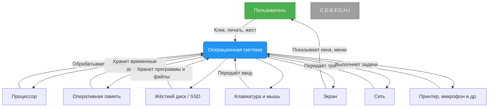
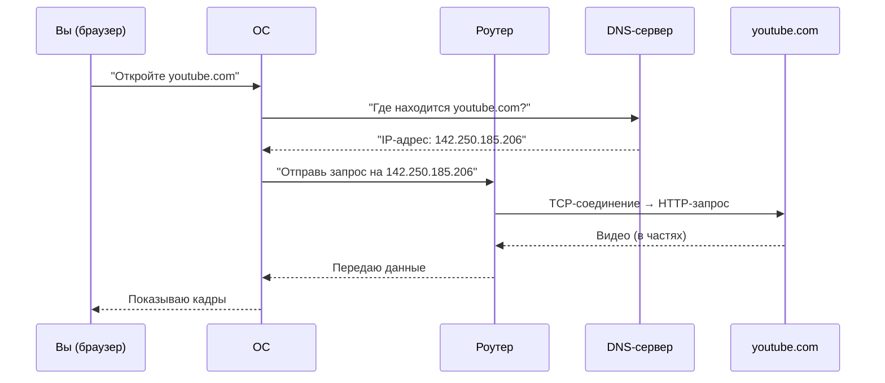
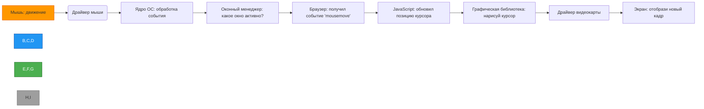
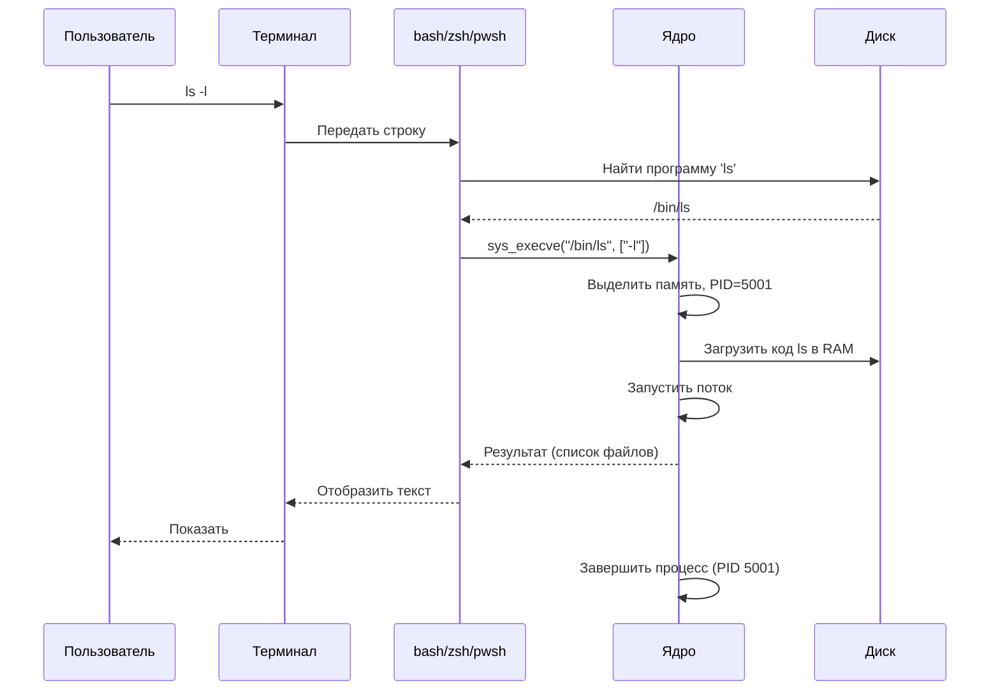

import ExternalPlayEmbed from '@site/src/components/ExternalPlayEmbed';


# Основы ОС

<div class="article-tags">
  <span class="tag tag-required">ОБЯЗАТЕЛЬНО</span>
  <span class="tag tag-beginner">ДЛЯ НОВИЧКОВ</span>
</div>

<span class="complexity-badge">Начальный уровень</span>

<div class="callout callout--tip">
  <div class="callout-title">Интерактив</div>

  <div class="callout-body">
  Демо ниже — нажимайте кнопки и смотрите, как слои ОС складываются друг на друга.
</div>
  </div>


<ExternalPlayEmbed example="system-network/os-stack-play" title="Стек операционной системы" />

---

## Основы ОС

**Операционная система (ОС)** — программный слой между железом и приложениями. Она распределяет процессорное время и память, управляет файлами, устройствами ввода-вывода и запуском программ.

> **ОС** загружается при включении ПК и работает до выключения. Она планирует выполнение процессов, выделяет ресурсы и обеспечивает доступ к файлам и перифери.

Самые известные ОС:
- **Windows** — от компании Microsoft, самая распространённая на персональных компьютерах.
- **macOS** — от Apple, работает только на компьютерах Mac.
- **Linux** — целое семейство (Ubuntu, Fedora, Linux Mint и др.). Часто используется на серверах, в научных центрах и везде, где важна стабильность и свобода настройки.

Каждая из них "одета" по-своему — у неё свой интерфейс, свои привычки. Но внутри они решают одни и те же задачи. Ниже — устройство по шагам.

---

### Рабочий стол

Когда компьютер включается и ОС загружается, перед Вами появляется **рабочий стол** — это фоновое "окно", которое всегда видно, если ничто не закрывает его сверху. Это **место, куда можно класть ярлыки, папки, заметки** — как на настоящем столе.


- В **Windows** рабочий стол — это фон с иконками, которые можно свободно перемещать мышью. Внизу — панель задач.
- В **macOS** рабочий стол тоже называется *Desktop*, но иконки обычно прижаВы к правому краю, а слева внизу — **Dock** (док) — панель с ярлыками программ, похожая на панель задач, но более компактная и анимированная.
- В **Linux** (например, в Ubuntu с рабочим окружением GNOME) рабочий стол часто выглядит как "чистый лист" — иконок по умолчанию нет, но их можно включить. Активные программы отображаются внизу (в *Dash to Dock*) или вверху (в панели).

> **Ярлык** — это "указатель" на неё. Как записка: *"Программа Paint находится здесь: C:\Program Files\..."*. Удалить ярлык — не значит удалить программу.

---

### Панель задач (Windows), Dock (macOS), панель/бар (Linux)

Это "командный центр" внизу (или сбоку/сверху) экрана. Он всегда на виду, и в нём — всё самое нужное.

---

#### В Windows
  
Это **панель задач** (taskbar). Слева — кнопка **Пуск**, затем — поиск, дальше — ярлыки закреплённых программ (браузер, Word и т.д.), затем — иконки уже открытых окон. Справа — **системный трей** (о нём ниже).

---

#### В macOS
  
Это **Dock** — полупрозрачная полоска внизу (или сбоку). В ней — слева — ярлыки программ, по центру — разделитель, справа — открытые окна и "миниатюры" документов. При наведении иконки увеличиваются (эффект *magnification*).

---

#### В Linux

Всё зависит от окружения. В **GNOME** (по умолчанию в Ubuntu) — панель сверху — меню приложений (аналог Пуска), часы, индикаторы. Внизу может быть дополнительная панель с иконками (если включить *Dash to Dock*). В **KDE Plasma** — всё похоже на Windows — панель снизу, кнопка меню, поиск, трей.

> 🎯 Главная идея: эта панель — Ваш "домашний причал". Отсюда Вы запускаете программы, переключаетесь между ними и видите, что работает.

---

### Контекстное меню и кнопки управления окнами

Кликните правой кнопкой мыши на любом свободном месте рабочего стола — появится **контекстное меню**. Оно называется так, потому что его содержимое *зависит от контекста*:  
- на рабочем столе — команды для создания папки, файла, настройки фона;  
- на файле — открыть, переименовать, удалить, отправить по почте;  
- на открытой вкладке в браузере — копировать ссылку, открыть в новом окне и т.д.

Это как контекстное меню: клик правой кнопкой — и Вам предлагают *именно то*, что можно сделать *здесь и сейчас*.

А теперь — **окна программ**. Когда Вы запускаете, скажем, редактор текста, он открывается в отдельном окне. В правом верхнем углу (в Windows и Linux) или левом (в macOS) — три (или две) кнопки:

| Система       | Кнопки (слева направо / справа налево)                      | Что делают |
|---------------|-------------------------------------------------------------|------------|
| **Windows**   | ◻ (свернуть), ◻◻ (развернуть/восстановить), ✕ (закрыть)     | — **Свернуть** — окно исчезает, но программа продолжает работать. — **Развернуть** — окно занимает весь экран. — **Закрыть** — программа завершается. |
| **macOS**     | 🔴 (закрыть), 🟡 (свернуть), 🟢 (развернуть/выйти в полноэкранный режим) | Аналогично, но 🔴 не всегда завершает программу — часто только закрывает окно, а программа остаётся в Dock. |
| **Linux**     | Зависит от окружения, но обычно как в Windows.              | То же поведение. |

> 🧠 Важно: **закрытие окна ≠ завершение программы**. Особенно в macOS — если в Dock иконка подсвечена (точка под ней), значит, программа всё ещё работает — даже без открытого окна.

---

### Кнопка "Пуск" и поиск

**Пуск** (Start) в Windows, **меню Apple** () в macOS, **меню приложений** (Activities или просто значок) в Linux — это "главные ворота" в систему.

- Нажимаете **Пуск** — появляется список всех установленных программ, часто используемых файлов, настроек.
- В Windows 10/11 и в macOS есть мощный **поиск**: начни печатать "калькулятор" — и нужная программа появится через долю секунды. Поиск работает по названиям программ и по содержимому файлов, настройкам, даже по вебу (в Windows — через Bing, в macOS — через Spotlight).
- В Linux (GNOME) нажмите клавишу `Super` (Win) — появится *Activities Overview* — поиск, открытые окна, рабочие пространства.

🔍 **Поиск — это мост между Вами и информацией.** Он учится: чем чаще Вы ищете "блокнот", тем выше он будет в результатах.

---

### Системный трей (область уведомлений)

Это правая часть панели задач (Windows/Linux) или правая часть верхней панели (macOS). Там живут маленькие иконки:

- 🔊 громкость  
- 🔋 заряд батареи (на ноутбуке)  
- 📶 Wi-Fi  
- 🕒 часы и календарь  
- 🖨️ принтеры, если подключены  
- 🛡️ антивирус  
- 📬 почта, мессенджеры (иногда)

Эти иконки — **не просто украшение**. Они показывают *статус* чего-то важного. Нажмите на 🔋 — увидите, сколько осталось времени работы от батареи. Нажмите на 🔊 — появится ползунок громкости. Некоторые иконки скрыВы (в Windows — стрелка вверх), но их можно показать.

> **Это как "приборная панель" автомобиля: Вы не управляете напрямую, но постоянно следите за показаниями.

---

### Сворачивание и фоновые процессы

Когда Вы **сворачиваете** окно (жмёте ◻ или 🟡), оно исчезает с экрана — но программа продолжает работать. Например:

- Музыкальный плеер играет в фоне.  
- Загрузка файла идёт, даже если Вы переключился на браузер.  
- Мессенджер получает сообщения, пока Вы пишете в Word.

Такие программы называются **фоновыми процессами**. Они "не на виду", но "на слух" — если что-то пойдёт не так (например, плеер завис), Вы можете это заметить по звуку или по значку в трее.

> 🌐 Интересный факт — веб-страницы тоже могут работать в фоне — например, YouTube продолжает проигрывать видео, если Вы переключите вкладку (но не свернёте браузер полностью).

---

### Автозапуск и автозагрузка

Когда компьютер включается, не все программы запускаются одновременно. Есть три уровня:

1. **Автозагрузка ОС** — сама система грузится — проверяет диски, запускает драйверы, подключает сеть.
2. **Службы (services)** — программы, которые работают "невидимо" — антивирус, обновления, серверы. Они стартуют почти сразу после ОС.
3. **Автозапуск (startup)** — программы, которые *Вы* выбрал запускать автоматически — браузер, мессенджер, облачное хранилище (Google Drive, OneDrive и т.д.).

- В **Windows**: `Настройки → Приложения → Автозагрузка` — там можно включать/выключать программы по одной.
- В **macOS**: `Системные настройки → Общие → Входящие элементы` (Login Items).
- В **Linux**: зависит от окружения. В GNOME — `Настройки → Приложения → Автозапуск`.

> ⚠️ Чем больше программ в автозапуске — тем дольше грузится компьютер. Иногда стоит отключить ненужное (например, игру, которая сама лезет в трей).

---

### Службы и менеджеры

**Служба** (service) — это программа, которая работает *без окна*, "тихо", в фоне. Примеры:
- `Print Spooler` — очередь печати: накапливает задания и отправляет их на принтер по одному.
- `Windows Update` — проверяет и скачивает обновления.
- `cron` (в Linux/macOS) — планировщик задач: "в 3 ночи запусти резервное копирование".

Службы управляются через **менеджеры**:
- В Windows — `services.msc` (наберите в поиске Пуска).
- В macOS — через `Activity Monitor` (Мониторинг системы) → вкладка *Службы*.
- В Linux — команды `systemctl` (для современных систем) или `service`.

> 🔐 Большинство служб **нельзя просто так выключить** — система может перестать работать. Но *некоторые* можно отключить, если они не нужны (например, Bluetooth, если у Вас нет наушников).

---

### Диспетчер задач (Windows) / Мониторинг системы (macOS) / Системный монитор (Linux)

Это "операционный зал" компьютера. Он показывает:

- Какие программы и процессы сейчас работают.
- Сколько памяти, процессора, диска и сети они используют.
- Какие процессы "тормозят" систему.

| Система | Как открыть |
|--------|-------------|
| Windows | `Ctrl + Shift + Esc` или правой по панели задач → "Диспетчер задач" |
| macOS | `Cmd + Пробел` → набрать *Activity Monitor* |
| Linux (GNOME) | Поиск → *Система Monitor* |

В диспетчере можно:
- **Завершить** зависшую программу ("Снять задачу").
- Посмотреть, какая программа "съедает" батарею (в macOS и Windows 11).
- Найти скрытые процессы — например, вирус или майнер (если что-то потребляет 100% CPU без причины).

> 📊 Это как "пульсометр" компьютера. Если он "задыхается" — первым делом смотрите сюда.

---

### Как работает ОС

Операционная система - **посредник между человеком и железом**. Вот как это работает на практике:

1. Вы нажимаете иконку *Браузер* на рабочем столе.  
2. ОС получает запрос: "Запусти программу по адресу C:\Program Files\Chrome\chrome.exe".  
3. Проверяет, есть ли права, свободна ли память.  
4. Загружает программу в оперативную память.  
5. Выделяет ей "окошко" на экране, подключает клавиатуру и мышь.  
6. Вы печатаете `youtube.com` — браузер просит ОС: "Подключите меня к интернету".  
7. ОС передаёт запрос сетевой карте → в роутер → в интернет.  
8. Ответ приходит → ОС передаёт его браузеру → Вы видите видео.

Всё это происходит за миллисекунды — и Вы даже не замечаете, сколько "согласований" прошло за кулисами.

---

### Как ОС связывает человека и железо



*Пояснение*: ОС (синий блок) — центральный узел. Без неё пользователь не может напрямую управлять процессором или памятью. Она обеспечивает безопасность, справедливость (никто не "захватит" весь процессор) и удобство.

---

## Файлы и папки

Представьте библиотеку. В ней есть залы (папки), в залах — стеллажи (подпапки), на стеллажах — книги (файлы). Чтобы найти книгу *"Гарри Поттер и философский камень"*, Вы не бегаете по всей библиотеке — Вы идёте в зал *"Фантастика"*, затем к стеллажу *"Роулинг"*, и там — нужная книга.

Компьютер хранит всё **иерархически** — как дерево:  
- **Корень** (C:\ в Windows, `/` в macOS/Linux) — "вход в библиотеку"  
- **Папки** (каталоги) — "залы и стеллажи"  
- **Файлы** — "книги, фотографии, музыка, программы"

> 🔍 **Файл** — это именованный блок данных на диске. Он имеет:  
> - **Имя** (например, `доклад.docx`)  
> - **Расширение** (`.docx`, `.jpg`, `.mp3`) — это "подсказка" ОС: *"Это документ Word / фото / музыка"*  
> - **Размер** — сколько места занимает (в байтах, килобайтах и т.д.)  
> - **Дата изменения** — когда в последний раз кто-то его редактировал  

В **Windows** расширения по умолчанию скрыВы (чтобы не пугать новичков), но их можно включить:  
`Проводник → Вид → Показать → Расширения имён файлов`.

В **macOS/Linux** расширения почти всегда видны — так надёжнее.

---

### Как ОС помогает с файлами?

Она даёт нам **проводник** (Windows), **Finder** (macOS), **Файловый менеджер** (Linux) — программу, которая превращает "сырые" данные на диске в удобную картинку — иконки, списки, дерево папок.

Пример пути:
- Windows: `C:\Пользователи\Тимур\Документы\сочинение.docx`  
- macOS: `/Users/timur/Documents/сочинение.docx`  
- Linux: `/home/timur/Documents/сочинение.docx`

Обратите внимание:  
- В Windows используется `\`, в macOS/Linux — `/`  
- В Windows диски обозначаются буквами (`C:`, `D:`), в macOS/Linux — всё едино — корень `/`, а диски *монтируются* внутрь него (например, флешка — в `/Volumes/USB`)

> 🌐 Почему так? Исторически — Windows унаследовала `\` от MS-DOS (1981), а macOS и Linux — от UNIX (1970), где `/` был стандартом. Это не "лучше" или "хуже" — просто разные традиции.

---

## Права доступа

Когда в классе все могут брать чужие тетради — начинается хаос. Поэтому у учителя есть правило: *"Чужое не трогать"*. В компьютере — то же самое.

Каждый файл и папка имеют **права доступа** — правила, кто и что может с ними делать:

| Право | Что означает |
|-------|--------------|
| **Чтение** (r, read) | Можно открыть и посмотреть содержимое |
| **Запись** (w, write) | Можно изменить или удалить |
| **Исполнение** (x, execute) | Можно запустить как программу (актуально для `.exe`, `.sh`, `.py`) |

Эти права задаются **для трёх категорий**:
1. **Владелец** (обычно — Вы)  
2. **Группа** (например, "ученики", "администраторы")  
3. **Все остальные**

---

### Примеры

- Файл `пароли.txt` у Вас дома:  
  - Владелец: **чтение + запись**  
  - Группа и Остальные — **ничего** → никто, кроме Вас, не откроет  

- Папка `Общие_фото` в школе:  
  - Владелец (учитель): чтение/запись  
  - Группа (класс): чтение  
  - Остальные: ничего  

- Программа `калькулятор.exe`:  
  - Владелец: чтение/запись (чтобы обновить)  
  - Все: **чтение + исполнение** — чтобы запустить  

> 🔐 В **Windows** права настраиваются через:  
> `Правой по файлу → Свойства → Безопасность → Изменить`  
> В **macOS/Linux** — через `chmod` в терминале или `Информация` (Cmd+I) в Finder.

Для детей это звучит как: *"Это мой дневник — только я могу писать в него. Но я могу разрешить маме читать, а брату — нет"*.

---

## Окна, вкладки и виртуальные рабочие столы

Вы когда-нибудь раскладывал на столе:  
- тетрадь по математике,  
- учебник по истории,  
- листок с черновиками,  
- и при этом слушал музыку?

Компьютер делает то же самое — но у него "стол" один (экран). Чтобы не путаться, ОС даёт инструменты:

---

### Окна

Каждая программа — в своём окне. Можно:
- Перетаскивать их мышью  
- Изменять размер (потянуть за край)  
- Накладывать одно на другое  

---

### Вкладки

Внутри одной программы (браузер, текстовый редактор) — **вкладки**. Это как разделы в одной тетради:  
- Вкладка 1: YouTube  
- Вкладка 2: Google Docs  
- Вкладка 3: переводчик  

Экономит место: не нужно 10 окон браузера — достаточно одного с 10 вкладками.

---

### Виртуальные рабочие столы (Spaces в macOS, Рабочие столы в Windows/Linux)

У Вас *четыре* стола — и Вы можете мгновенно переключаться между ними:
- Стол 1: учёба (Word, браузер с учебниками)  
- Стол 2: творчество (рисовалка, музыка)  
- Стол 3: игры  
- Стол 4: общение (мессенджеры, почта)

Как включить:
- **Windows**: `Win + Tab` → "Новый рабочий стол"  
- **macOS**: `Ctrl + стрелка влево/вправо` или `Mission Control` (F3)  
- **Linux (GNOME)**: `Super + PgUp / PgDn` или `Activities → +`

> ✅ Зачем это нужно? Чтобы не переключаться между 20 окнами — а *разделить задачи физически* в пространстве.

---

## Обновления

Компьютер — не статичная машина. Он *учится*. Каждый месяц Microsoft, Apple, разработчики Linux выпускают **обновления**:
- **Исправления ошибок** — убирают баги (например, "браузер падал при открыти PDF")  
- **Новые функции** — например, темный режим, голосовой помощник  
- **Защита** — патчи против новых вирусов и уязвимостей

Обновления бывают:
- **Автоматические** (по умолчанию в macOS и Windows) — система сама скачает и установит ночью  
- **Ручные** — Вы видите уведомление: *"Доступно обновление Windows 11 24H2"* — и жмёте "Установить"

**Важно**:  
- Никогда не отключай обновления полностью — это как не ходить к врачу годами.  
- Но можно настроить *время установки* — например, "только по ночам, когда я не за компом".

> 📅 Совет: раз в месяц проверяй — нет ли "зависших" обновлений. Иногда система ждёт перезагрузки.

---

## Безопасность "из коробки"

Операционная система — первый щит. Она включает:

| Компонент | Что делает | Где найти |
|----------|------------|-----------|
| **Брандмауэр (Firewall)** | Следит за входящим/исходящим интернет-трафиком. Блокирует подозрительные подключения. | Windows: `Безопасность Windows → Брандмауэр` macOS: `Системные настройки → Сеть → Брандмауэр` |
| **Защитник Windows / XProtect (macOS)** | Антивирус "из коробки". Сканирует файлы при скачивани, запуске. | Встроено. Работает тихо. |
| **Песочница (Sandbox)** | Программы (особенно из интернета) запускаются в "клетке": даже если вирус — он не достанет до Ваших файлов. | В macOS — почти все программы. В Windows — Microsoft Edge, Store-приложения. |
| **Контроль учётных записей (UAC)** | Когда программа хочет что-то важное (установить, изменить систему) — ОС спрашивает: *"Вы уверен?"* | Окно с подтверждением: "Разрешить этому приложению вносить изменения?" |

> 🛡️ Никакая защита не спасёт, если Вы сам введёте пароль на фишинговом сайте. Поэтому:  
> - Не нажимайте "Да" без понимания, зачем это нужно  
> - Не скачивай "взломанные" программы — они почти всегда содержат вирусы  

---

## Разница между "выключить", "перезагрузить", "спящий режим" и "гибернация"

| Режим | Что происходит | Плюсы | Минусы |
|-------|----------------|-------|--------|
| **Выключить** | Компьютер полностью обесточивается. | Экономия энерги, "чистый старт" | Долгая загрузка при включении |
| **Перезагрузить** | Выключение + включение. Все программы закрываются. | Нужно после обновлений, при сбоях | То же, что и выключение |
| **Спящий режим** (Sleep) | Компьютер "дремлет": память питается, всё остальное — выключено. | Мгновенный возврат, мало энерги | Если сядет батарея — данные в памяти потеряются |
| **Гибернация** (Hibernate) | Содержимое памяти сохраняется на диск → компьютер выключается полностью. При включении — загружается обратно в память. | Нет расхода энерги, безопасно при отключении питания | Медленнее, чем Sleep; занимает место на диске |

> В ноутбуках по умолчанию часто стоит:  
> - Закрыл крышку → **Спящий режим**  
> - Долго не трогал → **Гибернация**  

В Windows гибернацию можно включить/выключить:  
`Панель управления → Электропитание → Настройка схемы → Изменить дополнительные параметры → Сон → Гибернация`

---

## Что такое "ярлык", "алиас" и "символическая ссылка"?

Все они — **указатели на файл**, но с тонкими отличиями:

| Тип | Система | Как работает | Аналогия |
|-----|---------|--------------|----------|
| **Ярлык** (.lnk) | Windows | Отдельный маленький файл (≈1 КБ), внутри — путь к цели. Если цель удалена — ярлык "ломается". | Как записка: *"Книга лежит на полке 3, ряд 2"*. Если книгу убрали — записка бесполезна. |
| **Алиас** | macOS | Умный указатель: помнит путь и *уникальный ID файла*. Даже если файл переместили — алиас найдёт его. | Как GPS-метка: *"Ищите этот объект — я знаю его координаты"*. |
| **Смволическая ссылка** (symlink) | Linux/macOS | Как ярлык, но на уровне файловой системы. Может вести на папку или даже на другой диск. | Как дорожный указатель на шоссе: *"До Москвы — 100 км"*. |

> **Пример:**  
> 1. Создайте файл `тест.txt`.  
> 2. Сделайте ярлык/алиас/symlink на него.  
> 3. Перемести `тест.txt` в другую папку.  
> 4. Попробуйте открыть через ярлык — получится ли?  

(В Linux: `ln -s ~/Документы/тест.txt ~/Рабочий\ стол/тест_ссылка`)

---

## Жизненный цикл программы

```mermaid
flowchart LR
    A[Пользователь кликает по иконке] --> B{ОС проверяет:}
    B -->|Есть права?| C[Да]
    B -->|Нет| D[Отказ: "Доступ запрещён"]
    C --> E[Есть ли память?]
    E -->|Да| F[Загрузить в RAM]
    E -->|Нет| G["Недостаточно памяти"]
    F --> H[Запустить процесс]
    H --> I[Показать окно]
    I --> J[Работа: ввод, сохранение, сеть]
    J --> K{Пользователь закрыл окно?}
    K -->|Да| L[Спросить: "Сохранить изменения?"]
    L --> M[Завершить процесс]
    M --> N[Освободить память и ресурсы]
    K -->|Нет| J
```

*Комментарий*: Эта схема показывает, что даже простой клик — целая цепочка проверок. ОС заботится, чтобы ничего не сломалось.

---

## Процессор, память и диск

Компьютер — как школьный класс:

| Компонент | Аналогия | Что делает | Почему важно? |
|----------|----------|------------|---------------|
| **Процессор (CPU)** | Учитель | Выполняет все команды: складывает числа, рисует пиксели, проверяет пароли | Без него — никаких вычислений. Чем быстрее — тем быстрее всё работает. |
| **Оперативная память (RAM)** | Ученики за партами | Хранит то, с чем идёт работа *прямо сейчас*: открытые окна, текст в редакторе, кэш браузера | Мало памяти → компьютер "тормозит", потому что постоянно гоняет данные на диск и обратно. |
| **Жёсткий диск / SSD** | Школьная библиотека | Хранит всё надолго: программы, фото, музыку, документы | Даже когда компьютер выключен — всё на месте. SSD быстрее HDD, как электронная книга быстрее бумажной энциклопеди. |

> 🔍 **Как это работает вместе?**  
> Вы открываете *Minecraft*.  
> 1. ОС читает игру с диска (библиотека → ученики).  
> 2. Загружает её в оперативную память (ученики держат страницы).  
> 3. Процессор читает эти страницы и "рисует" мир (учитель объясняет, как строить крепость).  
> 4. Когда Вы сохраняете мир — ОС записывает изменения *обратно на диск* (ученики отдают конспект в архив).

Если памяти мало — ОС использует **файл подкачки** (Windows) / **swap** (macOS/Linux): кусок диска, который *имитирует* RAM. Но диск в 100–1000 раз медленнее памяти — отсюда и "тормоза".

> 📊 Проверьте:  
> - В диспетчере задач (вкладка *Производительность*) посмотрите загрузку CPU, RAM, диска.  
> - Откройте 10 вкладок с видео — что вырастет сильнее всего? (Скорее всего — RAM.)

---

## Подключение устройств

Когда Вы вставляете флешку в USB-порт, компьютер не "видит провод" — он получает сигнал: *"Подключено новое устройство с ID 0x0781:0x5581"*. Это как паспорт: по номеру ОС узнаёт — что это **SanDisk Cruzer**, и как с ним разговаривать.

Для этого нужны **драйверы** — специальные программы-переводчики. Но не пугайтесь: современные ОС почти всё делают автоматически.

---

### Как происходит подключение

1. Устройство подключено → посылает свой ID.  
2. ОС ищет драйвер:  
   - Есть ли он *внутри* системы? (Да — для мышей, клавиатур, базовых принтеров)  
   - Есть ли он *в интернете*? (Windows и macOS могут скачать сами)  
   - Нужно ли ставить вручную? (Иногда — для профессиональных устройств: звуковых карт, 3D-принтеров)  
3. Устройство получает "адрес" в системе:  
   - Флешка → появляется как диск `F:` (Windows) или в `/Volumes/USB` (macOS)  
   - Принтер → в меню "Печать"  
   - Камера → доступна в Zoom, OBS, "Фотокамере"

> **Plug and Play** ("включите и работай") — технология, при которой всё это происходит без участия пользователя. Появилась в середине 1990-х — и навсегда изменила IT.

---

### Особые случаи

| Устройство | Что делает ОС | Совет для пользователя |
|-----------|----------------|------------------------|
| **Bluetooth-наушники** | Ищет по радиосигналу, спаривается по PIN (часто `0000`), создаёт виртуальный звуковой выход | Если не подключаются — перезагрузи Bluetooth в настройках |
| **Принтер без драйвера** | Использует **AirPrint** (macOS/iOS) или **IPP Everywhere** (Linux/Windows) — стандарт печати без драйверов | Поддерживается почти всеми принтерами после 2010 г. |
| **Игровая приставка (Xbox/PS5)** | Работает как USB-накопитель или через сеть (DLNA, SMB) | Включите "Общий доступ к медиа" на приставке |

---

## Сетевые подключения

Вы открываете YouTube — и видите видео. Но до этого происходит целая цепочка:



> 🌐 **DNS** — это "телефонная книга интернета". Без неё пришлось бы запоминать адреса вроде `142.250.185.206`, а не `youtube.com`.

ОС отвечает за:
- Получение IP-адреса (через **DHCP** — сервер в роутере "раздаёт" адреса)
- Маршрутизацию (куда слать пакеты)
- Защиту (брандмауэр фильтрует подозрительные запросы)

> 🔍 Проверьте:  
> - В Windows: `ipconfig` в командной строке  
> - В macOS/Linux: `ifconfig` или `ip a`  
> Вы увидите — имя Wi-Fi, IP-адрес, шлюз (роутер), DNS-серверы.

---

## Звук, видео и графика

Когда Вы смотрите мультфильм, ОС координирует три системы:

---

### Графическая подсистема

- **CPU** — решает, *что* рисовать (герой летит вверх)  
- **GPU** (видеокарта) — *рисует* это миллион раз в секунду (пиксели, тени, свет)  
- **Драйвер GPU** — переводит команды ОС на "язык" видеокарВы (NVIDIA, AMD, Intel)

В Windows — через **DirectX**, в macOS — через **Metal**, в Linux — через **Vulkan** или **OpenGL**. Это "стандартные договорённости", чтобы игра могла работать на разных видеокартах.

---

### Аудиоподсистема

- Звуковые файлы → ОС → звуковой драйвер → наушники/колонки  
- **Смешивание** — ОС умеет соединять звуки: музыка + голос в Zoom + уведомление — и выводить всё одновременно.

---

### Снхронизация

Чтобы губы героя не "отставали" от голоса, ОС использует **таймеры и буферы**:
- Видео идёт кадр за кадром (30/60 кадров в секунду)  
- Звук идёт потоком (48 000 отсчётов в секунду)  
- ОС следит, чтобы они шли в ногу. Если не успевает — кадры пропускаются (*dropped frames*), звук " crackles ".

> 🎮 Почему игры тормозят?  
> - GPU не справляется с графикой → мало кадров  
> - CPU загружен другими процессами (антивирус, облако)  
> - Мало RAM → постоянная подкачка  

---

## Пользователи и сесси

У Вас и у брата один рабочий стол дома. Но у каждого — 
- Своя тетрадь  
- Свои заметки на стене  
- Свои закладки в браузере  

В компьютере это реализуется через **учётные записи**:

| Тип учётной записи | Права | Для кого? |
|--------------------|-------|-----------|
| **Администратор** | Может устанавливать программы, менять системные настройки | Родители, старшие братья/сёстры |
| **Стандартный пользователь** | Может работать, но не может "ломать" систему | Ребёнок, гость |
| **Гостевой аккаунт** | Временный доступ — при выходе всё стирается | Друг, пришедший поиграть |

Когда Вы входите в систему — запускается **сессия**:
- Загружаются *Ваши* обои, ярлыки, настройки браузера  
- Открываются *Ваши* автозапуски  
- Все файлы в `Документы`, `Загрузки` — Ваши, а не брата

> 🔐 Зачем это нужно?  
> - Безопасность: если брат скачает вирус — он не повредит *Ваши* файлы  
> - Приватность: дневник не увидят  
> - Стабильность: ошибка в одной сесси не уронит весь компьютер

Сменить пользователя можно без выхода:  
- **Windows**: `Win + L` → "Другой пользователь"  
- **macOS**: `Apple → Сменить пользователя`  
- **Linux**: в меню входа (GDM/SDDM)  

---

## Резервное копирование и синхронизация

Даже самый надёжный SSD может сломаться. Поэтому ОС помогает **копировать важное**:

---

### Встроенные инструменты

| ОС | Инструмент | Как работает |
|----|------------|--------------|
| **Windows** | **Файловая история** + **OneDrive** | Копирует папки `Документы`, `Изображения` на внешний диск / в облако. Можно "отмотать" к верси от вчера. |
| **macOS** | **Time Machine** | Подключите внешний диск → включите → каждые 60 минут — снимок всей системы. Можно восстановить даже *удалённую папку* от месяца назад. |
| **Linux** | **Deja Dup** (Ubuntu), **Timeshift** | Аналоги: копирование + инкрементальные обновления |

> 💾 **3-2-1 правило резервного копирования**:  
> - **3** копи данных (оригинал + 2 резервные)  
> - на **2** разных носителях (диск + облако)  
> - **1** копия вне дома (Google Drive, Dropbox, Яндекс.Диск)

> 🧪 Попробуй:  
> 1. Создайте файл `эксперимент.txt`  
> 2. Измени его 3 раза (добавляй строки)  
> 3. Включите резервное копирование (даже на флешку)  
> 4. Удалите файл — сможете ли вернуть версию от 10 минут назад?

---

## Облако и ОС

Облачные сервисы (Google Drive, iCloud, OneDrive, Dropbox) — не просто сайты. Они **интегрируются в ОС**:

- В **Windows** появляется диск `G:` (Google Drive) или `O:` (OneDrive)  
- В **macOS** — папка `iCloud Drive` в Finder, которая *выглядит* как локальная, но хранится в интернете  
- В **Linux** — через `rclone` или официальные клиенты

Как это работает:
1. Вы кладёте файл в папку `OneDrive/Фото`  
2. Программа OneDrive *замечает изменение*  
3. Шифрует файл и отправляет на сервер Microsoft  
4. На другом устройстве (телефон, ноутбук) — файл появляется автоматически  

> ⚠️ Важно:  
> - Файл в облаке — *не замена* резервной копи. Если Вы случайно удалите его — он исчезнет *везде*.  
> - Некоторые сервисы хранят историю версий (OneDrive — 30 дней, Google Drive — для платных аккаунтов).

---

## Как данные путешествуют от мыши до экрана



*Пояснение*: Даже простое движение мыши — цепочка из 8 шагов. И всё это за 16 мс (60 кадров/сек)!

---

## Терминал и командная строка

Вы управляете космическим кораблём. У него есть:
- **Графическая панель** (кнопки, экраны, джойстики) — удобно, но не всё можно настроить.
- **Текстовый консольный интерфейс** — набор команд напрямую инженеру: *"Увеличить тягу двигателей на 15%", "Перенаправить питание в щиты"*.

**Графический интерфейс (GUI)** — это кнопки, окна, иконки.  
**Текстовый интерфейс (CLI — Command Line Interface)** — это команды, которые Вы печатаете.  

И то, и другое — способы управлять ОС. CLI старше GUI на десятилетия, но до сих пор мощнее для многих задач.

> **Терминал** — это программа, которая *показывает* командную строку.  
> — В Windows: **Командная строка** (`cmd.exe`) или **PowerShell** (современный вариант)  
> — В macOS/Linux: **Terminal** (терминал), обычно с оболочкой `bash` или `zsh`

---

### Почему терминал до сих пор нужен?

| Задача | Через GUI | Через CLI |
|-------|-----------|-----------|
| Переименовать 100 фото `IMG_001.jpg` → `отпуск_001.jpg` | Вручную, 100 раз кликнуть | `rename 's/IMG/отпуск/' *.jpg` — одна команда |
| Найти все файлы с текстом *"экзамен"* | Открыть каждый по очереди | `grep -r "экзамен" ~/Документы` |
| Узнать, кто "съедает" интернет | Диспетчер задач → вкладка *Сеть*, искать глазами | `nethogs` — покажет процесс + скорость в реальном времени |
| Удалённо управлять сервером | Невозможно (серверы часто без экрана!) | `ssh user@server` — подключение за секунду |

> **CLI — это точнее и быстрее** для повторяющихся, массовых или удалённых задач.

---

### Основные команды (единые принципы во всех ОС)

| Команда | Что делает | Пример | Примечание |
|--------|------------|--------|------------|
| `pwd` | Показать текущую папку (**P**rint **W**orking **D**irectory) | `pwd` → `/home/timur` | В Windows: `cd` без аргументов |
| `ls` / `dir` | Список файлов (**L**i**s**t / **Dir**ectory) | `ls -l` — подробно `dir /p` — постранично | `ls` — в macOS/Linux `dir` — в Windows |
| `cd` | Сменить папку (**C**hange **D**irectory) | `cd Документы` `cd ..` — на уровень выше | `..` — родительская папка `~` — домашняя папка (macOS/Linux) |
| `mkdir` | Создать папку (**M**a**k**e **Dir**ectory) | `mkdir Проект` | Работает везде |
| `touch` / `type nul >` | Создать пустой файл | `touch заметка.txt` (macOS/Linux) `type nul > заметка.txt` (Windows) | В Windows нет `touch`, но есть аналог |
| `cat` / `type` | Показать содержимое файла | `cat список.txt` `type список.txt` | `cat` — от *concatenate* |
| `cp` / `copy` | Скопировать | `cp a.txt b.txt` `copy a.txt b.txt` | |
| `mv` / `move` | Переместить / переименовать | `mv старое.txt новое.txt` | Одна команда — две функции! |
| `rm` / `del` | Удалить (**R**e**m**ove / **Del**ete) | `rm файл.txt` | ⚠️ В CLI **нет корзины** — удаление мгновенное! |
| `man` / `help` | Справка по команде | `man ls` — руководство `ls /?` — краткая справка (Windows) | В macOS/Linux — `man`, в Windows — `/?" или `Get-Help` в PowerShell |

> 🌍 **Совет**:  
> Попробуйте открыть терминал и поэкспериментировать:  
> ```bash
> mkdir Тест
> cd Тест
> touch файл1.txt файл2.txt
> ls
> mv файл1.txt переименованный.txt
> ls
> cd ..
> rmdir Тест   # удалит папку (только если она пустая!)
> ```

---

### Почему в терминале "/", а в Windows — "\"?

Это исторический след:
- UNIX (1969, Bell Labs) выбрал `/` как разделитель путей.  
- MS-DOS (1981) не мог использовать `/`, потому что он уже был занят *флагами команд* (`dir /p`). Поэтому взяли `\`.  
- Windows сохранила `\` для совместимости — даже спустя 40 лет.

Но современные инструменВы (PowerShell, WSL) спокойно принимают `/` — так что можно писать `C:/Windows` — и это сработает.

---

## Процессы

Когда Вы запускаете *Блокнот*, он не просто "открывается". ОС создаёт **процесс** — изолированную среду выполнения, у которой есть:

| Атрибут процесса | Что это | Пример для Блокнота |
|------------------|---------|---------------------|
| **PID** (Process ID) | Уникальный номер (как паспорт) | `PID = 4821` |
| **Память** | Собственное "пространство" в RAM | От 10 до 50 МБ |
| **Файловые дескрипторы** | Открытые файлы, сеть, устройства | `файл.txt`, `клавиатура`, `экран` |
| **Состояние** | Чем занят сейчас | *Выполняется*, *ожидает ввода*, *спит* |
| **Родитель** | Какой процесс его запустил | `explorer.exe` (Проводник) |

> 🔍 **Процесс — это не программа**.  
> — **Программа** — файл на диске (`notepad.exe`)  
> — **Процесс** — запущенный экземпляр этой программы в памяти  

Можно запустить Блокнот 5 раз — будет 5 процессов с разными PID, но одной программой.

---

### Дерево процессов

Процессы организованы в **иерархию**:
```
Система (PID 0)
 └─ kernel_task (PID 1)
     └─ launchd (macOS) / systemd (Linux) / svchost (Windows)
         ├─ Finder / Explorer
         │   └─ Блокнот (PID 4821)
         ├─ Safari / Chrome
         │   ├─ вкладка YouTube (PID 4822)
         │   └─ вкладка Gmail (PID 4823)
         └─ Spotlight / Cortana
```

Если убить родительский процесс (`Finder`), все его дети (`Блокнот`) тоже завершатся — как домино.

> 🧪 Посмотрите сами:  
> - **Windows**: Диспетчер задач → вкладка *Подробности* → включите столбец *PID* и *Родительский PID*  
> - **macOS**: Activity Monitor → *View → Columns → PID, Parent PID*  
> - **Linux**: `ps -ef --forest` в терминале

---

## Потоки

Процесс — как театральная труппа.  
**Поток (thread)** — как один актёр в этой труппе.

Один процесс может содержать **много потоков**, и все они:
- Делят общую память (декорации, реквизит)  
- Выполняются параллельно (на многоядерном процессоре)  
- Могут делать разные вещи одновременно

---

### Пример — браузер Chrome

| Поток | Задача |
|------|--------|
| **Основной поток** | Рисует интерфейс, обрабатывает клики |
| **Поток вкладки 1** | Загружает YouTube, проигрывает видео |
| **Поток вкладки 2** | Проверяет почту, обновляет иконку уведомлений |
| **Поток сети** | Скачивает файлы в фоне |
| **Поток диска** | Сохраняет кэш, историю |

Если бы всё было в одном потоке — зависшее видео "заморозило" бы весь браузер. А с потоками — Вы можете писать в чате, пока видео грузится.

> ⚖️ **Легковесные потоки (green threads) vs ОС-потоки**  
> — *ОС-потоки* (Windows/macOS/Linux) — управляются ядром, могут работать параллельно на разных ядрах.  
> — *Легковесные* (в некоторых языках — Go, Java до 21) — управляются внутри программы, "эмулируют" параллелизм. Быстрые, но не истинно параллельные без нескольких ядер.

> 🧠 **Важно**:  
> Потоки делят память — это удобно, но опасно. Если два потока одновременно запишут в одну переменную — данные испортятся. Поэтому нужны **мьютексы**, **семафоры**, `volatile`, `memory barrier` — но это уже для старших классов (том *"4-code-dev"*).

---

## Фоновые процессы и демоны

Не все процессы — с окнами. Многие работают **в фоне**:

| Тип | Описание | Примеры |
|-----|-----------|---------|
| **Демон** (daemon) | Процесс без окна, служит системе | `sshd` (удалённый доступ), `cupsd` (печать), `bluetoothd` |
| **Служба** (service) | То же, но термин Windows | `Print Spooler`, `Windows Update`, `DHCP Client` |
| **Агент** (agent) | Фоновая программа пользователя | `Google Drive`, `Dropbox`, `Zoom Scheduler` |

> **Почему "демон"?  
> В UNIX-культуре — от греческого *daimon* (дух-помощник), не от "дьявол". Демон *служит*, не мешает.

Как управлять:
- **Windows**: `services.msc` → ПКМ → Запустить/Остановить  
- **macOS**: `launchctl list` в терминале  
- **Linux**: `systemctl status имя_службы`

> 🛑 Никогда не останавливай службы, если не знаете, зачем они. Например, `lsass.exe` в Windows — отвечает за вход в систему. Без неё — синий экран.

---

## ПриоритеВы и планировщик

В столовой 1 касса, а очередь из 100 человек. Планировщик ОС — как диспетчер, который решает:  
— *Кому дать пропуск первым?*

Каждый процесс имеет **приоритет** (обычно от -20 до +19, где -20 — самый высокий):

| Приоритет | Кто получает | Пример |
|-----------|--------------|--------|
| Высокий | Критически важные задачи | Воспроизведение звука, обработка ввода (мышь/клавиатура) |
| Нормальный | Обычные программы | Браузер, текстовый редактор |
| Низкий | Фоновые задачи | Обновление диска, индексация Spotlight |

Если процесс "жадный" (100% CPU), ОС может *снизить* его приоритет — чтобы система не "зависла".

> 🧪 Попробуйте в Windows:  
> 1. Запусти калькулятор  
> 2. В диспетчере задач → ПКМ по `Calculator.exe` → *Задать приоритет* → **Ниже обычного**  
> 3. Откройте тяжёлую вкладку в браузере — калькулятор станет "тормозить", но система останется отзывчивой.

---

## От команды в терминале до запущенного процесса



*Пояснение*: Даже простая команда — это взаимодействие 5 уровней. Ядро — главный координатор.

---
