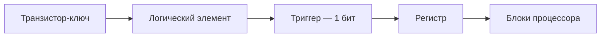

# Транзисторы и микросхемы

  ДЛЯ НОВИЧКОВ

Начальный уровень

  
Откуда материал

  

  По мотивам глав 4–5 учебника Д. В. Фомина "Основы компьютерной электроники". Подробнее — в разделе <a href="/encyclopedia/2-system-network/2-10-zhelezo/intro">Железо</a>.

  

Компьютер оперирует **нулями и единицами** — см. [Цифровой сигнал](/encyclopedia/9-spinoff/9-11-dlya-detey/1-computer/17). Физически уровни 0 и 1 переключают **транзисторы** — крошечные полупроводниковые элементы. Миллиарды транзисторов собраны на **микросхемах**.

---

## Что делает транзистор

**Транзистор** — полупроводниковый элемент. В цифровой схеме он работает как **ключ**:

- ток **идёт** — логическая 1
- ток **не идёт** — логический 0

Управляющий сигнал на одном выводе открывает или закрывает канал — как выключатель света.

Транзистор может также **усиливать** слабый сигнал. В аналоговой технике (радио, усилители) используют именно усиление. В процессоре и памяти — в первую очередь **ключевой** режим.

Транзистор (1947) заменил **электронные лампы**. Компьютеры стали меньше, быстрее и экономичнее.

---

## Типы транзисторов

| Тип | Где встречается | Роль |
|-----|-----------------|------|
| **Биполярный (BJT)** | Старые схемы, учебные стенды | Ключ и усилитель |
| **Полевой (FET, MOSFET)** | Процессоры, память | Основа современных микросхем |

В процессоре и RAM — **МОП-транзисторы** (MOSFET). Их умещают на площади меньше человеческого волоса.

---

## От транзистора к процессору

Из нескольких транзисторов собирают **логические элементы** — схемы "И", "ИЛИ", "НЕ". Из них — **триггеры** (ячейки памяти), **счётчики**, **регистры**.

**Триггер** — схема, которая "запоминает" 0 или 1, пока включено питание (или пока держится заряд в DRAM).

**Регистр** — группа триггеров, хранящая несколько бит сразу.

---

## Интегральная микросхема (ИМС)

**Микросхема** — пластина кремния, на которой **тысячи или миллиарды** транзисторов уже соединены в готовую схему. Снаружи — **корпус** с **выводами** (ножками) для питания, данных и управления.

### Как делают (упрощённо)

1. **Кремниевая пластина (wafer)** — основа
2. **Фотолитография** — через маски "рисуют" слои светом (как трафарет в микрометрах)
3. **Легирование** — впрыскивают примеси, меняя проводимость участков
4. **Сборка** — нарезают пластину на **кристаллы (die)**, припаивают к корпусу

**Технологический процесс** (7 нм, 5 нм, 3 нм) — минимальный размер элемента на кристалле. Чем меньше транзистор, тем **больше** их помещается на том же куске кремния — растёт мощность CPU.

---

## Типы микросхем по назначению

| Класс | Примеры | За что отвечает |
|-------|---------|-----------------|
| **Память** | DDR5, Flash, EEPROM | Хранение битов |
| **Логика / процессор** | CPU, GPU | Вычисления |
| **Комбинационные** | Мультиплексоры, сумматоры | Обработка сигналов "на лету" |
| **Последовательностные** | Триггеры, счётчики | Состояние, такты |

В системном блоке десятки микросхем:

- процессор
- чипсет
- контроллер USB
- Wi‑Fi-модуль
- BIOS на Flash

---

## Нанотехнологии

В топовых процессорах **структуры** размером около 3–5 **нм** (нанометров — миллиардные доли метра). На таких масштабах проявляются **квантовые эффекты** — электрон может "просачиваться" через барьер, и простой ключ перестаёт быть надёжным.

Инженеры применяют:

- **трёхмерные транзисторы** (FinFET)
- **одноэлектронные** устройства
- новые материалы помимо кремния

Параллельно развивают **алгоритмы и архитектуру** — несколько ядер, GPU, специализированные ускорители — см. [Процессор](/encyclopedia/9-spinoff/9-11-dlya-detey/1-computer/20).

---

## Что Вы видите на плате

| Надпись или деталь | Что внутри |
|--------------------|------------|
| "8 GB RAM" | Миллиарды ячеек на транзисторах и конденсаторах |
| "Intel Core i5" | Кристалл с миллиардами транзисторов |
| Кнопка включения | Запускает цепи питания и BIOS на Flash |

Подробнее про память — [Память изнутри](/encyclopedia/9-spinoff/9-11-dlya-detey/1-computer/19).

---

## Мини-задания

**1.** Транзистор в цифровой схеме — ключ или усилитель?  
**Ответ:** в цифре — **ключ**.

**2.** Почему ноутбук 2020 года быстрее ноутбука 2010-го при той же частоте в ГГц?  
**Ответ:** **больше транзисторов** на кристалле и эффективнее архитектура.

**3.** Найдите на материнской плате (с разрешения взрослых) **чёрный квадрат с множеством ножек** — это процессор в корпусе.

---

## Связанные материалы

- [Цифровой сигнал](/encyclopedia/9-spinoff/9-11-dlya-detey/1-computer/17)  
- [Память изнутри](/encyclopedia/9-spinoff/9-11-dlya-detey/1-computer/19)  
- [Процессор](/encyclopedia/9-spinoff/9-11-dlya-detey/1-computer/20)  
- [Физические компоненты](/encyclopedia/9-spinoff/9-11-dlya-detey/1-computer/11)

---
