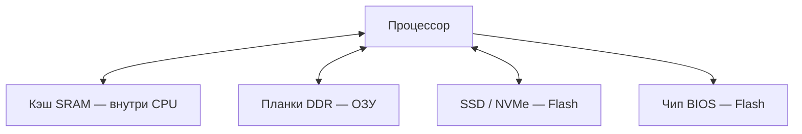

# Память изнутри

  ДЛЯ НОВИЧКОВ

Начальный уровень

  
Откуда материал

  

  По мотивам главы 9 учебника Д. В. Фомина "Основы компьютерной электроники". См. также <a href="/encyclopedia/9-spinoff/9-11-dlya-detey/1-computer/11">Физические компоненты</a> и <a href="/encyclopedia/9-spinoff/9-11-dlya-detey/1-computer/17">Цифровой сигнал</a>.

  

Память компьютера — **несколько видов** устройств. У каждого своя скорость, цена и главное правило — **сохраняются ли данные**, когда выключили питание.

---

## Ячейка памяти — один бит

Минимальный элемент — **ячейка**, хранящая **1 бит** (0 или 1).

Ячейки объединяют в **матрицу** (строки и столбцы). Чтобы прочитать бит, процессор посылает **адрес** — номер строки и столбца, как координаты в таблице.

Если в микросхеме **n** адресных линий, адресов может быть до **2ⁿ**. Например, 8 линий → 256 ячеек (в простейшем случае одного бита).

---

## Оперативная и постоянная память

| Класс | Русское название | Питание выключили |
|-------|------------------|-------------------|
| **RAM** | ОЗУ (оперативная) | Данные **теряются** |
| **ROM / Flash** | ПЗУ, флеш | Данные **остаются** |

Метафора из [статьи про компоненты](/encyclopedia/9-spinoff/9-11-dlya-detey/1-computer/11):

- **RAM** — рабочий стол (то, с чем работаете прямо сейчас)
- **SSD / Flash** — шкаф с папками (долговременное хранение)

---

## ОЗУ (RAM)

**ОЗУ** хранит то, с чем программа работает **в данный момент**:

- открытые вкладки браузера
- несохранённый документ
- игровой мир в памяти

### SRAM (статическая)

- ячейка — **триггер** (схема-память на транзисторах)
- бит **держится**, пока включено питание, без постоянного обновления
- быстрая, **дорогая**, мало ёмкости
- используется в **кэше процессора** (L1, L2, L3)

### DRAM (динамическая)

- ячейка — **транзистор + конденсатор** (заряд = 1, разряд = 0)
- заряд **утекает** — контроллер **обновляет** (регенерирует) ячейки тысячи раз в секунду
- дешевле и ёмче — **планки RAM** в ПК

**DDR** (Double Data Rate) передаёт данные **по обоим фронтам** тактового импульса. Отсюда названия DDR4, DDR5.

---

## ПЗУ и Flash

**ПЗУ (ROM)** хранит то, что должно пережить выключение:

- **BIOS/UEFI** — инструкции загрузки при включении
- прошивки устройств
- загрузчик ОС на встроенной памяти

Виды постоянной памяти (от редкой перезаписи к частой):

| Тип | Особенность |
|-----|-------------|
| **ROM / маскированное ПЗУ** | Записано на заводе |
| **PROM** | Перезапись один раз ("прожигание" перемычек) |
| **EPROM** | Стереть ультрафиолетом, записать снова |
| **EEPROM / Flash** | Стереть и записать **электрически**, много раз |

**SSD и флешка** — NAND Flash. Миллиарды транзисторов с **плавающим затвором** удерживают заряд **без питания**.

---

## Что где в обычном ПК

| Устройство | Тип памяти | Скорость | Ёмкость |
|------------|------------|----------|---------|
| Кэш L1–L3 | SRAM | Очень высокая | Килобайты–мегабайты |
| RAM | DRAM | Высокая | 8–64 GB типично |
| SSD | NAND Flash | Средняя | 256 GB – 2 TB |
| HDD | Магнитные пластины | Ниже SSD | Большие объёмы дёшево |

---

## Ёмкость и разрядность шины

Микросхему памяти описывают двумя числами:

- **сколько адресов** (строк × столбцов)
- **сколько бит** отдаётся за одно обращение (1, 8, 16…)

Пример из учебника: 8 адресных линий и 8 бит данных → **8 × 2⁸ = 2048 бит = 2 Кбит** — учебная схема. В реальном SSD — **терабайты**.

---

## Память и программы

- **Мало RAM** — ОС сбрасывает данные на диск (**файл подкачки**) → всё тормозит
- **Несохранённый файл** в блокноте сидит в RAM → при выключении без сохранения **пропадает**
- **Сохранили на диск** — данные попали в Flash/HDD → переживут перезагрузку

В Python переменная живёт в RAM, пока работает программа. Запись в файл — сохранение на диск — см. [Программа на Python](/encyclopedia/9-spinoff/9-11-dlya-detey/5-kod/6) и [Lab: файлы](/lab/Примеры/1126).

---

## Мини-задания

**1.** Выключили компьютер посреди игры без сохранения. Что пропало — уровень на диске или прогресс в RAM?  
**Ответ:** **прогресс в RAM**, если игра не успела записать save-файл.

**2.** Почему процессору нужен кэш, когда есть RAM?  
**Ответ:** кэш **ближе и быстрее** — CPU реже ждёт данные.

**3.** BIOS на материнской плате — ОЗУ или ПЗУ?  
**Ответ:** **ПЗУ (Flash)** — работает до загрузки Windows.

---

## Связанные материалы

- [Процессор](/encyclopedia/9-spinoff/9-11-dlya-detey/1-computer/20)  
- [Физические компоненты](/encyclopedia/9-spinoff/9-11-dlya-detey/1-computer/11)  
- [Транзисторы и микросхемы](/encyclopedia/9-spinoff/9-11-dlya-detey/1-computer/18)  
- [Как работает компьютер](/encyclopedia/1-basics/1-08-kak-rabotaet-kompyuter/intro)

---
