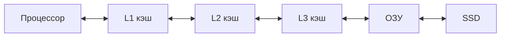

# Процессор — как он работает

  ДЛЯ НОВИЧКОВ

Начальный уровень

  
Откуда материал

  

  Глава 10 учебника Д. В. Фомина "Основы компьютерной электроники". См. также <a href="/encyclopedia/9-spinoff/9-11-dlya-detey/1-computer/11">Физические компоненты</a>, <a href="/encyclopedia/9-spinoff/9-11-dlya-detey/1-computer/19">Память изнутри</a>, <a href="/encyclopedia/1-basics/1-08-kak-rabotaet-kompyuter/intro">Как работает компьютер</a>.

  

**Процессор** (CPU, Central Processing Unit — центральное процессорное устройство) выполняет команды программы. Он читает инструкции из памяти, складывает числа, сравнивает значения и решает, какую команду выполнить следующей.

Пока процессор не запущен, программа на диске — просто файл. CPU превращает байты в действия.

---

## Части процессора

| Блок | Что делает |
|------|------------|
| **АЛУ** (арифметико-логическое устройство) | Сложение, вычитание, сравнение, логические операции "и", "или", "не" |
| **Устройство управления** | Берёт следующую команду из памяти и раздаёт сигналы другим блокам |
| **Регистры** | Сверхбыстрая память внутри CPU — несколько чисел "под рукой" |
| **Кэш** | Копия части оперативной памяти прямо в процессоре |

Все блоки собраны из **транзисторов** на одном кремниевом кристалле — см. [Транзисторы и микросхемы](/encyclopedia/9-spinoff/9-11-dlya-detey/1-computer/18).

**Инструкция** — одна элементарная команда для CPU ("сложить два числа", "перейти по адресу"). Программа — длинная цепочка таких команд.

---

## Тактовая частота и ядра

Процессор работает **тактами** — короткими импульсами, как метроном. Каждый такт — один шаг **конвейера** (pipeline):

- прочитать команду
- расшифровать её
- выполнить
- записать результат

**Герц (Гц)** — число тактов в секунду. **3 ГГц** (гигагерца) — около трёх миллиардов тактов в секунду.

На скорость влияет не только частота. Важны также:

- **архитектура** — как устроены блоки внутри
- **число ядер** — сколько независимых вычислителей на одном чипе
- **объём кэша** — сколько данных лежит рядом с CPU

**Ядро** — отдельный вычислительный блок. **Многоядерный** процессор может выполнять несколько задач параллельно. Игра часто грузит одно ядро, а операционная система, браузер и мессенджер распределяются по остальным.

**Поток** (thread) — отдельная "линия" выполнения внутри программы. Одно ядро может переключаться между потоками, создавая ощущение одновременной работы.

---

## CISC и RISC — два подхода к командам

**CISC** (Complex Instruction Set Computer) — набор **сложных** команд. Одна инструкция может, например, прочитать число из памяти, сложить его с регистром и записать обратно.

Примеры процессоров CISC:

- Intel x86 и AMD x64 — большинство настольных ПК и ноутбуков

**RISC** (Reduced Instruction Set Computer) — набор **простых** коротких команд. Сложную операцию собирают из нескольких простых шагов.

Примеры процессоров RISC:

- ARM — смартфоны, планшеты, многие одноплатные компьютеры
- Apple Silicon (M1, M2, …) — ядра на базе ARM

Современные x86-процессоры внутри **разбивают** сложные команды на простые **микрооперации** — идеи CISC и RISC смешиваются.

**DSP** (Digital Signal Processor) — процессор для **цифровой обработки сигналов** (звук, радио, модем). Рассчитан на потоковые вычисления с фиксированным набором операций.

---

## Типы процессоров по назначению

- **Универсальные** — ПК и серверы (Intel Core, AMD Ryzen)
- **Встроенные (embedded)** — микроконтроллеры в стиральной машине, Arduino, умной лампочке
- **Специализированные**
  - **GPU** — графика и параллельные вычисления (см. [видеокарта](/encyclopedia/2-system-network/2-10-zhelezo/11))
  - **NPU** — ускорение нейросетей на телефоне

Первый микропроцессор **Intel 4004** (1971) содержал около 2300 транзисторов. Современный CPU — **миллиарды**.

---

## Процессор и память

CPU редко обращается к SSD за каждой инструкцией. Порядок поиска данных:

1. **L1, L2, L3 кэш** — самый быстрый доступ
2. **ОЗУ (RAM)** — медленнее, но объём больше
3. **Файл подкачки на диске** — когда RAM переполнена; компьютер тормозит

Подробнее про виды памяти — [Память изнутри](/encyclopedia/9-spinoff/9-11-dlya-detey/1-computer/19).

---

## Разрядность 32-bit и 64-bit

**Разрядность** — сколько бит процессор обрабатывает за одну операцию (в типичных случаях).

**32-bit** — адреса памяти до ~4 ГБ без специальных приёмов.

**64-bit** — больший диапазон адресов, программы могут использовать больше RAM. Есть дополнительные инструкции для работы с длинными числами.

Переход с 32-bit на 64-bit **не удваивает** скорость автоматически. Меняется "ширина" шины данных и набор команд.

---

## Мини-задания

**1.** Что быстрее — L1 кэш или RAM?  
**Ответ:** L1 кэш. Он находится внутри процессора.

**2.** Почему в процессоре 8 ядер, если игра использует одно?  
**Ответ:** Остальные ядра обслуживают ОС, браузер, Discord и фоновые задачи.

**3.** Почему телефон работает без вентилятора?  
**Ответ:** ARM-чипы часто потребляют меньше ватт, чем desktop x86 при схожих задачах.

---

## Связанные материалы

- [Цифровой сигнал](/encyclopedia/9-spinoff/9-11-dlya-detey/1-computer/17)  
- [Память изнутри](/encyclopedia/9-spinoff/9-11-dlya-detey/1-computer/19)  
- [Физические компоненты](/encyclopedia/9-spinoff/9-11-dlya-detey/1-computer/11)  
- [Как работает компьютер](/encyclopedia/1-basics/1-08-kak-rabotaet-kompyuter/intro)

---
