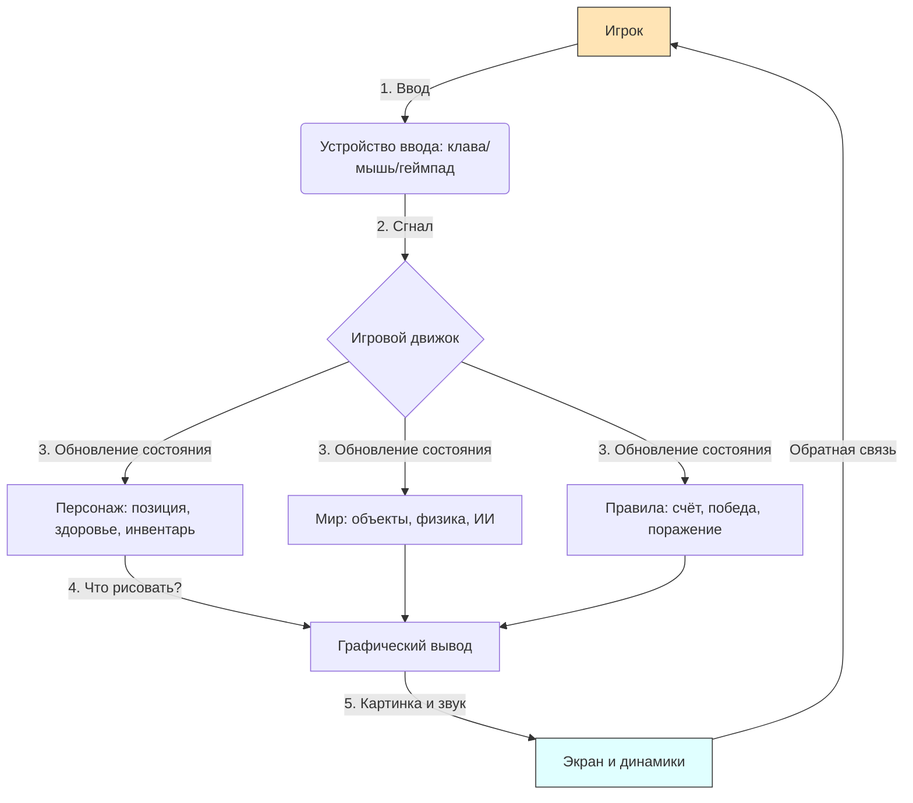
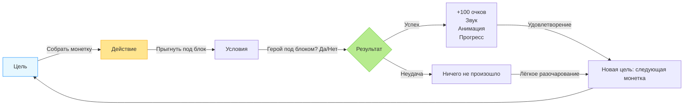

import ExternalPlayEmbed from '@site/src/components/ExternalPlayEmbed';


# Видеоигры

<div class="article-tags">
  <span class="tag tag-required">ОБЯЗАТЕЛЬНО</span>
  <span class="tag tag-beginner">ДЛЯ НОВИЧКОВ</span>
</div>

<span class="complexity-badge">Начальный уровень</span>

<div class="callout callout--tip">
  <div class="callout-title">Интерактив</div>

  <div class="callout-body">
  Покрутите виртуальный геймпад — так же сигнал уходит в настоящую игру.
</div>
  </div>


<ExternalPlayEmbed example="basics/gamepad-play" title="Gamepad" />

---

## Видеоигры

### Что такое видеоигры?

**Видеоигра** — интерактивная программа — игрок влияет на происходящее (управление персонажем, выбор действий, стратегия), а не только наблюдает заранее записанный сюжет.

В фильме или книге ход событий фиксирован автором. В игре часть решений принимает игрок — можно выбрать маршрут, тактику, ответ в диалоге — и увидеть другой исход.

Например, в сцене с автомобилем в кино машина едет по заданной траектори; в игре Вы можете свернуть, остановиться или попробовать другой путь:

 

---

#### Где живут видеоигры?

Видеоигры не существуют сами по себе — они работают внутри **устройств**, способных их "понимать" и показывать. Такие устройства называются *вычислительными системами*. В повседневной жизни мы называем их проще:

- **Компьютер** (настольный или ноутбук) — мощная машина, в которой игра "оживает" с помощью процессора, видеокарВы и оперативной памяти.  
- **Игровая приставка** (например, PlayStation, Xbox, Nintendo Switch) — специальный компьютер, собранный специально для игр.  
- **Смартфон или планшет** — маленький, но очень умный карманный компьютер. Многие игры там умещаются в одном приложении.  
- **Облачные сервисы** — новая технология: игра запускается на далёком сервере, а Вам по интернету приходит только картинка и звук. Как будто Вы смотрите стрим, но при этом управляете героем в реальном времени.


> **Интересный факт**: первая в мире видеоигра — *Tennis for Two* — появилась в 1958 году. Её создал физик Уильям Хиггинботэм на осциллографе (это такой прибор с зелёным экраном, на котором рисуются графики). Там не было персонажей — только две лини и точка-мячик. Но люди *уже тогда* могли играть вдвоём, поворачивая ручки и отбивая "мяч".

---

#### Чем видеоигра отличается от других развлечений?

| Средство       | Кто управляет событиями? | Можете ли Вы повлиять? |
|----------------|--------------------------|------------------------|
| Книга          | Автор                    | Нет                    |
| Фильм / Мультик| Режиссёр                 | Нет                    |
| Театр          | Актёры + режиссёр        | Иногда — через выбор зала, но не на сцене |
| **Видеоигра**  | **Вы + разработчики**    | **Да — постоянно!**    |

В игре разработчики создают *мир*, *правила* и *возможности* — а Вы выбираете, как ими пользоваться. Можно бежать вперёд, как все. А можно остановиться и исследовать каждую щель в стене — вдруг там спрятана секретная дверь?

---

#### Почему "видео"?

Слово *видео* происходит от латинского *video* — "я вижу". Оно появилось, потому что игры показывают движущиеся изображения на экране — как видео. Но в отличие от обычного видео, эти изображения *меняются в ответ на Ваши действия*.  


То есть:  
- **Видео** — это сигнал, который идёт на экран.  
- **Игра** — это программа, которая *генерирует* этот сигнал, основываясь на том, что Вы делаете.

Если представить игру как театральную постановку, то:  
- Вы — главный актёр (или режиссёр — зависит от игры),  
- Компьютер — сценограф, осветитель, звукооператор и гримёр *в одном лице*,  
- Программный код — сценарий *и* инструкция для техников одновременно.

---

#### А зачем вообще нужны видеоигры?

Некоторые думают: "Игры — это только для развлечения". И отчасти это правда — как и книги, фильмы или спорт, игры приносят радость. Но их ценность гораздо шире.

- **Обучение через действие**. В игре Вы *не читаете*, как строится мост, — Вы *строите* его (например, в *Bridge Constructor* или *Minecraft*), пробуете, ошибаетесь, учитесь на последствиях.  
- **Развитие мышления** — планирование, оценка рисков, ресурс-менеджмент — всё это тренируется в стратегиях и симуляторах.  
- **Эмпатия и этика** — в некоторых играх (например, *Undertale*, *Papers, Please*) выбор влияет на судьбы персонажей. Вы не просто "проходите уровень" — Вы *принимаете моральные решения*.  
- **Творчество** — игры вроде *Dreams* (PlayStation) или *Roblox Studio* позволяют *создавать* свои миры, персонажей, даже целые игры внутри игры.

> 🌱 **Мысль для размышления**:  
> Когда-то люди играли в шахмаВы на деревянной доске. Потом придумали шахмаВы на компьютере. А потом — игры, в которых шахматные фигуры оживают, рассказывают истории, и каждая партия — это эпическое сражение.  
> То есть: игра — это не просто "игрушка". Это *формат*, в котором можно передавать знания, чувства, идеи. Как книга. Как картина. Как песня.

---

### Как устроена игра?  

#### Персонаж, мир, правила  


Вы хотите сочинить сказку. С чего начнёте?  
Скорее всего — с героя: *Кто это? Что он умеет? Чего хочет?*  
Потом — с места действия: *Где он живёт? Что вокруг? Опасно ли там?*  
И наконец — с законов этого мира: *Можно ли летать? Нужно ли спасать принцессу? Что будет, если герой упадёт в лаву?*  

Видеоигра устроена почти так же. Только вместо "сочинить" — "создать работающую систему". И вместо "читателя" — *игрок*, который *действует внутри* этой системы.  

Разберём каждый кит подробно.

---

#### Персонаж (или "агент")

Это не обязательно человек, не обязательно даже живое существо. Это то, *за кого Вы играете* — то, чьи действия Вы контролируете.  

Вот примеры:  
- Марио — водопроводчик в красной шапке.  
- Корабль в *Asteroids* — просто треугольник, но он *Ваш*.  
- Танк в *World of Tanks* — машина, но Вы решаете, куда он едет и когда стреляет.  
- Даже курсор в *Microsoft Paint* — если представить, что Вы играете в "найдите все пиксели", то курсор — Ваш персонаж.  

**Что важно про персонажа?**  
- У него есть **состояние** — то, что "про него знает игра". Например:  
  - Где он находится (координаты X, Y, Z),  
  - Жив он или мёртв,  
  - Сколько у него здоровья, маны, патронов,  
  - Есть ли у него шляпа, меч, реактивный ранец.  
- У него есть **возможности** — что он *может делать* — прыгать, бегать, стрелять, разговаривать, копать землю.  
- И есть **ограничения** — что он *не может* — летать без крыльев, пройти сквозь стену (если только игра не позволяет), поднять 100-тонный камень без усиления.  

> **Примечание:  
> Иногда Вы управляете многими персонажами — как генерал, управляющий армией. Иногда — вообще *ничего не управляете*, а только наблюдаете и решаете, *когда* и *что запустить* (например, в *Космических рейсах* или *Factorio*). Но даже тогда в игре есть *объекты*, за которые Вы "отвечаете". Это и есть Ваша "точка входа" в мир.

---

#### Мир

Мир — это всё, что окружает персонажа, *пространство, в котором что-то происходит*.  

Мир может быть:  
- **Физическим** — как в *Super Mario* — есть пол, стены, трубы, облака. Вы можете упасть вниз из-за гравитации, удариться головой о кирпич.  
- **Абстрактным** — как в *Tetris* — поле из клеток, фигуры падают, и "мир" — это состояние этого поля. Нет деревьев, но есть *логика*: если заполнить линию — она исчезает.  
- **Социальным** — как в *Animal Crossing* — мир живёт по своему времени, соседи помнят, как Вы с ними разговаривал, дарил подарки, помогал.  

**Как строят миры в играх?**  
- **Карта** — это "план местности". Может быть нарисована вручную (как в *Hollow Knight*), а может генерироваться автоматически (как в *Minecraft* в режиме "бесконечный мир").  
- **Объекты** — всё, что в мире *существует отдельно* — дерево, враг, сундук, кнопка на стене. Каждый объект — это тоже маленькая "программка" внутри игры: "если игрок подошёл — открыться", "если пулька попала — взорваться".  
- **Физика** — не обязательно такая же, как в реальности. В *Celeste* герой может сделать двойной прыжок и рывок в воздухе — это *правило мира*.  

> **Интересный факт**:  
> В *No Man’s Sky* — более 18 квинтиллионов (!) планет. Их не рисовали художники. Их *создаёт алгоритм* по математической формуле. Одна и та же формула + разное "зерно" (seed) = разные миры. Это как если бы у Вас был рецепт "сделайте планету", и Вы подставляли разные числа — получались бы разные горы, реки, животные.  

---

#### Правила

Правила — это *законы игры*. Без них не было бы ни победы, ни поражения, ни смысла.  

Правила бывают:  
- **Явные** — написаны в обучении или подсказках:  
  > *"Соберите 100 монет — получите дополнительную жизнь"*  
  > *"Не касайся шипов — потеряете здоровье"*  

- **Скрытые** — Вы узнаёте их через опыт:  
  > В *Dark Souls* монстры "запоминают" Ваши действия и меняют тактику. Это не написано в меню — но Вы чувствуете: "Они теперь ждут, когда я прыгну".  
  > В *Minecraft* зомби не могут ломать дубовые двери, но ломают еловые. Это не подсказка — это свойство мира, которое можно *открыть*.  

- **Фундаментальные** — без них игра просто не будет *игрой*:  
  - Есть **цель** (даже если она — "выжить как можно дольше").  
  - Есть **обратная связь** (Вы сделалии — и увидели результат — звук, вспышка, надпись "+10 очков").  
  - Есть **баланс** — если победить можно за 1 секунду, или если проиграть — неизбежно, игра быстро наскучит.  

> 🧠 **Проверьте себя**:  
> Возьмите любую игру — даже *Flappy Bird*. Задайте три вопроса:  
> 1. *Кто мой персонаж?* — Птичка.  
> 2. *Какой у неё мир?* — Вертикальные трубы, гравитация, небо фоном.  
> 3. *Какие правила?*  
>    - Нажимаю — птичка взлетает,  
>    - Не нажимаю — падает,  
>    - Коснулся трубы или пола — игра окончена,  
>    - Пролетел между трубами — +1 очко.  

Просто? А ведь это *полноценная игра*. Значит, сложность — в *ясности структуры*.

---

#### Всё вместе

Любая игра работает по одному и тому же циклу — его называют **игровым циклом** (*game loop*). Он повторяется снова и снова, 60 раз в секунду (или чаще).  

Вот как он выглядит — без кода, как рассказ:

1. **Что сделали игрок?**  
   — Нажал клавишу? Двинул джойстик? Коснулся экрана?  

2. **Как мир отреагировал?**  
   — Персонаж прыгнул. Пуля вылетела. Сундук открылся.  

3. **Что изменилось?**  
   — Координаты героя обновились.  
   — Здоровье врага уменьшилось.  
   — Счётчик монет увеличился.  

4. **Что показать игроку?**  
   — Нарисовать новую картинку.  
   — Проиграть звук прыжка.  
   — Вывести надпись "Уровень пройден!".  

5. **→ Вернуться к шагу 1.**

Этот цикл — сердце любой игры. Даже в *The Witcher 3* с её 500-часовым сюжетом — в основе лежит тот же самый цикл: *действие → реакция → обновление → отображение*.

---

#### "Как устроена игра?"  

Ниже — схема, которую можно вставить в книгу (поддерживается в Markdown через `mermaid`):



**Пояснение к схеме**:  
- Игрок делает что-то → устройство передаёт сигнал → движок *всё пересчитывает* → решает, что показать → экран и звук возвращают информацию игроку → игрок снова действует.  
- Это *замкнутый круг* — поэтому игра "живёт", пока работает цикл.

---

### Как мы управляем?  

#### От нажатия до действия — путь сигнала  

Вы стоите у двери, за которой — волшебный мир. Перед Вами — три разных замка:  
- **Клавиатурный замок** — нужно нажать *именно эту* комбинацию букв.  
- **Мышинный замок** — нужно провести пальцем по узору *в такт музыке*.  
- **Геймпад-замок** — нужно одновременно повернуть два колеса и нажать кнопку *с нужным усилием*.  

Каждый замок открывает одну и ту же дверь — но *способ взаимодействия* меняет всё:

- скорость;
- точность;
- ощущение контроля.

В играх то же самое: **устройство ввода — это язык, на котором Вы разговариваете с игрой**.  

Разберём три основных "языка".

---

#### Клавиатура  

Клавиатура родилась как инструмент для *печати* — но в играх она стала *органайзером действий*.  

Каждая клавиша — это **кнопка действия**. Но в отличие от пульта от телевизора (где "вверх" — только "вверх"), в играх *одна и та же клавиша может означать разное*:  
- В *Minecraft* **E** — открыть инвентарь.  
- В *Counter-Strike* **E** — подобрать предмет или открыть дверь.  
- В *The Sims* **E** — ускорить время.  

Почему так? Потому что клавиатура — устройство *дискретное* — оно не чувствует, *насколько сильно* Вы нажали, а только *нажали ли*. Зато у неё **много кнопок** — около 100+. Это позволяет назначить *каждому действию свой символ*.  

**Преимущества клавиатуры**:  
- Высокая плотность управления: можно одновременно нажать **W+A+Shift+Ctrl** — и персонаж побежит влево, пригнувшись и стреляя.  
- Точность ввода текста — чат, поиск, имена персонажей — только клавиатура.  
- Долговечность: механическая клавиатура выдерживает десятки миллионов нажатий.  

**Недостатки**:  
- Неудобно для *аналоговых* действий — например, "поворот на 37 градусов". Клавиша либо нажата, либо нет.  
- Требует привычки: новичку сложно не смотреть на руки.  

> **Интересный факт**:  
> В 1980-х годах в играх на ZX Spectrum или Commodore 64 часто использовали только *одну руку* — потому что другая держала джойстик! Например, в *Jet Set Willy* левая рука на клавишах (прыжок, стрельба), правая — на аналоговом джойстике (движение).  

**Как клавиатура "говорит" с компьютером?**  
Когда Вы нажимаете клавишу:  
1. Под ней смыкаются два контакта → идёт электрический импульс.  
2. Микросхема в клавиатуре определяет *код клавиши* (например, `0x1E` — это буква **A**).  
3. Этот код отправляется по USB/Bluetooth в компьютер.  
4. Игра получает событие: *"Клавиша A нажата"* → запускает действие: *"герой идёт влево"*.

---

#### Мышь  

Мышь — не "указатель". Это **измеритель перемещения**.  

Когда Вы водите мышью по столу, внутри работает оптический датчик: маленькая камера, делающая 6000 снимков в секунду поверхности. Сравнивая кадры, она вычисляет: *на сколько пикселей и в каком направлении Вы сдвинули мышь*.  

Это называется **относительным вводом** — мышь не знает, *где* курсор — она знает, *насколько он должны сдвинуться*.  

**Почему мышь так важна в играх?**  
- **Точность**. В *FPS* (шутерах от первого лица) поворот головы — это движение мыши. Чем точнее Вы ведёте, тем точнее прицел.  
- **Скорость реакции**. Переместить курсор из левого верхнего угла в правый нижний — меньше секунды. На геймпаде — 2–3 секунды.  
- **Дополнительные кнопки**: колёсико — прокрутка и "средняя кнопка", боковые — переключение оружия.  

**Но есть и ограничения**:  
- Нужна поверхность. На коленях в автобусе — сложно.  
- Устаёт рука при долгой игре ("мышечная усталость запястья").  
- Не передаёт *усилие* — нельзя "слегка надавить", чтобы персонаж медленно шёл.  

> 🌐 **История в двух строках**:  
> Первая компьютерная мышь появилась в 1964 году у Дугласа Энгельбарта. Она была деревянной, с двумя металлическими колёсиками и одним проводом. Назвали её "мышью" потому, что провод напоминал хвост.

---

#### Геймпад (джойстик, контроллер)  

Геймпад — это не "игрушечная клавиатура". Это **эргономичный интерфейс**, созданный под анатомию руки.  

Ключевая особенность — **аналоговые элементы**:  
- **Аналоговые стики** — *угол и сила отклонения*.  
  - Слегка наклонил стик — герой идёт.  
  - До упора — бежит.  
  - На 45° — идёт по диагонали.  
- **Триггеры (LT/RT)** — *рычаги с градацией нажатия*.  
  - В *Forza* — чем сильнее жмёте правый триггер, тем сильнее газ.  
  - В *Resident Evil* — можно *медленно* нажать, чтобы тихо открыть дверь.  

<ExternalPlayEmbed example="basics/gamepad-play" title="Gamepad" playProps={{ variant: 'compact' }} />

**Почему геймпад удобен для консолей?**  
- Компактность: всё под рукой, не нужно смотреть.  
- Вибрация (**хаптическая обратная связь**) — Вы *чувствуете*, как машина едет по гравию, как взрывается граната.  
- Адаптация под жанры:  
  - В гонках — руль (специальный геймпад),  
  - В файтингах — дуговые стики для "комбо",  
  - В ритм-играх — ударные колодки или гитара.  

**Современные инновации**:  
- **Adaptive Triggers** (DualSense, PS5) — триггеры могут "сопротивляться" по-разному:  
  - В *Astro’s Playroom* — как будто нажимаете на пружину.  
  - В *Returnal* — оружие "заедает", если перегрелось.  
- **Встроенные микрофоны и динамики** — звук идёт прямо из контроллера, как в *Astro Bot*.  

---

#### А что ещё бывает?  

Не будем ограничиваться тремя. Современные игры используют **гибридные** и **альтернативные** способы ввода:

| Устройство | Как работает | Пример игры |
|------------|--------------|-------------|
| **Сенсорный экран** | Пальцы = курсоры. Поддерживает *мультикасание* (2 пальца — приблизить, 3 — меню). | *Monument Valley*, *Angry Birds* |
| **Голос** | Микрофон → распознавание речи → команда. | *Tom Clancy’s EndWar* ("Отряд Альфа, атакуй!") |
| **Камера / Датчики движения** | Следит за телом: прыгнул — прыгнул герой. | *Kinect Sports*, *Just Dance* |
| **VR-контроллеры** | Трекинг положения в 3D: поднял руку — меч поднят. | *Half-Life: Alyx*, *Beat Saber* |
| **Глаза (eye-tracking)** | Камера следит, куда смотрите — и фокусирует рендер там. | *Microsoft Flight Simulator* (на совместимых ПК) |

> ⚠️ Важно: ни одно устройство не "лучше" другого *вообще*. Всё зависит от **задачи**:  
> - Набрать код — клавиатура.  
> - Прицелиться в голову — мышь.  
> - Испытать гравитацию в космосе — VR-контроллер.  

---

#### Почему нельзя просто "подключить любое устройство"?  

Потому что игра должны *понимать язык*.  

Когда разработчик делает игру, он задаёт:  
- Какие **события ввода** она слушает (`KeyDown`, `MouseMove`, `GamepadButtonDown`).  
- Как **отображать** их в действия (`W → moveForward`, `LeftStickX → rotateCamera`).  
- Как **реагировать на разные устройства** (если нет мыши — использовать геймпад для прицеливания).  

Это называется **абстракция ввода** — игра не знает, *что* Вы нажали — она знает, что получила команду *"прыгнуть"*, а откуда она пришли — уже неважно.

> 🛠️ Пример из жизни:  
> В *Minecraft* (Java Edition) по умолчанию:  
> - **Пробел** — прыжок (клава),  
> - Нажатие **A** на геймпаде — тоже прыжок (если подключен контроллер).  
> Игра не проверяет "это клавиша или кнопка" — она получает *абстрактное событие* `JumpPressed`.

---

### Простые механики  

#### Что такое игровая механика?

Это **правило поведения в системе**, которое можно *повторить*, *комбинировать* и *развивать*.  

Механика — не "прыжок". Прыжок — это *действие*.  
Механика — это:  
> *"Если персонаж на земле и нажата кнопка прыжка → он получает импульс вверх. Пока он в воздухе, повторное нажатие даёт второй прыжок (если разрешено правилами)"*.

То есть — **связь между состоянием мира, вводом игрока и изменением состояния**.

Самая фундаментальная механика любой игры — это цепочка из трёх звеньев:

```
ЦЕЛЬ  →  ДЕЙСТВИЕ  →  РЕЗУЛЬТАТ
```

Разберём каждое звено — сначала просто, потом глубже.

---

#### Цель

Цель — это **мотивация**. Без неё действие бессмысленно.  

Цели бывают разного уровня:  

| Уровень | Пример | Срок выполнения |
|--------|--------|-----------------|
| **Микроцель** | Собрать монетку | 2–3 секунды |
| **Мезоцель** | Пройти уровень | 5–15 минут |
| **Макроцель** | Спасти принцессу | 10+ часов |
| **Метацель** | Получить 100% завершения | Недели, месяцы |

> **Важно: цель не обязана быть *заданной явно*.  
> В *Minecraft* в начале игры нет цели — только: *"Вы в лесу. Ночью будут монстры"*.  
> Цель возникает *из правил*: "надо выжить" → "надо построить укрытие" → "надо найти дерево" → "надо ударить его".

**Хорошая цель — это когда игрок сам *догадывается*, что делать, а не читает инструкцию.**  
Как? Через *визуальные подсказки*:  
- Монетка светится → "наверное, её надо взять".  
- Дверь приоткрыта, из-под неё свет → "там что-то есть".  
- Враг смотрит в сторону → "если я подойду, он нападёт".

---

#### Действие

Действие — это **инструмент достижения цели**. Но не любое действие подходит.  

Игра всегда ограничивает возможности — иначе не было бы *выбора*.  

Пример:  
> В *Super Mario Bros.* на уровне 1-1 Вы видите блок с вопросительным знаком.  
> — Цель: понять, что внутри.  
> — Доступные действия:  
>   - Пройти мимо,  
>   - Прыгнуть под блок.  
> — Результат:  
>   - Если прыгнул — выпадает монетка (+100 очков),  
>   - Если нет — ничего (но можно вернуться позже).

Заметьте: **действие становится интересным только в контексте последствий**.  
Если бы *все* блоки давали монетки — скучно.  
Если *никакие* — тоже.  
Интерес — в *неопределённости*: *"А что, если в этом — гриб?"*

> **Закон игрового дизайна №1 (из практики)**:  
> *"Давайте игроку выбор между двумя равноценными, но разными по стилю действиями"*.  
> — В *Dark Souls*: можно атаковать с разбега (риск) или дождаться блока (осторожность).  
> — В *Civilization*: развивать науку (долгая выгода) или армию (быстрая сила).

---

#### Результат

Результат — это **обратная связь**. Именно она превращает действие в *опыт*.  

Хороший результат должны быть:  
- **Понятен** — Вы сразу видите/слышите/чувствуете, что произошло.  
- **Измерим** — "+1 монетка", "–20 здоровья", "уровень опыта 42/100".  
- **Значим** — даже маленькое изменение должно *двигать игру вперёд*.  

Примеры обратной связи:  
| Действие | Минимальный результат | Богатый результат |
|---------|------------------------|-------------------|
| Собрал монетку | Число +1 | Звук *"динь!"*, искры, +10 очков, прогресс-бар монеток подрос на 1% |
| Ударил врага | Враг получил урон | Враг отлетел, оставил след крови, заорал, упал на колени, исчез с дымом |
| Построил дом | Появился блок | Птицы прилетели, внутри загорелся свет, NPC сказали: "Спасибо!" |

> 🌱 **Мысль для размышления**:  
> В реальной жизни результат не всегда очевиден:  
> — Вы учите урок — и не знаете, поможет ли это завтра на контрольной.  
> — В игре — да. Каждое действие *подтверждается*. Это и создаёт чувство контроля, уверенности, удовольствия.

---

#### Разбор на примере

Возьмём *Super Mario Bros.*, уровень 1-1 — самый известный в истории.  

---

##### Шаг 1. Цель  

→ *Собрать как можно больше монеток.*  
(Микроцель, но встроена в мезоцель: "дойти до флага".)

---

##### Шаг 2. Действие  

→ *Прыгнуть под блок с вопросительным знаком.*  
- Условия:  
  - Герой должны быть под блоком,  
  - Нажата кнопка прыжка,  
  - Блок ещё не активирован.  

---

##### Шаг 3. Результат  

→ *Выпадает монетка — звук, анимация, +100 очков, счётчик монет обновляется.*  
- Дополнительно:  
  - Если собрать 100 монет — +1 жизнь (макроцель),  
  - Если пропустил — блок остаётся, можно вернуться (не наказание за ошибку).

---

##### Цикл замыкается

Вы видите следующий блок → цель возобновляется → действие повторяется → результат подкрепляет мотивацию.  

Это и есть **игровой цикл**:  
> *Предвкушение → действие → подтверждение → желание повторить.*

---

#### Как усложняется механика?

Простая механика — как буква. Из букв складываются слова, из слов — предложения.  

Вот как развивается механика *прыжка*:

| Этап | Описание | Пример |
|------|----------|--------|
| **1. База** | Прыжок = подпрыгнуть и приземлиться | *Pong* (ракетка "прыгает" по краю) |
| **2. Вариация** | Двойной прыжок, рывок, приземление с уроном | *Celeste* (воздушный рывок в любом направлении) |
| **3. Комбинация** | Прыжок + атака = прыжковой удар | *Hollow Knight* (дроп-слэш) |
| **4. Система** | Прыжок влияет на физику мира: разрушает блоки, активирует триггеры | *Minecraft* (прыжок с зелья лёгкости), *Braid* (замедление времени в прыжке) |

> 🔁 **Правило развития**:  
> *Хорошая механика не требует новых кнопок — она использует старые по-новому.*  
> В *Mario* — всего 2 кнопки (бег/прыжок), но из них сделаны сотни ситуаций:  
> - Прыжок на врага → убить,  
> - Долгий прыжок → прыжок выше,  
> - Прыжок в воду → плавное погружение.

---

#### "Цикл механики"



**Комментарий к схеме**:  
- Цикл *не имеет конца* — он работает, пока игра запущена.  
- "Неудача" не наказывает — она *позволяет повторить*, что снижает стресс.  
- Результат всегда возвращает к *новой цели* — даже если это та же самая.

---

#### Почему механика важнее графики?

Потому что:  
- Графика устаревает за 5 лет.  
- Механика — вечна.  

*Pong* (1972) выглядит примитивно. Но возьмите его правила — и перенеси в 3D с физикой, частицами, музыкой: получите *Rocket League*.  
Игра про "бить мяч ракеткой" — та же. Но *ощущение* — новое.

> 📜 **Цитата из индустрии**:  
> *"Дизайнеры не делают игр. Они делают правила. Игру делает игрок — своими действиями".*  
> — Сд Мейер (создатель *Civilization*)

---
