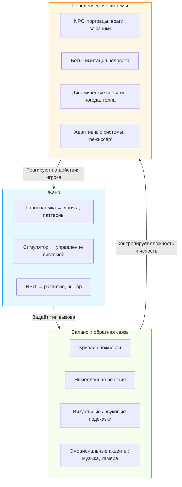

import ExternalPlayEmbed from '@site/src/components/ExternalPlayEmbed';


# Игровые жанры и интеллект

<div class="article-tags">
  <span class="tag tag-required">ОБЯЗАТЕЛЬНО</span>
  <span class="tag tag-beginner">ДЛЯ НОВИЧКОВ</span>
</div>

<span class="complexity-badge">Начальный уровень</span>

<div class="callout callout--tip">
  <div class="callout-title">Интерактив</div>

  <div class="callout-body">
  Демо ниже — нажимайте кнопки и смотрите, как это устроено. Ничего на компьютере не меняется.
</div>
  </div>


<ExternalPlayEmbed example="basics/match-three-play" title="Match-3 — механика игры" minHeight={480} />

---

## Игровые жанры и интеллект

В *Minecraft*, *Among Us* или *Portal* кажется, что мир живёт сам. На деле за кадром — команда людей и куча правил в коде. Вы нажимаете кнопку — игра отвечает: это и есть ключевая особенность жанра.

У любой нормальной игры есть три опоры:

1. **Правила** — что можно делать, а что нет (например, прыгать, но не летать);
2. **Цель** — зачем Вы это делаете (спасти принцессу, вырастить ферму, выйти из лабиринта);
3. **Обратная связь** — как игра отвечает на Ваши действия (Вы промахнулись — враг смеётся; Вы решили задачу — звучит музыка победы).

В этой главе мы разберём, как эти три опоры работают в разных **жанрах**, зачем игры не бывают "слишком лёгкими" или "слишком сложными" — и как компьютер "думает" за врагов и мир вокруг Вас.

<div class="callout callout--info">
  <div class="callout-title">За 15 минут</div>

  <div class="callout-body">
  <strong>Жанр</strong> — это не только "стрелялка" или "гонки". Это правила + цель + обратная связь.<br/>
  <strong>Игровой цикл</strong> — "ввод → обработка → ответ" много раз в секунду: Вы нажали — игра пересчитала мир — Вы увидели результат.<br/>
  <strong>ИИ</strong> в играх чаще всего — набор простых правил ("если игрок близко — атакуй"), а не "разумный робот".
</div>
  </div>


---

### Игровой цикл (как игра "живёт" каждую секунду)


Пока Вы играете, этот круг крутится 30–60 раз в секунду. Задержка между нажатием и ответом должна быть почти незаметной — иначе игра кажется "тяжёлой".

---

### Игровые жанры

Слово *жанр* пришло из литературы и музыки — так классифицируют произведения по общим признакам. В книгах есть фантастика, детективы и сказки; в музыке — рок, джаз, классика. А в играх — **головоломки**, **симуляторы**, **ролевые игры** и ещё десятки других типов.

Важно: жанр — это **модель взаимодействия игрока с миром**. Каждый жанр предлагает особый способ *думать*, *действовать* и *учиться*.

---

#### Головоломки (Puzzle)

Это игры, построенные вокруг **логических или пространственных задач**. Главное в них — способность замечать закономерности, пробовать гипотезы и корректировать их.

Примеры:
- *Portal* — нужно использовать "портальные пушки", чтобы попасть в недоступное место. Здесь важна физика (угол падения = угол отражения), умение *мысленно* представить, как соединятся две стены.
- *The Witness* — остров, покрытый панелями с лабиринтами. Постепенно правила усложняются — сначала просто провести линию от начала до конца, потом — учесть симметрию, тени, звуки.

Что учит головоломка?  
— Разбивать большую задачу на маленькие шаги.  
— Понимать: ошибка — **данные для следующей попытки**.  
— Замечать, как одни правила могут скрываться за другими (например, в *The Witness* тень дерева может быть частью подсказки).

---

#### Симуляторы (Simulation)

Здесь цель — **воспроизвести работу реальной или вымышленной системы**. Это *модель*, которая сохраняет ключевые связи и зависимости.

Примеры:
- *Microsoft Flight Simulator* — самолёт реагирует на ветер, вес багажа, даже на состояние двигателя. Если неправильно распределить топливо — баки могут разорваться при приземлении.
- *Cities — Skylines* — город живёт по своим законам — если не построить электростанцию — дома останутся без света, фабрики остановятся, а люди начнут уезжать.
- *Stardew Valley* — ферма, где урожай зависит от времени года, полива, удобрений и даже от дружбы с соседями (да, в игре дружба влияет на качество семян!).

Что учит симулятор?  
— Понимать **системное мышление**: как изменение одного элемента влияет на другие.  
— Принимать решения при ограниченных ресурсах (время, деньги, энергия).  
— Прогнозировать последствия: посадил пшеницу в зиму — не уродится.

---

#### Ролевые игры (RPG — Role-Playing Game)

В переводе — "игра, в которой Вы играете роль". Но это не значит "просто переодеть героя". В RPG Ваш персонаж **меняется со временем** — становится сильнее, умнее, получает новые навыки — и эти изменения влияют на то, какие задачи Вы можете решать.

Примеры:
- *The Legend of Zelda: Breath of the Wild* — Вы не просто герой с мечом. Вы можете поджечь траву, чтобы создать поток воздуха и подняться на парашюте; можете заморозить воду, чтобы добраться до острова. Игра не говорит: "Так нельзя" — она спрашивает: "А что, если попробовать?".
- *Undertale* — RPG, где бой можно выиграть *не атакуя*. Чем дольше Вы говорите с врагом, тем выше шанс договориться. Игра запоминает: если Вы убили хотя бы одного — концовка изменится.

Что учит RPG?  
— **Этика выбора**: действия имеют долгосрочные последствия.  
— **Идентичность через развитие**: Вы не "крутой с самого начала" — Вы становитесь таким через усилия.  
— Гибкость: одна и та же задача может иметь десятки решений.

> **Замечание для внимательных**: многие игры сочетают жанры. Тот же *Minecraft* — это одновременно симулятор (физика блоков, рост растений), RPG (прокачка заклинаний, брони), и головоломка (как построить автоматическую ферму?). Жанры — это скорее "инструменты", а не "коробки".

---

### Баланс и обратная связь

Вы играете в гонки. На первом уровне машины едут медленно, повороты широкие — легко. На третьем — ветер сбивает с трассы, топливо заканчивается быстрее. На десятом — противники уворачиваются от Ваших ракет и строят засады.

Это не случайность. За этим стоит **дизайн баланса** — процесс подбора таких условий, при которых игрок:
- не чувствует, что "всё и так ясно" (иначе — скука),
- не чувствует, что "ничего не получается" (иначе — раздражение),
- **чувствует, что победа возможна — если подумать, потренироваться, попробовать по-другому**.

---

#### Как этого добиваются?

**1. Кривая сложности** — график, на котором по оси X — время игры, по оси Y — уровень вызова. Хорошая кривая:
- начинается с низкой сложности (обучение),
- имеет "плато" после каждого нового навыка ("Вы научились прыгать — теперь закрепим"),
- постепенно поднимается, но с "ступеньками" — после сложного боя даётся спокойная миссия или юмористический диалог.

**2. Обратная связь** — то, как игра *сообщает* Вам о результате. Она бывает:
- **непосредственной**: Вы нажали на кнопку — персонаж прыгнул *сразу* (задержка >0.1 секунды вызывает раздражение);
- **визуальной**: враг моргает красным при получении урона;
- **звуковой**: звук монетки при сборе, скрежет при столкновении;
- **эмоциональной**: после победы над боссом камера медленно отдаляется, музыка меняется — Вы *чувств**уете** завершённость.

Важно: обратная связь должны быть **честной**. Если Вы умираете из-за того, что не видел ловушку ("скрытая яма без теней"), это **плохой дизайн**.

---

#### Почему "слишком легко" — тоже плохо?

Мозг любит вызов. Когда задача **в зоне ближайшего развития** (немного сложнее того, что Вы уже умеете), вырабатывается дофамин — гормон удовольствия от *преодоления*. Если игра слишком проста, дофамина нет. Вы не злитесь — Вы просто *выключаетесь*.

И наоборот — если игра требует от Вас того, чего Вы физически не можете сделать (например, нажать 15 кнопок за секунду), Вы злитесь на разработчиков. Это называется **фрустрация дизайна** — и её избегают профессионалы.

> **Факт**: в *Celeste* (игра про восхождение на гору) есть режим "помощи" — можно сделать персонажа неуязвимым или ускорить время. Но *никто не прячет эту кнопку*. Почему? Потому что цель игры — "помочь Вам почувствовать, что Вы *можете*". Это высший уровень баланса — **эмпатический дизайн**.

---

### Искусственный интеллект в играх

Здесь важно сразу уточнить: **в играх почти никогда нет настоящего ИИ** — в смысле машинного обучения, нейросетей или сознания. В 99% случаев это **набор правил и реакций**, заранее написанных программистом. Называют его ИИ для краткости — но правильнее говорить *поведенческие системы* или *боты* (от *robot*).

---

#### NPC — Non-Player Characters (персонажи, за которых не играет человек)

Это торговцы, враги, союзники, прохожие в городе. У каждого есть **состояние** и **набор реакций**.

Пример упрощённого поведения охранника в *The Elder Scrolls*:
```plaintext
ЕСЛИ игрок в поле зрения И расстояние < 5 метров И игрок не в форме стражника:
    ПОДОЙТИ на 2 метра
    СКАЗАТЬ: "Эй, стой! У Вас есть разрешение?"
    ЖДАТЬ 3 секунды
    ЕСЛИ игрок уходит — вернуться на точку патрулирования
    ЕСЛИ игрок достаёт оружие — перейти в состояние "БОЙ"
```

Заметьте: никакого "мышления". Только **условия → действия**. Но если таких правил много, и они перекрываются (например, "если голоден, идти к таверне" + "если враг рядом, атаковать"), поведение кажется "живым".

---

#### БоВы в мультиплеере

В *Counter-Strike* или *Dota 2* боВы имитируют людей. Как?

- Используют **карВы навигации** (navmesh) — невидимую сетку, по которой можно ходить, прыгать, прятаться.
- Имеют **уровни сложности**:  
  - Лёгкий — медленная реакция, часто промахивается, не использует гранаты.  
  - Сложный — помнит, где Вы прятались в прошлый раз, подставляет союзника под выстрел, отступает при низком здоровье.

Но даже "сложный" бот не *учится* во время игры. Его "знания" — это статистика, заложенная в код: *в 73% случаев игрок прячется за этой бочкой*.

---

#### Когда *настоящий* ИИ всё же используется?

Иногда — для анализа поведения игроков. Например:
- *Left 4 Dead* имеет "режиссёра" — систему, которая *в реальном времени* решает:  
  → *Скучно?* — запускает атаку зомби.  
  → *Слишком страшно?* — даёт больше патронов.  
  Это адаптивный алгоритм, подстраивающийся под ритм игры.

- *AI Dungeon* (ныне *Latent Labs*) использует языковые модели, чтобы генерировать сюжет "на лету". Вы пишете: *"Я достал меч и…"* — ИИ продолжает: *"…увидели, что клинок покрыт ледяными узорами. Из-под земли послышался шёпот"*. Здесь уже задействованы нейросети — но это исключение.

> **Важный вывод**: ИИ в играх — это про то, **как создать иллюзию жизни**. И эта иллюзия строится на деталях:  
> — в *Red Dead Redemption 2* лошадь дрожит от холода;  
> — в *The Sims* персонаж зевает, если не спал 20 часов;  
> — в *Breath of the Wild* враги прячутся под зонтиками во время дождя.  
> Это не "ИИ думает". Это разработчики *предусмотрели* сотни мелких ситуаций — и написали для них реакции.

---

### Как всё связано вместе  

Чтобы увидеть картину целиком, представим игру как **систему из трёх взаимосвязанных слоёв**:

1. **Жанр** определяет *тип задач*, которые стоят перед игроком (думать, управлять, развивать персонажа).  
2. **Баланс и обратная связь** регулируют *интенсивность* и *ясность* этих задач — чтобы игрок оставался в состояни "плавающего внимания" (flow state), когда вызов и навык уравновешены.  
3. **Поведенческие системы** ("ИИ") наполняют мир *реактивностью* — они делают так, чтобы действия игрока имели последствия в физике и в поведении других персонажей.

Вот как это выглядит в виде схемы на языке Mermaid:



**Как читать схему:**

- Стрелки показывают, что влияет на что. Например:  
  → *Жанр* задаёт, какие задачи будут *вообще возможны* (в головоломке — не будет "прокачки", в симуляторе — не будет "уровней прокачки" как таковых).  
  → *Баланс* решает, *когда* и *как* эти задачи появляются, чтобы не перегрузить игрока.  
  → *Поведенческие системы* делают так, чтобы мир *отвечал* на то, как игрок решает эти задачи — и этим поддерживает интерес.

- Обратите внимание на **цикл**: поведение NPC может *менять жанровое восприятие*. Например, если враги в RPG начинают объединяться в группы и ставить ловушки — игра временно "становится" тактической. Это показывает, что границы между жанрами подвижны и зависят от *взаимодействия* слоёв, а не от меток в магазине.

---

## Другие ключевые жанры 

Ранее мы рассмотрели головоломки, симуляторы и RPG — жанры, где ценится *анализ*, *системное мышление* и *долгосрочное развитие*. Но в игровом мире есть и другие модели взаимодействия, где на первый план выходят **реакция**, **координация**, **творческая свобода** и **коллективная стратегия**. Рассмотрим их по порядку.

---

### Аркады (Arcade)

**Происхождение:** от автоматов в торговых центрах (Pac-Man, Space Invaders), где игра длилась 2–5 минут и требовала монетку за продолжение.

**Суть:** *максимальная интенсивность действий в минимальном времени*. Аркады не про "прокачку" — они про **мгновенное принятие решений** и **точность исполнения**.

---

#### Как это работает?

- Время ограничено — либо явно (таймер), либо косвенно (здоровье уменьшается каждую секунду).
- Управление сведено к минимуму — часто только *движение* + *одно действие* (прыжок, выстрел, ускорение).
- Уровни короткие, повторяются с нарастающей сложностью (больше врагов, быстрее скорость).

**Примеры:**
- *Geometry Dash* — ритмичная аркада — персонаж движется автоматически, а игрок нажимает, чтобы прыгнуть или перевернуться. Здесь ключевая связь — **музыка и действие**: Вы учитесь *чувствовать ритм как структуру*.
- *Celeste* (начальные уровни) — платформер с аркадной основой: каждая смерть — через 2–3 секунды, но перезапуск мгновенный. Это учит *терпению через скорость*: ошибка не наказывает — она информирует.

**Что развивает:**
- **Нейромоторную координацию** — связь между зрением, мозгом и пальцами.
- **Распознавание паттернов в реальном времени** (например: "каждый третий прыжок — двойной").
- **Эмоциональную устойчивость к неудаче**: в аркаде смерть — *часть процесса обучения*.

> **Важно**: сегодня чистых аркад почти нет — они встроены как *механики* в другие жанры. Например, в *Hollow Knight* боссы сражаются как в аркаде — их атаки — повторяющиеся паттерны, которые нужно "прочитать" глазами, а не запомнить в уме.

---

### Песочницы (Sandbox)

**Суть:** игра даёт Вам **инструменВы и пространство**, но *не говорит*, что делать. Цель — *исследовать возможности*.

Слово *песочница* отсылает к детскому игровому пространству, где можно строить замки, рыть тоннели, смешивать песок с водой — без оценки "правильно/неправильно".

---

#### Как это устроено технически?

- **Физический движок** — реалистичное моделирование столкновений, гравитации, жидкостей (например, вода течёт вниз, огонь распространяется по дереву).
- **Система предметов и взаимодействий** — каждый объект имеет свойства ("горючий", "проводит ток", "может быть разобран").
- **Открытый мир** — отсутствие жёстких границ: если видите гору, можете подняться на неё.

**Примеры:**
- *Minecraft* — классическая песочница — кубики можно ставить/ломать, из них строить механизмы (редстоун), фермы, даже компьютеры. Здесь нет "главного квеста" — есть *Ваши цели*.
- *Scrap Mechanic* — конструирование машин из деталей: если колесо не закрепить болтом — оно отвалится при движении. Система *не прощает* нарушения физики — но и не ругает за ошибку.
- *Besiege* — сборка осадных машин для разрушения замков. Провалился? Посмотрите: почему крылья сломались? Неправильный центр тяжести? Слишком много пушек? Вы — инженер и испытатель одновременно.

**Что развивает:**
- **Экспериментальное мышление**: "А что будет, если…?" — главный вопрос.
- **Понимание причинно-следственных связей** в материальных системах.
- **Творческую автономию**: Вы автор *решения* и *задачи*.

> **Примечание для рефлексии**: песочницы — одни из немногих игровых форматов, где *отсутствие цели* — замысел. Это редкий цифровой аналог свободной детской игры — и поэтому они так важны в возрасте формирования самостоятельности (10–14 лет).

---

### Стратеги (Strategy)

**Суть:** побеждает тот, кто *лучше планирует*. Здесь время часто не ограничено в секундах — но в *ресурсах* — еда, дерево, золото, население.

Жанр делится на два подвида:

---

#### Пошаговые стратеги (Turn-Based Strategy — TBS)

Каждый игрок делает ход по очереди. Как в шахматах или "Монополи".

**Пример:** *Civilization VI*  
— Вы развиваете цивилизацию — строите города, исследуете науки, заключаете договоры.  
— На каждом ходу Вы распределяете **ограниченное количество очков действия** (рабочие, строители, юниты).  
— Решение: *построить библиотеку сейчас или подождать и сразу университет?* — требует прогноза на 10–20 ходов вперёд.

**Что развивает:**  
— **Планирование с учётом неопределённости** (соперник может напасть, может предложить союз).  
— **Учёт альтернативных издержек**: выбор одного пути — это отказ от другого.

---

#### Стратеги в реальном времени (Real-Time Strategy — RTS)

Все действия происходят *одновременно*. Нет пауз — только приостановки.

**Пример:** *StarCraft II*  
— Вы управляете базой, добываете ресурсы, строите армию.  
— Но: пока Вы строите пехоту, противник может уже лететь к Вам на кораблях.  
— Важна *стратегия* и **микроуправление** — точное движение юнитов в бою.

**Что развивает:**  
— **Многозадачность**: слежение за экономикой, картой и боем одновременно.  
— **Принятие решений при когнитивной перегрузке** — ключевой навык в информационном обществе.

> **Интересный факт**: в Южной Корее *StarCraft* считали национальным видом спорта. Профессиональные игроки тренировали **когнитивную эффективность**: как за 1 секунду обработать 10 событий и выбрать 3 приоритетных. Это — навык, применимый в медицине, авиации, управлении кризисами.

---

### Мультиплеерные социальные игры (Social & Cooperative Play)

Это **режим взаимодействия**, который меняет саму природу игры. Здесь главный "механизм" — *человек*.

**Типы взаимодействия:**

| Тип | Описание | Примеры | Что учит |
|-----|----------|---------|-----------|
| **Сотрудничество (Co-op)** | Игроки работают *вместе* против системы | *Overcooked*, *It Takes Two*, *Deep Rock Galactic* | Распределение ролей, вербальная координация, доверие |
| **Командное соревнование (Team vs Team)** | Две группы соревнуются по правилам | *Valorant*, *Rocket League*, *Dota 2* | Тактическое мышление, адаптация к стилю команды, управление эмоциями при поражении |
| **Социальные миры** | Игра — повод для общения, а не цель | *Roblox* (некоторые сервера), *Animal Crossing*, *VRChat* | Цифровая этика, построение отношений, самопрезентация |

---

#### Почему это важно?

- В *Overcooked* — если Вы не скажете — "Я режу лук, Вы ставь кастрюлю", суп сгорит. Здесь **коммуникация — часть геймплея**.
- В *Among Us* победа зависит от *убеждения* — Вы должны читать речь, жесты (в голосовом чате — интонации), логику аргументов. Это — тренировка критического мышления и детекции дезинформации.
- В *Minecraft-серверах* дети сами придумывают законы, суды, валюту — и сталкиваются с проблемами: как наказать "вора", если нет полиции? Это первые шаги в **социальном проектировании**.

> **Замечание**: многие родители и педагоги считают мультиплеер "отвлечением". Но исследования (например, работы Constance Steinkuehler, University of California) показывают: подростки в кооперативных играх демонстрируют **уровень риторики и логики**, сопоставимый с университетскими дебатами — просто в другой форме.

---

### "Гибридные" и новые форматы

Современные игры всё чаще **ломают границы жанров**, создавая новые модели обучения:

- ***Наблюдательные игры*** (например, *Return of the Obra Dinn*, *Her Story*):  
  Вы — *следователь*. Смотрите записи, сопоставляете факты, строите гипотезы. Это — интерактивное обучение методу Шерлока Холмса: дедукция через данные.

- ***Документальные игры*** (например, *Papers, Please*, *This War of Mine*):  
  Имитируют реальные социальные дилеммы: как пограничник — пропустить беженца без документов? Как выживший — отдать еду ребёнку или оставить себе? Здесь нет "хорошей концовки" — есть этический выбор и его последствия.

- ***Код-игры*** (например, *Human Resource Machine*, *Shenzhen I/O*):  
  Решение задач через визуальное программирование. Персонаж движется по командам: *взять → сложить → отправить*. Это — мягкий вход в логику алгоритмов без синтаксиса.

Эти формаВы показывают: игра может быть **инструментом для развития эмпати, этики и научного мышления**.

---

## Список рекомендуемых игрулек

### Головоломки (Puzzle)

| Игра | Возраст | Безопасность | Образовательный потенциал |
|------|---------|--------------|---------------------------|
| **Portal 2** | 10+ (с пояснением физики) | ✔️ Нет насилия; юмор саркастичный, но не злой; никаких покупок внутри | ✅ Логика, пространственное мышление, базовая физика (инерция, гравитация, сохранение импульса). Кооперативный режим учит совместному решению задач. |
| **A Tower Full of Cats** | 8+ | ✔️ Мягкая эстетика, нулевой стресс, никаких угроз | ✅ Классическая головоломка: планирование шагов, учёт порядка действий. Отлично для первых шагов в алгоритмическом мышлении ("если поставить кошку сюда → та прыгнет туда"). |
| **Tetris® Effect: Connected** | 7+ | ✔️ Абстрактная, медитативная, без сюжета, без насилия | ✅ Развитие рабочей памяти, распознавание симметри, антиципация (предвидение падения фигур). Режим "Journey" вводит понятие *состояния потока* (flow) через музыку и визуал. |

---

### Песочницы и симуляторы

| Игра | Возраст | Безопасность | Образовательный потенциал |
|------|---------|--------------|---------------------------|
| **Minecraft** | 7+ | ✔️ Без насилия (в Creative/Peaceful), никаких встроенных покупок в Java/Bedrock версиях (кроме косметики в Marketplace) | ✅ Архитектура, логика редстоуна (аналог электрических цепей), базы данных (командные блоки), командная работа. Практика команд и datapack — [Lab 1142](/lab/Примеры/1142), теория — [гл. 21](/encyclopedia/9-spinoff/9-04-razrabotka-igr/21). |
| **Stardew Valley** | 9+ | ✔️ Нет насилия (бой в пещерах опционален и стилизован), микротранзакций нет | ✅ Экономика (инвестиции → прибыль), биология (циклы роста растений), социология (влияние отношений на поведение NPC), планирование календаря. |
| **Cities: Skylines** | 11+ | ✔️ Нет насилия; катастрофы (пожары, наводнения) показаны схематично | ✅ Сстемное мышление: транспорт ↔ загрязнение ↔ здоровье ↔ налоги. Ввод в понятия *инфраструктура*, *масштабируемость*, *обратная связь в больших системах*. |
| **Game Dev Tycoon** | 10+ | ✔️ Абстрактная графика, никаких этических дилемм в базовой верси | ✅ Понимание жизненного цикла продукта: исследование → разработка → маркетинг → продажи. Учит балансу между инновациями и стабильностью. |

---

### Ролевые игры (RPG)

| Игра | Возраст | Безопасность | Образовательный потенциал |
|------|---------|--------------|---------------------------|
| **Cat Quest II / III** | 8+ | ✔️ Яркая мультяшная графика, юмор, бой стилизован (кошки дерутся когтями-пикселями), кооп до 2 игроков | ✅ Введение в RPG-механики: уровни, навыки, снаряжение — без сложных деревьев прокачки. Простая этика выбора ("помочь или пройти мимо"). |
| **LEGO Lord of the Rings** / **LEGO Star Wars: The Skywalker Saga** | 7+ | ✔️ Полностью безопасны: враги "разлетаются на кубики", смертей нет — только "откат на точку" | ✅ Нарративное мышление (знакомство с эпическими сюжетами в адаптированной форме), кооперация, решение пространственных головоломок. |
| **Divinity: Original Sin (1)** | 13+ (только с наставником) | ⚠️ Насилие стилизовано, но есть смерти; микротранзакций нет | ✅ Глубокая тактическая система: огонь + вода = пар, лёд + удар = скольжение. Учит *экспериментальному дизайну решений*: в игре часто 5+ способов пройти одну сцену. |

---

### Стратеги

| Игра | Возраст | Безопасность | Образовательный потенциал |
|------|---------|--------------|---------------------------|
| **Age of Empires II: Definitive Edition** | 11+ | ✔️ Историческая стилизация, бой без крови (юниВы исчезают), никаких микротранзакций | ✅ География (регионы → бонусы), экономика (ресурсы → юниты), тактика (фланги, засады). Кампани — живая история (Аттила, Древняя Русь, Саладин). |
| **Heroes of Might and Magic III** | 12+ | ✔️ Пиксельная графика, бой пошаговый, фэнтези-стилизация | ✅ Логика распределения ресурсов, прогнозирование хода противника, управление риском ("атаковать сейчас или подождать магию?"). |
| **Kingdom Rush Origins** (есть в списке как *Kingdom Rush Origins*) | 8+ | ✔️ Мультяшный стиль, юмор, никаких покупок в PC-верси | ✅ Тактическое размещение: тип юнита ↔ тип врага (лучник vs летающий), экономика башен. Отличный мост к RTS. |

---

### Кооператив и социальные игры

| Игра | Возраст | Безопасность | Образовательный потенциал |
|------|---------|--------------|---------------------------|
| **Among Us** | 9+ | ⚠️ Только **локальный режим** или приватные комнаВы **без открытого чата** (в PC-верси можно отключить голос/текст) | ✅ Дедукция, аргументация, распознавание лжи по логике (не по интонации). Ведёт к обсуждению: "Как отличить мнение от факта?" |
| **Awesomenauts** | 10+ | ✔️ Яркий мультяшный стиль, бой стилизован, кооп 2–3 игрока, микротранзакций нет (все герои открываются игрой) | ✅ Координация ролей (кто атакует, кто лечит), распределение пространства, адаптация к стилю партнёра. Ближе к *Overcooked*, чем кажется. |
| **Deep Rock Galactic**  | 12+ (в коопе с взрослым) | ⚠️ Стрельба, но против инопланетных монстров (не людей), кровь стилизована (зелёная), кооп 1–4 | ✅ Ролевая специализация (инженер → мосты, геолог → датчики), ресурсное планирование (кислород, боеприпасы), принятие решений при нехватке времени. |

---

### Особые случаи

| Игра | Возраст | Безопасность | Образовательный потенциал |
|------|---------|--------------|---------------------------|
| **Detroit: Become Human** | 14+ (только с обсуждением) | ⚠️ Насилие есть, но стилизовано под кинематограф; выборы влияют на сюжет | ✅ Этические дилеммы: "Что делает человека человеком?", "Можно ли оправдать насилие ради свободы?". Отлично для старших подростков при педагогическом сопровождении. |
| **Coffee Talk** | 10+ | ✔️ Нет насилия, никаких покупок, атмосфера спокойствия | ✅ Эмпатия, активное слушание, культурная чувствительность (персонажи — представители разных рас/гендеров/профессий). Учит *задавать правильные вопросы*. |
| **The Sims 3** (без допов с микротранзакциями) | 11+ | ✔️ В базовой верси — безопасно | ✅ Жизненные навыки: планирование дня, управление стрессом, карьерный рост, отношения. Можно моделировать "что, если…" ("что, если не спать 3 дня?" → болезнь). |

---
