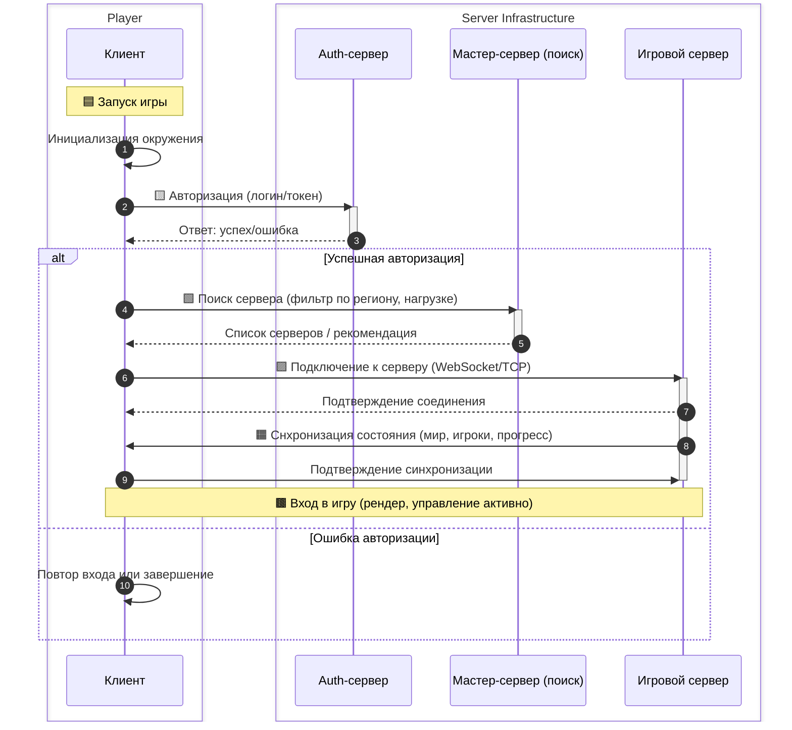
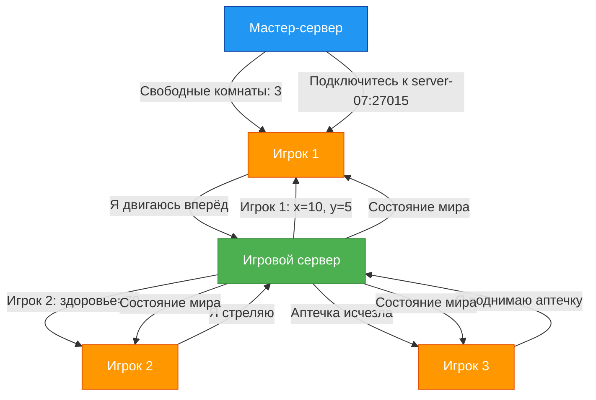

import ExternalPlayEmbed from '@site/src/components/ExternalPlayEmbed';


# Онлайн

<div class="article-tags">
  <span class="tag tag-required">ОБЯЗАТЕЛЬНО</span>
  <span class="tag tag-beginner">ДЛЯ НОВИЧКОВ</span>
</div>

<span class="complexity-badge">Начальный уровень</span>

<div class="callout callout--tip">
  <div class="callout-title">Интерактив</div>

  <div class="callout-body">
  Демо ниже — нажимайте кнопки и смотрите, как это устроено. Ничего на компьютере не меняется.
</div>
  </div>


<ExternalPlayEmbed example="basics/gamepad-play" title="Gamepad" />

---

## Онлайн

### Как компьютеры играют вместе

Когда Вы играете в одиночную игру — например, решаете головоломки, спасаете принцессу или строите город — весь мир игры живёт только на Вашем устройстве: в компьютере, планшете или консоли. Но что, если хочется играть *вместе* с другими? Чтобы соперник был настоящим человеком, который тоже думает, ошибается, радуется победе и расстраивается от поражения? Тогда на сцену выходит **онлайн-игра**.

> **Онлайн** — это не просто "интернет включён". Это особое состояние взаимодействия, при котором Ваше устройство *непрерывно обменивается информацией* с другими устройствами через сеть. В играх онлайн-режим позволяет многим игрокам участвовать в одном и том же игровом мире *одновременно*, как будто они находятся в одной комнате — только вместо дверей и окон здесь работают кабели, радиоволны и серверы.

Давайте разберёмся, как это устроено — шаг за шагом.

---

### Кто участвует в онлайн-игре?

В любой онлайн-игре есть три главных участника:

1. **Вы** — игрок, который запускает игру на своём устройстве.
2. **Другие игроки** — люди по всему миру, которые тоже подключились к одной и той же игре.
3. **Сервер** — мощный компьютер (или группа компьютеров), который *координирует* всё, что происходит в игре.


Вы с друзьями играете в прятки во дворе. Кто решает, кто водит? Кто следит, чтобы никто не подглядывал? Кто объявляет — "Раз, два, три — можно!"? Обычно это доверяют одному человеку — "ведущему".  
В онлайн-игре эту роль исполняет **сервер**. Именно он:

- получает сообщения от всех игроков — *"Я нажали кнопку прыжка"*, *"Я выстрелил"*, *"Я открыл дверь"*;
- проверяет, что эти действия возможны по правилам игры;
- рассылает обновления всем остальным — *"Игрок А теперь на координатах (10, 5)", "Игрок Б получил 10 очков"*;
- хранит важные данные — например, кто выиграл раунд, какие предметы собраны, как выглядит Ваш персонаж.

Без сервера не было бы единого игрового мира. Каждый игрок видел бы *свою версию событий*, и игра быстро превратилась бы в хаос.

> **Интересный факт**: некоторые игры используют *peer-to-peer* (P2P) — схему, где один из игроков временно становится "ведущим". Но это редкость: в P2P сложнее контролировать честность, и задержки обычно выше. Поэтому в большинстве серьёзных онлайн-игр (вроде *Minecraft с сервером*, *Roblox*, *Fortnite*, *World of Tanks*) используется централизованный сервер.

---

### Как Вы попадаете в игру? Подключение шаг за шагом

Игра — это театр. Сервер — это сцена и режиссёр в одном лице. Вы — актёр, который хочет выйти на подмостки. Как это происходит?



1. **Запуск игры**  
   Вы открываете приложение — оно загружает свои файлы в память устройства. Но пока Вы "ещё в гримёрке": игра ещё не знает, *с кем* и *где* Вы будете играть.

2. **Авторизация**  
   Вы вводите свой логин и пароль (или используете кнопку "Войти через Google/Apple/Xbox"). Это нужно, чтобы сервер *узнал*, кто Вы, и дал доступ к Вашему прогрессу, другим, достижениям.

3. **Поиск сервера**  
   Игра обращается к специальному сервису — **мастер-серверу** (или *matchmaking-серверу*). Он отвечает на вопрос: *"Где сейчас идут игры? Сколько свободных мест? Кто подходит по уровню?"*  
   Например, если Вы играете в шутер 5 на 5, мастер-сервер найдёт комнату, где уже есть 4 игрока за одну команду и 3 — за другую, и предложит присоединиться.

4. **Подключение к игровому серверу**  
   После выбора комнаВы (или автоматического распределения) игра получает *адрес сервера* — например, `game-server-07.eu-west.elma365.net:27015`. Это как GPS-координаты театрального здания.  
   Ваше устройство устанавливает **сетевое соединение** по протоколу **UDP** (чаще всего — он быстрее, хотя и менее надёжен, чем TCP; для игр важна скорость, а не 100% гарантия доставки каждого пакета).

5. **Снхронизация**  
   Сервер присылает Вам текущее состояние мира:  
   - где стоят другие игроки,  
   - какие объекВы разрушены,  
   - сколько времени осталось до конца раунда.  
   Вы видите: *"Загрузка... 78%"* — это как раз момент, когда данные скачиваются в Вашу память.

6. **Вход в игру**  
   Когда всё загружено — Вы появляетесь в мире. Теперь Вы в потоке: каждую долю секунды Ваше устройство шлёт серверу *"Я двигаюсь вправо"*, а сервер — *"Игрок слева бросил гранату"*. И так — до конца сесси.

> 🌐 **Адрес сервера — не магия**  
> Адрес вроде `185.22.153.44:27015` состоит из двух частей:  
> - **IP-адрес** (`185.22.153.44`) — уникальный "номер дома" в глобальной сети;  
> - **Порт** (`:27015`) — "номер квартиры" внутри этого дома. Один сервер может работать с разными играми или службами на разных портах.

---

### Где живут серверы? И почему это важно

Серверы — это не "где-то в облаке" в смысле водяного пара. Это реальные физические машины, стоящие в специальных помещениях, называемых **дата-центрами**.

Дата-центр — это здание, построенное как крепость для компьютеров:
- там поддерживается постоянная температура (обычно 18–22°C), потому что серверы греются сильнее чайника;
- есть резервное электропитание (дизельные генераторы на случай отключения света);
- работает система охлаждения — огромные вентиляторы и даже жидкостное охлаждение;
- доступ строго ограничен — биометрия, камеры, охрана.

Компании (например, Google, Amazon, Microsoft, или даже разработчики игры) арендуют *стойки* (rack) — металлические шкафы, в которые устанавливают серверы. Один такой шкаф может содержать десятки серверов.

Но главное — **география**.  
Если Вы живёте в Екатеринбурге, а сервер игры стоит в Токио (Япония), сигналу нужно пролететь ~7 500 километров *туда и обратно* — и сделать это за доли секунды.  

Скорость света в оптоволокне — около 200 000 км/с. Даже при идеальных условиях минимальная задержка (так называемый *пинг*) составит 75мс.
Это *только* физический минимум. На деле добавляются маршрутизаторы, обработка пакетов, очередь на сервере — и пинг легко превышает 150–200 мс.

А что такое *200 мс*? Это пятая доля секунды — кажется мало, но в шутере этого хватит, чтобы противник выстрелил *до того*, как Вы увидите его движение. Вы жмёте "огонь", а выстрел происходит с задержкой — и попадаете в то место, где враг *был* 200 мс назад.

Поэтому разработчики размещают серверы **регионально**:  
- `eu-west` — для Европы,  
- `us-east` — для восточного побережья США,  
- `ru-central` — для Росси и ближнего зарубежья.

Хорошие игры автоматически подбирают Вам *ближайший* сервер. Плохие — заставляют выбирать вручную. Лучшие — позволяют видеть пинг в списке серверов и сортировать по нему.

> ✅ **Проверьте сам**:  
> Откройте командную строку (в Windows — `Win+R` → `cmd` → Enter) и напиши:  
> ```bash
> ping game-server.example.com
> ```  
> Вы увидите строчки вроде:  
> `Ответ от 185.22.153.44: число байт=32 время=42мс TTL=52`  
> Чем меньше число после `время=`, тем лучше связь.

---

### Как придумать логин? Правила, а не прихоти

Ваш логин — это Ваше имя в игровом мире. Оно должно быть:

1. **Уникальным** — если кто-то уже занял `SuperDragon`, Вам предложат `SuperDragon_73` или `SuperDragon2025`. Это как номер телефона: два одинаковых не бывает.
2. **Понятным** — избегайте `qzX9!kLm`. Через год Вы сам не вспомните, как это читается.
3. **Безопасным** — никогда не используйте:
   - настоящее имя + фамилию (`TimurTagirov`);
   - дату рождения (`Timur1994`);
   - адрес школы (`School17Ekaterinburg`);
   - личные данные (`CatLover2009`, если у Вас действительно кошка Мурка и Вы в 9-м классе — это уже риск).

Лучше придумать что-то **нейтральное, но запоминающееся**:
- `PixelPilot`  
- `CodeRaven`  
- `QuantumLemon`  
- `EchoOfStars`

**Совет** — попробуйте объединить два слова — одно из мира техники, другое — из природы, мифов или науки. Получится не банально и не агрессивно.

Также учти:
- многие игры запрещают мат, оскорбления, политические лозунги в логинах;
- нельзя копировать логины известных стримеров (например, `xWick` — если это не Вы);
- длина часто ограничена — 3–16 символов, только латиница, цифры, `_` и `-`.

---

### Лобби и игровая сессия — до, во время и после

Перед боем — подготовка. После боя — отдых. В играх это тоже есть.

---

#### Что такое лобби?

**Лобби** (от англ. *lobby* — "вестибюль", "зал ожидания") — это *подготовительная зона*, где игроки собираются перед началом игры.

Здесь можно:
- выбрать персонажа, оружие, скин;
- посмотреть, кто уже в команде;
- пообщаться через чат или голос;
- дождаться, пока наберётся нужное число игроков.

Лобби — как сбор в школьном холле перед экскурсией — все надевают рюкзаки, проверяют, есть ли у всех бутылка с водой, и ждут учителя.

---

#### ⚔️ Что такое игровая сессия?

**Игровая сессия** — это *один полный цикл игры*: от старта до финального результата. Например:
- 10 минут в "Королевской битве";
- 3 раунда в командном режиме;
- один заход в подземелье в MMORPG.

Важно: сессия *не равна* всей игре. Вы можете сыграть 5 сессий подряд — и это будет 5 отдельных "раундов", даже если Вы не выходил из лобби.

После сесси — **результаты** — кто победил, сколько очков набрано, какие награды получены. Затем — возврат в лобби (если игра командная) или в главное меню.

---

### Этические основы онлайн-игр

Многие думают: *"Это же игра — можно всё"*. Но онлайн-мир — это общее пространство. Как в классе или на площадке — если один кричит, швыряется, обманывает — всем становится хуже.

Давайте поговорим о трёх ключевых понятиях.

---

#### ЧиВы (cheats) и почему они разрушают игру

**Чит** — программа или модификация, которая даёт игроку *нечестное преимущество*:  
- невидимость,  
- автоматический прицел (авто-аим),  
- ускорение,  
- возможность видеть сквозь стены ("стенхак").

На первый взгляд — круто: Вы побеждаете всегда. Но задумайся:

- Если *все* используют читы — игра превращается в гонку — кто скачает самый мощный взлом? Навыки, стратегия, реакция — перестают иметь значение.
- Если *Вы один* читаете — Вы обманываете других. Они тратят время, силы, нервы — а результат уже решён заранее.
- ЧиВы часто содержат **вирусы**. Вы скачиваете "бесплатный AimBot", а вместе с ним — программу, которая крадёт пароли от соцсетей.

> 📜 **Философский взгляд**: игра — это добровольное принятие правил. ШахмаВы без правила "пешка ходит на одну клетку" — уже не шахматы. Онлайн-игра без честности — уже лите симуляция победы.

---

#### Фэйрплей (fair play) — честная игра

**Fair play** — это *уважать правила и других участников*. Это значит:

- не использовать баги намеренно (например, застревать в текстурах, чтобы стрелять оттуда);
- не сливать команду (намеренно проигрывать);
- сообщать разработчикам об ошибках, а не эксплуатировать их;
- помогать новичкам, если игра кооперативная.

Фэйрплей — это как честный судья в футболе: он не обязательно должны любить обе команды, но он *должны* соблюдать правила одинаково для всех.

---

#### Токсичность — когда слова бьют сильнее пуль

**Токсичность** — это поведение, которое *намеренно портит настроение другим*:  
- оскорбления,  
- насмешки над ошибками,  
- угрозы,  
- спам в чате,  
- провокации ("Вы лузер, удаляй игру").

Важно:  
**Критика** — *"Вы слишком часто лезете вперёд, давайте координироваться"* — это полезно.  
**Токсичность** — *"Вы дно, даже мой дедушка так не танкует"* — это вред.

Почему это плохо для Вас?
- Многие игры имеют систему **репутации**: за жалобы Вас могут временно или навсегда забанить.
- Вы сам начинаете получать меньше удовольствия: играть в агресси — как есть острую еду каждый день. Сначала "вкусно", потом больно.
- Вы теряете друзей. Да, даже виртуальных.

> 🌱 **Практический совет**: если Вам хочется написать гневное сообщение — подожди 10 секунд. Вдохни. Спросите себя: *"Что я хочу изменить этим сообщением?"*  
> Если ответ — "выпустить пар", лучше выйди из игры на 5 минут. Если — "помочь команде", переформулируй мысль без обвинений.

---

### Как работает онлайн-игра

Вот как выглядит взаимодействие в виде диаграммы (на языке **Mermaid**, который можно вставить в Markdown и отобразить в современных редакторах):



> 🔍 **Как читать схему**:  
> - Оранжевые блоки — игроки.  
> - Зелёный — игровой сервер (главный координатор).  
> - Сний — мастер-сервер ("справочная служба" по комнатам).  
> - Стрелки показывают, *кто что кому отправляет*. Обратите внимание: игроки **не общаются напрямую** — всё идёт через сервер. Это обеспечивает честность и порядок.

---

### Что такое "облако"? И почему серверы не улетают

Мы уже говорили, что серверы стоят в дата-центрах. Но откуда взялось слово **облако** (*cloud*)? Это конкретная технология.

**Облачные вычисления** — это способ аренды вычислительных ресурсов (процессор, память, диски, сеть) *по мере необходимости*, без покупки физических серверов.

Вам нужно испечь торт.  
- **Классический подход** — купить духовку, миксер, формы — и хранить их годами, хотя печёте раз в месяц.  
- **Облачный подход**: пойти в кулинарную студию, оплатить 2 часа работы — и использовать их оборудование. После — уйти, ничего не оставив.

То же с играми:  
- Маленькая студия (например, из 5 человек) не может купить 100 серверов.  
- Но она может арендовать *виртуальные машины* у Amazon (AWS), Microsoft (Azure) или Google (GCP) — на час, на неделю, на миллион игроков.  
- Если в пятницу вечером народ массово заходит в игру — система *автоматически запускает* ещё 20 серверов.  
- В понедельник утром — *отключает* лишние, чтобы не платить за простой.

Это называется **масштабируемость** (*scalability*). И именно она позволила онлайн-играм стать массовыми.

> **Важно**: облачный сервер — это не "виртуальный компьютер в эфире". Это реальная физическая машина, на которой запущена программа *гипервизор* (например, VMware, KVM), разделяющая ресурсы между десятками виртуальных машин. Каждая такая машина ведёт себя как отдельный компьютер — с собственным процессором, памятью, IP-адресом.

---

### Как защищают серверы? Или что такое DDoS-атака

Онлайн-игра — как город. Есть дороги (сеть), дома (игроки), ратуша (сервер). Но бывают и враги.

---

#### Что такое DDoS?

**DDoS** — *Distributed Denial of Service* (распределённая атака типа "отказ в обслуживани").  

Принцип прост:  
1. Злоумышленник заражает тысячи домашних устройств (камер, роутеров, старых телефонов) вирусом-ботом. Получается **ботнет** — сеть "зомби-устройств".  
2. В условленный момент все эти устройства одновременно отправляют запросы на игровой сервер — *"Привет!"*, *"Дай данные!"*, *"Подключись!"* — миллионы раз в секунду.  
3. Сервер перегружается. Как будто в магазин ворвались 10 000 человек, но никто не хочет покупать — все просто стоят у кассы и кричат "Алло!".  
4. Настоящие игроки не могут подключиться — им выдаёт *"Сервер перегружен"* или *"Тайм-аут соединения"*.

Это не взлом. Никакие пароли не украдены. Просто сервер *заблокирован шумом*.

---

#### Как с этим борются?

1. **Фильтрация трафика**  
   Перед сервером ставят специальные устройства — **анти-DDoS-шлюзы**. Они анализируют пакеты:  
   - Если 99% запросов идут с IP-адресов дешёвых IoT-устройств — отбрасывать.  
   - Если один IP присылает 10 000 запросов в секунду — ограничить его до 100.  
   Это как охранник у входа: "Вы не клиент — Вы толпа. Пройдите, пожалуйста, в сторону".

2. **Распределение нагрузки**  
   Вместо одного сервера — кластер из 50. Если 10 из них упали под атакой, остальные принимают игроков. Как запасные выходы в театре при пожаре.

3. **CDN (Content Delivery Network)**  
   Это сеть серверов по всему миру, которые хранят *статические файлы* — текстуры, звуки, карты.  
   Когда Вы впервые заходите в игру, 90% данных скачивается с ближайшего CDN-узла (например, в Москве, даже если главный сервер — в Германи). Это снижает нагрузку и ускоряет загрузку.

4. **Поведенческий анализ**  
   Современные системы (например, Cloudflare, Akamai) учатся на трафике. Они видят:  
   - Настоящий игрок: подключился → авторизовался → начал двигаться.  
   - Бот: подключился → сразу 100 запросов к /admin → отключился.  
   Такие паттерны автоматически блокируются.

> 🛡️ **Заметка для будущих инженеров**:  
> Защита от DDoS — это не "поставить антивирус". Это баланс между *доступностью* (чтобы все могли играть) и *безопасностью* (чтобы не пустили атаку). Иногда приходится жертвовать — например, временно отключать голосовой чат, потому что через него идёт спам.

---

### Типы онлайн-режимов

Не стоит думать, что "онлайн = все бегают и стреляют". Существует несколько фундаментальных моделей взаимодействия. Знать их — значит понимать *цель* игры.

| Режим | Расшифровка | Описание | Примеры |
|------|--------------|----------|---------|
| **PvP** | Player versus Player | Игрок против игрока. Победа достигается за счёт превосходства над другими людьми. | *Counter-Strike*, *League of Legends*, *Brawl Stars* |
| **PvE** | Player versus Environment | Игрок (или команда) против *окружения* — ботов, монстров, ИИ. Другие игроки — союзники. | *World of Warcraft (данжи)*, *Destiny 2 (рейды)*, *Minecraft (выживание с друзьями против криперов)* |
| **Co-op** | Cooperative | Кооператив — подмножество PvE, где акцент на *совместном решении задач*. Часто без соревнования внутри команды. | *It Takes Two*, *Portal 2 (кооп-кампания)*, *Deep Rock Galactic* |
| **MMO** | Massively Multiplayer Online | Игра с *тысячами* игроков в одном мире, который существует *постоянно* — даже когда Вы вышли. | *World of Warcraft*, *EVE Online*, *Roblox (в части персистентных миров)* |
| **Asynchronous** | Асинхронный онлайн | Игроки не взаимодействуют *в реальном времени*. Один сыграл — оставил "след"; другой пришли позже и отреагировал. | *Clash of Clans (атаки на базы)*, *Mini Metro (рейтинги)*, *Animal Crossing (посещение островов)* |

> 🔍 **Нюанс**: многие игры комбинируют режимы.  
> Например, *Fortnite*:  
> - *Королевская битва* — PvP + PvE (дикая природа, шторм);  
> - *Creative Mode* — Co-op + асинхронный (можно строить мир, а друзья зайдут завтра);  
> - *Save the World* — PvE (кооператив против зомби).

---

### Краткая история онлайн-игр

Онлайн-игры — не изобретение 2010-х. Их корни уходят в 1970-е. Вот ключевые вехи.

---

#### 1978 — MUD — Multi-User Dungeon  
- Первая многопользовательская онлайн-игра.  
- Текстовая:  
```
  Вы находитесь в тёмной пещере. На севере — узкий проход.  
  > идти север  
  Вы входите в зал. Здесь орк с дубиной!  
  > атаковать орка  
  Вы наносите 5 урона. Орк рычит.
```  
- Игроки подключались через **telnet** — протокол удалённого доступа к компьютерам университетов.  
- Сервер работал на мейнфреймах (огромных машинах, занимавших комнату).  
- MUD заложили основы — чат, уровни, инвентарь, PvP-зоны.

---

#### 1996 — QuakeWorld  
- Первая игра с *предиктивным клиентом*.  
- Проблема: при высоком пинге персонаж "подёргивался".  
- Решение — клиент *предугадывал* движение ("я нажали вперёд — значит, иду вперёд"), а сервер потом *корректировал*, если предсказание ошиблось.  
- Это — основа всех современных шутеров.

---

#### 2004 — World of Warcraft  
- MMO, которая вывела онлайн-игры в мейнстрим.  
- 12 миллионов активных подписчиков на пике (2010).  
- Ввела понятие *гильдий*, *раидов*, *экономики внутри игры* (аукционы, профессии).  
- Серверы делились на *реалмы* (миры) — чтобы не было перегрузки.

---

#### 2017 — Fortnite Battle Royale  
- Показал силу *кросс-платформенности* — один матч — Xbox, PlayStation, Nintendo Switch, ПК, телефон.  
- Динамическая карта (меняется после каждого сезона).  
- Интеграция с поп-культурой: концерВы Travis Scott’а *внутри игры* посетили 27 млн человек.

---
