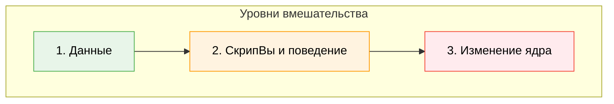
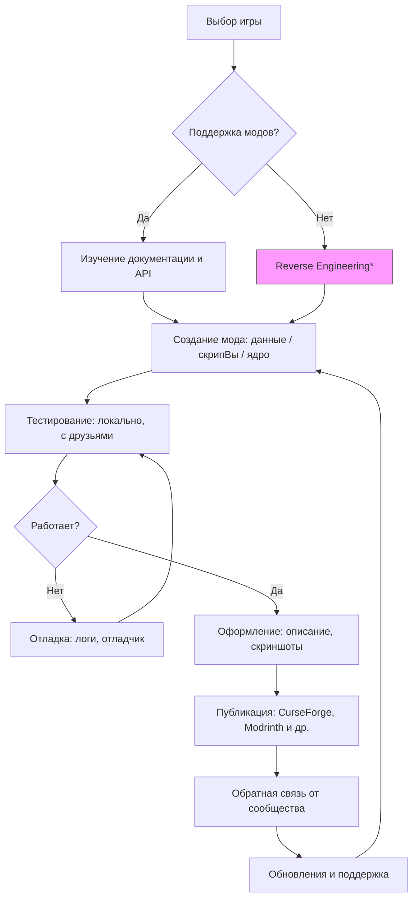

import ExternalPlayEmbed from '@site/src/components/ExternalPlayEmbed';


# Моддинг

<div class="article-tags">
  <span class="tag tag-required">ОБЯЗАТЕЛЬНО</span>
  <span class="tag tag-beginner">ДЛЯ НОВИЧКОВ</span>
</div>

<span class="complexity-badge">Начальный уровень</span>

<div class="callout callout--tip">
  <div class="callout-title">Интерактив</div>

  <div class="callout-body">
  Демо ниже — нажимайте кнопки и смотрите, как это устроено. Ничего на компьютере не меняется.
</div>
  </div>


<ExternalPlayEmbed example="spinoff/game-franchise-play" title="Игровая франшиза" minHeight={520} playProps={{ franchise: 'elder-scrolls' }} />

---

## Моддинг

> *"Моддинг — это как взять готовый конструктор и перестроить его так, чтобы он летал, плавал и решал уравнения — если Вы хотите".*

---

### Что такое моддинг — и почему это вообще возможно?

Вы пришли в кинотеатр и посмотрел фильм. А потом решили: *"А что, если главный герой откроет школу для драконов?"*  
Вы можете написать сценарий, снять короткометражку, сделать фан-арт — это будет *фандом-творчество*.  
А теперь представьте, что у Вас есть доступ к тем же *материалам*, что и у создателей фильма — декорациям, костюмам, сценарию на бумаге… и даже к монтажной программе. Вы можете переделать сам фильм — добавить сцену, изменить диалог, сделать новый финал.  

В играх это возможно потому, что **всё, что Вы видите и с чем взаимодействуете — это данные**, а не "железо в коробке".  
Звуки — файлы. Текстуры стен — изображения. Правила боя — программы. Карта леса — координаты точек и описания объектов.  
Если разработчики *предусмотрели* возможность менять эти данные (или не запретили это жёстко), — у Вас есть шанс вмешаться.  

Такая возможность называется **моддингом** (от *modification* — модификация), а то, что получается в результате — **модом** (сокращение от *modification*).  

> 🔍 **Мод — это не обязательно "взлом".**  
> Это *дополнение*, *альтернативная версия* или *расширение* игры, созданное игроками.  
> Иногда моды — это новые персонажи. Иногда — целые вселенные, вшитые в старую игру. А иногда — просто исправление досадной ошибки, которую официальная команда пропустила.

---

### Откуда берутся моды? История в трёх актах

#### Акт I — Warcraft III и рождение сообщества

В 2002 году вышла игра **Warcraft III: Reign of Chaos**. В ней был встроенный инструмент — **World Editor**. Обычно редакторы карт делают только для тестировщиков. Но Blizzard *открыла* его всем.  
И что произошло?

Люди начали создавать *микроигры* внутри Warcraft III:
- "Герои меча и маги" — прохождение с ростом уровня, крафтом, боссами;
- "Tower Defense" — защита базы от волн врагов, расстановка башен;
- "Мультиплеерные арены" — дуэли один на один.

Самый известный мод — **Defense of the Ancients (DotA)** — начался как эксперимент в World Editor. Он настолько увлёк игроков, что позже стал отдельной игрой — **Dota 2**, а её идеи легли в основу целого жанра: **MOBA** (*Multiplayer Online Battle Arena*).

> Это важный урок: *моддинг может стать началом чего-то большего — даже новой индустри.*

---

#### Акт II — Minecraft — когда каждый стал архитектором

В Minecraft (вышла в 2011) моддинг пошёл дальше карт. Здесь:
- **Блоки** — заменяются или добавляются новые;
- **Механики** — появляются магия, технологии, фермы автоматов;
- **Мир** — может стать подводным, космическим или стимпанковским;
- **Интерфейс** — меняется под нужды игрока.

Но самое главное — появился **Forge**, потом **Fabric**, потом **Quilt** — *платформы для модов*. Они позволяют:
- Ставить десятки модов одновременно;
- Убирать конфликВы между ними;
- Обновлять игру, не теряя моды.

Сегодня Minecraft — это *тысячи миров*, собранных сообществом. Один из самых известных модпаков — **FTB (Feed The Beast)** — превращает её в сложную инженерную симуляцию — Вы строите ядерные реакторы, автоматизируете добычу ресурсов, управляете роботами… и всё это — на основе исходного песочного мира.

---

#### Акт III — Roblox и моддинг как основа игры

Roblox (запущена в 2006, популярна с 2015+) — это не игра. Это *платформа*, где **вся игра — это мод**.  
Каждый проект в Roblox — это:
- Своя карта ("place");
- Свои правила (написанные на Lua);
- Свои персонажи, предметы, интерфейс.

То есть здесь *нет* "оригинальной игры", которую нужно модифицировать. Вместо этого — готовая среда, в которой Вы *сразу* становитесь создателем.  
Именно поэтому в Roblox много игр от 10-летних: они не "ломают" чужую работу — они *строят с нуля*, пользуясь проверенными инструментами.

> **Обратите внимание: моддинг — это *спектр*.  
> От простой замены текстур ("скинов") до написания нового ядра игры — всё это моддинг.  
> Главное — *степень доступа* и *инструменты*, которые предоставляет разработчик.

---

<div class="callout callout--tip">
  <div class="callout-title">Старт в Minecraft без модов</div>

  <div class="callout-body">
  В **Java Edition** можно учиться на встроенных **командах** и **datapack** (текстовые файлы в папке мира) — без Forge и Java IDE.

  Готовые примеры с разбором каждой строки — [Minecraft — команды и datapack](/lab/Примеры/1142); теория — [Разработка в Minecraft](/encyclopedia/9-spinoff/9-04-razrabotka-igr/21).
</div>
</div>

### Как устроен моддинг? Три уровня вмешательства

Моды бывают разные — и их сложность зависит от того, *насколько глубоко* Вы лезете в игру.



---

#### Уровень 1. Данные (Assets & Configs)

Это — "мягкое" вмешательство.  
Вы меняете то, что игра *сама умеет читать*:
- Звуки (.wav, .ogg);
- Изображения текстур (.png);
- Описания предметов (в текстовых или JSON-файлах);
- Параметры — здоровье моба, урон меча, скорость прыжка.

*Пример:* мод, который делает всех зомби в Minecraft розовыми и заставляет их петь "Happy Birthday" при атаке.  
Вы просто подменил файлы звуков и текстуры — и игра сама их использует.

> ✅ Плюсы — безопасно, быстро, не требует программирования.  
> ❌ Минусы: нельзя добавить *новую логику* — только менять то, что уже есть.

---

#### Уровень 2. СкрипВы и поведение (Scripts & Logic)

Теперь Вы уже *меняете, как игра думает*.  
Для этого нужны:
- Язык сценариев (часто Lua, Python, JavaScript, или специальный DSL — domain-specific language);
- Понимание событий — "когда игрок прыгает", "когда монстр умирает", "когда открывается сундук".

*Пример:* в Minecraft-моде Вы добавляете способность "летать ночью", но только если у игрока есть амулет.  
Вы пишете код:
```lua
if player.hasItem("amulet_of_night") and time.isNight() then
    player.setFlight(true)
else
    player.setFlight(false)
end
```
(Это псевдокод — в реальности синтаксис зависит от движка.)

> ✅ Плюсы: можно создавать новые механики.  
> ❌ Минусы: ошибки в коде могут сломать игру; нужно учить синтаксис и логику.

---

#### Уровень 3. Изменение ядра (Core Modding / Reverse Engineering)

Самый сложный и спорный уровень.  
Вы *меняете саму программу игры* — компилируете исходный код (если он открыт) или декомпилируете бинарник (если закрыт).  
Часто используется:
- Java-декомпиляция (для Minecraft до 1.12);
- Hex-редактирование (редко, устарело);
- Hook-инъекции (через библиотеки вроде **Detours** на Windows).

*Пример:* мод **OptiFine** для Minecraft — *переписывает части движка рендеринга*, чтобы игра работала быстрее на слабых компьютерах.

> ⚠️ Важно: этот уровень часто нарушает лицензионное соглашение.  
> Некоторые компании разрешают его (Mojang — для Minecraft), другие — блокируют и банят (Activision в Call of Duty).  
> Всегда читайте **EULA** (*End User License Agreement*) — соглашение конечного пользователя.

---

### Как начать создавать моды? Пошаговый путь

#### Шаг 1. Выберите игру и цель

Не начинай с "я сделаю киберпанк-мод для GTA V". Начни с:
- **"Хочу, чтобы в игре X появился новый питомец"**;
- **"Хочу, чтобы в игре Y был другой финал"**;
- **"Хочу, чтобы в игре Z можно было строить мосВы из сыра"**.

Лучшие стартовые площадки:
| Игра | Почему подходит | Инструменты |
|------|----------------|-------------|
| **Minecraft (Java)** | Огромное сообщество, документация, готовые среды | Forge MDK, IntelliJ IDEA, Java 17 |
| **Roblox** | Всё онлайн, мгновенная публикация, Lua простой | Roblox Studio (бесплатно) |
| **Stardew Valley** | Открытая архитектура, дружелюбные разработчики | SMAPI, C#, Visual Studio |
| **Factorio** | Моды — часть культуры игры, отличная документация | Lua, встроенный редактор |
| **Unity-игры** (если у Вас есть доступ к исходникам) | Мощно, но сложнее | Unity Editor, C# |

---

#### Шаг 2. Изучи структуру игры 

Откройте папку с игрой (часто: `C:\Program Files\Игра` или `%appdata%\.minecraft`).  
Посмотрите:
- Где лежат текстуры? (`assets/textures/`)
- Где конфиги? (`config/`, `options.txt`)
- Есть ли папка `mods`? Если да — игра поддерживает моды "из коробки".

> 🔧 Совет: используйте **7-Zip** или **WinRAR**, чтобы открыть `.jar`, `.pak`, `.pak01_dir.vpk` — это архивы. Многие игры хранят данные в сжатом виде.

---

#### Шаг 3. Найдите документацию  

Официальный сайт → "Modding Wiki", "API Docs", "Getting Started".  
Примеры:
- [Minecraft Modding Wiki](https://minecraft.fandom.com/wiki/Modding)
- [Roblox Developer Hub](https://developer.roblox.com/)
- [Stardew Valley Modding Docs](https://stardewvalleywiki.com/Modding:Index)

Не стесняйся читать чужие моды: большинство выложены на GitHub. Откройте `.java`-файл — даже если не понимаете всё, Вы увидите структуру: *как называются функции, как организованы классы*.

---

#### Шаг 4. Напишите "Hello, World!"-мод 

Простейший пример — мод, который при запуске пишет в чат:  
> `[Мой Первый Мод] Привет, Вселенная!`  

Для Minecraft (на Forge):
```java
@Mod("myfirstmod")
public class MyFirstMod {
    public MyFirstMod() {
        IEventBus bus = FMLJavaModLoadingContext.get().getModEventBus();
        bus.addListener(this::onInitialize);
    }

    private void onInitialize(FMLCommonSetupEvent event) {
        // Выполняется при загрузке игры
        System.out.println("[Мой Первый Мод] Привет, Вселенная!");
    }
}
```
Да, это Java — но не пугайся. Через месяц Вы будете писать это автоматически. Главное — *начать с малого*.

---

#### Шаг 5. Тестируй и итерируй 

- Запусти игру с модом.
- Что сломалось? Посмотрите `latest.log` — там ошибка.
- Исправь → пересоберите → запусти снова.
  
Это не провал — это *цикл разработчика*. Даже у профессионалов 90% времени уходит на отладку.

---

### Публикация мода

Когда мод работает — хочется показать другим. Но просто кинуть архив в чат — это как выкинуть книгу в окно и надеяться, что кто-то её прочитает.

Вот как делать правильно:

1. **Оформи описание**  
   - Что делает мод?  
   - С какими версиями игры совместим?  
   - Есть ли зависимости (другие моды, которые надо поставить)?  
   - Как установить? (Пошагово: "распакуй в папку mods")

2. **Сделайте скриншоВы и видео**  
   Люди сначала *смотрят*, потом читают. Короткое (30 сек) видео "до/после" — самый сильный аргумент.

3. **Выберите платформу**  
   | Платформа | Для чего | Особенности |
   |-----------|----------|-------------|
   | **CurseForge** | Minecraft, WoW, Stardew и др. | Версионирование, зависимости, автоматическая установка через лаунчер |
   | **Modrinth** | Альтернатива CurseForge, быстрее и современнее | Открытый API, поддержка Fabric/Quilt |
   | **GitHub** | Исходный код | Хорошо для разработчиков, плохо для новичков |
   | **Roblox Library** | Только для Roblox | Встроенная публикация, рейтинги, комментари |
   | **Nexus Mods** | Старые игры (Skyrim, Fallout, GTA) | Большая аудитория, но строгая модерация |

4. **Соблюдай лицензию**  
   Вы можете выбрать:
   - **MIT** — любой может использовать, даже в коммерческих проектах;
   - **CC BY-NC-SA** — можно делиться и изменять, но *не для денег* и *с указанием автора*;
   - **All Rights Reserved** — нельзя перепродавать, но можно использовать бесплатно.

> 🌐 Этика моддинга:  
> - Не копируй чужой код без разрешения.  
> - Если используете чужие текстуры — проверьте лицензию (часто — CC0 или CC BY).  
> - Не воруй идеи — вдохновляйся, но делайте по-своему.

---

### Как устроен процесс моддинга

Вот `mermaid`-диаграмма — её можно вставить в HTML-версию "Вселенной IT":



> *Reverse Engineering — извлечение знаний из программы без исходного кода. Юридически спорно. Используйте только если разрешено лицензией.*

---

## Безопасность, этика и будущее моддинга

### Опасности моддинга — не всё, что блестит — золото

Моды — как книги. Большинство написаны с доброй целью. Но, как и в реальном мире, бывают и подделки, и вредоносные издания.

---

#### Что может пойти не так?

| Угроза | Как выглядит | Как защититься |
|--------|--------------|----------------|
| **Вирус/троян** | Мод-архив содержит `.exe` вместо `.jar`/`.zip`, требует "запустить установщик от имени администратора" | Никогда не запускай `.exe` из непроверенного источника. Используйте только `.jar`, `.zip`, `.rbxl` — форматы, которые игра *сама* загружает. |
| **Кража аккаунта** | Сайт-подделка под CurseForge; фишинговые ссылки в комментариях: *"Новый мод! Скачать здесь → bit.ly/…"* | Проверяй URL: `curseforge.com`, `modrinth.com`, `roblox.com` — только официальные домены. |
| **Нарушение лицензии** | Мод включает текстуры из платной игры (например, *The Witcher 3*), без разрешения автора | Используйте только ресурсы с лицензией **CC0**, **CC BY**, **MIT**, или созданные Вами. |
| **Разрушение игры** | Конфликтующие моды, битые файлы, устаревшие верси | Делайте резервную копию папки `saves` и `mods` перед установкой. Используйте мод-менеджеры (MultiMC, Prism Launcher). |

> 🛡️ **Правило №1 безопасности**:  
> *Если мод требует от Вас что-то, чего не требует сама игра — насторожись.*  
> Minecraft никогда не спрашивает пароль. Roblox Studio не просит ввести данные кредитной карты.  
> Если спрашивает — это не мод. Это *ловушка*.

---

#### Как проверить, безопасен ли мод?

1. **Источник** — официальный сайт/платформа (не Telegram-канал, не "форум-кустарщина").  
2. **Комментарии** — есть ли жалобы на вирусы? Есть ли отвеВы автора?  
3. **Версия игры** — совпадает ли с Вашей? Мод для 1.12.2 на 1.20.1 почти наверняка сломает игру.  
4. **Зависимости** — указаны ли они? Например: *"Требуется Forge 47.1.0 и мод Just Enough Items (JEI)"*. Если нет — рискованно.  
5. **Исходный код** — открыт ли на GitHub? Если да — любой разработчик может проверить его на наличие вредоносного кода.

> 🔍 **Интересный факт**: в 2022 году мошенники выложили фальшивый мод OptiFine на поддельный сайт. Он содержал *stealer* — программу, крадущую логины Minecraft и Discord. Более 10 000 пользователей пострадали.  
> Вывод: даже известные имена могут быть подделаны. Внимательность — Ваш главный инструмент.

---

### Этические дилеммы

Моддинг — это свобода. Но свобода без ответственности превращается в хаос. Рассмотрим спорные случаи.

---

#### Чит-моды в мультиплеере 

Мод, дающий *бесконечное здоровье*, *вид сквозь стены* или *автоматическую прицельную стрельбу* — в одиночной игре это просто "сложность наоборот".  
Но в онлайн-режиме — это **неуважение к другим игрокам**. Это нарушает *fair play* — принцип честной игры.

> ⚖️ Этическая граница:  
> *Можно ли использовать мод, если он не даёт Вам преимущество, но улучшает доступность?*  
> Например:

- мод;
- увеличивающий размер шрифта для слабовидящих;
- или заменяющий цвета для дальтоников.
> **Да** — такие моды одобряются даже официальными серверами.  
> Ключевое слово — *инклюзивность*, а не *доминирование*.

---

#### Перепаковка чужого труда  

Некто скачал 10 популярных модов, переименовал их, убрал имена авторов, выложил как "мой сборник" и монетизирует (реклама, донаты).  
Это не моддинг. Это **плагиат**.

> 📜 Правило сообщества:  
> *Если Вы используете чей-то код или ресурсы — укажите автора. Лучше — спросите разрешения.*  
> В мире open source это называется *attribution* (атрибуция). Без неё — нарушение лицензи.

---

#### Моды с вредным контентом  

Игры для детей (например, *Roblox* или *Minecraft: Образование Edition*) иногда получают моды с:
- Ненормативной лексикой;
- Политическими лозунгами;
- Изображениями насилия или дискриминации.

Такие моды нарушают правила платформ и травмируют других пользователей.

> 🌱 Важный принцип:  
> *Вы отвечаете за то, что выпускаете в мир.*  
> Даже если Вам 12 лет — Ваш мод может увидеть ребёнок 7 лет. Думай: "Хочу ли я, чтобы мой младший брат/сестра это увидели?"

---

### Моддинг как профессия

Многие считают моддинг "детской забавой". Но десятки профессионалов в индустрии начали именно с модов.

---

#### 🧱 История 1. *Notch → Mojang → Microsoft* 

Маркус Перссон (Notch) не просто сделал Minecraft — он *вырос* из моддинг-сообщества. До Minecraft он писал моды для *Wurm Online*, другой песочницы. Его опыт в управлении блоками, сетевой синхронизации, генерации мира — всё это было отточено в модах.

---

#### 🌌 История 2. *IceFrog → DotA → Valve*

Разработчик DotA долго оставался анонимом. Позже выяснилось — это IceFrog. Valve пригласила его *работать над Dota 2* как ведущего дизайнера. Сегодня он — один из самых влиятельных геймдизайнеров мира.

---

#### 🧪 История 3. *ПрактиканВы по модам*

Компании вроде **Paradox Interactive** (Crusader Kings, Stellaris) и **Larian Studios** (Divinity, Baldur’s Gate 3) регулярно приглашают авторов лучших модов на стажировки.  
Почему? Потому что:
- Моддеры знают игру *глубже*, чем тестировщики;
- Они умеют работать с ограничениями;
- Они привыкли к обратной связи от сообщества.

> 📈 Статистика (по данным ModDB и Discord-сообществ, 2024):  
> - 23% нанятых геймдизайнеров в indie-студиях имели публичные моды до устройства на работу;  
> - 68% технических писателей в геймдеве начали с написания гайдов по модам;  
> - 12% модов с `>`100 000 скачиваний привели к предложениям о сотрудничестве.

**Вывод**: моддинг — не "времяпрепровождение". Это *портфолио*, *обучение в реальных условиях*, *демонстрация характера*.

---

### Как не выгореть в моддинге?

Многие начинают с энтузиазма — и бросают через неделю. Почему?

| Причина | Решение |
|---------|---------|
| **Слишком амбициозная цель** ("сделаю MMO за лето") | Разбей на микрозадачи: "сегодня — текстура дерева", "завтра — анимация рубки" |
| **Ошибки не отлаживаются** | Учись читать логи. Ищите фразы `Caused by:`, `NullPointerException`, `Missing texture`. Копируй их в Google — кто-то уже сталкивался. |
| **Нет обратной связи** | Опубликуй *альфа-версию* даже с одной фичей. Спроси: "Как вам идея? Что неудобно?" |
| **Одиноко** | Найдите единомышленников: Discord-серверы, форумы (например, *Planet Minecraft*), школьные IT-клубы. |

> 💬 Совет от опытного моддера:  
> *"Первые 10 модов — это учебные. Их цель — понимание — как работает инструмент, как думает движок, как реагируют люди. Пусть они будут маленькими. Главное — закончить".*

---
