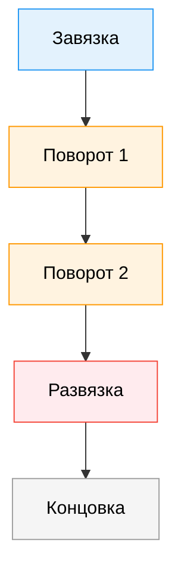

import ExternalPlayEmbed from '@site/src/components/ExternalPlayEmbed';


# Дизайн

<div class="article-tags">
  <span class="tag tag-required">ОБЯЗАТЕЛЬНО</span>
  <span class="tag tag-beginner">ДЛЯ НОВИЧКОВ</span>
</div>

<span class="complexity-badge">Начальный уровень</span>

<div class="callout callout--tip">
  <div class="callout-title">Интерактив</div>

  <div class="callout-body">
  Демо ниже — нажимайте кнопки и смотрите, как это устроено. Ничего на компьютере не меняется.
</div>
  </div>


<ExternalPlayEmbed example="basics/display-tech-play" title="Технологии дисплеев" />

---

## Дизайн

### Сюжет

Многие думают: "сюжет — это когда персонажи много говорят". Но в играх всё иначе.  

В фильме или книге — Вы *наблюдатель*. Вы видите, как герой плачет, и думаете: "Ему грустно".  
В игре — Вы *действующее лицо*. Вы *чувствуй*, что герой грустит — потому что *Вам* темно, холодно, тихо, и в инвентаре — только сломанная игрушка.

> **Атмосфера** — это сюжет, который Вы *вдыхаете*, а не читаете.

Как это работает?




---

#### Завязка

В книгах завязка — это начало истори: *"Однажды принцесса исчезла"*.  
В играх завязка — это *начальное состояние мира и игрока*:  
— Вы просыпаетесь в капсуле. Вокруг — треснувшее стекло, аварийное освещение, тишина.  
— На экране — сообщение: *"Система жизнеобеспечения: 12%"*.  
— Вы нажимаете кнопку — дверь не открывается.  
— Но справа — красная ручка. Вы тянете — слышен щелчок.  

Нет объяснений. Но Вы уже *в истории*. Вы уже *выживаете*.

---

#### Повороты

Классический "поворот сюжета" — когда герой узнаёт, что его друг — предатель.  
В игре это может выглядеть иначе:  
— Вы месяц собирал ресурсы, строил базу, доверял NPC-союзнику.  
— Однажды возвращаетесь — база разграблена.  
— В углу — записка с почерком этого союзника: *"Мне нужны были ресурсы. Прости."*  
— И его значок на карте — теперь красный.

Вы не *услышал* предательство. Вы *пережил* его. И теперь Ваш выбор: *отомстить*, *простить* или *игнорировать* — изменит дальнейшее развитие.

---

#### Концовки

Хорошая игра не даёт "хэппи-энд или бэд-энд". Она даёт **логическое завершение того, что Вы построили**.  

Пример:  
— Если Вы всё время помогал другим — в финале к Вам придут те, кого Вы спас.  
— Если Вы копили ресурсы для себя — Вы выживете, но будете один.  
— Если Вы искали правду — откроется секретный финал, где главный злодей объяснит, *почему* он так поступил.

Концовка — это *отражение*. Как зеркало: что вложил — то и получил.

---

### Игровые механики

Вот фраза, которую часто путают:  
> "Собирать монетки — это игровая механика".  
**Нет.** Это — *поведение игрока*.  

**Механика** — это *правило системы*, которое делает это поведение возможным и осмысленным.

| Поведение игрока | На самом деле — проявление механики |
|------------------|--------------------------------------|
| Собираю монетки | **Вознаграждение за исследование** — чем глубже заходите, тем больше находите |
| Стреляю по врагам | **Ресурс-менеджмент** — патроны ограничены, нужно выбирать: стрелять или уклоняться? |
| Прыгаю через пропасть | **Риск-возврат** — если прыгнёте не вовремя — упадёте (риск), если точно — получите бонус (возврат) |

Механики — как законы физики в игре. Они работают всегда. Даже если их не видно.

---

#### Пример — механика "растущей силы"

В *Metroid* или *Hollow Knight* Вы начинаете слабым. Но постепенно получаете новые способности:  
— двойной прыжок → открывает новые области,  
— удар в прыжке → позволяет бить врагов с безопасного расстояния,  
— отражение снарядов → превращает атаку врага в Ваше оружие.

Это — **механика освоения пространства**: карта раскрывается как пазл — и каждый новый навык — новый кусочек.

---

### Геймплей

**Геймплей** — это *ритм взаимодействия*:  
— Что Вы *делаете*?  
— Как *реагирует* игра?  
— Как *меняется* Ваша стратегия?  

Вот как это выглядит в трёх играх:

| Игра | Основное действие | Реакция системы | Как меняется стратегия |
|------|-------------------|-----------------|------------------------|
| *Tetris* | Вращать и опускать фигуру | Строка исчезает → очки, ускорение | Сначала — укладывать аккуратно, потом — искать "T-спин", потом — жертвовать строками ради буста |
| *Minecraft* | Добывать, строить, крафтить | Ресурсы → инструменВы → защита → экспансия | От выживания в пещере — к автоматическим фермам и порталам в другие измерения |
| *Celeste* | Прыгать, цепляться, взрываться в прыжке | Точное попадание → плавная анимация, неудача — мгновенный респаун | От "просто добраться" — к "пройти без единого смертельного падения" |

Геймплей — это **как игрок думает**, когда играет.

---

### Как увлекают игрока

Некоторые думают: "игры ловят на дофамин". Но это упрощение.  

Да, мозг выделяет дофамин при получении награды. Но *долгосрочное* увлечение строится на **глубоких психологических потребностях**:

| Потребность | Как удовлетворяется в игре | Пример |
|-------------|----------------------------|--------|
| **Автономия** — "я сам выбираю" | Не один путь прохождения, а несколько стилей: скрытность, сила, дипломатия | *The Outer Wilds*: можно изучать планеВы в любом порядке |
| **Компетентность** — "я расту" | Чёткий прогресс: от "едва могу" до "это легко" | *Dead Cells*: каждая смерть — шаг к мастерству |
| **Связанность** — "я часть чего-то" | Общие цели с другими игроками, даже без чата | *Journey*: просто идти рядом с незнакомцем — уже создаёт историю |

Хорошие игры не *заставляют* играть. Они **открывают возможности**, которые хочется *исследовать*.

---

### Как сюжет, механика и геймплей работают вместе

```mermaid
flowchart LR
    S[Сюжет: "Зачем?"] -->|"Я должны спасти город"| G[Геймплей]
    M[Механика: "Как?"] -->|"Я могу строить баррикады из найденных частей"| G
    G -->|"Строю баррикаду → враги обходят → меняю тактику"| F[Обратная связь]
    F -->|"Город выжил на 2 часа дольше"| S
    F -->|"Получил чертёж новой пушки"| M

    classDef story fill:#9C27B0,stroke:#4A148C,color:white;
    classDef mechanic fill:#009688,stroke:#004D40,color:white;
    classDef gameplay fill:#FF9800,stroke:#E65100,color:white;
    class S story;
    class M mechanic;
    class G gameplay;
```

Это *цикл вовлечения* — сюжет задаёт мотив, механика даёт инструменты, геймплей — пространство для экспериментов, обратная связь — подтверждение, что Вы *влияете* на мир. И тогда сюжет становится *личным*.

---

### Этический дизайн

Некоторые игры используют приёмы, которые *технически работают*, но нарушают доверие:  
— **Ложные цели**: "осталось 2% до победы!" — но это просто анимация,  
— **Случайность под видом мастерства**: победа зависит от рандомного дропа,  
— **Псевдо-выбор**: "Вы выбираете — но финал один".

**Доброкачественный гейм-дизайн** опирается на три принципа:

---

#### Честность
 
Если механика — рандом, об этом говорят.  
Если выбор влияет на сюжет — игрок *видит*, как его решения отражаются в мире.  
Если уровень нельзя пройти без подсказки — она доступна *до* фрустрации, а не после 20 попыток.

---

#### Уважение к времени

— Сохранение работает *всегда*, а не только после "важного момента",  
— Нет искусственных "преград" — миссия не длится 45 минут, если суть — в 5-минутном диалоге,  
— Пауза останавливает *всё*, включая таймеры (кроме случаев, когда это часть замысла — например, в хорроре о выживани).

---

#### Безопасность

— Нет микротранзакций, заставляющих тратить деньги, чтобы "не отстать",  
— Есть настройки сложности *в любое время* — даже в середине боя,  
— Есть инструменВы для игроков с особенностями — цветокоррекция, замедление, замена звуков на визуальные сигналы.

> **Факт**: в ЕС и Великобритани с 2024 года игры для детей до 13 лет проходят обязательную этическую оценку по *структуре вовлечения*. Это — признание: дизайн может быть *вредным*, если игнорировать психологию.

---

### Как начать самому

Многие думают: "чтобы делать игры, нужно знать Unity и C#". Это как сказать: "чтобы писать стихи, нужно знать типографское дело".  

**Первый шаг гейм-дизайнера — *мысль*, зафиксированная так, чтобы её мог проверить другой человек**.

---

#### Этап 1. Бумажный прототип 

Возьми:  
— Лист А4,  
— Карандаш,  
— 2–4 фишки (монетки, LEGO-детали, стикеры).  

Придумайте игру, где:  
— Есть *цель* ("добраться до флага"),  
— Есть *препятствие* ("река, которую можно перепрыгнуть, только если собрал 2 доски"),  
— Есть *одна механика* ("можно толкать ящики, но не поднимать").

Разыграй партию сам — как игрок. Запиши, где запнулся, что было неясно. Попроси друга сыграть — не объясняя правил, только дав карту. Если он угадал логику — Вы на правильном пути.

---

#### Этап 2. Цифровой прототип — без программирования 

Инструменты для новичков:  
- **[itch.io](https://itch.io)** + **[Twinery](https://twinery.org)** — для текстовых квестов с выбором,  
- **[Roblox Studio](https://create.roblox.com)** — визуальный редактор: перетаскивание блоков, скрипВы на *Lua* (но можно начать с готовых шаблонов),  
- **[Construct 3](https://www.construct.net)** — drag-and-drop, поддерживает экспорт в HTML5 (игру можно дать по ссылке).

> Совет — первая игра — *один уровень, одна механика, одна эмоция*. Например — "игра про то, как трудно сказать “извини”" — и механика — чем ближе подходите к другу, тем медленнее движение, и нужно нажать 5 раз “Простить”, пока таймер не истёк.

---

#### Этап 3. Тестирование — не на себе  

— Дай поиграть человеку, который *ничего не знает* о Вашей задумке.  
— Не подсказывайте. Смотри, где он сомневается, где злится, где смеётся.  
— Спросите не "понравилось?", а:  
> "Что Вы хотели сделать в момент X?"  
> "Почему Вы пошли направо, а не налево?"  
> "Что, по Вашему мнению, значил этот значок?"

Это — *настоящий* гейм-дизайн, создание *понятного опыта*.

---
