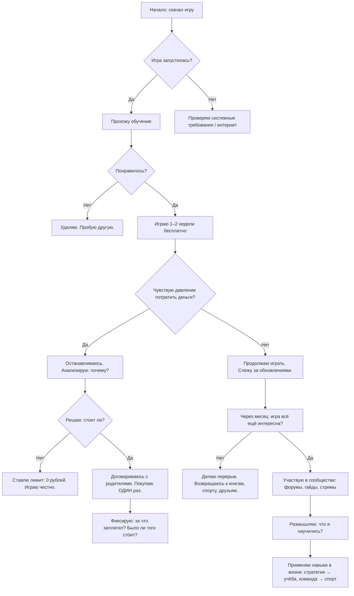

import ExternalPlayEmbed from '@site/src/components/ExternalPlayEmbed';

# Бесплатные игры

  ОБЯЗАТЕЛЬНО
  ДЛЯ НОВИЧКОВ

Начальный уровень

  
Интерактив

  

  Демо ниже — нажимайте кнопки и смотрите, как это устроено. Ничего на компьютере не меняется.

  

<ExternalPlayEmbed example="basics/gamepad-play" title="Gamepad" />

---

## Бесплатные игры

### Бесплатные игры

Вы пришли в огромный парк развлечений. Вход бесплатный — стоят открытые ворота, внутри музыка, яркие огни, смеются дети. Вы заходите, идёте по аллее, видите карусели, лабиринты, симуляторы полётов — всё это можно попробовать *без денег*. Но… чтобы прокатиться на самых крутых аттракционах, чтобы пройти во внутренние зоны, чтобы получить особую форму или значок героя — нужно купить билет. И билеты стоят не одинаково — один — за конфету, другой — за целый обед, третий — за целую неделю карманных денег.

Игровые миры устроены почти так же. **Бесплатная игра** — это игра, в которую можно начать играть *прямо сейчас*, без покупки диска, без оплаВы подписки, без ввода платёжных данных. Вы скачиваете её, запускаете — и уже герой, космонавт, тренер покемонов или стратег будущего. Но… почти всегда в такой игре есть **точки выбора**: хотите продолжить — идите дальше сам, решая задачи и тренируя навыки; хотите ускорить путь, выделиться, получить преимущество — откройте кошелёк.

---

#### Почему игры *на самом деле* не бесплатны?

Создание игры — это огромный труд сотен людей — программистов, художников, дизайнеров, композиторов, тестировщиков. Они работают месяцы и годы. Их надо кормить, одевать, платить за электричество, серверы, лицензии на инструменты. Поэтому, если игра не продаётся за деньги в магазине, **деньги приходят откуда-то ещё**. Это может быть:

- реклама (Вы смотрите ролик — Вам дают монетки),
- внутриигровые покупки (вещи, скины, ускорения),
- подписки (ежемесячная плата за "премиум-статус"),
- "коробочки удачи" (loot boxes — случайные наборы предметов, цена фиксирована, содержимое — нет),
- монетизация данных (редко у детей, но бывает: анализ поведения для показа рекламы).

Такая модель называется **F2P — Free to Play**, "свободно играть". Но важно понимать: игра не бесплатна для *разработчика*. Она бесплатна для *входа*. А дальше — каждый решает сам: сколько вложить *времени* и сколько *денег*.

---

#### Не нужно донатить — не ведись на развод

Слово *донат* пришло из английского *donate* — "дарить". Но в играх его часто используют как "добровольный платёж". На самом деле, **ничего добровольного в этом нет**. Вы не в церкви и не на сборе помощи больным детям. Вы в коммерческом продукте, где каждая кнопка "Купить за 499 рублей" была тщательно спроектирована — цвет — яркий, анимация — манящая, надпись — вроде бы скромная — *"Помоги команде!"*, *"Осталось 3 штуки!"*, *"Вы почти герой — докупи доспех!"*.

Это называется **геймификация продаж** — когда приёмы игрового дизайна (награды, прогресс, дефицит) применяют, чтобы вызвать импульсивную покупку. Особенно уязвимы те, кто:

- боится отстать от друзей ("у всех есть дракон, а у меня нет"),
- стремится к завершённости ("остался один предмет в коллекции"),
- устал от повторяющихся заданий ("надоело ждать 12 часов — куплю ускорение").

Но помни: **никакая игра не стоит денег родителей**. Особенно если Вы тратите их без спроса. А теперь — главный аргумент:

> **Представьте, что весь Ваш купленный прогресс может быть удалён одной строчкой кода.**  
> Серверы ломаются. Компании закрываются. Игры уходят в архив. В 2023 году, например, закрылась игра *Disney Infinity* — тысячи детей потеряли свои сборки, фигурки, миры. В 2024-м Blizzard убрала из *Overwatch* некоторые анимации и предметы после обновления. Да, чаще всего сохраняют. Но *права на то, что Вы "купили"*, у Вас нет. Вы арендовали доступ. Надолго — или на час. Вы доверяете компании, что она не изменит правила. А она имеет полное право.

Это не призыв бояться. Это призыв — **думать**.

---

#### Тогда зачем играть в бесплатные игры?

Потому что **многие из них — настоящие шедевры**.

Они дают:

- доступ к сложным механикам без барьера входа (например, *StarCraft II* учит стратегическому мышлению лучше любого учебника),
- возможность играть с друзьями, даже если у них разные устройства,
- шанс попробовать жанр, прежде чем решить — нравится ли он (вдруг Вам понравится MOBA после *Smite*, или RPG после *Path of Exile*?),
- киберспортивные дисциплины — *Dota 2*, *CS2*, *Rocket League* — это не просто игры, это мировые чемпионаВы с призовыми в миллионы долларов.

Бесплатные игры — это **портал**. Через него можно прикоснуться к тому, что раньше было доступно только тем, кто мог заплатить. Главное — не застрять в нём. Не превратить игру в долг, в зависимость, в повод для ссоры дома.

> **Правило номер один — играйте столько, сколько хотите — плати столько, сколько *решили заранее*.**  
> Лучше всего — ноль. Потому что лучшие достижения в играх — это те, что Вы *заработал*, а не *купил*. Орёл на плече — круто. Но гораздо круче — *научиться летать*.

---

### Где играть — и как не заблудиться в мире F2P

#### Платформы — не все одинаково полезны

Игровая платформа — это как книжный магазин. Есть огромные супермаркеВы (*Steam*, *Battle.net*), есть специализированные лавки (*Epic Игры Store*), есть "киоски на улице" — мобильные магазины (*Google Play*, *App Store*), а есть закрытые клубы (*PlayStation Store*, *Nintendo eShop*). Везде можно найти что-то стоящее, но и везде есть шанс наткнуться на "фантик без конфеты" — красивую обёртку, пустое содержание.

Давайте пройдёмся по основным местам обитания бесплатных игр — и поймём, что там действительно ценно.

---

##### Battle.net (Blizzard Развлечения)

Это платформа, созданная компанией, которая *переписала правила* киберспорта и онлайн-игр. Blizzard никогда не гналась за "быстрым заработком" — её бесплатные игры — это скорее *приглашение в мир*, чем ловушка.

- **StarCraft II** — стратегия в реальном времени. Бесплатно — весь мультиплеер (сражения 1 на 1, 2 на 2), кооперативный режим "Командиры" (18 героев со своими армиями), и первая кампания — "Восхождение крыльев", где Вы играете за людей (терранов).  
  → *Почему это важно?* StarCraft учит:  
  — делить внимание (ресурсы, юниты, карту),  
  — принимать решения за секунды,  
  — планировать на 5 шагов вперёд.  
  Это не просто игра — это тренажёр тактического мышления. Школьники в Южной Корее проходят по ней олимпиады по логике.

- **Hearthstone** — карточная стратегия по мотивам вселенной *World of Warcraft*. Бесплатно — полный доступ к основному режиму, ежедневные задания, базовые колоды.  
  → Здесь развиваются:  
  — вероятностное мышление (сколько шансов вытянуть нужную карту?),  
  — работа с ограничениями (всего 30 карт в колоде),  
  — чтение намерений соперника ("почему он не атаковал?").  
  Игра регулярно обновляется, но *никогда* не требует покупки для победы. Лучшие игроки мира собирают колоды из бесплатных карт.

- **Heroes of the Storm** — MOBA (командная арена), где сражаются герои из разных вселенных Blizzard. Бесплатно — все герои, все карты.  
  → Акцент сделан на *командной игре*. Здесь важно "кто лучше координируется".

- **World of Warcraft** — легендарная MMORPG. Бесплатно — до 20-го уровня (раньше было 10, теперь увеличили). Этого хватает, чтобы пройти целый регион, понять систему квестов, познакомиться с профессиями и гильдиями.  
  → Это введение в *социальную архитектуру онлайн-миров* — как люди договариваются, как строятся правила, как возникает доверие.

> 🔎 **Как проверить, "живая" ли игра?**  
> Зайдите на официальный сайт Blizzard (eu.battle.net). Посмотрите:  
> — Есть ли раздел *Новости* с обновлениями за последние 2 месяца?  
> — Проводятся ли турниры (даже любительские)?  
> — Есть ли в игре *патчноуты* (описания изменений)?  
> Если да — проект поддерживается. Если последняя запись — год назад — будь осторожен.

---

##### Консоли — PlayStation, Xbox, Nintendo Switch

На консолях бесплатные игры появились позже, но сейчас их выбор огромен — и многие из них адаптированы специально для геймпада, а не для мышки.

- **Overwatch 2** (PS, Xbox, Switch, ПК) — шутер от первого лица с командной игрой 5 на 5. Каждый герой — уникальный класс (танк, поддержка, урон), у каждого — свои способности. Бесплатно — полный доступ ко всем режимам, героям, событиям.  
  → Почему это выделяется?  
  — Открытые API для моддинга (можно создавать свои карВы и режимы),  
  — Система *репутации*: игроки голосуют за поведение друг друга — поощряется уважение,  
  — Регулярные "сезоны" с бесплатными наградами за игру (скины, эмоции).

- **Fortnite** (везде) — "королевская битва" с элементами строительства. Да, она известна танцами и коллаборациями с Marvel, но за этим стоит очень умная система:  
  — *Creative Mode* — конструктор уровней, где можно создать школу, лабиринт, квест — и пригласить друзей,  
  — *Unreal Editor for Fortnite* (UEFN) — инструмент для продвинутых:

  - можно писать скрипты;
  - делать логику;
  - как в настоящей разработке.
  → Это не просто игра — это *платформа для творчества*. Многие подростки начинают с неё путь в геймдизайн.

- **Rocket League** (PS, Xbox, Switch, ПК) — футбол на реактивных машинах. Бесплатно — полный мультиплеер, турниры, тренировочные режимы.  
  → Здесь нет "прокачки": все машины у всех одинаковые по характеристикам. Побеждает тот, кто лучше владеет физикой, углами и командной игрой. Чистый, честный киберспорт.

- **Fall Guys** (PS, Xbox, Switch, ПК) — весёлый "королевский бой" в стиле детской эстафеты — бег, прыжки, балансы. Бесплатно — все уровни, все события.  
  → Отлично для переключения мозга, смеха с друзьями, развития пространственного мышления в 3D.

- **Pokémon Unite** (Switch, мобильные) — MOBA от Nintendo. Покемоны сражаются 5 на 5, чтобы набрать больше очков за 10 минут. Бесплатно — все персонажи, все карты.  
  → Особенность: нет "убийств" — только *очки за действия*. Нет стресса от потери — только рост команды. Идеально для новичков в жанре.

> ⚠️ Важно — консольные верси требуют *онлайн-подписки* (PS Plus, Xbox Game Pass Core) для сетевой игры — *кроме* Fortnite, Fall Guys и Rocket League (они бесплатны даже без подписки). Уточняй на сайте.

---

##### Steam — "город-государство" игр

Steam — крупнейший магазин ПК-игр. Здесь бесплатных проектов — тысячи. Но… много и "мусора". Как отличить?

**Критери качества:**  
1. **Разработчик** — известная студия (Valve, Riot, CD Projekt RED) или сообщество с репутацией (например, *Team Fortress 2* — от Valve, хотя и старая, но жива).  
2. **Количество игроков онлайн** (в правом нижнем углу страницы игры — цифра вроде "124 892 играет сейчас"). Если меньше 100 — серверы могут быть пустыми.  
3. **Дата последнего обновления** — в нижней части страницы. Если "2 года назад" — проект, скорее всего, заброшен.

**Достойные проекты:**

- **Counter-Strike 2** — шутер, который учит:  
  — точности (реалистичная баллистика),  
  — командной тактике ("эконом-раунды", "пистолетки"),  
  — работе с информацией (звуки шагов, отскоков).  
  Бесплатно — полный доступ. Никаких "платных" карт или оружия.

- **Dota 2** — самая сложная MOBA в мире. 120+ героев, глубокая экономика, стратегия на 45+ минут. Бесплатно — всё.  
  → Почему это важно? Dota — это как шахмаВы с физикой и психологией. Здесь учатся *предвидеть*, *жертвовать*, *восстанавливаться после ошибок*. Многие гроссмейстеры начинали с неё.

- **Path of Exile** — "тёмная Diablo". Глубочайшая система прокачки, 1325 умений, 7 актов сюжета. Бесплатно — вся кампания, все расширения.  
  → Подходит тем, кто любит *системы*, *оптимизацию*, *длинные цели*. Нет "платных преимуществ" — только время и ум.

- **The Sims 4** — симулятор жизни. Бесплатно — базовая версия (полный доступ к карьере, отношениям, строительству).  
  → Это школа *эмпатии* и *управления ресурсами* — как устроить быт, как решать конфликты, как планировать пространство.

- **Destiny 2** — шутер с элементами RPG. Космос, рейды на 6 человек, сюжетные кампани. Бесплатно — основная игра + несколько расширений.  
  → Отлично для тех, кто любит *эпические истории* и *командную работу*.

- **Smite 2** (скоро) — MOBA от третьего лица (вид сзади, как в *God of War*). Боги из 20+ мифологий. Бесплатно — все боги, все режимы.  
  → Новинка 2025 года, но уже с огромным потенциалом — физика ближнего боя, тактические умения, честная экономика.

- **Halo Infinite** — шутер от Microsoft. Бесплатно — мультиплеер (арены, захват флага, "король холма").  
  → Классика жанра, без микротранзакций в бою. Только чистый PvP.

---

##### Мобильные устройства — мир в кармане

Смартфоны — самые доступные игровые устройства. Но здесь *самый высокий риск* наткнуться на "высосанную" игру — яркая картинка, простой геймплей, и… бесконечные просьбы заплатить.

**Как не попасться?**  
— Игнорируй игры с фразами в описани — *"Уникальная возможность!", "Только сегодня!", "Последний шанс!"*.  
— Если в первые 10 минут уже предлагают купить что-то — закрывай.  
— Ищите игры, где *проигрыш не останавливает прогресс*: можно проиграть бой — и продолжить.

**Достойные примеры:**

- **Pokémon Unite** (iOS/Android) — как на Switch, но с оптимизацией под сенсор. Отлично для коротких сессий (10 минут — и матч окончен).

- **Fortnite** (iOS/Android через облачный стриминг, например, GeForce NOW) — да, на смартфоне тоже можно строить и сражаться.

- **2048** — головоломка. Складывай плитки с одинаковыми числами, пока не получите 2048.  
  → Учит:  
  — планированию ходов,  
  — работе с экспоненциальным ростом (2 → 4 → 8 → 16…),  
  — терпению (одна ошибка — и всё сначала).

- **Fruit Ninja** — резка фруктов. Кажется простым, но требует:  
  — скорости реакции,  
  — предугадывания траекторий,  
  — работы с "ложными целями" (бомбы нельзя резать!).

- **Diablo Immortal** — спорная игра, но объективно:  
  — бесплатный доступ к 6 классам и 60+ уровням,  
  — сюжет продолжает историю *Diablo II* и *III*,  
  — боевая система — одна из лучших на мобильных.  
  → Однако: после 45-го уровня сильно давят на покупки. Лучше играть до 40-го — и остановиться.

---

### Путь игрока в бесплатной игре

> Эта схема — *алгоритм осознанного выбора*. Она напоминает: игра — инструмент. А инструментом нужно уметь пользоваться.

---

### Психология и защита

#### Что такое "донатер" — и почему это не комплимент?

Слово *донатер* в игровых чатах часто произносят с иронией — или даже с презрением. Почему? Потому что оно стало синонимом **игрока, который платит за избавление от дискомфорта**.

Вы играете в командную игру. Вы стараетесь, тренируетеся, но проигрываете — не потому, что слаб, а потому, что у соперников *уровень предметов выше*. Они просто *купили ускорение прокачки*. Вы злитесь. Вы устаёте. И в какой-то момент появляется окошко: *"За 299 рублей получите комплект, который сравняет шансы"*.

Вы платите.

Игра "побеждает" потому, что **создала боль, а потом предложила "лекарство"**.

Это называется **pain-and-relief loop** (цикл "боль → облегчение"). Он лежит в основе многих F2P-систем. И он работает — особенно у тех, кто:

- стремится к справедливости ("если все платят — я тоже должны"),  
- боится потери ("если не куплю сейчас — скидка пропадёт"),  
- путает *инвестицию* и *трату* ("я же вкладываюсь в игру!" — но игра не Ваша собственность).

> 🔔 Важно: *Хотеть* что-то купить — нормально.  
> Слабость — *не замечать*, что решение принято под давлением.

---

#### Как Вас "подключают" к циклу — и как отключиться

Вот семь самых распространённых приёмов. Мы разберём каждый — и дадим **анти-приём**, способ защиты.

---

##### Визуальный дефицит

> *"Осталось 2 штуки!", "Только до конца дня!", красная мигающая рамка.*  

🧠 **Как работает**: мозг воспринимает дефицит как угрозу упущенной выгоды (FOMO — *fear of missing out*). Это древний инстинкт: если в пещере осталось две ягоды — их надо взять *сейчас*, пока не забрали другие.  

🛡️ **Защита**:  
— Спросите себя: *"Если бы этого предмета не было в продаже вообще — я бы о нём помнил через неделю?"*  
— Откройте таймер на 24 часа. Если через сутки всё ещё хочется — обсуди с родителями.  
— Помните: *виртуальные предметы не портятся, не заканчиваются физически*. "Дефицит" — это цифра в базе данных. Её можно изменить.

---

##### Псевдо-рандом

> *"Откройте коробку — получите случайный предмет! Шанс легендарного — 1%"*  

🧠 **Как работает**: мозг любит азарт. Даже маленький шанс активирует систему вознаграждения — как у крысы, которая нажимает на рычаг в надежде на еду. Особенно если *иногда* повезёт — тогда Вы запомните "победу", а не 99 неудач.  

🛡️ **Защита**:  
— Переведи проценВы в реальность: *1% = 1 из 100 коробок*. Если коробка стоит 100 рублей — легендарный предмет "стоит" 10 000 рублей *в среднем*.  
— Спроси: *"Если бы я получил этот предмет бесплатно — я бы его использовал? Или он просто лежал бы в инвентаре?"*  
— Играйте в игры, где *все предметы можно заработать* (например, *Overwatch 2* или *Rocket League*).

---

##### Искусственное замедление

> *"Улучшение займёт 12 часов. Ускорить — 75 рублей"*  

🧠 **Как работает**: игра создает *искусственную паузу*, чтобы Вы почувствовали "торможение". А когда человеку мешают двигаться вперёд — он готов заплатить за "кнопку продолжить".  

🛡️ **Защита**:  
— Включите таймер *настоящего времени* — если улучшение идёт 12 часов — переключись на другую игру, книгу, прогулку.  
— Спроси: *"Что я потеряю, если подожду? Реальный прогресс — или только ощущение нетерпения?"*  
— Заметьте — такие системы почти отсутствуют в играх от Valve (*CS2*, *Dota 2*), Blizzard (*SC2*, *HS*) — потому что они верят: *интерес должны держать геймплей, а не очередь*.

---

##### Социальное давление

> *"Ваш друг купил дракона. У Вас такого нет?"*, *"Клан проголосовал — все должны купить премиум"*  

🧠 **Как работает**: принадлежность к группе — базовая потребность. Особенно в 10–16 лет. Игры используют это, превращая покупку в "знак лояльности".  

🛡️ **Защита**:  
— Напомни себе: *настоящая дружба не строится на виртуальных скинах*.  
— Проведите эксперимент: один день играйте *без уникальных предметов* (только базовые модели). Заметьте: кто-то действительно отказался с Вами играть — или это был вымысел страха?  
— Предложи клану *альтернативу*: "Давайте устроим турнир на базовых героях — кто победит без ускорений?"

---

##### Ложная завершённость

> *"У Вас 9 из 10 предметов коллекции! Докупи последний — получите приз!"*  

🧠 **Как работает**: мозг стремится к завершённости (эффект Зейгарник — незавершённые дела "висят" в памяти). Коллекци специально делают *почти полными* с самого начала.  

🛡️ **Защита**:  
— Спроси: *"А что я получу за завершение? Новый функционал — или просто значок?"*  
— Создайте *свою* коллекцию: например, "10 побед без единого выстрела в голову" в CS2 — и награда — Ваш личный трофей на стене.  
— Помните: *коллекция — это не цель. Цель — ощущение роста*.

---

##### Эмоциональные триггеры

> *"Этот скин — в память о разработчике, ушедшем в отставку", "Выручка пойдёт на благотворительность"*  

🧠 **Как работает**: подмена мотивов. Вместо "купите красивую вещь" — "помогите человеку". Это мощно: совесть сильнее желания.  

🛡️ **Защита**:  
— Проверьте: *есть ли официальное подтверждение благотворительности?* (Ищите на странице компании.)  
— Спроси: *"Почему помощь идёт через игру, а не напрямую?"* (Часто ответ: "Потому что так прибыльнее".)  
— Предложи альтернативу: *"Я пожертвую 50 рублей напрямую — и не куплю скин. Это честнее"*.

---

##### Привычка вместо выбора
  
> *"Вы не открывал магазин 3 дня. Специальное предложение!"*  

🧠 **Как работает**: алгоритмы следят за поведением. Если Вы *раньше* покупал — Вам будут показывать больше "персонализированных" предложений. Со временем решение "купить" становится автоматическим — как привычка чистить зубы.  

🛡️ **Защита**:  
— Раз в месяц *удаляй историю покупок* в магазине (если возможно).  
— Используйте правило **"5 секунд + 5 вопросов"**:  
 1. Что я получу?  
 2. Сколько это стоит *в часах моего времени* (если бы я зарабатывал 100 руб/час — это 3 часа работы)?  
 3. Буду ли я это использовать через месяц?  
 4. Есть ли бесплатная альтернатива?  
 5. Согласен ли я, что *разработчик имеет право удалить это завтра*?  
— Если не ответил(а) — закройте окно.

---

#### Что делать, если уже потратил(а) — и пожалел(а)?

Это случается. Даже взрослые разработчики иногда "попадаются". Важно **перевести ошибку в опыт**.

1. **Зафиксируй факт**: "Я потратил Х рублей на Y. Цель была — Z".  
2. **Оцени результат**: "Через 3 дня я использовал это N раз. Ощущение радости длилось M минут".  
3. **Сделайте вывод**: "В следующий раз я буду ждать 48 часов" или "Я не куплю ничего, что не влияет на геймплей".  
4. **Поделитесь**: расскажите другу — как "я провёл эксперимент". Это сделает Вас не слабее — а мудрее.

> **Правило зрелого игрока**:  
> *Я плачу не за предмет. Я плачу за эмоцию.  
> Если эмоция прошла быстрее, чем деньги вернулись — я переплатил.*

---
