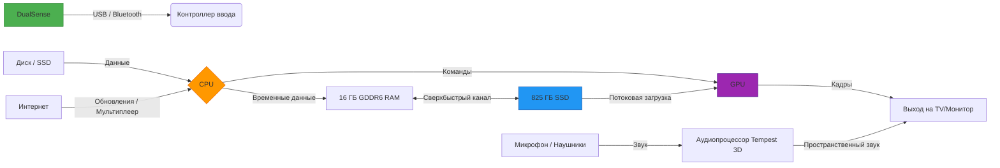

import ExternalPlayEmbed from '@site/src/components/ExternalPlayEmbed';

# PlayStation

  ОБЯЗАТЕЛЬНО
  ДЛЯ НОВИЧКОВ

Начальный уровень

  
Интерактив

  

  Демо ниже — нажимайте кнопки и смотрите, как это устроено. Ничего на компьютере не меняется.

  

<ExternalPlayEmbed example="basics/gamepad-play" title="Gamepad" />

---

## PlayStation

**PlayStation** — линейка игровых консолей Sony — устройство подключается к телевизору или монитору, игры запускаются с дисков или из цифрового магазина, управление — через геймпад.

Консоль — специализированный компьютер для игр и мультимедиа — собственная ОС, оптимизированное "железо" (CPU, GPU, память) и экосистема сервисов (PlayStation Network, подписки, облачные сохранения).

---

### Почему PlayStation — это компьютер?

Многие думают — "Компьютер — это то, что стоит на столе, с монитором и клавиатурой". Но на самом деле *компьютер* — это любое устройство, способное:

1. **Принимать информацию** (например, нажатие кнопки на джойстике),  
2. **Обрабатывать её** (вычислять, что должны сделать персонаж — прыгнуть, выстрелить или упасть),  
3. **Хранить данные** (запоминать, сколько жизней у Вас осталось, где Вы сохранились),  
4. **Выводить результат** (показывать картинку на экране и звук через колонки или наушники).

PlayStation делает всё это — и даже больше. Просто вместо клавиатуры и мыши у неё *геймпад* (игровой контроллер), а вместо операционной системы Windows — собственная, специально созданная для игр и развлечений.

---

### Немного истори — от кассет к лучу света

Всё началось в далёком 1994 году — задолго до того, как Вы родился. Тогда японская компания **Sony** (да-да, та самая, что делает телевизоры, фотоаппараты и наушники) выпустила первую PlayStation. Почему? Потому что Sony хотела продавать музыку и фильмы, а также создать *экосистему* — мир, где технологии помогают людям получать удовольствие, учиться и творить.

| Поколение | Год выпуска | Что было особенного |
|-----------|-------------|----------------------|
| **PlayStation (PS1)** | 1994 | Впервые использовала **CD-диски** вместо кассет. На них помещалось куда больше музыки, звуков и картинок! Появились трёхмерные (3D) миры. |
| **PlayStation 2 (PS2)** | 2000 | Стала самой продаваемой консолью в истории (более 155 миллионов штук!). Умела проигрывать DVD — тогда это был прорыв. |
| **PlayStation 3 (PS3)** | 2006 | Впервые получила жёсткий диск "из коробки", поддержку Blu-ray (диски с высоким качеством видео), и даже могла соединяться с другими PS3 для расчётов (так называемый *сетевой суперкомпьютер*). |
| **PlayStation 4 (PS4)** | 2013 | Сделала акцент на удобстве: простой интерфейс, облачные сохранения, стриминг (трансляции игр в прямом эфире). |
| **PlayStation 5 (PS5)** | 2020 | Сейчас это — **настоящий прорыв**. Она работает так быстро, что загрузка уровней почти исчезла. А ещё — она умеет "чувствовать" силу Вашего нажатия на кнопки! |

> 💬 **Интересный факт**: название *PlayStation* состоит из двух слов: *Play* ("играть") и *Station* ("станция"). То есть — *станция для игры*. Именно *станция* — как космическая станция, где можно провести много времени, исследуя и экспериментируя.

---

### Что внутри PlayStation 5? Разбираем "по винтикам"

Консоль выглядит как чёрно-белая коробка с изогнутыми краями — но внутри неё скрывается настоящий суперкомпьютер. Давайте заглянем внутрь мысленно.

Вот из чего состоит PS5:

---

#### Процессор (CPU)

Это "мозг" консоли. Он принимает решения — *"герой прыгнул — проверить, не ударился ли он о потолок"*, *"враг подошёл близко — начать атаку"*. В PS5 стоит 8-ядерный процессор на архитектуре **Zen 2** (разработанной компанией AMD). Для сравнения: у многих ноутбуков 2020 года было по 4 ядра — PS5 вдвое "умнее" в плане многозадачности.

---

#### Видеопроцессор (GPU)

Это "художник". Он отвечает за то, как выглядит игра — сколько полигонов в модели дракона, как свет отражается от воды, как падает тень. В PS5 GPU создан по технологии **RDNA 2** — та же, что используется в мощных игровых видеокартах для ПК. Благодаря ей возможны:
- разрешение до **4K** (3840 × 2160 пикселей — это в 4 раза больше, чем Full HD!),
- частота смены кадров до **120 кадров в секунду** (обычное видео — 24–30 кадров/с),
- технология **ray tracing** ("трассировка лучей") — имитация реального света — бликов, отражений, полупрозрачности.

---

#### Память (RAM)

RAM — это "оперативная память", кратковременная "блокнотная тетрадка", где консоль хранит то, с чем работает *прямо сейчас*. У PS5 — **16 ГБ сверхбыстрой памяти GDDR6**. Благодаря высокой скорости обмена данными (448 ГБ/с), игра может мгновенно подгружать новые части мира — например, когда Вы едете на машине по городу и за поворотом появляется новое здание.

---

#### SSD-накопитель

Это "долговременная память", **твердотельная (SSD)**. У PS5 — внутренний SSD ёмкостью 825 ГБ (примерно 667 ГБ доступно пользователю), со скоростью чтения до **5,5 ГБ/с**. Что это значит?  
Раньше, в PS4, загрузка уровня в *Spider-Man* занимала 15–20 секунд. В PS5 — **менее 1 секунды**. Вы нажали кнопку — и уже в игре. Это возможно благодаря скорости и специальной *системе сжатия данных* (кодек **Kraken**) и *обходу ненужных этапов загрузки*.

---

#### Контроллер DualSense

Это не просто "пульт". Это устройство, которое **общается** с Вами через ощущения:
- **Адаптивные триггеры** — кнопки R2/L2 могут становиться "тяжелее" или "мягче" в зависимости от ситуации (например, натягиваете лук — сопротивление растёт);
- **Тактильная отдача (haptics)** — мелкие вибромоторы передают разные ощущения — дождь, ветер, шаги по песку или льду;
- **Встроенный микрофон** — можно говорить с друзьями без гарнитуры;
- **Сенсорный тачпад** — можно проводить пальцем, как на смартфоне.

---

#### Система охлаждения

PS5 выделяет много тепла — как небольшой обогреватель. Чтобы не перегреться, внутри стоит мощный вентилятор и медные тепловые трубки. Поэтому консоль такая большая — ей нужно "дышать".

---

#### Программное обеспечение (ПО)
  
Это операционная система **Orbis OS** (на базе FreeBSD — одной из разновидностей Unix). Она управляет всем — запуском игр, подключением наушников, обновлениями, родительским контролем. Интерфейс называется **PS5 UI** (User Interface) — простой, с акцентом на скорость и удобство.

---

### Как это всё работает вместе? Схема PS5

Ниже — упрощённая, но технически точная схема архитектуры PlayStation 5. Она показывает, как компоненВы "общаются" между собой.

> **Пояснение к схеме**:
> - **CPU и GPU** работают *в одной связке* (это называется *гетерогенная архитектура* — похоже на то, как в человеческом мозге разные области отвечают за разное, но всегда вместе).
> - **SSD и RAM** соединены напрямую — это ключ к скорости. В старых консолях данные шли через CPU, как через "таможню"; теперь — по "экспресс-дороге".
> - **Tempest 3D AudioTech** — звуковой движок, который создаёт эффект "звука вокруг" даже в обычных наушниках. Вы можете *слышать*, откуда стреляют — сверху, сзади, слева.

---

Когда Вы включаете PlayStation 5, перед Вами появляется не просто меню — а **персональная среда**, построенная вокруг *Вас* и *Ваших интересов*. Это как комната в доме, где всё расставлено так, чтобы Вам было удобно — любимая игра — рядом, сообщения — на виду, настройки — под рукой.

Называется эта среда — **Control Center** (Центр управления). Давайте разберём её по слоям.

---

### Что такое Control Center и Home Screen?

Это не одно и то же — и это важно.

- **Home Screen (Домашний экран)** — это "стена с полками". Здесь Вы видите иконки игр, приложений (Netflix, YouTube), папки и предложения от PlayStation Store. Это *статичное* пространство — Вы заходите сюда, чтобы выбрать, чем заняться.

- **Control Center (Центр управления)** — это "быстрое меню", которое появляется, если нажать кнопку **PS** (круглая с логотипом PlayStation) на DualSense. Оно выезжает *поверх* игры, не останавливая её полностью (в большинстве случаев). Вы можете проверить уведомления, переключить звук, посмотреть прогресс трофеев — и вернуться в игру за секунду.

> **Почему так сделано?**  
> Раньше, в PS4, чтобы посмотреть, сколько очков набрал друг — приходилось выйти из игры, загрузить профиль, подождать… В PS5 инженеры поставили задачу: *никаких простоев*. Вы — в центре, и всё должно быть у Вас под рукой — как в смартфоне.

---

### Структура Home Screen — как ориентироваться

Домашний экран — это горизонтальная лента. Слева направо:

1. **Ваша библиотека**  
   Здесь — всё, что у Вас *куплено или установлено* — игры, демо-верси, пробные периоды подписок. Можно сортировать по дате, алфавиту, частоте запуска. Умная фильтрация позволяет, например, найти "все игры с поддержкой VR" или "игры, в которые я не заходил больше месяца".

2. **Рекомендаци PlayStation**  
   Система анализирует, во что Вы играете, какие жанры выбираете (головоломки? шутеры? симуляторы?), и предлагает похожие проекты — но *без навязчивости*. Нет рекламы вроде "КУПИ СЕЙЧАС!", только нейтральные карточки — обложка, рейтинг, краткое описание.

3. **PlayStation Plus Collection**  
   Если у Вас есть подписка **PlayStation Plus Extra или Premium**, здесь появляется отдельный раздел с сотнями игр — классикой и новинками — которые можно скачать *бесплатно*, пока подписка активна.

4. **Media-приложения**  
   Netflix, Spotify, YouTube, Twitch… Да, PS5 — не только для игр. Можно слушать музыку в фоне, пока играете, или смотреть стримы на большом экране.

> **Интересно**: PlayStation *не следит* за тем, что Вы смотрите на YouTube или слушаете в Spotify. Эти данные не передаются в Sony — только статистика по *игровой* активности (и то — с Вашего разрешения в настройках приватности).

---

### Что такое "карточки активности" (Activity Cards)?

Это один из самых умных элементов интерфейса PS5 — и одновременно один из самых недооценённых.

Вы застряли в головоломке. Раньше пришлось бы искать прохождение на YouTube, ставить игру на паузу, переключаться между окнами…  
А теперь:

- Вы открываете **Control Center**,  
- Видите карточку *"Подсказка к головоломке X"*,  
- Нажимаете — и *прямо в меню* появляется короткое видео от разработчиков: "Вот как это решается. Обратите внимание на красную кнопку слева".  
- Возвращаетесь в игру — и продолжаете.

Карточки активности умеют:

- Показывать **цели** ("Соберите 5 звёзд"),  
- Отображать **прогресс** ("3 из 7 боссов побеждено"),  
- Давать **прямой доступ** к определённому уровню или режиму ("Начать гонку в Нью-Йорке"),  
- Подсказывать **время выполнения** ("Эта миссия займёт ~12 минут" — данные от сообщества игроков).

Всё это работает благодаря **метаданным**, которые разработчики игры встраивают в неё при создани. Это как "подсказки для интерфейса" — и PS5 их читает, чтобы помочь Вам.

---

### Общение — как играть с друзьями — и оставаться в безопасности

PlayStation 5 делает упор на **осознанное общение**, *контекстное* взаимодействие.

---

#### Как добавить друга?
1. Откройте профиль друга (по имени или PSN ID),  
2. Нажмите **"Добавить в друзья"**,  
3. Он получит запрос — и только *после подтверждения* Вы сможете играть вместе.

> 🔒 **Важно**: по умолчанию *никто не может писать Вам первым*, если Вы не друзья. Это не как в соцсетях, где любой может прислать сообщение. Здесь — как в реальной жизни: сначала знакомство, потом разговор.

---

#### Голосовой чат
- Можно создать **групповую беседу** (до 16 человек),  
- Включить/выключить микрофон кнопкой на DualSense (**Mute**),  
- Настроить громкость *каждого участника отдельно* (если кто-то кричит — просто убавь ему звук, не трогая остальных).

---

#### Родительский контроль (Family Management)

Если Вам меньше 13 лет — или если родители хотят ограничить время игры — в PS5 есть встроенный инструмент **Семейный доступ**:
- Установка лимита времени в день/неделю,  
- Блокировка покупок без подтверждения,  
- Ограничение по возрастному рейтингу (например, "разрешены только игры 7+"),  
- Отчёт о времени, проведённом в играх.

Всё это настраивается *на сайте* account.sonyentertainmentnetwork.com — не на самой консоли, чтобы ребёнок не мог отключить контроль.

> 🌐 **Факт**: рейтинг игр (PEGI в Европе, ESRB в США) — это не мнение Sony. Это независимые организации, которые оценивают контент по критериям — насилие, язык, сексуальный подтекст, азартные элементы. PS5 просто *соблюдает* эти правила.

---
