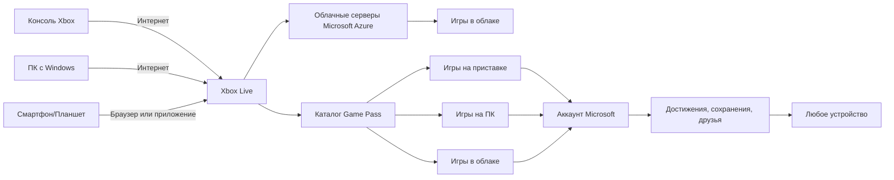

import ExternalPlayEmbed from '@site/src/components/ExternalPlayEmbed';

# Xbox

  ОБЯЗАТЕЛЬНО
  ДЛЯ НОВИЧКОВ

Начальный уровень

  
Интерактив

  

  Демо ниже — нажимайте кнопки и смотрите, как это устроено. Ничего на компьютере не меняется.

  

<ExternalPlayEmbed example="basics/gamepad-play" title="Gamepad" />

---

## Xbox

**Xbox** — линейка игровых консолей Microsoft. Консоль выводит игру на телевизор или монитор; управление — геймпадом; игры — с диска, установки или облачного сервиса.

Xbox — **экосистема** — железо консоли, Xbox Live, Game Pass, магазин и кроссплатформенная игра с ПК и облаком (xCloud) при наличи подписки и интернета.

---

### Краткая история — от Microsoft до галактики и обратно

Xbox появился не сразу. В конце 1990-х домашние приставки делали в основном Sony (PlayStation) и Nintendo. Microsoft к тому моменту уже выпускала Windows и Office и боялась, что **PlayStation 2** станет главным развлекательным устройством в доме вместо компьютера. Команда **DirectX** предложила свою консоль — **DirectX Box**, позже имя сократили до **Xbox**.

До собственной приставки Microsoft помогала **Sega Dreamcast** — переносила на неё урезанную Windows с DirectX, чтобы игры с ПК легче переносились на консоль.

Первый **Xbox** вышел **15 ноября 2001** в США. Это была первая массовая консоль со **встроенным жёстким диском** и разъёмом **Ethernet** для игры по сети. В **2002** запустили **Xbox Live** — онлайн с друзьями, загрузками и обновлениями. Игра **Halo: Combat Evolved** стала визитной карточкой: многие покупали приставку ради неё; позже *Halo 2* стал самым продаваемым тайтлом на платформе.

С тех пор вышло четыре поколения железа:

| Поколение | Год | Что запомнить |
|-----------|-----|----------------|
| Xbox (оригинал) | 2001 | HDD, сеть, Halo, ~25 млн проданных |
| Xbox 360 | 2005 | Xbox Live для всех, Kinect, ~86 млн; у части консолей было "красное кольцо" (поломка) |
| Xbox One | 2013 | Близка к ПК; позже вышли **One S** (2016, меньше и тише) и **One X** (2017, мощнее) |
| Xbox Series X и Series S | 2020 | Быстрый SSD, 4K на X, только цифровые игры на **Series S** (без дисковода) |

  
Откуда имя Xbox

  

  Название — от <strong>DirectX Box</strong>. DirectX — набор технологий Microsoft для графики и звука в играх на Windows. Xbox задумывали как игровую "коробку" на тех же идеях, что и ПК.
  

---

### Главное достоинство Xbox сегодня — Game Pass

Сегодня Xbox часто ассоциируют с подпиской **Game Pass** — большой библиотекой игр за ежемесячную плату (по смыслу как Netflix, но для игр).

Пока игра в каталоге, Вы можете скачать её на консоль или ПК и играть без отдельной покупки. Каталог меняется: что-то добавляют, что-то убирают. Крупные новинки **Microsoft** (*Starfield*, *Forza*, *Halo* и др.) часто попадают в подписку в день выхода — на полном тарифе **Ultimate**.

Основные уровни (названия могут меняться по региону):

- **Essential** — онлайн-мультиплеер на консоли и небольшой набор игр (преемник старого Xbox Live Gold).  
- **Premium** — большой каталог на консоли, ПК и в облаке, без всех day-one релизов Microsoft.  
- **Ultimate** — полный каталог, **EA Play**, облачный гейминг на телефоне и ПК, мультиплеер.  
- **PC Game Pass** — только игры на Windows.

Подробнее для взрослых и старших школьников — в статье [Xbox Game Pass](/encyclopedia/9-spinoff/9-03-igrovaya-industriya/114301).

---

### Xbox = ПК + приставка — как это работает?

Xbox и Windows — как братья. Обе системы используют одну и ту же базу — процессоры от AMD, графические технологии DirectX, облачные сервисы Azure. Поэтому игры, созданные для Xbox, часто легко переносятся на ПК — и наоборот.

Это даёт три больших преимущества:

1. **Единый аккаунт**  
   Один логин Microsoft — и Вы везде — на Xbox, в Windows, в браузере, в приложениях. Все достижения (трофеи), сохранения, друзья — синхронизируются автоматически.

2. **Кроссплатформенный мультиплеер**  
   Вы играете в *Minecraft* на Xbox, а Ваш друг — на iPad или на школьном ноутбуке с Windows. И Вы — в одной команде. Это называется *cross-play* ("кросс-плей"), и Xbox активно его поддерживает.

3. **Облачные игры (Xbox Cloud Gaming)**  
   Если у Вас нет мощного ПК или даже приставки — не беда. Заходите на сайт [xbox.com/play](https://www.xbox.com/play) (или в приложение Xbox), выбираете игру — и она *запускается на серверах Microsoft*, а Вам передаётся только картинка и звук, как на YouTube. Управление — с геймпада, телефона или даже клавиатуры. Правда, нужен хороший интернет (минимум 10 Мбит/с, лучше — 20+).

---

### Кто такой Мастер Чиф

*"Wake up, Master Chief…"* ("Проснитесь, Мастер Чиф…") — знакомая фраза миллионам игроков.

**Мастер Чиф** — герой серии **Halo**. Полное имя — **Джон-117**; его зовут **Чиф**. Он **спартанец** в броне MJOLNIR, рядом с ним ИИ **Кортана**. Сражается с **Ковенантом**, паразитами **Флуд** и исследует кольцевые миры **Хало**.

Чиф почти не говорит длинных речей — игрок смотрит на мир его глазами. **Halo** выросла во вселенную — книги, комиксы, сериал. *Halo Infinite* (2021) даёт бесплатный мультиплеер даже без Game Pass.

---

### Forza Horizon — почему каждому иксбоксеру стоит прокатиться

Если Halo — это "космическая одиссея", то **Forza Horizon** — это "праздник скорости под открытым небом".

Это серия *аркадных автогонок*. Действие происходит в открытом мире — сначала — в вымышленном штате Колорадо (Horizon 1), потом в Италии и Франции (Horizon 2), Великобритании (Horizon 3), Мексике (Horizon 4), США (Horizon 5)… Каждая часть — это *живой фестиваль музыки, машин и приключений*.

Что делает Forza Horizon особенной?

**Настоящие машины** — от классического "Запорожца" до гиперкара Bugatti Chiron. Каждая воссоздана с миллиметровой точностью — звук мотора, вес, управляемость — всё как в жизни (но без штрафов за превышение 😄).  
**Динамическая погода и время суток** — внезапный ливень, рассвет над вулканом, снежная буря в горах…  
**Фестиваль Horizon** — в игре проходит музыкальный фестиваль. Вы приезжаете туда на своей машине, участвуете в гонках, трюках, конкурсах.  
**Свобода** — хотите — гоняй по шоссе. Хочете — прыгай на джипе через кактусы в пустыне. Хочете — включите радио и просто катайся, слушая музыку.

> 🌟 **Forza Horizon 5** (2021) — особенно хороша. В ней — Мексика — джунгли, вулканы, древние руины, пляжи, мегаполисы… И каждую неделю — новые события, машины, задания.  
> А ещё — **режим "Выживание"**, где Вы управляете *не машиной*, а… *самолётом*, *вертолётом*, *трактором* или даже *тюбингом* (надувным кругом по склону)!  

Совет: Forza Horizon отлично подходит для *совместной игры*. Один за рулём, второй — штурман или… просто громко кричит "ТОРМОЗИ!!!".

---

### Как устроен Xbox "изнутри"? Схема

Вот как взаимодействуют основные компоненты экосистемы Xbox — от железа до облака:

> Пояснение:  
> — Всё начинается с **аккаунта Microsoft** — он как "ключ от замка".  
> — **Game Pass** — это *услуга*: доступ к играм.  
> — Одна и та же игра может быть запущена тремя способами — с диска, из загрузки на устройство, или потоком из облака.  
> — Сохранения и достижения хранятся **в облаке**, поэтому Вы можете начать игру дома на Xbox, а продолжить в школе на ноутбуке — и ничего не потеряете.

---
