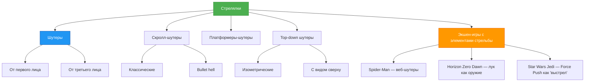
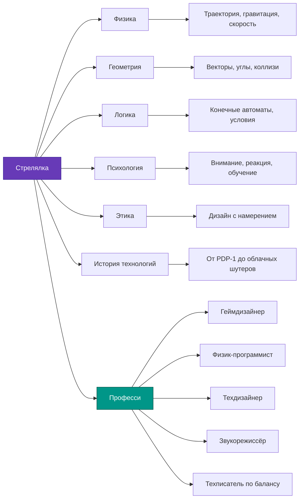

import ExternalPlayEmbed from '@site/src/components/ExternalPlayEmbed';


# Стрелялки

<div class="article-tags">
  <span class="tag tag-required">ОБЯЗАТЕЛЬНО</span>
  <span class="tag tag-beginner">ДЛЯ НОВИЧКОВ</span>
</div>

<span class="complexity-badge">Начальный уровень</span>

<div class="callout callout--tip">
  <div class="callout-title">Интерактив</div>

  <div class="callout-body">
  Демо ниже — нажимайте кнопки и смотрите, как это устроено. Ничего на компьютере не меняется.
</div>
  </div>


<ExternalPlayEmbed example="spinoff/game-franchise-play" title="Игровая франшиза" minHeight={520} playProps={{ franchise: 'doom' }} />

---

## Стрелялки

Когда взрослые слышат слово *"стрелялка"*, они часто представляют себе что-то шумное, быстрое и, возможно, даже "бесполезное" — просто герой бегает и стреляет, монстры падают, уровень заканчивается. Но если посмотреть чуть глубже, то окажется: **стрелялки — одни из самых продуманных и сложных типов компьютерных игр**. В них сочетаются физика, геометрия, тактика, искусство, программирование и даже психология.

В этой главе мы не будем учить, *как* выигрывать в конкретные игры. Мы разберём:  
— **почему** игры устроены именно так,  
— **как** менялись стрелялки за 50 лет,  
— **где** в них скрываются настоящие научные идеи — от расчёта траектори пули до предсказания поведения врага,  
— и **как** даже веб-выстрелы Человека-паука — это тоже, в некотором смысле, *стрельба* (но без пороха!).

Это не инструкция для геймера. Это **путеводитель по мышлению разработчика** — как будто Вы заглянули в мастерскую, где рождаются миры.

---

### Что такое *стрелялка*? Давайте договоримся о словах

Слово *"стрелялка"* звучит просто — и это хорошо. Оно описывает суть: **в игре есть персонаж (или машина), который выпускает снаряды в цель**. Снаряд может быть:
- пулей из пистолета,
- лазерным лучом,
- снежком, мячиком, волшебной стрелой,
- даже словом (в играх-головоломках бывают "атаки через диалог"),
- или… веб-нитью (да, об этом позже!).

**Важно** — в настоящей стрелялке снаряд *летит по траектории*, и игрок должны *предугадать*, куда целиться — потому что цель может двигаться, а снаряд летит не мгновенно.

Это отличает стрелялки от:
- игр, где достаточно *нажать кнопку*, и противник сразу получает урон (например, "тык-тык" в RPG);
- мини-игр, где стрельба — просто анимация без физики (например, "выстрел" в викторине — это метафора).

**Стрелялка = цель + снаряд + время полёта + необходимость прицеливания**.

---

### А что такое *шутер*? Английское слово, русская идея

Слово **шутер** пришло из английского *shooter* — от глагола *to shoot*, то есть *стрелять*. Ничего мистического: шутер — это просто *английское название стрелялки*.

Но в игровой индустрии слово *шутер* стало означать **уже стрелялку определённого вида** — где Вы управляете персонажем, который сам стреляет, чаще всего в реальном времени, и где стрельба — главный способ взаимодействия с миром.

Например, если в игре Вы — танк, который стреляет по целям, — это *танковый симулятор* с элементами шутера.  
Если Вы — волшебник, который метает огненные шары, — это *экшен-RPG*, но в момент боя работает механика шутера.

То есть:  
**все шутеры — стрелялки**,  
**но не все стрелялки называют шутерами** — особенно если стрельба там второстепенна.

---

### Шутеры от первого лица (FPS — First-Person Shooter)

Вы смотрите **глазами героя**.  
Вы не видите своё тело — только руки с оружием, и всё, что перед вами. Это как смотреть на мир через камеру, прикреплённую ко лбу.

Такие игры называются **от первого лица**, потому что "я" — герой. Вы не *наблюдаете* за ним — Вы *становитесь* им.

---

#### Примеры
- *Doom* (1993) — первая массовая игра такого типа; герой — безымянный солдат в аду (да, буквально);
- *Half-Life* — история, где Вы — учёный, попавший в катастрофу;
- *Portal* — здесь Вы стреляете *порталами* (дырами в пространстве!), но механика — всё равно шутер от первого лица.

---

#### Почему это сложно сделать?

Разработчикам нужно решить много задач:
- Как показать, что герой дышит, устаёт, получает ранения — если его тела не видно?
- Как не вызвать у игрока *укачивание* (кинетоз) при быстром повороте головы?
- Как сделать, чтобы прицеливание чувствовалось *точно*, хотя в реальности мы прицеливаемся двумя глазами, а игра — одним "глазом" камеры?

Даже такая мелочь, как *отдача* (отброс оружия при выстреле), требует расчёта силы, анимации, звука и вибрации контроллера — и всего этого одновременно.

---

### Шутеры от третьего лица (TPS — Third-Person Shooter)

Теперь представьте: Вы видите героя **со стороны** — как будто за ним летит невидимая птица или дрон. Камера обычно расположена чуть выше и позади персонажа.

Это *от третьего лица*: Вы — рассказчик, наблюдающий за героем.

---

#### Примеры
- *Gears of War* — герои укрываются за стенами, выскакивают, стреляют, снова прячутся;
- *The Division* — спецагенВы в реалистичном Нью-Йорке;
- *Fortnite* — в режиме "Соло" Вы видите себя со спины.

---

#### Преимущества такого вида
- Игрок видит *всё тело героя* — как он бежит, прыгает, прячется — это помогает в оценке расстояний и укрытий;
- Удобнее делать анимации — удар ногой, перекат, прыжок с крыши — всё это видно и красиво;
- Легче вводить сюжет: лицо героя может мимикрировать, реагировать на диалог.

---

#### Сложность для программистов
- Надо следить, чтобы камера *не застревала* в стенах, когда герой прижимается к углу;
- Нужно рассчитывать, когда показывать оружие "поверх" тела, а когда — скрывать за укрытием;
- В многопользовательских играх — если один игрок видит врага от третьего лица, а другой — от первого, как гарантировать *честность*? (Это целая наука — *netcode* и *hit registration*.)

---

### А что насчёт других видов? Не всё — от первого или третьего лица!

Да, FPS и TPS — самые известные, но стрелялки бывают и другими. И это важно — потому что именно в этих формах родились многие идеи, которые потом перекочевали в крупные проекты.

---

#### Top-down ("сверху вниз")

Камера смотрит строго сверху — как будто Вы с высоты птичьего полёта. Иногда чуть под углом ("изометрия"), но суть та же: Вы видите поле боя целиком.

**Примеры**:  
- *Enter the Gungeon* — подземелье, где каждая пуля видна, и уклоняться от них — искусство;  
- *Hotline Miami* — быстрые, жёсткие бои, где планирование хода решает всё.

**Особенность**: в таких играх особенно важна *геометрия пространства*. Например, если два врага стоят на одной лини — одним выстрелом можно убить обоих (это называется *"penetration"* или "пробитие"). Программисту нужно проверять, *пересекает ли траектория пули несколько объектов*.

---

#### Скролл-шутеры (Scrolling Shooters)

Это классика 80-х — экран *движется сам* (обычно вверх или вбок), а игрок управляет кораблём или персонажем, который стреляет навстречу волнам врагов.

**Примеры**:  
- *1942* (1984) — самолёт в небе, враги летят сверху;  
- *R-Type* — космический корабль с "прицепом"-оружием, который можно разворачивать.

Такие игры учили компьютеры *заранее планировать волны*: враги появляются не случайно — их паттерны ("фигуры полёта") записаны в коде как *скрипты*. Это — ранняя форма *искусственного интеллекта* (хотя и очень простого).

---

#### Bullet hell ("ад из пуль")

Это поджанр скролл-шутеров, где враги стреляют *сотнями* снарядов одновременно, но так, что между ними остаются *узкие проходы*. Игрок должны не просто уворачиваться — нужно *танцевать* по экрану.

**Примеры**:  
- *Touhou Project* — японская серия про ведьм и божеств, где красота паттернов важна не меньше, чем сложность;  
- *Ikaruga* — пули чёрные и белые, и ваш корабль может *впитывать* пули своего цвета.

Здесь физика сочетается с *дизайном* — разработчики тщательно рисуют траектори, чтобы игра была *сложной, но честной*. Если Вы погибли — значит, не заметили закономерность. Это тренирует **внимание, память и пространственное мышление**.

---

#### Платформеры-шутеры

Смешение жанров: Вы прыгаете по платформам (как в *Super Mario*), но ещё и стреляете (как в *Contra* или *Cuphead*).

**Особенность**: баланс между *точностью прыжка* и *точностью прицела*. Например, в *Cuphead* герой может стрелять в любую сторону, даже в прыжке — и это требует от движка игры одновременной обработки:
- гравитации,
- столкновений с платформами,
- анимации рук,
- направления взгляда,
- полёта пуль.

Это — отличный пример *модульного программирования* — физика, анимация, баллистика — всё работает как отдельные "кубики", но соединяется в плавный опыт.

---

### А где же *веб-шутеры* у Человека-паука? И почему теперь всё — "Action"?

Отличный вопрос. Давайте разберём.

У Человека-паука есть **веб-шутеры** — устройства на запястьях, которые выпускают липкую нить. Это *устройства для стрельбы*, но они стреляют *нитями*. И эти нити:
- имеют массу и вязкость,
- растягиваются,
- цепляются за поверхности,
- позволяют *качаться* по городу — то есть превращают стрельбу в способ *передвижения*.

С технической точки зрения:  
— веб-выстрел — это *снаряд с физическими свойствами*;  
— его траектория рассчитывается в реальном времени;  
— точка прикрепления — это *цель*;  
— неудачный выстрел = падение героя.

Значит, **да — механика шутера здесь присутствует**, даже если нет урона. Просто выстрел служит для *взаимодействия с миром*.

Именно поэтому сегодня редко говорят *"шутер"* как отдельный жанр. Вместо этого — **Action (экшен)**. Это более широкое понятие:  
*экшен* = игра, где важны **реакция, координация, физика и мгновенные решения**.  
В экшен могут входить:
- рукопашные бои (*God of War*),
- стрельба (*Call of Duty*),
- лазание и качание (*Spider-Man*),
- управление транспортом (*Red Dead Redemption*),
- даже использование маги (*Elden Ring*).

**Шутер — это *подтип экшена*, где основной инструмент взаимодействия — снаряд, запускаемый в цель.**

Это как:  
> *Квадрат — это прямоугольник, но не всякий прямоугольник — квадрат.*  
> *Шутер — это экшен, но не всякий экшен — шутер.*

---

### Родословная стрелялок



> **Как читать схему**:  
> Зелёный — общее понятие *"стрелялка"*.  
> Сний — *"шутеры"* как устоявшийся жанр.  
> Оранжевый — современные *экшен-игры*, где стрельба — один из инструментов, но не единственный.

---

## Как устроена стрельба *внутри* игры?

### Пуля, лазер, граната — почему они летят по-разному?

Многие думают: "ну пуля — она летит прямо и быстро". Но даже в одной игре снаряды могут вести себя совершенно по-разному. И это не для красоВы — это **логика мира** и **баланс геймплея**.

Вот три ключевых свойства, которые определяют поведение снаряда:

| Свойство | Что оно значит? | Пример из жизни | Пример из игры |
|--------|----------------|----------------|----------------|
| **Траектория** | По какой кривой летит снаряд? | Бросок мяча — дуга. Стрельба из лука — тоже дуга. Из винтовки — почти прямая линия. | — *Minecraft*: стрела летит по параболе. — *Call of Duty*: пуля почти прямая (на короткой дистанции). — *Worms*: граната — дуга, как в боулинге. |
| **Скорость** | Сколько времени снаряд тратит на путь до цели? | Водяной пистолет (медленно) vs пневматика (быстро). | — *Cuphead*: пули врагов летят медленно — можно уклониться. — *Quake*: ракеВы летят медленно, но их можно *перехватить* своей ракетой (да, так умеют!). |
| **Эффект столкновения** | Что происходит при попадани? | Пена — прилипает. Вода — брызги. Камень — разбивает. | — *Half-Life 2*: физ-пушка толкает объекты, но не убивает. — *Overwatch*: ультимейт Райнхардта — волна, отбрасывающая врагов. — *Enter the Gungeon*: пули могут *отскакивать* от стен. |

---

#### Почему это важно для разработчика?

Потому что каждое свойство — это **переменная в коде** и **условие в логике**.  
Например, для пули с дугой нужно:
1. Знать начальную скорость и угол выстрела.
2. Применять каждую миллисекунду *гравитацию* (например, `y = y + vy; vy = vy + gravity`).
3. Проверять, не коснулась ли пуля земли — тогда *остановить* её.

Для лазера — проще:  
— мгновенное появление лини от ствола до первого объекта,  
— проверить, *пересекает* ли эта линия врага (это геометрия: отрезок и прямоугольник/круг).

А для *отскакивающей* пули — сложнее:  
— при столкновении нужно *отразить* вектор скорости,  
— уменьшить скорость (потеря энерги),  
— ограничить число отскоков (иначе пуля будет летать вечно).

Это уже не "бах-бах" — это **физическое моделирование в миниатюре**.

---

### Прицеливание — почему мы не целимся "прямо в голову"?

В реальности стрелок учитывает:
- расстояние до цели,
- её скорость,
- ветер,
- даже вращение Земли (в снайперских расчётах!).

В играх тоже есть "подсказки", но они *спрятаны* в интерфейсе и механике — чтобы не перегружать игрока, но сохранить реализм.

---

#### Что помогает прицеливаться?

| Элемент | Как работает | Зачем нужен |
|--------|--------------|-------------|
| **Прицел (crosshair)** | Маленький крестик или точка в центре экрана. Иногда "расходится" при беге — показывает, что точность упала. | Даёт опорную точку. Без него — как стрелять с закрытыми глазами. |
| **Ретикул (reticle bloom)** | Прицел "растёт" при движении, стрельбе очередью. Чем больше — тем выше разброс. | Учит думать: *стоит ли бежать и стрелять? Или лучше остановиться?* |
| **Упреждение (lead targeting)** | В некоторых играх (например, космических симуляторах) появляется *вторая метка* — куда *будет* враг через 1 секунду. | Помогает компенсировать время полёта снаряда. Особенно важно для медленных ракет. |
| **Автоприцел (snap-to / aim assist)** | На консолях: если Вы *почти* навели на врага — камера слегка "дотягивает" прицел. | Компенсирует меньшую точность геймпада по сравнению с мышью. |

> 🔍 **Интересный факт**: в *Fortnite* на ПК автоприцела почти нет, а на PlayStation он есть — иначе игроки с геймпадом проигрывали бы всегда. Это — пример *адаптивного дизайна*: игра подстраивается под устройство, а не заставляет всех быть одинаковыми.

---

### Как "думает" враг, когда стреляет в вас?

Многие дети (и даже взрослые!) думают: "Компьютер всё знает. Он видит меня сквозь стены". На самом деле — **нет**. В 99% игр ИИ *не читерит*. Он использует те же данные, что и игрок:  
— что видит его "глаз" (камера),  
— слышит ли звук (выстрел, шаги),  
— помнит ли, где Вы *были* секунду назад.

---

#### Простая модель поведения врага-стрелка

```plaintext
Каждую секунду враг проверяет:
1. Вижу ли я игрока? (луч от глаз врага до игрока — не пересекает ли стены?)
   → Да: перехожу в состояние "Атака".
   → Нет: перехожу в "Патрулирование".

В состояни "Атака":
2. Повернуть тело и оружие в сторону игрока (плавно, не мгновенно!).
3. Подождать 0.5–2 секунды (имитация "прицеливания").
4. Выстрелить — с небольшой случайной ошибкой (±5°), чтобы не быть "роботом-снайпером".
5. Если игрок ушёл из поля зрения — искать 3 секунды, потом вернуться к патрулированию.
```

Это называется **конечный автомат** (finite state machine) — как будто у врага есть "режимы": *спит → слышит шум → ищет → видит → стреляет → теряет*.

---

#### А как с bullet hell?

Там враги не "стреляют в игрока". Они **выполняют заранее записанные паттерны** — как ноВы в музыке.

Пример паттерна для шарика-врага:
1. Появляется вверху экрана.
2. Летит по прямой 2 секунды.
3. Одновременно выпускает 8 пуль по кругу (как солнце с лучами).
4. Через 0.3 сек — ещё 8 пуль, но повёрнутых на 22.5°.
5. Через 0.3 сек — опять, и так 5 раз → получается "цветок" из пуль.

Эти паттерны рисуют *вручную* — художник и геймдизайнер вместе подбирают, чтобы было сложно, но *предсказуемо*. Если Вы пройдёте уровень 10 раз — Вы запомните — "вот здесь — волна, потом пауза, потом спираль". Это — **обучение через повторение**, как в математике.

---

## От лаборатори к миру — как стрелялки научили нас думать

### Краткая история

#### 1962 — Spacewar! — первая интерактивная стрелялка

Создана студентами MIT на компьютере **PDP-1** — огромной машине, весившей тонну и стоившей $120 000 (сегодня — ~$1.2 млн).  
Два корабля летают вокруг звезды, стреляют торпедами.  
Есть гравитация: если лететь близко к звезде — притягивает.  
Управление — через *специальные переключатели*, не клавиатуру.

**Почему это важно?**  
— Это не "развлечение" — это **эксперимент по человеко-машинному взаимодействию**.  
— ПрограммисВы проверяли — может ли человек *одновременно* управлять поворотом, ускорением, стрельбой и учитывать гравитацию?  
— Ответ: *да* — но только после тренировки. Родилось понятие **кривой обучения**.

> Интересно: исходный код *Spacewar!* был открыт. Любой мог его улучшать. Это — один из первых примеров **open-source культуры** в IT.

---

#### 1970–1980-е — Аркады и ограничения как творчество

Компьютеры были слабыми. В *Space Invaders* (1978):  
— Враги — 55 одинаковых спрайтов, но их *движение* создаёт иллюзию умного поведения: чем меньше врагов, тем быстрее они двигаются (процессору меньше работать — игра ускоряется сама).  
— Звук — один генератор: "тук-тук-тук" учащается по мере приближения врагов → создаётся напряжение.

Ограничения *порождали гениальность*:  
— В *Asteroids* (1979) пули и астероиды исчезают за краем экрана, но **появляются с противоположной стороны** — это применение **топологи тора** (поверхности бублика).  
— В *Galaga* (1981) боссы *захватывают* игрока — и если выстрелите *вовремя*, можно освободиться. Это — ранняя форма **механики QTE (quick-time event)**.

---

#### 1990-е — Революция 3D и рождение FPS

*Doom* (1993) не была первой игрой от первого лица — но первой, которая:  
— работала на *обычных ПК* (не на специальных станциях),  
— поддерживала **многопользовательскую игру через сеть** (впервые — Deathmatch),  
— имела **WAD-файлы** — внешние архивы с картами, звуками, текстурами → началась эра **моддинга**.

*Quake* (1996) добавил:  
— настоящую 3D-графику (не "2.5D", как в *Doom*),  
— **движок как платформу** — любой мог сделать свою игру на его основе (*Counter-Strike*, *Team Fortress* — начинались как моды),  
— **client-server архитектуру**, без которой невозможны современные онлайн-шутеры.

---

#### 2000–2020-е — Гибридизация и "невидимые" шутеры

Сегодня редко встретите "чистый" шутер. Вместо этого — **слои механик**:  
- *Destiny 2*: шутер + RPG (прокачка, редкие предметы) + MMO (рейды на 6 человек);  
- *Hades*: roguelike + платформер + шутер (Загребной стреляет трезубцем в такт ударам);  
- *Splatoon* — шутер, где "пули" — чернила, и цель — *закрасить территорию*.

**Вывод**:  
Стрелялки — не застыли. Они *эволюционировали*, вбирая идеи из других жанров, потому что **механика стрельбы — универсальный способ взаимодействия с виртуальным пространством**.

---

### Этический дизайн — почему важно, *во что* стрелять

Многие считают: "игра — это фантазия, тут всё можно". Но исследования (например, от Оксфордского интернет-института, 2021) показывают:  
**Игроки запоминают *механику***.  
**Повторяющееся действие формирует автоматизм** — даже если он виртуальный.

Поэтому разработчики всё чаще задают себе вопросы:

| Вопрос | Пример решения | Эффект |
|-------|----------------|--------|
| **Можно ли избежать насилия, сохранитев стрельбу?** | *Splatoon*: вместо крови — чернила. Враги "отключаются", а не "умирают". | Сохраняется динамика игры, но снижается тревожность. Подходит для младших игроков. |
| **Как сделать поражение информативным, а не унижающим?** | *Celeste*: при падени герой *возвращается* к последней точке. Никакого "Game Over". | Игрок не боится ошибаться — учится смелее. |
| **Можно ли превратить врага в союзника?** | *Half-Life: Alyx*: роботы-враги могут быть *отключены*, а потом *перепрограммированы* для помощи. | Меняется отношение: враг — *задача*. |
| **Как показать последствия?** | *This War of Mine*: если Вы стреляете в мирного жителя за еду — потом персонаж *впадает в депрессию*, перестаёт готовить. | Даёт понять: выбор имеет цену — даже в игре. |

> ⚠️ Важно: это не "цензура". Это **дизайн с намерением** (*intentional Проектирование*).  
> Как инженер решает: мост должны выдержать ветер, так и геймдизайнер решает: игра должны формировать *осознанное* взаимодействие.

---

#### А что с "веб-шутерами"? Этический пример

В *Marvel’s Spider-Man* (2018) Человек-паук **никогда не убивает**. Даже в перестрелках:  
— его веб-выстрелы *обездвиживают*,  
— он отбивает пули щитом или уклоняется,  
— финальный удар — *нейтрализация*, не казнь.

Это — уважение к характеру героя. Если бы он убивал, это нарушило бы **внутреннюю логику мира**, и игрок бы почувствовал "диссонанс".

---

### Кем можно стать, если увлечён стрелялками?

Многие дети мечтают "делать игры". Но профессий — десятки. Вот те, что *прямо связаны* с механикой стрельбы:

| Профессия | Что делает | Какие навыки нужны | Где учится/начинать |
|----------|------------|--------------------|---------------------|
| **Геймдизайнер (game designer)** | Придумывает, как работает стрельба: скорость, урон, баланс, "чувство выстрела" (ощущение отдачи, звука, визуала). | Анализ игр, прототипирование в Figma/Unity, знание психологи восприятия. | — Изучать геймдизайн-документы (GDD) на itch.io. — Делать "дизайн-разборы" любимых игр. |
| **Программист игровой физики** | Пишет код для полёта пуль, отскоков, гравитации, коллизий. | Математика (векторы, тригонометрия), C++/C#, движки (Unity, Unreal). | — Начать с PyGame или Godot на Python. — Писать симуляторы: "как летит мяч при ветре". |
| **Технический дизайнер (technical designer)** | Совмещает код и дизайн: делает скрипВы поведения врагов, паттерны выстрелов. | Blueprints (Unreal), C# (Unity), логика, state machines. | — В Unity: писать поведение врага через ScriptableObject. — В Unreal: создавать поведение через Behavior Tree. |
| **Звукорежиссёр игр** | Создаёт звук выстрела так, чтобы он *соответствовал* оружию: пистолет — короткий щелчок, дробовик — гулкий "бум". | Аудиоредакторы (Reaper, Wwise), знание акустики, психологи звука. | — Анализировать звуки в *DOOM Eternal*: как меняется тембр при отдаче. |
| **Технический писатель по балансу** | Пишет документы: "как изменить урон, чтобы AK-47 не была сильнее снайперки на ближней дистанции". | Статистика, Excel/Python, понимание PvP-экономики. | — Собрать данные по 10 оружию в *Counter-Strike*. — Построить графики "урон vs дистанция". |

> 🔍 Пример карьерного пути:  
> Ученик → делает мини-шутер в Scratch → учит Python и PyGame → делает игру с физикой → поступает в вуз на "Программная инженерия" → стажируется в студи → становится техдизайнером.

---

### Стрелялка как система знаний



---
