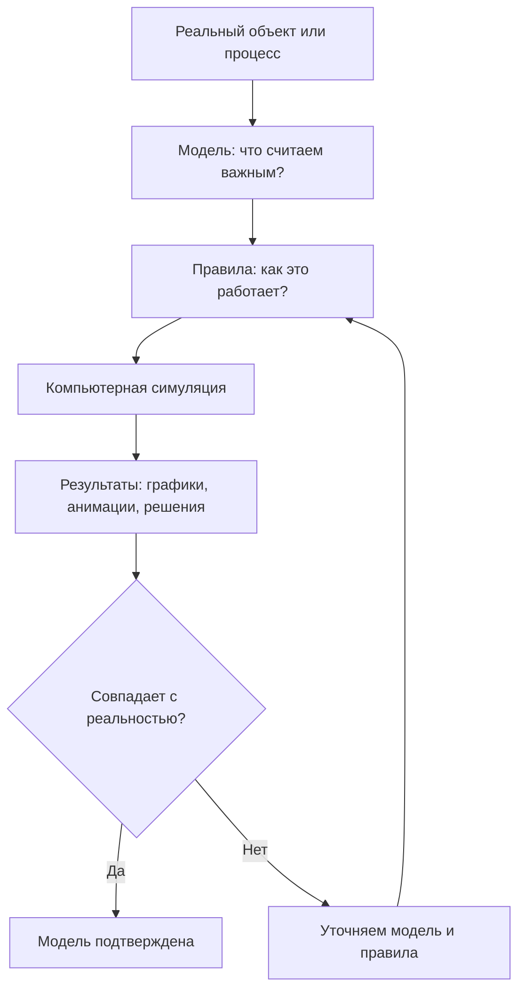

import ExternalPlayEmbed from '@site/src/components/ExternalPlayEmbed';

# Симуляторы

  ОБЯЗАТЕЛЬНО
  ДЛЯ НОВИЧКОВ

Начальный уровень

  
Интерактив

  

  Демо ниже — нажимайте кнопки и смотрите, как это устроено. Ничего на компьютере не меняется.

  

<ExternalPlayEmbed example="spinoff/game-franchise-play" title="Игровая франшиза" minHeight={520} playProps={{ franchise: 'sims' }} />

---

## Симуляторы

**Симулятор** — программа, которая моделирует процесс или систему (полёт, город, ферму, эволюцию) на компьютере.

Слово *simulare* (лат.) — "подражать". Симулятор **воспроизводит** реальный или вымышленный объект, чтобы его **изучать**, **тренироваться** или развлекаться без риска и без полных затрат ресурсов в реальности.

---

#### Симуляция

Многие симуляторы выглядят как игры: Вы садитесь за штурвал самолёта, управляете фермой или наблюдаете за развитием цивилизации. Но у них есть важное отличие от обычных игр: **цель — реалистичность, а не только развлечение**.

В реальной жизни:
- Чтобы научиться летать, пилот тратит сотни часов в настоящем самолёте, а это дорого и опасно.
- Чтобы понять, как будет развиваться город при новой дороге, инженеры строят модели — иначе можно допустить ошибку, которая потом приведёт к пробкам или авариям.
- Чтобы изучить, как появилась жизнь на Земле, учёные не могут ждать миллиарды лет — им нужна модель.

И тогда на помощь приходит **симуляция** — компьютерная копия процесса, которая работает *быстро*, *безопасно* и *повторяемо*. Можно запустить её десять раз, изменить одно условие — и сразу увидеть, как это повлияет на результат.

---

#### Как вообще работает симуляция?

Любая симуляция строится на трёх китах:

1. **Модель** — это *описание* того, что мы хотим сымитировать. Например:  
   — самолёт — вес, форма крыльев, мощность двигателей, аэродинамика;  
   — экосистема — сколько травы растёт, сколько зайцев её едят, сколько волков охотится на зайцев;  
   — город — сколько машин ездит по улицам, где люди работают, как они ходят в магазин.

2. **Правила** — это *законы*, по которым модель живёт. Они часто выражаются формулами (например, закон всемирного тяготения) или алгоритмами ("если заяц голоден и рядом есть трава — он ест"). В программе такие правила записываются как код.

3. **Время** — симуляция всегда *разворачивается во времени*. Но компьютер может ускорять его (1 секунда = 1 день), замедлять (1 секунда = 1 миллисекунда полёта) или даже останавливать — чтобы изучить, что происходит "под капотом".

Вот как это выглядит в упрощённой схеме:

Эта схема показывает: симуляция — это **цикл уточнения**. Чем лучше модель и точнее правила, тем ближе результат к реальности. И наоборот — если симулятор ведёт себя странно, это сигнал: *"Проверьте исходные данные!"*

---

#### А что, если симулировать… вообще всё?

Теоретически — да, можно. Но на практике приходится *упрощать*. Например:
- В авиасимуляторе не рисуют каждую молекулу воздуха — используют усреднённые законы аэродинамики.
- В симуляторе эволюции не моделируют каждый ген в ДНК — используют "условные признаки" — размер, скорость, защита.
- В симуляторе города не следят за каждым жителем 24/7 — только за статистикой: сколько едут на работу, сколько — в школу.

Это называется **абстрагированием** — когда мы оставляем только самое важное и отбрасываем "шум". Именно в этом и состоит искусство создания симуляторов: найти баланс между *реализмом* и *скоростью работы*.

---

### Спортивные симуляторы — не просто мяч и голы

Когда Вы включаете, например, *FIFA*, *NBA 2K* или *Rocket League*, кажется: "Ну вот, футбол/баскетбол/футбол на машинах — просто жмите кнопки!"  
Но на самом деле перед Вами — **математическая модель спорта**.

Возьмём футбол. В реальной игре происходит одновременно *много* процессов:
- Игроки бегают, меняя направление и скорость.
- Мяч катится, отскакивает, крутится в воздухе (эффект Магнуса!).
- Тренер даёт указания — "прессинг", "контратака", "удерживать мяч".
- Погода влияет: дождь — мяч скользит, ветер — меняет траекторию удара.

Симулятор пытается повторить всё это — **по правилам**. Например:

- У каждого виртуального футболиста есть *характеристики* — скорость, выносливость, точность паса, реакция. Это — числа в памяти компьютера.
- Когда Вы нажимаете кнопку "пас", программа:
  1. Смотрит, куда Вы направили джойстик (угол),
  2. Берёт силу нажатия (насколько долго держал кнопку),
  3. Добавляет "шум" — случайную погрешность (чтобы не было идеального паса, как в реальной жизни),
  4. Проверяет: не бежит ли противник рядом? Если да — шанс перехвата растёт.
  5. Рассчитывает траекторию мяча с учётом физики — сила удара, угол, вращение, трение о траву.

Всё это происходит **за миллисекунды**, но за этим стоит *физический движок* (например, Havok или PhysX) и *искусственный интеллект* (ИИ), управляющий поведением соперников.

> **Интересный факт** — В профессиональных спортивных симуляторах (именно тренажёрах для спортсменов) используются **реальные данные** — видеозаписи матчей, GPS‑трекеры с тренировок, биометрия. Такой симулятор помогает, например, квотербеку в американском футболе "проиграть" сотни комбинаций виртуально, прежде чем выйти на поле.

---

#### Почему это важно учить?

Потому что спортивные симуляторы — это прекрасный пример **системного мышления**:
- Вы учитесь видеть *цепочки*: "если я сдвину защитника влево, у нападающего появится окно для паса".
- Вы тренируете *прогнозирование* — что будет, если противник сыграет не так, как ожидалось?
- Вы видите, как *маленькое изменение* (на 5% повысить точность паса) может изменить весь исход матча.

---

### Симуляторы эволюции — от клетки — к звёздам

Один из самых вдохновляющих симуляторов — **Spore** (2008, Maxis/EA). Он начинается с одной клетки в океане и заканчивается — межзвёздной империей. Звучит как фантастика? Но каждая стадия — это *отдельная модель эволюции*.

---

#### Как это работает "под капотом"?

1. **Стадия "Клетка"**  
   Вы — одноклеточное существо. Вы можете есть другие клетки, избегать хищников, мутировать.  
   *Модель*: популяционная динамика.  
   — Каждая клетка имеет ДНК‑код (на самом деле — условный набор "частей":

   - жвал;
   - глаз;
   - двигатель).
   — Если Вы съедаете клетку — получаете "очков эволюции" → можете добавить новую часть → меняется поведение (быстрее плаваете? лучше видите?).  
   — Если Вы умираете — Ваш "геном" исчезает.  
   → Это упрощённая модель **естественного отбора**: выживают наиболее приспособленные.

2. **Стадия "Существо"**  
   Теперь Вы — существо на суше. Вы общаетесь с другими: дружба или бой.  
   *Модель*: поведенческая экология.  
   — У каждого вида есть "поведенческий профиль":

   - агрессивность;
   - социальность;
   - любопытство.
   — Вы можете эволюционировать *мозг* — новые способности — танцы, пение, боевые приёмы.  
   — Союзы с другими видами дают бонусы (защита, еда).  
   → Это уже **теория игр** и **социальная динамика**.

3. **Стадия "Племя", "Цивилизация", "Космос"**  
   Масштаб растёт: от стаи — к городу — к планете — к галактике.  
   *Модель*:  
   — Экономика (ресурсы, производство),  
   — Дипломатия (альянсы, войны),  
   — Астрофизика (планеВы имеют тип:

   - ледяная;
   - пустынная;
   - водная — и это влияет;
   - кого можно там заселить).

Важно — Spore — *не научная модель* (биологи укажут на упрощения), но он делает **главное** — показывает, что сложные системы (жизнь, общество, космос) строятся из *простых правил*, которые повторяются на разных уровнях.

> 🌱 **Мысленный эксперимент для читателя**:  
> Представьте, что Вы создаёте симулятор "Эволюция растений". Какие *три главных правила* Вы бы заложили?  
> — Свет?  
> — Вода?  
> — Борьба за место?  
> Попробуйте записать их как "если… то…" — это уже начало программирования симулятора!

---

### Авиасимуляторы — небо в Ваших руках

Если спортивные симуляторы — это про людей, то авиасимуляторы — про **физику и точность**.

Самый известный — **Microsoft Flight Simulator** (2020). Он настолько реалистичен, что:
- Использует реальные спутниковые карВы Земли (вплоть до отдельных деревьев),
- Моделирует погоду в реальном времени (если в Париже идёт дождь — он будет и в симуляторе),
- Воспроизводит работу сотен систем самолёта: от гидравлики до радиосвязи.

---

#### Как компьютер "летает"?

Самолёт в симуляторе — это **математическая модель в 6 степенях свободы**:
1. Движение вперёд-назад (продольное),
2. Влево-вправо (боковое),
3. Вверх-вниз (вертикальное),
4. Крен (наклон крыльев),
5. Тангаж (нос вверх/вниз),
6. Рыскание (поворот вокруг вертикальной оси).

На каждую из этих осей действуют силы:
- Подъёмная сила крыла (зависит от скорости, угла атаки, плотности воздуха),
- Сла тяги двигателей,
- Сла сопротивления,
- Сла тяжести.

Всё это описывается **дифференциальными уравнениями** — но Вам не нужно их решать вручную: компьютер делает это *миллионы раз в секунду*, обновляя положение самолёта.

А ещё — **человеческий фактор**:
- Пилот может ошибиться — перегрузить двигатель, забыть убрать шасси, неправильно рассчитать заход на посадку.
- Симулятор не ругает — он *показывает последствия*. И это главная ценность: учиться на ошибках *без риска*.

> ✈️ **Знаете ли Вы?**  
> В настоящих лётных училищах используют **тренажёры-симуляторы**, сертифицированные ICAO (Международной организацией гражданской авиации). Чтобы получить лицензию пилота, нужно отлетать *сотни часов* именно в симуляторе — потому что это безопаснее и дешевле, чем в реальном Boeing.

---

### Другие симуляторы — от фермы до Вселенной

Симуляторы — это не только машины и самолёты. Это целый зоопарк моделей, где каждая имитирует *тип системного поведения*. Ниже — самые яркие примеры и — главное — *что в них "симулируется на самом деле"*.

---

#### Симуляторы жизни и общества

**Примеры** — *The Sims*, *Animal Crossing*, *RimWorld*.

На первый взгляд — "кукольный домик" — поставь диван, покорми персонажа, пускай дружит. Но под обёрткой — **модель принятия решений и социальной динамики**.

В *The Sims* у каждого персонажа есть:
- **Нужды** (голод, сон, гигиена, социум, развлечение, комфорт) — это *переменные состояния*, которые со временем уменьшаются.
- **ЧерВы характера** (аккуратный, ленивый, дружелюбный) — влияют на *вес решений*: ленивый сим реже будет мыть посуду, даже если гигиена низкая.
- **Эмоции** — возникают из комбинаций событий ("подарок → радость", "спор → злость"), и сами влияют на поведение (злой сим может сломать телевизор).

Всё это — реализация **архитектуры BDI** (*Belief-Desire-Intention* — "Убеждения–Желания–Намерения"), которую используют и в серьёзных системах ИИ.  
→ Симулятор жизни — это тренировка понимания *мотивации* и *последствий*.

В *RimWorld* добавляется ещё и **генеративное повествование** — события (торговцы, набеги, болезни) вырастают из *взаимодействия систем*:  
- Если колония слабо защищена → шанс нападения растёт,  
- Если много еды → привлекает торговцев,  
- Если персонаж одинок → повышается риск депресси.  
Это — модель *сложной адаптивной системы*.

---

#### Симуляторы строительства и управления 

**Примеры** — *Cities — Skylines*, *Factorio*, *Oxygen Not Included*.

Здесь симуляция фокусируется на **потоках** — и на том, как системы *стабилизируются* или *ломаются*, если потоки нарушаются.

В *Cities: Skylines*:
- **Трафик** — не просто машины, едущие по дорогам. Это *поток частиц* с правилами:
  - Каждый "житель" ищет кратчайший путь от дома → работы → магазина → дома.
  - Если дорога загружена — маршрут пересчитывается.
  - Если перекрёсток неэффективен — образуется пробка → растёт время в пути → падает "счастье" → люди уезжают.
- **Коммунальные сети** (вода, электричество, канализация) — работают по *законам сохранения*:  
  сколько воды втекло в район — столько должно и вытечь (или накопиться в резервуарах). Нарушение → затопление или засуха.

В *Factorio*:
- Вы строите фабрику, где руда → плавится → собирается в детали → собираются в конвейеры → летят в ракету.  
- Каждый шаг — *производственная цепочка* с ограничениями:  
  — скорость добычи,  
  — пропускная способность конвейера,  
  — энергопотребление.  
- Задача — **балансировка потоков данных и ресурсов**, как в реальном производстве.

→ Это обучение *системному инжинирингу*: видеть *взаимосвязи*.

---

#### Симуляторы науки и природы 

**Примеры** — *Universe Sandbox²*, *Kerbal Space Program*, *Climate Interactive simulators*.

Здесь симуляция — *буквально наука*. Возьмём *Kerbal Space Program* (KSP).

В нём:
- Все объекВы (планеты, спутники, ракеты) подчиняются **закону всемирного тяготения Ньютона**.  Компьютер считает эту силу *между каждой парой тел* каждый кадр.
- Ракета — не "жмите вверх и лети". У неё есть:
  - **Импульс удельный (Isp)** — эффективность двигателя,
  - **Центр масс и центр давления** — если они не совпадают → ракета кувыркается,
  - **Дельта-v (Δv)** — "топливный бюджет" для манёвров (рассчитывается по формуле Циолковского).

Удивительно — многие игроки KSP *впервые в жизни* понимают, почему спутники летают по эллипсам, зачем нужны гравитационные манёвры — и даже поступают в аэрокосмические вузы. В NASA признали: KSP — отличный инструмент для популяризации орбитальной механики*.

*Universe Sandbox* идёт дальше — Вы можете "столкнуть Землю с Марсом" и увидеть, как изменится орбита, климат, приливы — всё на основе физических уравнений.

→ Это не фантастика. Это *вычислительная астрофизика в реальном времени*.

---

#### Симуляторы профессий и экстремальных условий 

**Примеры** — *Surgeon Simulator*, *Euro Truck Simulator*, *Farming Simulator*, *Subnautica* (частично).

Да, *Surgeon Simulator* с его дребезжанием и "рукой-осьминогом" кажется пародией. Но за ним — серьёзная идея: **симуляция моторики и точности под стрессом**.

В настоящих медицинских симуляторах (например, *LapSim* для лапароскопи):
- Хирург управляет джойстиками, имитирующими инструменты,
- Система оценивает:  
  — дрожание руки,  
  — время выполнения операции,  
  — сколько раз инструмент задел здоровую ткань.
- Обратная связь — *анализ ошибок*.

*Euro Truck Simulator* — тоже не просто "ехать по Европе". Он моделирует:
- **Физику груза**: при резком повороте фура может опрокинуться (центр тяжести!),
- **Экономику** — стоимость топлива, штрафы за превышение, износ машины,
- **Логистику** — планирование маршрута с учётом веса, габаритов, ограничений по тоннелям.

→ Это тренировка **ответственности и планирования в реалистичных условиях**.

---

### Где заканчивается реалистичность — и начинается вымысел?

Важный вопрос: *все ли симуляторы стремятся к точности?*

**Нет.** Есть два полюса:

| Тип | Цель | Примеры | Упрощения |
|-----|------|---------|-----------|
| **Тренировочные симуляторы** | Максимальная точность для подготовки | Лётные тренажёры, медицинские симуляторы, военные тактические комплексы | Минимальные — только ради производительности |
| **Развлекательные симуляторы** | Баланс реализма и удовольствия | *Farming Simulator*, *Stardew Valley*, *Goat Simulator* | Много: физика "дружелюбная", ошибки прощаются, системы упрощены |

Например, в *Farming Simulator*:
- Комбайн не ломается от перегрузки каждые 10 минут (как в реальности),
- Урожай растёт за 1–2 дня, а не за сезон,
- Погода не убивает посевы — только слегка снижает урожайность.

И это *правильно*: если бы всё было как в жизни, играть было бы мучительно скучно.  
Симулятор — это **отражение в зеркале с нужным фокусом**. Зеркало может быть плоским (точным), выпуклым (преувеличивающим детали) или вогнутым (скрывающим сложность) — в зависимости от задачи.

---
