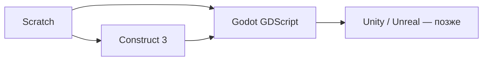

import ExternalCodeEmbed from '@site/src/components/ExternalCodeEmbed';

# Godot и Construct 3

  ОБЯЗАТЕЛЬНО
  ДЛЯ НОВИЧКОВ

Начальный уровень

  
Уже знаете Scratch?

  

  В <a href="/encyclopedia/9-spinoff/9-11-dlya-detey/5-kod/3">Scratch</a> Вы собирали блоки. <strong>Construct 3</strong> похож на "блоки для игр". <strong>Godot</strong> — следующий шаг, когда хочется писать код построчно (язык похож на Python).

  

Путеводитель: [Инструменты и среды](/encyclopedia/1-basics/1-035-bazovaya-informatika/9). Как делают игры в студи: [Как разрабатывают игры](./26.md). Профессиональный обзор движков: [Виды движков](/encyclopedia/9-spinoff/9-04-razrabotka-igr/113.md).

---

## Сравнение

| | **Construct 3** | **Godot** |
|---|-----------------|-----------|
| Код | В основном **события** (таблица "если — то") | **GDScript**, C#, C++ |
| 2D / 3D | Сильный **2D** | 2D и 3D |
| Цена | Подписка (есть ограниченный бесплатный tier) | **Бесплатно**, open source |
| Где работает | Браузер + экспорт | Установка на ПК |
| Первый проект | Платформер за вечер | Тот же, чуть дольше настройки |

---

## Construct 3

**Construct** — движок, где логика описывается **событиями**:

> *При нажатии пробела → герой прыгает*  
> *При столкновении с монеткой → счёт +1*

**Старт:**

1. Зарегистрируйтесь на [construct.net](https://www.construct.net/).
2. "New project" → шаблон **Platformer** или пустой 2D.
3. Добавьте спрайт героя, плитки пола, объект "монетка".
4. В листе **Event Sheet** создайте условие `Keyboard → On Space pressed` → действие `Platform behavior → Simulate jump`.
5. Нажмите **Play** — игра в окне браузера.

**Экспорт:** HTML5 (сайт), Windows, Android (зависит от тарифа). Для школьной выставки часто хватает WebGL-верси по ссылке.

**Когда выбирать:** быстрый результат без синтаксиса, первый платформер, учебный проект "за неделю".

---

## Godot

**Godot** — бесплатный движок с редактором сцен. Язык **GDScript** читается почти как Python:

<ExternalCodeEmbed example="text/sp-9-9-11-dlya-detey-2-video-games-27-001" title="Godot" minHeight={354} />

**Старт:**

1. Скачайте с [godotengine.org](https://godotengine.org/download).
2. "New project" → 2D.
3. Узел `CharacterBody2D` + дочерний `Sprite2D` + `CollisionShape2D`.
4. Прикрепите скрипт движения (шаблон **2D Platformer** в документации Godot).
5. F5 — запуск сцены.

**Когда выбирать:** готовы к коду, нужен экспорт без подписки, планируете 3D или open-source портфолио.

Подробнее для разработчиков: [Godot — первая 2D-игра](/encyclopedia/9-spinoff/9-04-razrabotka-igr/207), [виды движков](/encyclopedia/9-spinoff/9-04-razrabotka-igr/113), [инструменты /games](/games/9-031-gametools/1).

---

## Маршрут обучения

1. [Scratch](/encyclopedia/9-spinoff/9-11-dlya-detey/5-kod/3) — логика событий.  
2. Construct **или** Godot — первая "настоящая" игра.  
3. [Blender](/encyclopedia/9-spinoff/9-08-kompyuternaya-grafika/131.md) — свои модели для Godot.

---

## См. также

- [Как разрабатывают игры](./26.md)
- [Pygame в Python](/encyclopedia/5-languages/5-02-python/312.md) — игры на Python
- [Pygame — мини-игры](/lab/Примеры/1132) — готовый код змейки, Pong и др. с разбором
- [Unity C# — скрипты для новичков](/lab/Примеры/1136) — WASD, прыжок, монетки, UI на C#
- [Инструменты и среды](/encyclopedia/1-basics/1-035-bazovaya-informatika/9)

---
