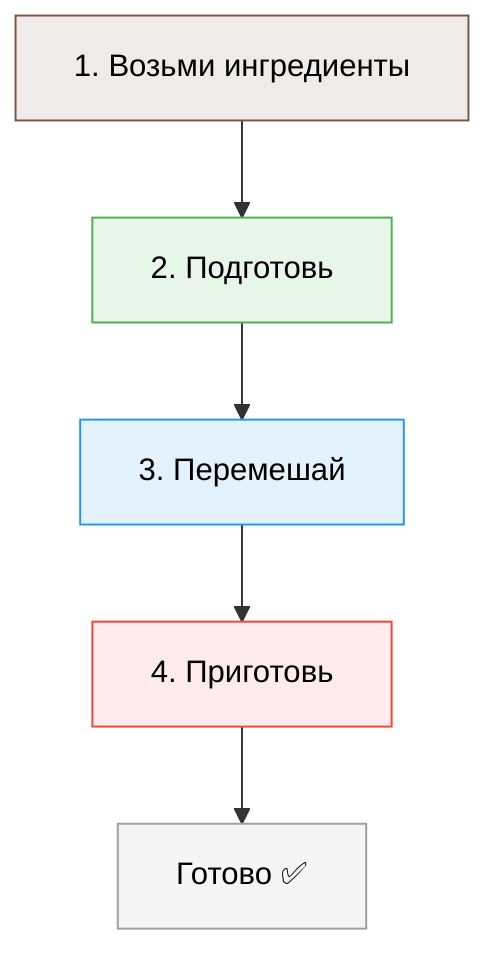
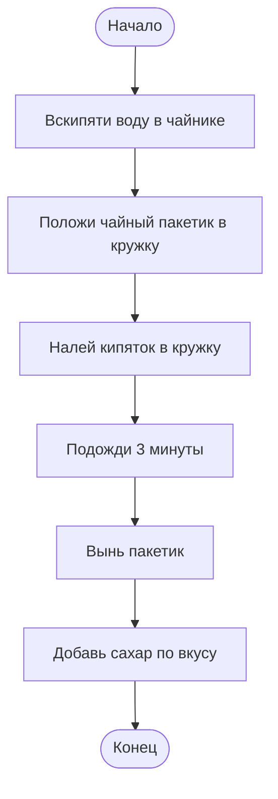
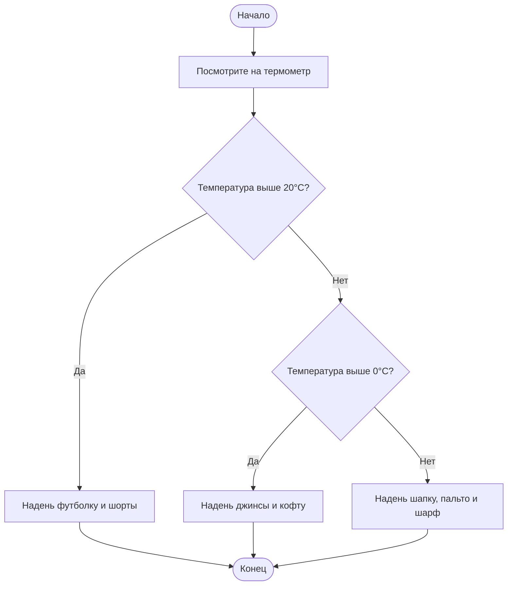
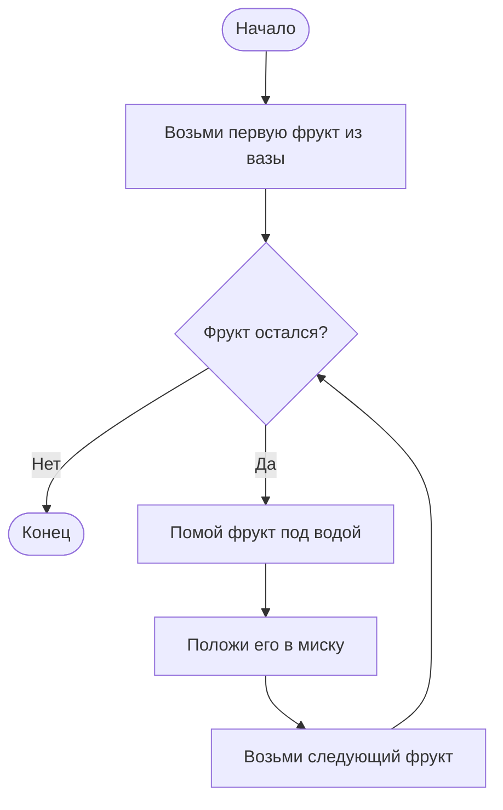
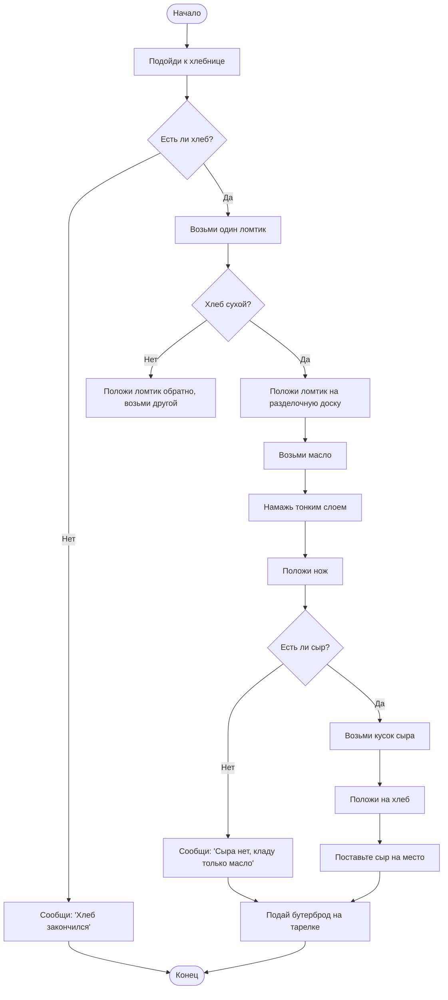

import ExternalPlayEmbed from '@site/src/components/ExternalPlayEmbed';


# Алгоритм

<div class="article-tags">
  <span class="tag tag-required">ОБЯЗАТЕЛЬНО</span>
  <span class="tag tag-beginner">ДЛЯ НОВИЧКОВ</span>
</div>

<span class="complexity-badge">Начальный уровень</span>

<div class="callout callout--tip">
  <div class="callout-title">Интерактив</div>

  <div class="callout-body">
  Демо ниже — нажимайте кнопки и смотрите, как это устроено. Ничего на компьютере не меняется.
</div>
  </div>


<ExternalPlayEmbed example="code-basics/block-builder" title="Конструктор блоков" minHeight={420} />

---

## Алгоритм

### Что такое алгоритм?

Вы хотите испечь блинчики. Вы открываете кулинарную книгу — и там не написано просто "испеки блинчики". Там есть *пошаговая инструкция*: 

``` 
1. Возьми яйцо, муку, молоко.  
2. Взбей их венчиком до однородной массы.  
3. Разогрей сковороду, смажь маслом.  
4. Налей немного теста, жарь до золотистой корочки.  
5. Переверни, жарь ещё 30 секунд.  

```

Это и есть **алгоритм** — чёткая последовательность действий, которая приводит к нужному результату.



Слово *алгоритм* звучит современно, но оно очень старое — ему больше тысячи лет! Оно происходит от имени средневекового персидского учёного **Аль-Хорезми** (полное имя — Мухаммад ибн Муса аль-Хорезми). Он жил в IX веке в городе Хорезм (на территори современного Узбекистана) и написал книги по арифметике и алгебре. В них он объяснял, *как* выполнять вычисления — как делить числа, как извлекать корень, как решать уравнения *по шагам*. Эти правила называли *аль-Хорезми*, а позже, в Европе, стали произносить как *алгоритм*.

Так что алгоритм — это не изобретение компьютеров. Люди использовали их всегда:  
- архитекторы — чтобы построить пирамиду,  
- моряки — чтобы проложить курс по звёздам,  
- врачи — чтобы поставить диагноз по симптомам.

Компьютеры просто сделали алгоритмы особенно заметными — потому что *всё*, что делает компьютер, выполняется по алгоритмам. Без алгоритма компьютер — как кухня без рецептов — есть продукты, но неизвестно, что и как из них приготовить.

---

### Главные свойства алгоритма

Чтобы считаться настоящим алгоритмом, последовательность действий должны обладать пятью важными свойствами:

1. **Дискретность** — действия идут *по шагам*. Нельзя "немного взбить и одновременно налить на сковороду". Сначала — шаг 1, потом — шаг 2, и так далее. Каждый шаг отделён от другого, как ступеньки лестницы.

2. **Понятность** — каждый шаг должен быть ясен *исполнителю*. Если Вы объясняете ребёнку 8 лет, как завязать шнурки, Вы не скажете: "Сформируйте петлю и выполните операцию транспозиции". Вы скажете: "Заведи один конец под другой и потяни". *Исполнитель* — это тот, кто выполняет алгоритм — человек, робот, компьютер-программа.

3. **Определённость (детерминированность)** — на каждом шаге должно быть *однозначно понятно*, что делать дальше. Нельзя писать: "Если хочется — добавь ваниль". В алгоритме: "Если в рецепте указано "ваниль" — добавь 1 ч. л.; иначе — пропусти этот шаг".

4. **Результативность (конечность)** — алгоритм *всегда* должны завершиться за конечное число шагов и дать результат. Он не может "крутиться вечно". Даже если результат — "не удалось", это тоже результат (например, "блин пригорел — рецепт не сработал при таких условиях").

5. **Массовость** — хороший алгоритм работает с *целым классом похожих задач*. Рецепт блинов должны получиться не только с молоком от коровы Ася, но и от коровы Бурёнка, и даже с соевым молоком (если внести поправку в шаг 2). Алгоритм сложения работает и для 2 + 3, и для 127 + 89.

> **Интересный факт** — первый в мире алгоритм, предназначенный для исполнения *машиной*, придумал **Чарльз Бэббидж** в XIX веке для своей Аналитической машины. А его сотрудница **Ада Лавлейс** (дочь поэта Байрона) написала программу для вычисления чисел Бернулли — и по сути стала первым в мире программистом. Она поняла, что машина может следовать *сложным правилам*, как человек следует рецепту.

---

## Простые, линейные и нелинейные алгоритмы

Все алгоритмы можно разделить на три основные группы — по тому, *как устроена последовательность шагов*.

---

### Простые алгоритмы (интуитивные)

Это те, которые мы выполняем каждый день, даже не задумываясь, что это — алгоритмы. Например:
- **Как умыться утром**:
```  
  1. Подойди к раковине.  
  2. Откройте кран с водой.  
  3. Смочи лицо.  
  4. Нанеси пенку.  
  5. Потри щёки, лоб, подбородок.  
  6. Смой пенку.  
  7. Вытри лицо полотенцем.  
  8. Закройте кран.
```

Здесь нет ветвлений, нет повторений — просто *один шаг за другим*. Такие алгоритмы называются **линейными** (о них — чуть ниже). Но "простой" — не значит "неправильный". Простота — признак хорошей продуманности.

---

### Линейные алгоритмы

Это формальное название для последовательностей без развилок и циклов. Каждый шаг выполняется *ровно один раз*, строго в заданном порядке.

Пример — **алгоритм нахождения среднего арифметического трёх чисел**:
```
1. Возьми первое число — `a`.  
2. Возьми второе число — `b`.  
3. Возьми третье число — `c`.  
4. Сложите их: `s = a + b + c`.  
5. Раздели сумму на 3: `result = s / 3`.  
6. Выведи `result`.
```

Неважно, какие числа — 1, 2, 3 или 100, 200, 300 — шаги одни и те же, порядок не меняется.

> **Заметка для старших школьников**: в программировании линейные алгоритмы — основа. Даже сложные программы в какой-то момент "раскручиваются" в линейную последовательность машинных команд. Но чтобы управлять *порядком* этих команд, нужны более сложные конструкции — и тогда появляются нелинейные алгоритмы.

---

### Нелинейные алгоритмы

Это — когда путь "не по прямой". Здесь возможны:
- **Ветвления (развилки)** — "если… то… иначе…"  
- **Циклы (повторения)** — "делайте это снова и снова, пока не выполнится условие"

Пример с ветвлением — **алгоритм надевания обуви перед выходом на улицу**:
```
1. Посмотрите в окно.  
2. **Если** на улице сухо → надень кроссовки.  
3. **Иначе, если** идёт дождь → надень резиновые сапоги.  
4. **Иначе** (например, снег) → надень зимние ботинки.  
5. Завяжи шнурки.
```

Здесь шаги 2–4 — ветвление. Выполняется *только один* из вариантов, в зависимости от условия.

Пример с циклом — **алгоритм мытья посуды**:
```
1. Возьми первую грязную тарелку.  
2. Помой её.  
3. Поставьте в сушилку.  
4. Повторяй шаги 1–3, пока не закончатся грязные тарелки.
```

Цикл позволяет *не писать по шагу на каждую тарелку* — иначе для 10 тарелок понадобилось бы 30 шагов! Цикл сокращает запись и делает алгоритм универсальным: он сработает и для 2 тарелок, и для 20.

> 🔍 **Как это связано с компьютерами?**  
> В языках программирования ветвления реализуются через `if… else`, циклы — через `for`, `while`. Но *логика* остаётся той же, что и в жизни. Именно поэтому обучение алгоритмам начинается с понимания последовательностей, условий и повторений в привычных действиях.

---

## Алгоритмическое мышление

Алгоритмическое мышление — это способ организовывать мысли и действия так, чтобы решать задачи эффективно, без путаницы и ошибок.

Представьте, Вы объясняете роботу-помощнику, как сделать бутерброд с маслом и сыром. Робот очень точный, но ничего не знает сам — он умеет только *выполнять команды буквально*. Что будет, если Вы скажете: 
 
> "Возьмите хлеб, положите сыр, намажь маслом"?

Робот:
```
1. Возьмёт кусок хлеба.  
2. Положит на него кусок сыра.  
3. Намажет маслом сверху сыра — и масло не пристанет, сыр будет скользить, бутерброд развалится.
```

Правильный алгоритм:
```
1. Возьми кусок хлеба.  
2. **Если** хлеб сухой → намажь его маслом.  
3. Положи сверху ломтик сыра.  
4. **Если** хотите — накрой вторым куском хлеба (сэндвич).  
5. Подай на тарелке.
```

Видите разницу? Второй вариант учитывает:
- **порядок** (масло — *до* сыра),  
- **условия** ("если сухой", "если хотите"),  
- **чёткое завершение** (подать на тарелке — сигнал, что готово).

Это и есть алгоритмическое мышление:  
- разбивать задачу на шаги,  
- прогнозировать, что может пойти не так,  
- проверять, все ли случаи учтены,  
- искать способ сделать короче, но не менее надёжно.

Оно помогает:
- писать сочинения по плану,  
- собирать чемодан в поездку,  
- готовиться к экзаменам,  
- даже договариваться с друзьями: "Если в 15:00 будет солнечно — идём в парк; иначе — в кино".

> **Вывод**: алгоритмы — это не про компьютеры. Это про *ясность, порядок и ответственность за результат*. А компьютеры — просто самые послушные исполнители, которые никогда не устают… но и никогда не догадаются сделать "как лучше", если Вы не написали это в алгоритме.

---

### Как увидеть алгоритм? Блок-схемы

Вы рисуете *карту* для путешествия. На ней — дороги, развилки, "повторите этот участок три раза", "если мост закрыт — езжай в объезд". Такая карта помогает не заблудиться.

**Блок-схема** — это как раз *карта алгоритма*. Она показывает:
- с какого шага начать,  
- в каком порядке идти,  
- где делать выбор,  
- где возвращаться и повторять.

Для построения блок-схем используются **специальные фигуры**, каждая из которых означает свой тип действия. Вот основные:

| Фигура | Название | Что означает |
|--------|----------|--------------|
| 🟦 Овал | **Начало / Конец** | Точка входа и выхода из алгоритма |
| 🟨 Прямоугольник | **Действие** | Конкретный шаг: "взять хлеб", "сложить числа", "включить свет" |
| 🟩 Ромб | **Условие (решение)** | Вопрос, на который можно ответить "да" или "нет": "идёт дождь?", "число чётное?" |
| ⬛ Стрелка | **Переход** | Направление выполнения — от одного блока к другому |

Блок-схемы универсальны: их понимают и инженеры в Япони, и школьники в Бразили — потому что логика одинакова во всём мире.

---

### Линейный алгоритм — "Как приготовить чай"

Самый простой — без развилок и повторов. Каждое действие следует за предыдущим, как бусины на нитке.



> 🔎 **Обратите внимание**:  
> — Все блоки — прямоугольники (действия), кроме начала и конца.  
> — Нет ромбов — значит, *нет выбора*. Всё происходит одинаково, в любом случае.  
> — Если Вы забудете, например, шаг "выньте пакетик", чай получится горьким — алгоритм *некорректен*. Это показывает, насколько важна **полнота** описания.

---

### Алгоритм с ветвлением — "Как одеться по погоде"

Здесь путь *раздваивается*. Выбор зависит от условия — например, температуры или осадков.



> **Как читать такую схему**:  
> Начинаем сверху. Доходим до ромба — задаём вопрос. В зависимости от ответа — идём по одной из стрелок. Важно, что *все пути* в итоге ведут к концу. Если бы, например, после "шапку, пальто" не было стрелки к концу — алгоритм завис бы.

---

### Алгоритм с циклом — "Как помыть все фрукВы в вазе"

Цикл позволяет повторять шаги, не переписывая их каждый раз.



> 🔄 **Как работает цикл**:  
> Мы заходим в "петлю": проверяем условие → если "да" — делаем действия → возвращаемся к проверке. Так продолжается, пока условие не станет "нет".  
> Цикл здесь — *с постусловием*: сначала проверка, потом действие. Существуют и другие виды (например, цикл "сделайте 5 раз"), но логика та же — *повтор по правилу*.

---

## Рецепт бутерброда для робота

Вернёмся к нашему роботу. Допустим, его зовут **Бип**, он умеет:
- брать предметы руками,  
- класть предметы на поверхность,  
- намазывать мягкое вещество (масло, джем) на плоский предмет (хлеб),  
- резать ножом (осторожно!),  
- проверять: "сухой ли хлеб?", "есть ли сыр на столе?".

Вот **плохой** алгоритм:
```
> 1. Возьми хлеб.  
> 2. Намажь маслом.  
> 3. Положи сыр.
```

Что может пойти не так?
- Хлеба нет — робот "зависнет", пытаясь взять то, чего нет.  
- Сыра нет — робот положит "ничего", и бутерброд будет без сыра.  
- Хлеб уже масляный — робот намажет ещё раз, и будет "масляный блин".  
- Робот возьмёт *весь* батон, а не один ломтик.

**Хороший алгоритм** учитывает *возможные проблемы* и даёт чёткие указания:



Что изменилось?
- Появились **проверки на наличие** (хлеб, сыр).  
- Есть **действие при ошибке** (сообщить, положить обратно).  
- Описаны **мелкие, но важные шаги**: "положите нож", "поставь сыр на место" — чтобы кухня осталась в порядке.  
- Робот не делает предположений — только то, что *явно указано*.

Это и есть **алгоритмическое мышление**:
1. **Декомпозиция** — разбиваем большую задачу ("сделайте бутерброд") на мелкие шаги.  
2. **Анализ условий** — что может быть не так? Что нужно проверить?  
3. **Обработка исключений** — что делать, если "сыра нет" или "хлеб мокрый"?  
4. **Оптимизация** — можно ли убрать лишнее? (Например, "положите нож" и "поставь сыр" можно объединить в "убери всё на место" — но для робота лучше оставить отдельно, чтобы не забыл.)

> 🧠 **Полезная привычка**:  
> Перед тем как что-то делать (собрать рюкзак, написать сообщение, приготовить завтрак), задайте себе три вопроса:  
> 1. *С чего начинаю?*  
> 2. *Где могут быть развилки?*  
> 3. *Как пойму, что закончил?*  
> Это тренирует алгоритмическое мышление — и делает жизнь спокойнее.

---

## Типовые структуры алгоритмов

Любой, даже самый сложный алгоритм (например, поиск пути в Google Maps или распознавание лица на фото) строится из трёх базовых конструкций:

| Название | Что делает | Пример из жизни | Пример из программирования |
|---------|-------------|------------------|----------------------------|
| **Последовательность** | Шаги выполняются один за другим | Заварить чай → налить в кружку → добавить лимон | `a = 5; b = 3; s = a + b; print(s)` |
| **Ветвление** | Выбор пути в зависимости от условия | Если идёт дождь — бери зонт; иначе — не берите | `if temp > 20: wear("футболку") else: wear("кофту")` |
| **Цикл** | Повторение действий, пока выполняется условие | Мыть тарелки, пока они есть в раковине | `while dishes_left > 0: wash_one_dish()` |

> **Фундаментальный факт**:  
> В 1966 году учёные доказали теорему: *любой вычислимый алгоритм можно реализовать, используя только эти три структуры*. Другими словами — хватит последовательности, ветвления и цикла, чтобы написать *любую* программу в мире. (Современные языки добавляют удобства — функции, классы — но "под капотом" всё сводится к этим трём.)

---
