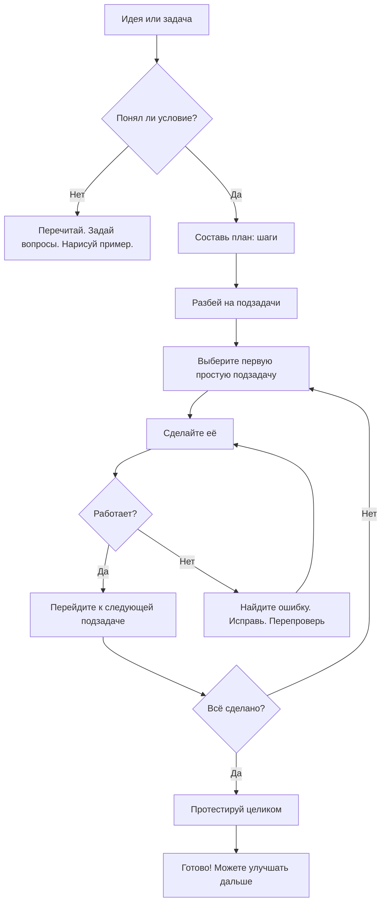

import ExternalPlayEmbed from '@site/src/components/ExternalPlayEmbed';


# Задачи

<div class="article-tags">
  <span class="tag tag-required">ОБЯЗАТЕЛЬНО</span>
  <span class="tag tag-beginner">ДЛЯ НОВИЧКОВ</span>
</div>

<span class="complexity-badge">Начальный уровень</span>

<div class="callout callout--tip">
  <div class="callout-title">Интерактив</div>

  <div class="callout-body">
  Демо ниже — нажимайте кнопки и смотрите, как это устроено. Ничего на компьютере не меняется.
</div>
  </div>


<ExternalPlayEmbed example="code-basics/block-builder" title="Конструктор блоков" minHeight={420} />

---

## Задача

### Что такое задача?

**Алгоритм** — пошаговая инструкция с однозначными действиями. Как в инструкции к набору деталей — каждый шаг описан явно, порядок важен, результат предсказуем при тех же входных данных.  

**Вот это — задача.**  
Точнее, *вся сборка корабля* — это одна большая задача. А каждый шаг из инструкции — *подзадача*, маленькая часть большой цели.

В жизни задачи встречаются повсюду:  
— "Нарисовать открытку к 8 Марта"  
— "Написать сочинение про лето"  
— "Научиться кататься на велосипеде без поддержки"  
— "Разработать игру, где кот прыгает по облакам"  

В программировании и IT задачи особенно важны, потому что компьютер — это очень умная, но очень буквальная машина. Он делает *только то*, что ему чётко сказали. Если Вы хотите, чтобы программа сложила два числа и вывела результат, Вы должны сформулировать эту цель *как задачу*, а потом — объяснить, *как именно* её решать — какие шаги, в каком порядке, что проверять.
  
> **Задача — это чётко сформулированная цель + понимание того, что нужно сделать, чтобы её достичь.**  
> Не "сделать что-то" — а *что именно*, *зачем*, и *каким образом*.

---

### Как решать задачи?

Решение любой задачи можно представить как путешествие от *"Я хочу…"* к *"Вот — готово!"*. Но без карВы и компаса легко заблудиться. Хорошая новость — у нас есть универсальный "компас". Его зовут **алгоритм решения задач**. Он подходит и для математики, и для рисования, и для написания кода.

```mermaid
flowchart TD
    %% Цвета по когнитивным функциям
    classDef understand fill:#2196F3,stroke:#0D47A1,color:black;
    classDef plan fill:#9C27B0,stroke:#4A148C,color:black;
    classDef execute fill:#4CAF50,stroke:#1B5E20,color:black;
    classDef verify fill:#FF9800,stroke:#E65100,color:black;
    classDef refine fill:#607D8B,stroke:#263238,color:black;

    A[1. Пойми задачу]:::understand
    B[2. Придумайте план]:::plan
    C[3. Выполни план]:::execute
    D[4. Проверьте результат]:::verify
    E[5. Доработай]:::refine

    A --> B
    B --> C
    C --> D
    D -->|✅ Успешно| F[Завершено]
    D -->|❌ Недостаточно| E
    E -->|Вернуться к| B
    E -->|Мелкая правка| C
    E -->|Полная переоценка| A

    %% Финальный узел
    classDef done fill:#4CAF50,stroke:#1B5E20,color:black;
    F:::done

    %% Визуальные акценты
    style A fill:#E3F2FD,stroke:#2196F3
    style B fill:#F3E5F5,stroke:#9C27B0
    style C fill:#E8F5E9,stroke:#4CAF50
    style D fill:#FFF3E0,stroke:#FF9800
    style E fill:#ECEFF1,stroke:#607D8B
    style F fill:#E8F5E9,stroke:#4CAF50

    %% Полезные примечания
    note1["🔍 Понимание — не единовременный акт: уточнения возможны на всех этапах"]:::understand
    note2["⚙️ План может быть иерархическим"]:::plan
    note3["✅ Проверка — не "запуск и посмотреть", а верификация по критериям приёмки"]:::verify

    style note1 fill:#E3F2FD,stroke:#64B5F6,stroke-dasharray: 5 5
    style note2 fill:#F3E5F5,stroke:#BA68C8,stroke-dasharray: 5 5
    style note3 fill:#FFF3E0,stroke:#FFB74D,stroke-dasharray: 5 5

    note1 -.-> A
    note2 -.-> B
    note3 -.-> D
```

Вот из чего он состоит:

---

#### Понять задачу

Не спешите бежать вперёд — сначала остановитесь и *перескажите условие своими словами*.  
Пример:  
- Задача — *"Напишите программу, которая спрашивает имя пользователя и выводит приветствие: “Привет, [имя]!”"*  
- Пересказ — *"Мне нужно, чтобы компьютер спросил — “Как Вас зовут?”, запомнил ответ и потом напечатал: “Привет, …!” — с подставленным именем".*

❓ Полезные вопросы:  
- Что *дано* (входные данные)?  
- Что *требуется* (результат)?  
- Есть ли ограничения? (например: "имя должно быть не длиннее 20 букв")  
- Как я пойму, что задача решена правильно?

---

#### Придумать план

Это как нарисовать маршрут на карте. Можно сначала мысленно, а лучше — на бумаге или в заметках.  
- Разбей задачу на **шаги**.  
- Определи, какие шаги *обязательные*, а какие — *опциональные*.  
- Подумайтете: какие шаги похожи на то, что Вы уже делал раньше?

Пример плана для приветственной программы:
```
1. Вывести на экран вопрос: *"Как Вас зовут?"*  
2. Дождаться, пока человек введёт имя и нажмёт Enter.  
3. Запомнить введённое имя в переменной (например, `name`).  
4. Вывести фразу *"Привет, " + name + "!"*.
```

---

#### Выполнить план

Теперь — в дело! Если программируете — пишете код. Если рисуете — берёте карандаш. Главное — *следовать плану*, но быть готовым *скорректировать* его, если что-то пошло не так.

---

#### Проверить результат

Не верьте на слово — проверь!  
- Запусти программу с разными именами — "Аня", "Максим", "Z" — работает?  
- А если ввести пустое имя? А если имя из 50 букв?  
- Сравни результат с ожидаемым: должны ли быть восклицательный знак? Пробел после запятой?

---

#### Доработать

Редко бывает, что всё получается с первого раза. Это нормально!  
Ошибка — не провал. Это *подсказка*: "Вот здесь что-то не так — посмотрите внимательнее".  
Исправь, перепроверьте — и снова запусти.

---

### Как планировать и придумывать задачи?

Иногда задачу приносит учитель, заказчик или друг. А иногда — *Вы сам* её придумываете. Это называется **инициативное проектирование**, и оно лежит в основе всякой творческой работы — от изобретений до игр.

---

#### Откуда берутся собственные задачи?

1. **Желание что-то улучшить**  
   — "А можно, чтобы моя игра сохраняла рекорд?"  
   — "А если в моём калькуляторе добавить кнопку “очистить”?"

2. **Наблюдение за неудобствами**  
   — "Каждый раз, когда я пишу расписание, трачу 10 минут. А если бы был шаблон?"

3. **Вдохновение от других проектов**  
   — "В Minecraft есть красный камень. А можно сделать “синий камень”, который будет…"

4. **Расширение уже сделанного**  
   — Сначала: "Программа, которая складывает два числа".  
   — Потом: "А можно — три числа? А дробные? А с проверкой ошибок?"

---

#### Как превратить идею в задачу?

Возьмём пример: *"Хочу, чтобы мой чат-бот шутил"*.

Это — мечта. Превратим её в задачу с помощью **уточнений**:

| Вопрос | Ответ |
|--------|-------|
| **Кто будет шутить?** | Чат-бот (программа). |
| **Что значит “шутить”?** | Выдавать случайную загадку или анекдот по команде. |
| **Как пользователь попросит шутку?** | Напишет `/joke` или нажмёт кнопку "Рассмеши меня!". |
| **Откуда бот возьмёт шутки?** | Из заранее подготовленного списка в коде (или из файла). |
| **А если шуток не осталось?** | Повторить первую или сказать: "У меня пока мало шуток — пришэто свои!". |

Теперь у нас есть **чёткая задача**:  
> *"Реализовать в чат-боте команду `/joke`, которая выводит случайную загадку из списка из 10 штук. Если список исчерпан — начинать сначала".*

Это уже можно *планировать*, *разбивать на шаги*, *программировать*.

---

### Декомпозиция задач

Вам дали задание:  
> *"Сделайте приложение “Дневник настроения”, где можно каждый день ставить смайлик (грустный/нейтральный/весёлый), писать комментарий и смотреть график настроения за неделю".*

Звучит сложно? Да. Но **сложность — это иллюзия, созданная большим объёмом сразу**. Если разобрать задачу на части — каждая часть станет лёгкой.

Этот приём называется **декомпозиция** — от лат. *de* (вниз) + *componere* (складывать). То есть: *разложить сложное на простые компоненты*.

---

#### Пример декомпозиции "Дневника настроения"

```
Дневник настроения
├── 1. Интерфейс (то, что видит пользователь)
│   ├── 1.1. Кнопки выбора настроения (3 смайлика)
│   ├── 1.2. Поле для ввода комментария
│   ├── 1.3. Кнопка "Сохранить"
│   └── 1.4. График (столбчатая диаграмма за 7 дней)
│
├── 2. Логика (то, что происходит “за кулисами”)
│   ├── 2.1. Сохранение данных: дата + смайлик + текст
│   ├── 2.2. Чтение данных за последние 7 дней
│   └── 2.3. Подсчёт: сколько грустных/весёлых дней
│
└── 3. Хранение (где лежат данные)
    └── 3.1. Временное — в памяти (пока браузер открыт)
    └── 3.2. Постоянное — в файле или базе данных (на будущее)
```

Теперь Вы можете начать с *любой* самой простой подзадачи: например, сначала сделать три кнопки и вывод смайлика на экран. Это — *мини‑победа*. А потом — добавить сохранение, потом — график.

> ✅ Правило:  
> **Если задача кажется слишком большой — задайте себе вопрос: “А что можно сделать *прямо сейчас*, за 5–10 минут?”**  
> Часто ответ — "нарисовать интерфейс на бумаге", "написать список смайлов", "создать пустой файл проекта". Это уже *старт*.

---

### Визуализация

Давайте нарисуем схему с помощью языка **Mermaid**, который понимают многие редакторы (включая VS Code и некоторые сайты). Эта схема покажет, как проходит путь от *идеи* до *результата*.



Эту схему можно скопировать в любой редактор с поддержкой Mermaid и увидеть "живой" граф — как путь героя в квесте.

---
