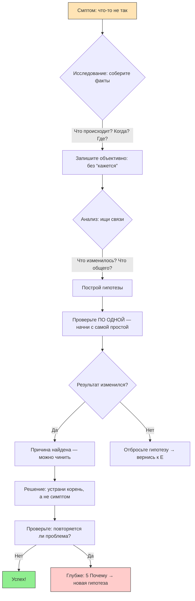

import ExternalPlayEmbed from '@site/src/components/ExternalPlayEmbed';


# Анализ и отладка

<div class="article-tags">
  <span class="tag tag-required">ОБЯЗАТЕЛЬНО</span>
  <span class="tag tag-beginner">ДЛЯ НОВИЧКОВ</span>
</div>

<span class="complexity-badge">Начальный уровень</span>

<div class="callout callout--tip">
  <div class="callout-title">Интерактив</div>

  <div class="callout-body">
  Демо ниже — нажимайте кнопки и смотрите, как это устроено. Ничего на компьютере не меняется.
</div>
  </div>


<ExternalPlayEmbed example="about/algo-code-visualizer" title="Algo Code Visualizer" minHeight={420} />

---

## Анализ и отладка

Вы нашли старый сундук на чердаке. Он закрыт, замок ржавый, ключа нет. Вы **не бьёте его кувалдой** — Вы сначали *осматриваете*:  
— Есть ли потайные защёлки?  
— Шевелится ли крышка, если потянуть осторожно?  
— Может, ключ спрятан под дном?  

**Анализ и отладка — это как раскрытие тайны сундука.** Только вместо сундука может быть программа, робот, сайт, эксперимент в школе — или даже Ваш собственный план подготовки к контрольной.

Это не "лечение поломок". Это *научный способ понимания мира*:  
> **Что происходит? Почему? Что изменится, если я сделаю вот так?**

И самое важное: **ничто не ломается просто так.** Всегда есть *причина*. И если Вы её найдёте — Вы не просто всё почините. Вы станете тем, кого в IT называют **инженером мышления**.

---

### Исследование

Перед тем как что-то чинить, нужно *понять, что вообще происходит*. Это называется **исследование**.

Допустим, Вы написали программу, которая должна считать, сколько Вам будет лет в 2050 году. Запускаете — а она говорит: *"Вам будет −12 лет"*.  

Стоп.  
Отрицательный возраст? Такого не бывает. Но программа *не врёт*. Она делает ровно то, что Вы ей велел. Просто Вы, возможно, *неправильно велел*.

```mermaid
flowchart
    %% Цвета по когнитивно-аналитическим функциям
    classDef explore fill:#2196F3,stroke:#0D47A1,color:black;
    classDef validate fill:#FF9800,stroke:#E65100,color:black;
    classDef loop fill:#607D8B,stroke:#263238,color:black;

    A[1. Изучение данных]:::explore
    B[2. Проверка результатов]:::validate

    A --> B
    B -->|✅ Подтверждено| C[Гипотеза принята / вывод зафиксирован]
    B -->|❌ Опровергнуто / неясно| A

    class C loop

    %% Стили
    style A fill:#E3F2FD,stroke:#2196F3
    style B fill:#FFF3E0,stroke:#FF9800
    style C fill:#ECEFF1,stroke:#607D8B

    %% Примечания
    note1["💡 "Изучение" — активное формирование вопросов"]:::explore
    note2["⚠️ "Проверка" без внешней/независимой основы"]:::validate

    style note1 fill:#E3F2FD,stroke:#64B5F6,stroke-dasharray: 5 5
    style note2 fill:#FFF3E0,stroke:#FFB74D,stroke-dasharray: 5 5

    note1 -.-> A
    note2 -.-> B
```

**Исследование — это сбор фактов, а не предположений.**  

Что Вы можете сделать *прямо сейчас*, не меняя код?  

1. **Посмотрите входные данные**:  
   — Какой год рождения Вы ввели?  
   — А текущий год программа берёт из системы — может, на компьютере стоит неправильная дата?  

2. **Проверьте промежуточные результаты**:  
   — Что покажет программа, если Вы добавите строчку: *"Напечатай: (2050 − 2025)"*?  
   — А если напечатаете: *"Напечатай: (2025 − год_рождения)"*?  

Каждый такой шаг — как поставить под микроскоп один кусочек цепочки. Вы не кричите: "Она сломана!" — Вы *спрашиваете*: "Где в этой цепочке звено повернулось не туда?"

> 🔍 **Правило №1 исследователя:**  
> *"Не верьте глазам своим — проверьте цифрами. Не верьте выводу — проверьте шаг за шагом".*

Ребята, которые начинают с крика *"Всё сломалось!"*, тратят часы на эмоции. А те, кто тихо спрашивают *"А что, если…?"* — находят причину за 7 минут.

Исследование — это не скука. Это *охота за деталями*, из которых складывается картина.

---

### Анализ

**Анализ** — это уже следующий уровень. Здесь Вы *связываете факВы в логическую цепочку*.

Вот пример из жизни.  
Вы пришли в школу, а все одноклассники какие-то тихие, никто не шумит, даже на перемене.  

- **ФакВы (исследование):**  
  — Учительница не улыбается.  
  — На доске написано: *"Контрольная по математике. 45 минут"*.  
  — В коридоре стоит директор.  

- **Анализ (объяснение):**  
  → Контрольная необычная — может, итоговая?  
  → Присутствие директора — значит, результаВы важны (например, для регионального рейтинга).  
  → Учительница напряжена — она тоже несёт ответственность.  

→ Вывод: *Сейчас пройдёт серьёзная проверка знаний. Нужно собраться.*

**В IT — то же самое.**  
Допустим, сайт долго грузится.  

- **Факты:**  
  — На компьютере всё быстро.  
  — На телефоне — медленно.  
  — На другом телефоне (у друга) — быстро.  

- **Анализ:**  
  → Проблема не в сайте (иначе везде было бы медленно).  
  → Не в сети (у друга на том же Wi-Fi быстро).  
  → Значит — *в Вашем телефоне*. Что может быть?  
    — Много открытых вкладок?  
    — Закончилась память?  
    — Старая версия браузера?  

→ Проверяете по порядку — и находите: *браузер не обновлялся год*. Обновляете — и сайт летает.

**Анализ — это умение перейти от "странно" к "логично".**  
Он строится на трёх китах:

1. **Целостность** — смотрите на систему целиком ("как это связано с остальным").  
2. **Последовательность** — каждое утверждение должно вытекать из предыдущего.  
3. **Обратимость** — если Вы говорите: *"A привело к B"*, спросите себя: *"А если я уберу A — исчезнет ли B?"*

---

### Как поймать суть

В любой задаче — особенно в IT — очень много "шума":  
— Красивые кнопки на сайте.  
— Длинные названия функций.  
— Ошибки, которые выглядят ужасно, но на деле безвредны.

**Суть — это то, без чего явление невозможно.**  
Если убрать суть — пропадёт и сама проблема.

Вот техника для выявления сути — назовём её **"5 Почему"** (придумали в Toyota для поиска корневых причин аварий на заводах, но работает везде).

> **Стуация:** Фонарик не светит.  
> — Почему?  
> — Потому что лампочка тёмная.  
> — Почему лампочка тёмная?  
> — Потому что нет тока.  
> — Почему нет тока?  
> — Потому что батарейки сели.  
> — Почему батарейки сели?  
> — Потому что их не меняли полгода.  
> — Почему их не меняли полгода?  
> — Потому что в доме нет запасных батареек — и никто не ведёт учёт.  

→ **Суть проблемы не в лампочке и даже не в батарейках.**  
→ **Суть — в отсутстви системы поддержки** (запасные элементы + напоминания).

В программировании это работает точно так же.

> Программа вылетает при нажатии кнопки "Сохранить".  
> — Почему?  
> — Потому что возникает ошибка "Нет прав на запись".  
> — Почему нет прав?  
> — Потому что программа пытается сохранить в папку `C:\Program Files\`, а туда может писать только администратор.  
> — Почему она туда пишет?  
> — Потому что разработчик жёстко прописал этот путь в коде.  
> — Почему так сделали?  
> — Потому что тестировал только на своём компьютере, где он администратор.  
> — Почему не проверил на другом компьютере?  
> — Потому что не было автоматических тестов для разных условий.  

→ **Суть не в кнопке, не в правах, не в пути.**  
→ **Суть — в отсутстви проверки на разных средах перед выпуском.**

Умение задавать "Почему?" — это как лупа, которая сжигает шум и оставляет только то, что *действительно имеет значение*.

И помни: **первая причина, которая приходит в голову — почти всегда не истинная.** Настоящая причина обычно на 3–5 уровней глубже.

---

### Всегда что-то кому-то нужно

Очень легко думать, что программа, сайт или робот — это "вещь", как стул или карандаш. Но это не так.  

**Любая компьютерная система — это *посредник* между людьми и их целями.**

Пример:  
Вы пользуетесь мессенджером — чтобы писать друзьям.  
Друзья — чтобы читать Ваши сообщения.  
Разработчики мессенджера — чтобы Вы *остался пользоваться им завтра*.  
Серверы — чтобы не упасть под нагрузкой.  
Даже антивирус на Вашем компьютере — "хочет" проверить каждое входящее сообщение, чтобы не пропустить вредоносный файл.

→ Всё это — *сетка намерений*. И когда что-то "ломается", почти всегда это означает:  
**одно намерение столкнулось с другим.**

Вот реальный кейс:  
В 2020 году один школьник написал программу, которая автоматически отправляла напоминания родителям: *"Проверьте дневник!"*  
Сначала всё работало. Потом — перестало.  

Исследование показало:  
— Письма больше не доходят.  
— Сервер отвечает: *"550, спам-фильтр заблокировал"*.  

Почему?  
— Потому что письма отправлялись с одного и того же адреса.  
— С одинаковым текстом.  
— Каждый день в 18:00.  

→ Спам-фильтр *выполнял свою задачу*: защищать почтовые ящики от автоматических рассылок.  
→ Но это *мешало* задаче школьника — помогать родителям быть в курсе.

**Конфликт целей.**  
Решение? *Переформулировать взаимодействие*:  
— Добавить в письмо случайную фразу ("Сегодня на ужин — макароны!").  
— Отправлять только если в дневнике появилась "2".  
— Использовать уведомления через школьное приложение (если оно есть).

Когда Вы анализируете систему, спрашивай не только:  
> *"Что не работает?"*  

А ещё:  
> *"Кому это нужно? Зачем? Что он от этого ждёт? Что будет, если этого не случится?"*

Потому что **ошибки часто рождаются из несогласованных ожиданий**.

Например:  
— Учитель ожидает, что все сдадут проект в PDF.  
— Вы отправляете DOCX, потому что так удобнее редактировать.  
— Система приёма работ *не умеет открывать DOCX*.  
— Работа "не загружена".  

Технически — всё верно: файл не поддерживается.  
Но суть — в том, что *ожидания не были озвучены явно*.  

Анализ — это умение видеть и *людей за кнопками*.

---

### Причина и следствие

Один из самых частых подводных камней — **путать корреляцию и причинность**.

> Корреляция — это когда два события происходят *вместе*.  
> Причинность — это когда одно *вызывает* другое.

Пример:  
Каждый раз, когда Вы едите мороженое, на улице жарко.  
→ Можно подумать: *"Мороженое вызывает жару"*.  
Но на самом деле: *жара вызывает желание есть мороженое*.

В IT такие ошибки — обычное дело.  

> "С тех пор как мы обновили логотип, упали продажи".  
→ Возможно. А возможно — в тот же день началась экономическая рецессия.  

> "После установки новой верси антивируса компьютер стал тормозить".  
→ Может быть. А может, одновременно запустился фоновый процесс обновления Windows.

**Как отличить?**  
Есть три вопроса, которые должны задать каждый аналитик (даже 10-летний):

1. **Можно ли повторить?**  
   → Если Вы *сам* включите антивирус → компьютер тормозит.  
   → Выключите → скорость возвращается.  
   → Включите снова — снова тормозит.  
   → Это уже *признак причинности*.

2. **Есть ли промежуточное звено?**  
   → Антивирус сканирует все файлы при запуске → загружает диск на 100% → система не отвечает.  
   → Это — *механизм причины*. Без него — только подозрение.

3. **Что будет, если убрать предполагаемую причину, но оставить всё остальное?**  
   → Запусти ту же программу на другом компьютере *без антивируса* — будет ли тормозить?  
   → Если нет — вероятно, причина в нём.  
   → Если да — ищите глубже.

> 🧠 **Правило золотой цепочки:**  
> *Настоящая причина — это то, без чего следствие невозможно.  
> Если следствие остаётся — Вы нашли соседа.*

Умение строить такие цепочки — основа отладки и научного мышления вообще.

---

### Как задавать вопросы

Большинство проблем решаются *ещё до того, как начнёте что-то чинить* — просто потому, что их **правильно сформулировали**.

Вот плохая формулировка:  
> *"Программа не работает".*

Почему она плохая?  
— Непроверяема.  
— Нечёткая.  
— Не говорит, *что именно* не так.

Вот хорошая формулировка:  
> *"При нажатии кнопки “Отправить” в 14:23 на устройстве Samsung Galaxy A14 (Android 13) с версией приложения 2.4.1, сообщение не отправляется и появляется надпись “Ошибка 500”, хотя интернет-соединение стабильно (Wi-Fi, 48 Мбит/с), и аккаунт подтверждён".*

Это уже *рабочий материал*. Такой отчёт может прочитать даже разработчик из другой страны — и понять, с чего начать.

Хороший вопрос — это **гипотеза в обёртке запроса**.

Например:  
- *"Почему сайт грузится долго?"*  
- *"Зависит ли время загрузки от размера аватарки пользователя? (Проверил: при аватарке 2 МБ — 8 сек, при 50 КБ — 1.2 сек)"*

Обратите внимание: второй вопрос уже содержит *наблюдение* и *предположение*. Он почти сам себя решает.

---

#### Как формулировать — по шагам

1. **Что ожидалось?** (идеальное состояние)  
2. **Что произошло на самом деле?** (факт, желательно с цифрами)  
3. **При каких условиях?** (устройство, ОС, версия, действия до ошибки)  
4. **Что менял(а) перед этим?** (обновления, новые файлы, настройки)  
5. **Что уже проверил(а)?** (чтобы не повторять)

Это называется **структурированное описание проблемы**. Оно экономит часы — и это уважение к тем, кто будет помогать.

> Совет: перед тем как спросить кого-то — попробуйте *вслух* ответить на эти 5 пунктов.  
> Часто на шаге 3 или 4 Вы сам(а) поймёте, в чём дело.

---

### Отладка в повседневной жизни

Отладка про *любую систему*, где есть **вход → процесс → выход**.

Разберём классический пример: **"Почему не работает фонарик?"**

---

#### Шаг 1. Наблюдение (без выводов!)  

— Нажимаю кнопку — ничего не происходит.  
— Иногда мелькает слабый свет, потом гаснет.  
— Батарейки вставлены "плюсом вперёд" — как нарисовано.

---

#### Шаг 2. Гипотезы (пока без проверки!)  
1. Сели батарейки.  
2. Плохой контакт (ржавчина, пыль, пружинка отогнулась).  
3. Перегорела лампа/светодиод.  
4. Сломалась кнопка.  

---

#### Шаг 3. Проверка *по одной гипотезе*, начиная с самой простой  
- **Попробую новые батарейки.**  
  → Вставил — фонарик засветил.  
  → Значит, *старые сели*.  

Но подожди.  
— Почему они сели так быстро? Вчера ещё работал.  
— Проверяю старые батарейки мультиметром (или ставлю в пульт — он тоже не работает).  
→ Батарейки *действительно разряжены*.  

— А почему разрядились за день?  
→ Смотрю внутрь: одна батарейка вставлена **наоборот**.  
→ Ага! Значит, *пока Вы думали, что всё правильно — на самом деле был короткий замыкатель внутри*. Батарейки разряжались, греясь, даже когда фонарик "выключен".

→ **Настоящая причина — *ошибка сборки человеком*.**

Выводы:  
- Не верьте инструкции на слово — проверяйте.  
- Слабый вспышка — важный симптом (говорит, что есть *немного* тока).  
- Иногда "поломка" — это *неправильная настройка*.

---

#### Другие примеры для тренировки

| Стуация | Что проверить первым? | Скрытая причина (часто!) |
|--------|---------------------|------------------------|
| Растение засыхает | Влажность почвы, свет, температура | Горшок без дренажных отверстий → корни задыхаются |
| Наушники шипят | Переподключить, попробовать на другом устройстве | Повреждена оплётка кабеля (перегиб у штекера) |
| Робот-пылесос едет по кругу | Закрыты ли датчики (пыль, волосы)? | Датчик столкновения "залип" в положении "стена рядом" |
| Домашний эксперимент не получился | Точность измерений, чистота посуды | Вода из-под крана содержит примеси, мешающие реакции |

Отладка — это не волшебство. Это **дисциплина наблюдения**.

---

### Путь от симптома к корню

Ниже — схема, которую можно вставить в книгу (поддерживается в Markdown через блок ```mermaid```). Она обобщает всё вышеизложенное.



> **Как читать схему:**  
> — Каждый блок — шаг мышления.  
> — Цикл "гипотеза → проверка → отбраковка" — норма. Даже профи проходят его 3–5 раз.  
> — Зелёный "Успех" — только после *проверки решения*, а не после первого исправления.

Эту схему можно распечатать и повесить над столом.

---
