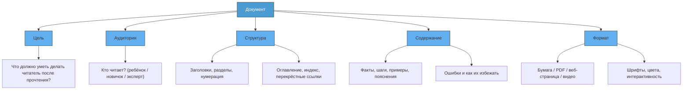

import ExternalPlayEmbed from '@site/src/components/ExternalPlayEmbed';


# Документы

<div class="article-tags">
  <span class="tag tag-required">ОБЯЗАТЕЛЬНО</span>
  <span class="tag tag-beginner">ДЛЯ НОВИЧКОВ</span>
</div>

<span class="complexity-badge">Начальный уровень</span>

<div class="callout callout--tip">
  <div class="callout-title">Интерактив</div>

  <div class="callout-body">
  Демо ниже — потренируйся печатать: скорость и точность пригодятся в школе и в коде.
</div>
  </div>


<ExternalPlayEmbed example="basics/typing-play" title="Typing" />

---

## Документы

Вы получили в подарок конструктор — большой, с сотнями деталей. В коробке лежат шестерёнки, пластины, моторчики, проводки… но нет никаких листочков. Никаких картинок, никаких надписей. Просто куча деталей и… всё.

Что Вы сделаете?

Возможно, попробуете собрать что-то сам. Может, получится самолёт. Или робот. А может — странная штука, которая никуда не едет и ничего не делает. Это нормально — экспериментировать. Но если Вы *хотите* собрать именно то, что обещано на коробке — например, космический корабль с лазерной пушкой и антенной связи, — Вам понадобится **инструкция**.

А инструкция — это один из самых простых и важных видов **документов**.

---

### Что такое документ?

**Документ** — это любая запись, которая *сохраняет* информацию и *передаёт* её другому человеку (или даже себе в будущем).

Слово *"документ"* звучит немного официально — как будто речь о паспорте или договоре. Но на самом деле документы окружают нас повсюду:

- рецепт бабушкиного пирога на листочке в кухонном блокноте — это документ;  
- список покупок на телефоне — документ;  
- правила игры в прятки, которые Вы придумали во дворе и записали мелом на асфальте — тоже документ;  
- даже сообщение в чате, где Вы объясняете другу, как пройти уровень в игре, — это документ (цифровой, но всё равно!).

**Главное свойство документа:**  
> Он существует *независимо от человека*, который его создал.  
> Он не исчезает, когда создатель ушёл, уснул или забыл.  
> Он может быть прочитан, проверен, исправлен, передан дальше.

Документ не обязательно должны быть на бумаге. Документ может быть:

- текстовым файлом (`.txt`, `.docx`, `.pdf`);
- веб-страницей;
- изображением с надписями;
- видеоинструкцией;
- голосовой заметкой;
- даже базой данных — если она содержит структурированное описание чего-либо.

Но вне зависимости от формы, документ выполняет три основные задачи:

1. **Фиксация** — "здесь и сейчас мы договорились так…";
2. **Передача** — "я не могу объяснить Вам лично, но вот запись — читайте";
3. **Повторяемость** — "сделайте вот так — и у Вас получится то же самое, что и у меня".

---

### Почему документы так важны в IT?

Представьте программиста. Он сидит, печатает код — сотни строк, тысячи команд. Он что-то создаёт — сайт, игру, приложение. В какой-то момент он заканчивает версию 1.0 и уходит в отпуск.

А через две недели к проекту подключается другой программист. Он открывает код и видит:

```javascript
if (z > 0 && m !== null) {
  q = m.transform(z).apply();
}
```

Что такое `z`? Что такое `m`? Зачем `transform`? Что делает `apply()`? Без пояснений — это как инструкция на непонятном языке.

Но если рядом лежит документ — например, файл `README.md`, где написано:

> `z` — угол поворота объекта в градусах (от –180 до +180)  
> `m` — модель 3D-объекта, загружается из `/assets/models/ship.obj`  
> `.transform(z)` вращает модель вокруг оси Y  
> `.apply()` отправляет изменения в видеокарту для отрисовки

— тогда всё становится ясно.

**В IT документы — это мост между мыслью и действием.**  
Они позволяют людям работать вместе, даже если они:
- живут в разных странах;
- подключились к проекту через год после его старта;
- никогда не встречались лично.

Без документов невозможно сделать сложную, надёжную, масштабируемую систему. Даже если Вы один — *через месяц Вы сам будете другим человеком*. И Вам потребуется документ, чтобы понять: "А зачем я так сделали?"

---

### Виды документов

ДокуменВы бывают разные — как инструменВы в наборе. Отвертка не заменит молоток, и наоборот. Давайте разберём три самых частых вида — особенно полезных при работе с техникой, программами и проектами.

---

#### Инструкция (Instruction / Manual)

Это **пошаговое руководство**, как сделать что-то конкретное *впервые*.  
Цель: "Доберись от нуля до результата *без ошибок*".

Примеры:
- "Как собрать LEGO-робота за 30 минут";
- "Как настроить Wi-Fi на планшете";
- "Как создать аккаунт в ELMA365".

Особенности:
- Идёт от начала к концу — как фильм;
- Часто содержит скриншоты, номера шагов, предупреждения ("Не нажимайте “Да”, если не увереныыы!");
- Предполагает, что читатель *ничего не знает* об этом процессе.

> **Пример:** Возьмите упаковку от нового устройства (наушников, настольной лампы, набора для опытов) и найдите там *инструкцию*. Прочитайте её *вслух* — как будто Вы объясняете младшему брату. Заметьте: какие слова повторяются? Где стоят картинки? Почему одни шаги жирным шрифтом, а другие — серым?

---

#### Справка (Reference)

Это **энциклопедия возможностей**.  
Цель: "Вы уже умеете — теперь узнай, *что ещё можно*".

Примеры:
- таблица команд для консоли Linux (`ls`, `cd`, `mkdir`);
- описание всех функций в Python — `len()`, `range()`, `open()`;
- список всех кнопок в игре *Minecraft* ("Shift — присесть, F2 — сделать скриншот…").

Особенности:
- Не надо читать подряд. Читаете только то, что нужно *сейчас*;
- Часто структурирована по темам ("Работа с файлами", "Цвета", "Ошибки");
- Суховата — но зато точна — *что делает*, *какие параметры*, *что возвращает*.

> 🧩 **Интересный факт**: Справка — это как меню в ресторане. Вы не ешь всё сразу. Но когда захотите *именно пасту карбонара* — открываете раздел "Паста" и выбираете.

---

#### Гайд (Guide / Tutorial)

Это **история с обучением внутри**.  
Цель — "Покажу, как *думать*, когда решаете такую задачу".

Примеры:
- "Как написать свою первую игру на Python: от идеи до запуска";
- "Как сделать сайт про котиков за 1 час";
- "Как найти и исправить ошибку в программе: пошаговый разбор".

Особенности:
- Есть сюжет: проблема → поиск решения → результат;
- Автор делится *своим опытом*: "Сначала я пытался так — не получилось. Потом попробовал эдак — и вот что вышло…";
- Часто содержит "вопросы для размышления", "попробуйте изменить этот параметр и посмотрите, что будет".

Гайд — это **"почему так, а не иначе?"**

---

### Как читать документацию?  

Давайте разберём реальную ситуацию: Вы получили набор "Робот-исследователь" от 500 деталей. В коробке — мешочки с номерами, шестерни, датчики, и… брошюра на 24 страницы.

Как к ней подступиться?

---

#### Шаг 1. Не листай сразу к картинке с готовым роботом  

(Да, он классный — с антенной и гусеницами! — но это *цель*, а не *старт*.)

Вместо этого:
- прочитайте **введение** (обычно на первой странице) — что входит в набор, сколько времени займёт сборка, какие инструменВы нужны;
- найдите **легенду** — условные обозначения: что означает красная стрелка? что такое "шаг 3А"? где искать детали по номеру?

---

#### Шаг 2. Учись "читать схемы"  

В инструкциях LEGO или Meccano почти нет слов. Всё — через схемы:  
- серые лини — уже собранная часть;  
- цветные детали — то, что *надо добавить сейчас*;  
- пунктир — деталь, которую *невидно*, но она есть внутри;  
- взрыв-схема — как разобрать узел, если ошибся.

Это язык. Как ноВы для музыканта. Со временем Вы начнёте *видеть* сборку в голове, просто взглянув на схему.

---

#### Шаг 3. Не бойся "откатиться назад"  

Если на шаге 12 рука робота смотрит в потолок, а должны — вперёд, *не продолжайтете*.  
Лучше:
- вернись на шаг 10;
- проверь, правильно ли поставлена шестерня;
- сравните свою конструкцию с картинкой *точно* — не перепутаны ли лево и право?

Документация — не тест на "угадайку". Она *предполагает*, что Вы будете ошибаться. Хорошая инструкция даже пишет:  
> ⚠️ *Частая ошибка: деталь №47 вставляется острым концом вниз. Если вставить вверх — рука будет двигаться рывками.*

---

#### Шаг 4. Делайте пометки  

Карандашом на полях:  
- "Здесь я потратил 10 минут — сложно было найти деталь №112";  
- "Можно заменить деталь №88 на №91 — работает так же";  
- "Шаг 15 — пропустил, потом всё пошло не так".

Вы создаёте *свою версию документа* — адаптированную под Вас. Это нормально. Даже профи так делают.

---

### Как устроен документ  

Посмотрим, из чего состоит *любой* хороший документ — от инструкции к игрушке до технической спецификации на спутник.



Эта схема показывает: документ — не просто "текст". Это *продукт*, созданный с расчётом на конкретного человека и конкретную задачу.

Например:
- Инструкция к детскому планшету (аудитория — 6 лет) будет в формате PDF с крупными картинками и голосовым сопровождением;
- Справка по SQL для разработчика (аудитория — 25 лет, 3 года опыта) — веб-сайт с поиском по ключевым словам и примерами кода;
- Техническое задание на разработку школьного сайта (аудитория — команда из 4 человек) — Google Doc с комментариями и версионированием.

---
