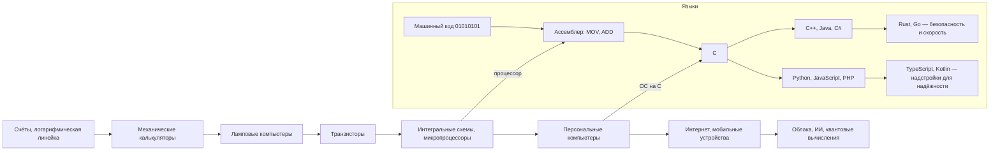
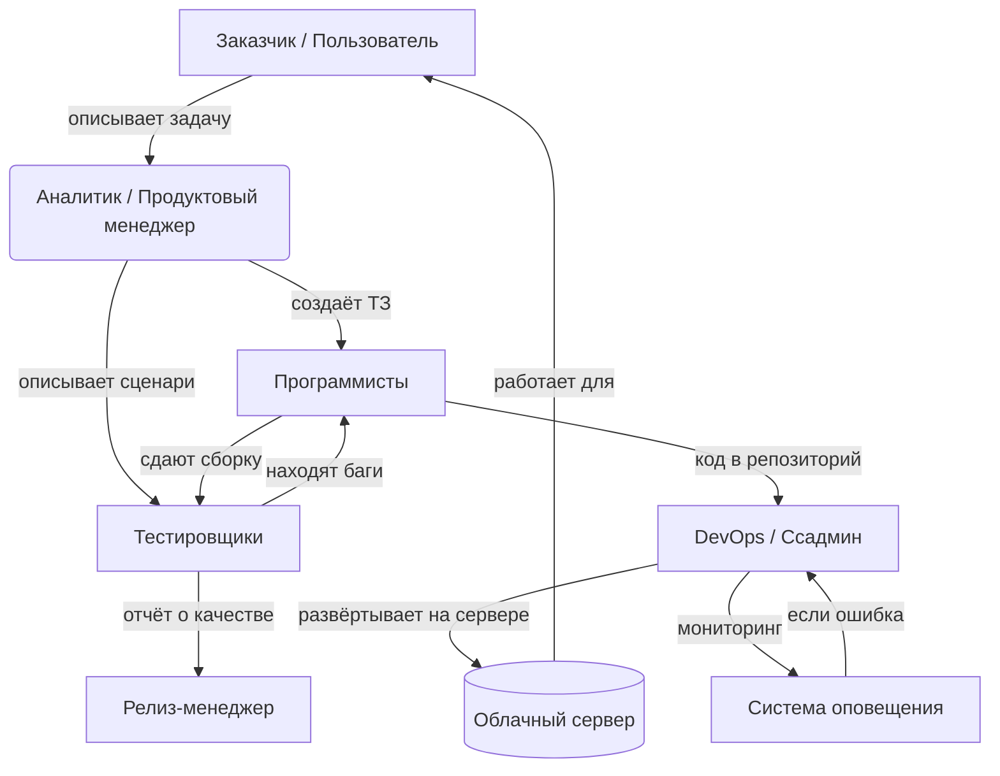

import ExternalPlayEmbed from '@site/src/components/ExternalPlayEmbed';


# История

<div class="article-tags">
  <span class="tag tag-required">ОБЯЗАТЕЛЬНО</span>
  <span class="tag tag-beginner">ДЛЯ НОВИЧКОВ</span>
</div>

<span class="complexity-badge">Начальный уровень</span>

<div class="callout callout--tip">
  <div class="callout-title">Интерактив</div>

  <div class="callout-body">
  Демо ниже — нажимайте кнопки и смотрите, как это устроено. Ничего на компьютере не меняется.
</div>
  </div>


<ExternalPlayEmbed example="basics/tech-history-play" title="История технологий" minHeight={420} playProps={{ topic: 'it-overview' }} />

---

## История

### Как всё начиналось  

Что раньше, чтобы просто *сложить два числа*, людям приходилось считать вручную — на бумаге, на счётах, или даже с помощью специальных машин, которые занимали целую комнату и весили больше слона.  

Самые первые вычислительные устройства появились задолго до того, как родились Ваши родители, бабушки и дедушки — даже до того, как появился Интернет, телефоны с экранами и электронная почта. Всё начиналось с простых механических машин:  

- В XVII веке французский учёный **Блез Паскаль** создал "Паскалину" — механический калькулятор, который складывал и вычитал числа с помощью шестерёнок. Это была машина размером с коробку от обуви, но она не умела "думать" — только повторять действия, которые ей задавал человек.  
- Позже, в XIX веке, англичанин **Чарльз Бэббидж** придумал "Аналитическую машину" — прообраз современного компьютера. Он даже планировал, чтобы она понимала инструкции, записанные на перфокартах (карточках с дырочками, как в старых музыкальных шкатулках). Но построить её при жизни не успел — технологии того времени были ещё слишком слабыми.  

Первый настоящий компьютер, который умел *выполнять программы*, появился в 1940-х годах. Его звали **ENIAC** (произносится как "Энийак"). Он:  
- занимал целую комнату (около 170 квадратных метров!),  
- весил 27 тонн (как три автобуса!),  
- работал на 18 000 лампах накаливания — и каждую из них нужно было менять, когда она перегорала (а перегорали они довольно часто),  
- умел считать всего в 500 раз быстрее, чем человек с карандашом и бумагой — и это казалось чудом!  

ENIAC не умел хранить программы внутри себя — чтобы сменить задачу, инженерам приходилось *физически переключать провода и колёсики*. Да-да — чтобы заставить компьютер что-то посчитать по-новому, нужно было *переподключить его, как будто это гигантский конструктор LEGO*.  

Но уже в конце 1940-х появилась новая идея — **архитектура фон Неймана**. Американский математик **Джон фон Нейман** предложил хранить *и данные, и инструкции* (программу) в одной и той же памяти. Это стало прорывом: теперь компьютер мог менять поведение, просто считывая новую программу — без переключения проводов! Эта идея до сих пор лежит в основе почти всех современных устройств — от смартфонов до суперкомпьютеров.  

Следующий большой шаг — изобретение **транзистора** в 1947 году. Это крошечное устройство заменило хрупкие и горячие лампы. Оно меньше ногтя, потребляет мало энерги, почти не греется и работает десятилетиями. Благодаря транзисторам компьютеры стали:  
- меньше (из комнаВы — в шкаф, потом — на стол, потом — в карман),  
- надёжнее (меньше поломок),  
- дешевле (можно делать их сериями, как игрушки).  

А в 1960-х появились **интегральные схемы** — "чипы", на которых сотни, потом тысячи, потом миллионы транзисторов размещались на одном кусочке кремния. Так родилась микропроцессорная революция. В 1971 году компания Intel выпустила **Intel 4004** — первый в мире микропроцессор. Он был размером с ноготь, но выполнял всё, что раньше делал ENIAC… только в 10 000 раз быстрее и на миллионную долю энерги.  

Это как если бы Вы заменили стадион с тысяч людей, бегающих с записками, на одного школьника с планшетом — и тот делал бы ту же работу быстрее и без ошибок.

---

К концу 1970-х и в 1980-х годах компьютеры начали появляться *в домах*. Появились такие машины, как:  
- **Commodore 64** — продано более 17 миллионов штук (это рекорд для одного компьютера!), он играл музыку, рисовал цветные картинки и позволял писать простые программы;  
- **ZX Spectrum** — популярный в СССР и Восточной Европе — подключался к обычному телевизору, программы загружались с кассет, а для запуска игры нужно было набрать команду вроде `LOAD ""` и нажать кнопку Play на магнитофоне;  
- **Apple II**, **IBM PC** — первые компьютеры для офисов и школ; на них учили основам программирования и работали с текстами.

В это время почти все пользователи *умели программировать* — потому что без этого компьютер просто мигал курсором и ждал, пока Вы ему что-то скажете. Программы часто вводили вручную из журнала (например, из "Науки и жизни"), строка за строкой. Одна ошибка в букве — и всё зависало. Зато, когда программа заработала — это было как волшебство.

**А теперь представь**: Вы сидите за современным ноутбуком. Он в миллион раз мощнее ENIAC. В нём больше транзисторов, чем людей на Земле. Он помнит всё, что Вы вчера искали, знает, какое время года за окном, и может показать Вам видео с пингвинами в Антарктиде — через доли секунды. И всё это стало возможно потому, что десятки Высяч людей — учёных, инженеров, программистов — десятилетиями улучшали технологии, делились идеями и *не боялись пробовать новое*.

---

### Языки программирования

Вы уже знаете, что первые компьютеры нельзя было просто "включить и использовать". Чтобы они что-то сделали, нужно было дать им *точные инструкции*. Но компьютеры не понимают русский, английский или эмодзи. Они понимают только **электрические сигналы**: есть ток — это "1", нет тока — это "0". Всё, что делает компьютер, построено на этих двух цифрах — это называется **двоичная система** (или *бинарный код*).

Вы учите робота заваривать чай. Вы не можете сказать:  
> "Сделай, пожалуйста, чай".  

Робот не знает, что такое "чай", "пожалуйста" или даже "сделай". Вы должны объяснить:  
1. Откройте дверцу шкафа.  
2. Возьмите чайник левой рукой за ручку.  
3. Подойди к крану.  
4. Поверни ручку крана на 90 градусов влево…  

И так — на *каждое движение*. Если пропустите шаг — робот остановится. Если скажете "немного" или "примерно" — он не поймёт.  

Так и с компьютером — каждая программа — это список инструкций, записанных на языке, который он *точно* понимает. Исторически таких языков было несколько уровней — от самых "низких" (близких к машине) до самых "высоких" (близких к человеку). Давайте пройдёмся по ним по порядку.

---

#### Ассемблер 

Самый первый способ "общаться" с компьютером — это **машинный код**: цепочки нулей и единиц. Например, инструкция "сложить два числа" могла выглядеть так:  
```
10110000 01100001
```  
Никто не мог нормально работать с таким — легко ошибиться, невозможно проверить, что написал. Поэтому уже в 1950-х годах придумали **ассемблер** (*assembly language*).  

Ассемблер — это как "переводчик" между человеком и машиной. Вместо `10110000` программист пишет короткое слово — например, `MOV` (от *move* — "переместить"), `ADD` ("сложить"), `JMP` ("перейти"). Это называется **мнемоникой** — легко запоминаемое сокращение.  

Пример простой программы на ассемблере (для учебного процессора):

```asm
MOV A, 5     ; помести число 5 в регистр A
MOV B, 3     ; помести число 3 в регистр B
ADD A, B     ; сложите A и B, результат положи в A
; теперь в A лежит 8
```

Это уже читаемо! Но — важно: **каждая команда ассемблера почти один-в-один соответствует одной машинной инструкции**. Поэтому:  
- программа работает *очень быстро* (компьютеру почти ничего не нужно "переводить"),  
- но написать большую программу — долго и сложно,  
- и код зависит от конкретного процессора: программа для Intel не заработает на ARM без переписывания.

Ассемблер до сих пор используется:  
- в микроконтроллерах (умные часы, бытовая техника),  
- в критически важных участках операционных систем (например, при запуске компьютера),  
- когда каждая микросекунда на счету — например, в играх или робототехнике.

Но для повседневных задач он — как молоток по гвоздям — мощно, но неудобно, если нужно собрать шкаф.

---

#### C (С)

В 1972 году в лаборатори Bell Labs (США) программист **Деннис Ритчи** создал язык **C** — и изменил мир. Почему?

C был первым языком, который:  
- позволял писать программы *высокоуровнево* (как человек — "выведи текст", "прочитайте файл"),  
- но *оставался близким к машине* — можно было управлять памятью, регистрами, битами,  
- и, главное, **компилировался в машинный код для разных компьютеров**. То есть одну и ту же программу можно было перенести с одного компьютера на другой — достаточно было "пересобрать" её (скомпилировать заново под новую архитектуру).

> **Компилятор** — это особая программа-переводчик. Она берёт текст на языке (например, C), проверяет его на ошибки, и превращает в машинный код, который поймёт процессор. Это как если бы учитель проверил Ваше сочинение, исправил ошибки, а потом распечатал его на принтере — готовый, чистый, для публикации.

На языке C была написана **операционная система UNIX** — и именно поэтому UNIX (и её потомки, вроде Linux и macOS) распространились по миру. Потом на C писали базы данных, браузеры, игры… Сегодня около 30% всего системного ПО по-прежнему написано на C или его "дочернем" языке **C++**.

Вот как выглядит программа "Привет, мир!" на C:

```c
#include <stdio.h>

int main() {
    printf("Привет, мир!\n");
    return 0;
}
```

Даже если Вы не понимаете каждое слово — видно: это *намного* понятнее, чем ассемблер!  
- `#include <stdio.h>` — подключаем библиотеку для ввода/вывода,  
- `main()` — главная функция, с которой начинается программа,  
- `printf(...)` — команда "напечатай текст",  
- `\n` — символ "новой строки" (как нажать Enter),  
- `return 0` — "всё прошло успешно".

C требует дисциплины — Вы сам управляете памятью, сам следите, чтобы не было ошибок. Но именно это делает его *сильным* — как велосипед без электропривода: ехать сложнее, зато Вы чувствуете каждую деталь.

---

#### Эволюция

После C появилось много языков, которые стали "выше" и "дружелюбнее":  
- **Pascal** (1970-е) — создан специально для обучения; строгий, но логичный;  
- **C++** (1985) — добавляет к C "объектно-ориентированное программирование" (ООП), чтобы моделировать реальный мир — "машина", "кошка", "робот" — всё это можно описать как "объекты" с свойствами и действиями;  
- **Java** (1995) — "пишете один раз — запускаете где угодно"; работает на виртуальной машине (JVM), что делает её кроссплатформенной и безопасной;  
- **JavaScript** (1995) — создавался за 10 дней (!), чтобы оживлять веб-страницы (например, делать кнопки, которые меняют цвет при наведении); сегодня — язык №1 для интерактивных сайтов и веб-приложений;  
- **Python** (1991, популярен с 2000-х) — простой синтаксис, похожий на английский; идеален для науки, автоматизации, обучения; вот как выглядит "Привет, мир!" на Python:  
```python
  print("Привет, мир!")
```  
  Всего одна строка — и всё работает.

Каждый язык — как инструмент в наборе мастера:  
- C — как отвёртка с тонким жалом: точная работа внутри устройства;  
- Python — как шуруповёрт с автоматической подстройкой — быстро, надёжно, не нужно думать о деталях;  
- JavaScript — как клей и скотч: скрепляет части веб-страницы, делает их живыми.

Интересный факт — **почти все современные языки так или иначе "родственники" C** — даже если синтаксис другой, логика управления памятью, циклами и функциями часто берёт начало оттуда.




Эта схема показывает две параллельные лини:  
- **внизу** — развитие "железа" (аппаратуры),  
- **вверху** — развитие "софта" (языков и программ).  

Обратите внимание: каждая новая технология *дополняет* старую. Мы до сих пор используем C для системного кода, а ассемблер — в микроконтроллерах. Просто теперь у нас больше выбора: можно писать и "вручную", и "на автопилоте" — в зависимости от задачи.

---

### Професси в IT

Когда Вы пользуетесь телефоном, играете в игру, смотрите видео или пишете сообщение — за всем этим стоит работа *многих людей*. Никто не может сделать всё сам — даже самый талантливый программист не сможет написать операционную систему, нарисовать иконки, настроить серверы, проверить, что кнопка "Отправить" работает во всех браузерах, и написать инструкцию для пользователя. Поэтому в IT сформировались разные профессии — как в оркестре — есть скрипачи, трубачи, дирижёр и техник, который настраивает инструменты. Все важны.

Давайте познакомимся с тремя ключевыми ролями — теми, о которых чаще всего спрашивают дети и подростки.

---

#### Программист (разработчик, developer)

**Чем занимается?**  
Пишет программы — от простых калькуляторов до сложных систем, управляющих спутниками или больницами. Но на самом деле — не просто "набирает код". Программист:  
- *Понимает задачу*: что хочет заказчик? Как это поможет пользователю?  
- *Проектирует решение*: как устроена программа внутри? Какие части нужны? Как они будут взаимодействовать?  
- *Пишет код* — на подходящем языке, с соблюдением правил, чтобы другие могли его понять.  
- *Проверяет* — запускает программу, ищет ошибки, исправляет.  
- *Документирует*: объясняет, как работает код — для себя через полгода и для коллег.

**Что нужно знать?**  
- Один или несколько языков программирования (например, Python для обучения, JavaScript для сайтов, C# для игр и бизнес-систем),  
- Как работают алгоритмы (пошаговые инструкции для решения задач),  
- Как устроены данные — списки, таблицы, деревья, графы,  
- Как работать в команде — использовать системы контроля версий (например, Git), писать понятный код, обсуждать решения.

**Интересный факт:**  
В 1980-х и 1990-х большинство программистов были женщинами. Например, **Грейс Хоппер** создала один из первых компиляторов и участвовала в разработке языка COBOL. Её называли "бабушкой COBOL". А фраза *"debugging"* (отладка — поиск ошибок) пошла от реального случая: в 1947 году в реле компьютера Mark II застряла моль — её вынули и приклеили в журнал с надписью *"First actual case of bug being found"*.

---

#### Системный администратор (сисадмин, sysadmin)

**Чем занимается?**  
Следит за тем, чтобы *всё работало*. Если программист — как архитектор и строитель дома, то системный администратор — как инженер ЖКХ, электрик, сантехник и охранник *в одном лице*. Его зона ответственности:  
- Серверы — компьютеры, которые хранят данные и запускают программы (часто их десятки или тысячи),  
- Сети — как устроены подключения между устройствами, как передаются данные, как защитить от взлома,  
- Обновления — установка новых версий программ и операционных систем, чтобы не было уязвимостей,  
- Резервное копирование — чтобы, если что-то сломается, можно было восстановить информацию,  
- Помощь пользователям — если у сотрудника не работает почта, звонят сисадмину.

**Что нужно знать?**  
- Как устроены операционные системы (Windows, Linux, macOS), особенно на уровне командной строки,  
- Как работают сети — IP-адреса, DNS, маршрутизация, брандмауэры,  
- Языки автоматизации — например, Bash (для Linux) или PowerShell (для Windows), чтобы не делать всё вручную,  
- Принципы информационной безопасности — как защитить данные от потери и кражи.

**Важно:**  
Ссадмин не "чинит принтер" (это — инженер или техник). Его работа — обеспечить *надёжность и безопасность всей информационной системы*. Например, если сайт перестал грузиться, он проверит: сервер отвечает? Сеть не перегружена? Не закончилось ли место на диске? Не было ли атаки?

---

#### Тестировщик (QA-инженер, quality assurance)

**Чем занимается?**  
Тестирует программу *до того*, как её увидит пользователь. Его задача — найти ошибки там, где разработчик их не заметил. Программист думает — *"Как сделать, чтобы работало?"* — тестировщик думает: *"Как сделать, чтобы сломалось?"*

Примеры действий тестировщика:  
- Проверяет, что кнопка "Купить" работает при нажатии мышкой, и при Enter, и на сенсорном экране, и при медленном интернете,  
- Вводит неожиданные данные — вместо имени — 1000 букв "А", вместо телефона — "котёнок", чтобы посмотреть, как программа отреагирует,  
- Сравнивает, как программа ведёт себя в Chrome, Firefox, Safari, на телефоне и на компьютере,  
- Пишет *тест-кейсы* — чёткие инструкции: "Шаг 1: залогиниться. Шаг 2: нажать „Создать отчёт“. Ожидаемый результат: открылось окно с полями…".

**Что нужно знать?**  
- Логику и внимание к деталям (заметить, что иконка чуть сдвинута или текст обрезан),  
- Основы работы с программами (как и обычный пользователь, но глубже — понимает, *почему* что-то может сломаться),  
- Иногда — языки автоматизации тестов (например, Python + библиотека Selenium), чтобы проверять повторяющиеся сценари без ручного кликанья,  
- Умение описывать ошибки точно: "При вводе email без точки программа выдаёт пустое окно, в консоли ошибка TypeError: cannot read property ‘split’ of undefined".

**Почему это профессия, а не "просто покликать"?**  
Хороший тестировщик экономит компании миллионы: представьте, что в банковском приложении ошибка — и при переводе 1000 рублей уходит 10 000. Найти такую ошибку *до* выпуска — задача QA. Поэтому в крупных проектах на одного разработчика приходится 0,5–1 тестировщика.

---

#### Как они работают вместе?

Допустим, компания создаёт приложение для учёта домашних растений: "Зелёный помощник".  

1. **Программисты** пишут:  
   - интерфейс (как выглядит экран с кактусом),  
   - логику (как считать, когда поливать — "+1 день после полива", "если влажность < 30% — напомнить"),  
   - подключение к облаку (чтобы данные не пропали, если сломается телефон).  

2. **Системный администратор** настраивает:  
   - сервер, на котором хранятся данные всех пользователей,  
   - резервное копирование каждую ночь,  
   - защиту от DDoS-атак (когда хакеры пытаются "забросать" сервер запросами, чтобы он упал).  

3. **Тестировщики** проверяют:  
   - что напоминание приходит ровно в 9 утра, даже если телефон был выключен,  
   - что приложение не падает, если пользователь быстро нажимает "Добавить полив" 10 раз подряд,  
   - что данные с iPhone корректно синхронизируются с Android-версией.  

Если кто-то из троих ошибся — приложение может выйти неудобным, ненадёжным или даже опасным. Поэтому *командная работа* — основа IT.

---

#### Как взаимодействуют профессии  



Эта схема показывает:  
- Информация идёт по кругу — пока качество не будет достигнуто,  
- Нет "главного" — все звенья равны,  
- Современные команды часто используют подход **DevOps** (сокращение от *Разработка + Operations*) — программисты и сисадмины работают в одной команде, используют одни инструменты, автоматизируют развёртывание — чтобы обновления выходили быстро и безопасно.

---

#### Как родилась глобальная сеть  

В США существовало агентство **ARPA** (Advanced Research Projects Agency) — оно финансировало передовые исследования, в том числе в вычислительной технике. В 1969 году инженеры ARPA запустили сеть из четырёх узлов:  
- UCLA (Калифорнийский университет),  
- Стэнфордский исследовательский институт,  
- Университет Калифорни в Санта-Барбаре,  
- Университет Юты.  

Эта сеть получила название **ARPANET**.  

Первое сообщение в ARPANET было отправлено 29 октября 1969 года. Программист пытался напечатать слово **`LOGIN`**, но после двух букв — **`LO`** — система упала. Иронично: первое сообщение в истории Интернета было… "ЛО".  

Через несколько недель связь заработала стабильно. Важнейшее изобретение, позволившее ARPANET масштабироваться, — **пакетная коммутация**. В отличие от телефонной сети (где между двумя абонентами устанавливался *постоянный канал*), в ARPANET сообщения разбивались на *пакеты* — небольшие кусочки данных. Каждый пакет шёл своим маршрутом, а на месте — собирался обратно. Если один путь был повреждён (например, при бомбардировке), пакеты шли другими дорогами. Это делало сеть **устойчивой к повреждениям** — что было важно в условиях "холодной войны".

В 1974 году Винтон Серф и Роберт Кан предложили **TCP/IP** — набор правил (протоколов), по которым любые компьютеры могут обмениваться данными, независимо от того, как они устроены внутри.  
- **IP** (Internet Protocol) — отвечает за *адресацию*: каждый компьютер получает уникальный номер (например, `192.168.1.1`), как почтовый адрес.  
- **TCP** (Transmission Control Protocol) — отвечает за *доставку* — разбивает сообщение на пакеты, нумерует их, проверяет, все ли дошли, и собирает обратно.  

1 января 1983 года ARPANET *перешла полностью на TCP/IP* — эту дату считают **днём рождения Интернета**.

---

#### Как сеть стала всемирной  

В 1980-х сеть всё ещё использовали в основном учёные и военные. Но в 1989 году британский физик **Тим Бернерс-Ли**, работая в ЦЕРНе (Швейцария), придумал нечто революционное:  

> **World Wide Web (WWW)** — *система для работы с информацией в сети*.

Он создал три ключевые технологии:  
1. **HTTP** (HyperText Transfer Protocol) — правила, по которым браузер запрашивает страницу, а сервер её отдаёт,  
2. **HTML** (HyperText Markup Language) — язык разметки, с помощью которого можно писать текст с ссылками, картинками, заголовками,  
3. **URL** (Uniform Resource Locator) — адрес страницы, например `https://example.com/page.html`.

Первый веб-сайт (`http://info.cern.ch`) появился в августе 1991 года. Он объяснял, что такое WWW и как создавать свои страницы.

Важно: **Интернет ≠ WWW**.  
- *Интернет* — это физическая и логическая сеть — кабели, роутеры, серверы, протоколы (TCP/IP).  
- *WWW* — один из сервисов поверх Интернета (как почта, Skype или онлайн-игры).  

В 1993 году вышел браузер **Mosaic** — первый с поддержкой картинок внутри текста. Люди впервые увидели: веб — это *живые, красивые страницы*. К 1995 году появились Netscape, Yahoo!, Amazon, eBay. Интернет перешёл из лабораторий — в дома.

---

#### Облака

Раньше, чтобы работать с программой, её нужно было *установить на свой компьютер*. Если компьютер сломался — данные пропадали. Если нужно было поработать с другого устройства — приходилось переносить файлы на флешку.

С развитием сетей появилась идея — **а что, если хранить программы и данные не у пользователя, а на мощных серверах — и давать к ним доступ через браузер?**

Так родились **облачные сервисы** (*cloud computing*). Слово *cloud* (облако) взято из схем — инженеры рисовали сеть как облако, потому что "там, внутри, что-то происходит, но нам не важно как — главное, что работает".

Примеры:  
- **Google Docs** — текстовый редактор в браузере. Файл хранится на серверах Google. Вы можете открыть его с телефона, планшета, школьного компьютера — и продолжить с того места, где остановился.  
- **Яндекс.Диск, iCloud, Dropbox** — облачные хранилища — как "сейф в интернете", куда можно положить фото, документы, проекты.  
- **ELMA365, Notion, Trello** — системы для управления задачами, проектами, знаниями — всё в облаке, команда работает вместе в реальном времени.

**Преимущества облаков:**  
- Не нужно покупать дорогие компьютеры — даже слабый ноутбук с браузером справится,  
- Данные не теряются при поломке устройства,  
- Легко делиться: отправил ссылку — и коллега уже редактирует тот же документ.

**А как устроено "внутри"?**  
Крупные компании (Google, Amazon, Microsoft) строят **дата-центры** — специальные здания с Высячами серверов, системами охлаждения, резервным питанием и охраной. Один дата-центр может занимать площадь 10 футбольных полей. В них используется виртуализация: один физический сервер делится на десятки "виртуальных машин", каждая из которых работает независимо — как отдельный компьютер.

---

#### Икусственный интеллект

Слово *искусственный интеллект* (ИИ, AI) часто пугает — из-за фильмов. Но на самом деле современный ИИ — это **программы, которые умеют находить закономерности в огромных объёмах данных**.

**Как это работает?**  
Вы показываете ребёнку 100 картинок — на одних кошки, на других собаки — и говорите: "Это кошка. Это собака". Через какое-то время он начнёт угадывать: "Ага, уши торчком и усы — кошка!".  

Так учится **нейронная сеть** — математическая модель, вдохновлённая работой мозга. Она состоит из "нейронов" (узлов), соединённых "весами" (числами, показывающими, насколько важен каждый признак). Когда сеть видит новую картинку, она:  
1. Анализирует пиксели,  
2. Сравнивает с тем, что видела раньше,  
3. Выдаёт вероятность: "Кошка — 92%, Собака — 8%".

**Где используется ИИ сегодня?**  
- Поиск в Google — понимает, что Вы *имел в виду*, даже если написал с ошибкой,  
- Переводчик: учитывает контекст ("bank" → "банк" или "берег"?),  
- Рекомендаци: "Вам может понравиться" в YouTube или "Похожие товары" на Wildberries,  
- Распознавание лиц в фотоархивах,  
- Сстемы автопилота в автомобилях (Tesla, Яндекс.Такси),  
- Генерация изображений (DALL·E, Midjourney), текстов (ChatGPT), музыки.

**Важно:**  
Современный ИИ — *узкий* (narrow AI) — он умеет *одно* очень хорошо (переводить, играть в шахматы, распознавать речь), но не обладает *общим разумом*, как человек. Он не "думает", он *вычисляет*. И он не принимает решений — он *помогает людям принимать решения*, предоставляя данные и прогнозы.

---

#### Квантовые компьютеры

Сегодняшние компьютеры хранят информацию в **битах**: 0 или 1.  
Квантовые компьютеры используют **кубиты** — квантовые биты, которые могут быть одновременно и 0, и 1 (*суперпозиция*), а также "связываться" друг с другом (*запутанность*).

Это даёт преимущество в очень специфических задачах:  
- Моделирование молекул (для создания новых лекарств),  
- Оптимизация сложных систем (например, логистика доставки для 10 000 магазинов),  
- Криптография — как защитить данные, так и взломать старые шифры.

**Но:**  
- Квантовые компьютеры *не заменят* обычные. Вы не будете писать в Word на квантовом ноутбуке.  
- Они требуют температуры близкой к абсолютному нулю (−273°C),  
- Пока самые мощные квантовые процессоры — на сотни кубитов (Google, IBM), но для практических задач нужно *миллионы* стабильных кубитов.  

Скорее всего, квантовые компьютеры станут *специализированными сопроцессорами* — как видеокарта помогает с графикой, так квантовый чип будет помогать с расчётами молекул.

---

#### Краткая хронология — ключевые вехи (1940–2025)

| Год | Событие |
|-----|---------|
| 1945 | ENIAC — первый электронный программируемый компьютер |
| 1947 | Изобретён транзистор (Bell Labs) |
| 1957 | Появился первый высокоуровневый язык — FORTRAN |
| 1969 | ARPANET: первое соединение (LO → LOGIN) |
| 1971 | Intel 4004 — первый микропроцессор |
| 1972 | Деннис Ритчи создаёт язык C |
| 1981 | IBM PC — начало эры персональных компьютеров |
| 1983 | Переход ARPANET на TCP/IP — рождение Интернета |
| 1989 | Тим Бернерс-Ли предлагает WWW |
| 1991 | Первый веб-сайт в открытом доступе |
| 1995 | Появление JavaScript, Java; запуск Amazon и eBay |
| 2007 | iPhone — начало эры смартфонов |
| 2009 | Запуск Bitcoin — первая блокчейн-система |
| 2012 | Прорыв в глубоком обучении (нейросеть победила в ImageNet) |
| 2020 | Массовое внедрение облачных инструментов (удалёнка, онлайн-школы) |
| 2022 | ChatGPT — ИИ выходит в массы |
| 2025 | Квантовые процессоры >1000 кубитов; ИИ в образовании, медицине, науке |

---
