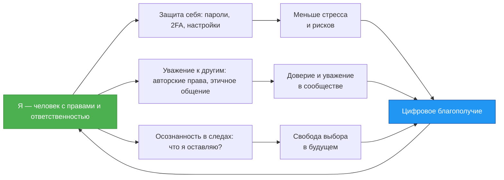

import RandomChecklistItem from '@site/src/components/RandomChecklistItem';

# Цифровая гигиена

  ОБЯЗАТЕЛЬНО
  ДЛЯ НОВИЧКОВ

Начальный уровень

  
Интерактив

  

  Демо ниже — нажимайте кнопки и смотрите, как это устроено. Ничего на компьютере не меняется.

  

<RandomChecklistItem />

---

## Цифровая гигиена

**Цифровая гигиена** — привычки и правила безопасной и уважительной работы в сети — учётные записи, пароли, общение, публикации и понимание того, что данные могут сохраняться надолго.

> **Цифровая гигиена** — система повседневных действий, которые помогают защитить себя, соблюдать границы других и осознанно оставлять цифровой след.

Как гигиена тела (мытьё рук, чистка зубов), цифровая гигиена — **регулярные** простые действия в интернете и в приложениях.

Три опоры:

1. **Защита себя** — пароли, двухфакторная аутентификация, настройки приватности, распознавание фишинга.  
2. **Уважение к другим** — авторские права, этичное общение, отказ от кибербуллинга.  
3. **Цифровой след** — понимание, что сообщения, фото и лайки могут сохраняться и влиять на репутацию позже.

  
Примечание

  

  Те же принципы — лимиты, автовоспроизведение, проверка тревожных новостей — полезны и бабушкам с дедушками, у которых реже был отдельный урок цифровой гигиены.

  Объясняй спокойно, без насмешек — [настройка телефона для пожилых](/encyclopedia/1-basics/1-12-sovety-dlya-novichka/6), [почему ленВы устроены так же, как у подростков](/encyclopedia/1-basics/1-04-kak-vidyat-it-obychnye-lyudi/2#уязвимость-старшего-поколения).

  

Ниже — разбор основных тем по каждому блоку.

---

### Вы — не "пользователь". Вы — *человек с идентичностью*

Когда Вы заходите в соцсеть, игру или почту, система "видит" Вас через **цифровую идентичность** — набор данных, который собирается о Вам:  
- что Вы искали в поисковике,  
- какие видео смотрел,  
- с кем переписывался,  
- где был (если разрешили геолокацию),  
- даже *сколько времени* Вы смотрели на определённую кнопку.

Это не обязательно "плохо". Например, если Вы часто ищете видео по рисованию, YouTube может предлагать Вам новые уроки — и это удобно. Но если кто-то соберёт *слишком много* таких данных, он сможет предсказать:  
- чем Вы интересуетесь,  
- когда Вы бываете дома,  
- что Вас расстраивает или радует,  
- какие решения Вы, скорее всего, примете.

Это как если бы незнакомец стоял за Вашей спиной и записывал всё, что Вы читаете, говорите, рисуете — *без Вашего согласия*. Неприятно? Да. А ведь в цифровом мире такое возможно — если Вы не знаете, как защищаться.

**Первый принцип цифровой гигиены**:  
> *Если сервис или приложение просит доступ — всегда спрашивай: "Зачем ему это?"*  
> — Зачем фонарику на телефоне нужен доступ к моим контактам?  
> — Зачем игре знать моё точное местоположение?  
> — Зачем приложению для рисования читать мои SMS?

Если ответа нет — скорее всего, за этим стоит сбор данных. И тогда у Вас есть выбор:  
- отказать в доступе (часто это не ломает функционал),  
- поискать альтернативу (есть приложения, которые не следят),  
- использовать сервис без регистрации (например, открытые библиотеки или offline-программы).

---

### Пароль — это не "ключ от двери". Это *условный сигнал доверия*

Многие думают: "Мой пароль никто не угадает — я написал дату рождения собаки плюс восклицательный знак". Но современные программы могут перебрать *миллиарды* комбинаций за минуту. А если сайт, где Вы зарегистрировся, будет взломан — Ваш пароль окажется в открытом списке, и его попробуют ввести на *других* сайтах (например, в почту или банк).

Вот как строится надёжная защита:

| Уровень | Что делать | Почему |
|--------|------------|--------|
| **1. Уникальность** | Для *каждого* аккаунта — свой пароль. Никаких `Timur123` везде. | Если один сайт украдёт пароль — остальные останутся в безопасности. |
| **2. Сложность** | Длина важнее "сложных символов". Лучше фраза: `синий_кит_пьёт_чай_в_среду` — чем `Tr7#mK!`. | Такой пароль долго подбирать, но легко запомнить. |
| **3. Хранение** | Никогда не пишите пароли на листочке или в заметках без шифрования. Используйте *менеджер паролей* (например, Bitwarden — бесплатный и открытый). | Он сохраняет всё зашифрованным и автозаполнит при входе. Вы запоминаете *один* мастер-пароль — а он — сотни. |

> **Задача 1 (8–10 лет)**  
> Придумайте три *надёжных* пароля-фразы на темы — "космос", "животные", "школа". Каждый должны быть не короче 4 слов. Проверьте: можно ли их легко вспомнить? Можно ли их спеть?  
>   
> **Задача 2 (11–16 лет)**  
> Установите Bitwarden (bitwarden.com), создайте учётную запись, сохраняете в нём три тестовых пароля (например, для фейковых аккаунтов `test1@example.com`). Настрой автозаполнение в браузере. Напишите, сколько времени это заняло и что показалось сложным.

---

### Цифровой след — всё, что Вы оставляете — остаётся *где-то*

Когда Вы что-то публикуете — фото, комментарий, лайк — Вы думаете: "Это же просто для друзей". Но:
- Даже удалённое сообщение мог скопировать кто-то другой.  
- Серверы хранят логи — кто, когда, откуда заходил.  
- Поисковые системы индексируют почти всё.  
- Иногда государственные органы или суды могут запросить эти данные.

Это не повод бояться — это повод **думать на шаг вперёд**.

> **Вопрос перед публикацией**:  
> *"Буду ли я гордиться этим через 5 лет? Не поставит ли это в неловкое положение меня или кого-то другого?"*

Цифровой след — как следы на снегу. Даже если Вы их "замёл", опытный следопыт может их восстановить. Но Вы можете *сам* решать, какие следы оставлять:  
- След любознательного исследователя (Ваши проекты на GitHub, статьи в блоге),  
- След доброго друга (поддержка в комментариях, помощь в чатах),  
- След творца (музыка, рисунки, код).

А вот следы злости, насмешек, плагиата — их трудно стереть. Они могут повлиять на приём в университет, на работу, на репутацию.

---

### Авторские права

Многие думают: "Картинка в Google — значит, она свободная". Это ошибка.

> **Авторское право возникает автоматически** — в момент создания произведения — рисунка, текста, кода, музыки. Не нужно "регистрировать" — оно уже *есть*.

Это **система уважения труда**. Представьте — Вы потратили неделю на рисунок, а кто-то просто скопировал его и выдал за свой — и получил за это лайки, славу, даже деньги. Справедливо?

Вот как поступать правильно:

| Что хотите использовать | Как поступить |
|------------------------|---------------|
| Фото из Google | Найдите источник. Если не указано `CC0` (общественное достояние) или `CC BY` (можно с указанием автора) — *не бери*. Используйте сайты: [Pixabay](https://pixabay.com/), [Unsplash](https://unsplash.com/), [Wikimedia Commons](https://commons.wikimedia.org/). |
| Музыка в видео | Ищите треки с лицензией `Creative Commons`. Например, на [Free Music Archive](https://freemusicarchive.org/). Или создайте свою — даже в простом приложении типа BandLab. |
| Код из интернета | Если это открытый проект (например, на GitHub), посмотрите файл `LICENSE`. Если нет лицензии — автор *не разрешили* использование. Скопировать — значит украсть труд. |
| Пересказ идеи | Это *можно* — если Вы *переформулируете* своими словами и укажете, где об этом впервые прочитал (это называется *цитирование*). |

> **Задача 3 (все возрасты)**  
> Найдите в интернете изображение кота. Попробуйте определить — кому оно принадлежит? Есть ли лицензия? Как Вы это понял? Сравни три разных сайта — Google Images, Pixabay, Wikimedia Commons — чем они отличаются по информации о правах?

---

### Конфиденциальность

Конфиденциальность — **контроль**: *кто* имеет право знать *что* и *зачем*.

Например:  
- Вы можете рассказать другу, что расстроился, но не хотите, чтобы об этом узнали весь класс.  
- Вы готов показать проект учителю, но не хотите, чтобы его скачали и выдали за свой.  
- Вы разрешаете маме видеть Ваши оценки в электронном дневнике, но не хотите, чтобы они публиковались в соцсети.

**Инструменты контроля**:
- Настройки приватности в соцсетях ("Кто видит мои посты?")  
- Шифрование переписки (Signal, Telegram *в секретных чатах*)  
- Двухфакторная аутентификация (2FA) — когда для входа нужен не только пароль, но и код из приложения  
- Использование *никнеймов*, если не хотите раскрывать настоящее имя

> **Правило**:  
> *Чем личнее информация — тем меньше круг тех, кому Вы её даёте. И чем больше выгода *не Вам*, а *им* — тем выше риск.*

---

### Цифровая этика — как быть хорошим жителем цифрового города

Этика — это не "правила от взрослых". Это **соглашение между людьми**, чтобы всем было комфортно жить вместе.

В цифровом мире оно проявляется так:

- **Не кибербулли** — даже если Вы злитесь, не публикуй оскорбления. Лучше выключи устройство и поговори с кем-то вживую.  
- **Не распространяйте слухи** — перед тем как переслать "страшную новость", проверьте: есть ли источник? Проверено ли это?  
- **Помогай** — если видите, что кто-то в чате не понимает, как что-то сделать — объясни. Вы когда-то тоже не знал.  
- **Признавай ошибки** — если Вы что-то написал резко, и Вам указали на это — извинись. Это не слабость. Это сила.

---

### Цифровая гигиена — как цикл заботы

> **Как читать схему**:  
> Всё начинается с понимания: *я — субъект*. Из этого вытекают три направления заботы. Их результат — *цифровое благополучие*: когда Вы чувствуете себя свободно, безопасно и с достоинством. И это возвращает Вас к исходной точке — к осознанному выбору.

---

### Стуаци, в которые попадают почти все — и как из них выходить с достоинством  

#### Стуация 1. "Бесплатная раздача" — новая игра, скин, промокод, подписка

Вы видите пост: *"Бесплатно выдаём 1000 Robux! Жмите сюда → [ссылка]"*.  
Это не просто обман. Это **инженерия доверия** — когда злоумышленники используют то, что Вам *действительно интересно*, чтобы заставить нарушить правило.

🔬 **Как это работает**:
1. Вы переходите по ссылке — попадаете на сайт, похожий на официальный (тот же логотип, те же кнопки).  
2. Вас просят "подтвердить аккаунт": ввести логин и пароль от Roblox/Instagram/Steam.  
3. Данные уходят к мошенникам.  
4. Через минуту Ваш аккаунт уже не Ваш.

**Ключевой признак**:  
> *Официальные компании **никогда** не просят вводить пароль вне своего сайта.*  
Никогда. Ни через Telegram-бота. Ни через "форму регистрации". Ни через "проверку возраста".

**Что делать**:
- Посмотрите адресную строку: начинается ли она с `https://www.roblox.com/`? Если нет — закройте.  
- Наведи курсор на кнопку *до клика* — внизу браузера покажется настоящая ссылка. Если там `bit.ly/xyz` или `roblox-free.gift` — это подделка.  
- Спросите у взрослого: "Вы слышали про такую раздачу?"  
- Сообщи о фейке в самой соцсети (есть кнопка "Пожаловаться → Мошенничество").

> **Задача 4 (8–12 лет)**  
> Нарисуйте "знаки опасности" — что должно всплыть в голове, если Вы видите "бесплатный Fortnite V-Bucks"? (Например — *"Почему им не жалко?", "Где кнопка “О компании”?", "Почему нет отзыва от друзей?"*). Составьте 5 таких вопросов-сигналов.

> **Задача 5 (13–16 лет)**  
> Найдите в Google фразу `site:roblox.com free robux`. Посмотрите результаты. Что общего у официальных страниц? Как они отличаются от фейковых (например, тех, что в рекламе выше)? Напишите краткий гид "Как не попасться на Robux-раздачу".

---

#### Стуация 2. "Срочно! Вас взломали!" — паника как инструмент  

Вы получаете SMS:  
> *"Ваш аккаунт ВКонтакте заблокирован. Войдите здесь для восстановления: vkontakte-help.ru"*  

Или письмо:  
> *"Google обнаружил подозрительную активность. Подтвердите личность: google-secure[.]net/login"*

Это — **фишинг** (от англ. *phishing* — "рыбная ловля"). Вас не крадут — Вас *ловят*, используя страх.

🧠 **Почему срабатывает?**  
Потому что мозг в стрессе переключается в режим "быстро действовать". А злоумышленники *имитируют экстренность* — красные кнопки, восклицательные знаки, слова "последнее предупреждение".

**Как не поддаться**:
1. **Остановитесь**. Сделайте паузу — 30 секунд. Выдохни.  
2. **Не кликайте**. Откройте официальное приложение *вручную* — из меню телефона или закладок. Зайдите туда — если всё работает, значит, угрозы нет.  
3. **Проверьте отправителя**:  
   - Настоящие уведомления от Google/VK приходят *внутри приложения* или на почту, привязанную к аккаунту.  
   - Номер SMS — не короткий (например, 7777), а обычный, часто заграничный.  
   - Адрес письма — `support@vkontakte-help.ru` (подделка!).

Золотое правило:  
> *Если Вас просят срочно ввести пароль, код, номер карВы — это почти наверняка обман. Настоящие сервисы **никогда** не запрашивают такие данные по ссылке из письма или SMS.*

---

#### Стуация 3. "Просто перешли — не удалят аккаунт"  

Вы видите в чате:  
> *"Если не перешлёте это сообщение 10 друзьям в течение 5 минут — Ваш аккаунт в TikTok заблокируют"*  

Это — **манипуляция через страх и стыд**.  
Цель — заставить *распространить ложь*. Чем больше пересылок — тем "правдоподобнее" кажется угроза.

🔍 Почему это невозможно?  
- TikTok (и любая крупная соцсеть) **не может** удалить аккаунт из-за того, что Вы *не переслал сообщение*. У них нет такой функции.  
- Блокировка происходит только за нарушения правил (оскорбления, порнография, боты) — и всегда с уведомлением *внутри приложения*.

Что делать:
- Не пересылай.  
- Напишите в чат: *"Это фейк. TikTok так не делает. Давайте не пугать друг друга"*.  
- Если в чате настаивают — выйди из чата и сообщи модераторам.

> **Задача 6 (все возраста)**  
> Придумайте "анти-страшилку" — добрую версию такой же механики. Например:  
> *"Если перешлёте это сообщение 5 друзьям — мы соберём 10 000 ₽ на приют для животных (проверенный сбор на Добро Mail.Ru)"*.  
> Обсуди: почему такая версия *призыв к действию*? Чем она отличается от манипуляции?

---

### Как управлять настройками приватности — пошагово  

Давайте разберём три самых популярных у детей/подростков платформы — **Telegram**, **VK**, **Roblox**.  
Важно: настройки меняются, но *принципы* остаются. Мы учим *как думать*.

---

#### Telegram  
> Цель — чтобы незнакомцы не видели Ваш номер, не добавляли в чаВы без спроса, не сохраняли Ваши фото.

| Что настроить | Как | Зачем |
|--------------|-----|-------|
| **Кто видит номер телефона** | Настройки → Конфиденциальность → Номер телефона → "Никто" или "Мои контакты" | Чтобы не получить спам или звонки от мошенников |
| **Кто может добавлять в группы/каналы** | Конфиденциальность → Группы и каналы → "Контакты" или "Никто" | Чтобы не втянули в нежелательный чат |
| **Кто видит "последнее посещение"** | Конфиденциальность → Последнее посещение → "Никто" (или "Контакты") | Чтобы не выдавалось, когда Вы онлайн (и не ловили в момент слабости) |
| **Автосохранение медиа** | Настройки → Данные и хранилище → Автозагрузка → Отключите для "Чатов с незнакомцами" | Чтобы не засорялась память и не сохранялись нежелательные фото |

Совет: включите **секретные чаты** для переписки с близкими друзьями. Там:  
- Сообщения не хранятся на серверах,  
- Можно поставить таймер удаления (например, 1 минута после прочтения),  
- Нельзя сделать скриншот (на iOS/Android будет уведомление).

---

#### VK (ВКонтакте) 

> Цель — чтобы посты, фото, список друзей не видели все подряд.

| Что настроить | Как (2025, актуально) | Зачем |
|--------------|------------------------|-------|
| **Кто видит мои записи** | Настройки → Приватность → Записи на стене → "Только друзья" | Чтобы личные мысли не читали одноклассники или учителя без приглашения |
| **Кто может комментировать** | Там же → Комментари к записям → "Друзья" | Чтобы не писали анонимные оскорбления |
| **Скрыть "онлайн"** | Настройки → Приватность → Информация обо мне → Статус "онлайн" → "Только я" | Чтобы не создавать давление "Вы же онлайн — почему не отвечаете?" |
| **Кто видит, кого я добавил в друзья** | Приватность → Друзья → "Только я" | Чтобы не знали Ваш круг общения |

Важно: если Вы публикуете что-то **в группе**, настройки приватности *личного профиля* не работают. В группе могут видеть все подписчики — даже незнакомцы. Поэтому:  
- Не пости в открытые группы то, что не хотите видеть в поиске через 5 лет.  
- Используйте "Закрытые группы" для проектов с друзьями.

---

#### Roblox  

> Цель — чтобы незнакомцы не писали Вам, не приглашали в подозрительные игры, не видели имя.

Roblox ориентирован на детей, и у него **строгие настройки по умолчанию для пользователей до 13 лет**. Но после 13 — многое открывается. Проверьте!

| Что проверить | Где (в приложении Roblox) | Что выбрать |
|--------------|---------------------------|-------------|
| **Контакты** | Настройки → Конфиденциальность → КонтакВы | "Никто" (если младше 16) или "Друзья" |
| **Чат и сообщения** | Там же → Чат | "Друзья" или "Никто" — особенно если Вы в играх часто |
| **Имя пользователя в чате** | Настройки → Аккаунт → Имя отображения | Не используйте настоящее имя. Лучше ник: `SpacePanda_2025` |
| **Игры с чатом** | Перед входом в игру → нажмите "i" → посмотрите "Рейтинг" | Избегайте игр с рейтингом 13+ и открытым чатом, если не увереныыы в модерации |

Совет: включите **режим родительского контроля**, даже если Вам 15+. Он позволяет:  
- Ограничивать время в день,  
- Блокировать покупки,  
- Запрещать чат с незнакомцами.  
Это *инструмент саморегуляции*, как будильник.

---

### Цифровой след в действи — как проверить, что "видно" о Вам  

Попробуем *взглянуть на себя глазами другого человека*.

---

#### Упражнение — "Поиск в Google — как будто Вы чужой"  
1. Выйди из всех аккаунтов (Google, Яндекс).  
2. Откройте браузер в режиме инкогнито (Ctrl+Shift+N).  
3. Введите в поиск:  
   - своё имя и фамилию в кавычках: `"Тимур Тагиров"`  
   - никнейм: `SpacePanda_2025`  
   - школа + класс: `"школа 179 8Б"`  
4. Посмотрите: что находится?  
   - Публичные посты?  
   - Фото с мероприятий?  
   - Комментари в новостях?  
   - Упоминания в школьных сайтах?

Если нашлось что-то, что Вы не хотите видеть — есть два пути:  
- **Запросить удаление** (например, через форму Google: [support.google.com/websearch/answer/7536321](https://support.google.com/websearch/answer/7536321))  
- **"Замаскировать"** — опубликовать больше *положительного контента* (статья в школьном блоге, проект на GitHub, рисунок в открытом альбоме), чтобы он "вытеснил" старое в поиске.

> Это называется **поисковая репутация** — и ею можно управлять.

---

### Цифровой след во времени — как данные "живут" после Вас  

Когда Вы удаляете пост, фото или сообщение, создаётся ощущение, что оно *исчезло*. Но в цифровом мире "исчезновение" — понятие условное.

Ниже — что происходит "под капотом".

---

#### Этапы жизни цифрового следа

| Этап | Что происходит | Пример | Можно ли удалить полностью? |
|------|----------------|--------|------------------------------|
| **1. Создание** | Вы публикуете пост, отправляете сообщение, скачиваете файл. | Пост в VK: "Сегодня получил двойку…" | Да — пока не отправил. |
| **2. Хранение на сервере** | Данные сохраняются на дисках компании (Google, VK, Telegram). | Сервер VK дублирует пост в трёх дата-центрах. | Да — при удалении *Вы* просите сервер стереть запись. Но… |
| **3. Резервное копирование** | Серверы делают бэкапы (на случай авари) — ежедневно, еженедельно, ежемесячно. | Бэкап от 5 мая хранится 90 дней. | Нет — пока срок хранения бэкапа не истечёт. |
| **4. Кэширование** | Поисковики (Google, Яндекс) делают "снимки" страниц — чтобы быстрее показывать. | Google сохранил Ваш пост в кэше 5 дней назад. | Можно запросить удаление из кэша (но не мгновенно). |
| **5. Копирование другими** | Кто-то сделали скриншот, сохранил в архив, переслал. | Друг отправил скрин Вашего поста в закрытый чат. | Нет — Вы не контролируете чужие устройства. |

**Вывод**:  
> *Удаление — это просьба "перестать показывать", а не "стереть из истории".*  
> Поэтому ключевой навык — **думать до публикации**.

---

#### Что такое "удаление" на самом деле?  

Когда Вы жмёте "Удалить" в Instagram:  
- Фото исчезает из ленВы *для новых посетителей*,  
- Но оно может оставаться в:  
  - Базе данных Meta (до 90 дней в бэкапах),  
  - Кэше Google,  
  - У друзей, которые его сохранили,  
  - Архивах типа Wayback Machine (если страница была проиндексирована).

Аналогия:  
> Представьте, что Вы написали записку, отдал её другу, а потом сказали: "Забудь".  
> Он может уничтожить записку — но если он уже пересказали содержание третьему человеку, Вы не можете стереть *его память*.

---

#### Можно ли "стереть след полностью"?  

Технически — **нет**, если данные уже вышли за пределы Вашего контроля.  
Но практически — **да**, если действовать быстро и грамотно.

---

##### Стратегия "Цифрового выведения следа"

1. **Удалите оригинал** — как можно быстрее.  
2. **Запроси удаление из кэша**:  
   - Google: [google.com/webmasters/tools/removals](https://search.google.com/search-console/remove-outdated-content)  
   - Яндекс: [yandex.ru/support/webmaster/controlling-robot/removing-documents.html](https://yandex.ru/support/webmaster/controlling-robot/removing-documents.html)  
3. **Обратись к тому, кто распространил**: вежливо попроси удалить (часто помогает).  
4. **Замести след**: опубликуй *новый*, позитивный контент с теми же ключевыми словами — он постепенно заменит старое в поиске.

> Это как посадить деревья на месте старой свалки: мусор под землёй остаётся, но сверху — лес.

---
