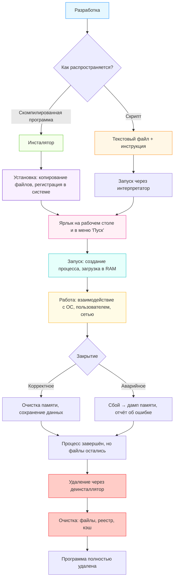

import ExternalPlayEmbed from '@site/src/components/ExternalPlayEmbed';

# Программы

  ОБЯЗАТЕЛЬНО
  ДЛЯ НОВИЧКОВ

Начальный уровень

  
Интерактив

  

  Демо ниже — нажимайте кнопки и смотрите, как это устроено. Ничего на компьютере не меняется.

  

<ExternalPlayEmbed example="system-network/os-stack-play" title="Стек операционной системы" />

---

## Программа

### Что такое программа и как она работает  

Вы пришли в кухню и хотите испечь блинчики. Вы уже знаете рецепт — взять яйцо, молоко, муку, взбить, налить на сковородку, подождать, перевернуть… Это **алгоритм** — пошаговая инструкция, как что-то сделать.

Теперь представьте, что вместо вас на кухне стоит робот. Он не понимает слов "взбей" или "подожди", если Вы не объясните *очень точно*, что это значит. Например:  
— взять вилку,  
— вращать запястье по часовой стрелке 30 раз за 10 секунд,  
— остановиться, когда пена появится на поверхности…  

Компьютер — это и есть такой робот. Он умный, но буквальный — он делает *только то*, что ему сказано, и *только так*, как ему сказано.  

**Программа** — это и есть такая точная инструкция для компьютера. Это текст (часто на специальном языке — например, Python или JavaScript), в котором по шагам описано, что компьютер должен делать — показать окно, нарисовать кнопку, посчитать сумму чисел, отправить сообщение…  

Программа не "думает". Она не "хочет" и не "понимает". Она просто *выполняет команды одну за другой*, как робот по рецепту. Скорость выполнения — миллионы команд в секунду. Поэтому кажется, что компьютер "сам всё делает", но на самом деле — он *читает программу и следует ей*.

Компьютер не видит программу сразу целиком. Он загружает её в память и начинает выполнять — построчно, от первой команды к последней (если не сказано иначе). Одна программа может управлять другой. Например, ваш браузер — это программа, которая запускает другие программы (видеоплеер, редактор текста) или читает *скрипты* — мини-программы, встроенные в веб-страницы.

Ключевая мысль:  
**Программа — это инструкция.**  
**Компьютер — исполнитель этой инструкции.**  
**Без инструкции компьютер — просто коробка из металла и пластика.**

---

### Правила работы с программами  

Работа с программами — не волшебство. Это как езда на велосипеде — сначала непривычно, потом — легко, если соблюдать правила. Вот главные из них:

---

#### 1. Программа должны быть **для вашей операционной системы**  

Windows, macOS, Android, iOS — это разные "миры". Программа, написанная для Windows (`.exe`), не запустится на iPhone. Как книга на французском не прочитается человеком, который знает только русский — пока не будет перевода (или специального "переводчика", вроде эмулятора).

---

#### 2. Не запускайте программы из ненадёжных источников  

Любая программа имеет право делать с компьютером почти всё — читать файлы, отправлять данные в интернет, удалять папки. Вредоносная программа (вирус) — это просто *злонамеренная инструкция*. Поэтому важно:  
— скачивать только с официальных сайтов или проверенных магазинов (App Store, Google Play, Microsoft Store),  
— не открывать "подарочные" файлы от незнакомцев (особенно `.exe`, `.bat`, `.scr`),  
— читать, какие разрешения запрашивает программа при установке ("доступ к камере?" — зачем калькулятору камера?).

---

#### 3. Программы нужно обновлять  

Авторы программ постоянно находят в них ошибки — "баги". Некоторые из них могут быть опасными. Обновление — это как замена старого, потрескавшегося шланга в машине: не обязательно *сегодня* случится поломка, но лучше сделать заранее. Большинство программ обновляются автоматически — просто разрешите это в настройках.

---

#### 4. Одна и та же задача — разные программы  

Хотите рисовать? Есть Paint (простой), Krita (для художников), Photoshop (профессиональный). Хотите писать код? Блокнот — можно, но неудобно. А VS Code, PyCharm — это как письменный стол с подсветкой, полками и лупой. Выбор зависит от цели, опыта и вкуса. Нет "лучшей" программы — есть *подходящая*.

---

### Исполняемые файлы 

Когда Вы видите файл с расширением `.exe` (Windows), `.app` (macOS), `.apk` (Android) — это **исполняемый файл** (executable). Его можно сравнить со *стартовой кнопкой* или *пусковым ключом*:  
— вставить ключ в замок → повернуть → двигатель завёлся.  
— дважды кликнуть по `.exe` → операционная система загружает код → программа запускается.

Но:  
Сам по себе `.exe` — это только "запускатель". Часто рядом с ним лежат другие файлы — картинки, звуки, настройки, библиотеки (готовые блоки кода, которые программа использует).  
Если убрать или повредить эти "спутники" — программа может не заработать, хотя `.exe` остался цел.  
Умные программы устанавливаются через **инсталлятор** — особую программу-помощника, которая сама раскладывает все файлы по нужным папкам, создаёт ярлыки, добавляет пункт в меню "Пуск".

> *Запомните: исполняемый файл — это "нервный импульс". Без тела (файлов, данных) импульс ни к чему не приведёт.*

---

### Как запускать, устанавливать и удалять программы  

#### ▶ Запуск 

— *Ярлык* на рабочем столе или в меню "Пуск" — ссылка на исполняемый файл. Нажимаете → запускается.  
— *Поиск* (Win + S, Spotlight на Mac) — вводите название, выбираете программу → Enter.  
— *Командная строка* — для продвинутых: `notepad`, `code .`, `python script.py` — прямо ввести имя программы.

---

#### 📦 Установка 

1. Скачиваете **инсталлятор** (обычно `.exe`, `.msi`, `.dmg`, `.pkg`).  
2. Запускаете его — появляется "мастер установки".  
3. Читаете лицензию (хотя бы мельком), выбираете путь установки (лучше оставить по умолчанию), отменяете ненужные предложения ("установить панель инструментов?" — почти всегда "нет").  
4. Ждёте — программа копирует файлы, регистрирует себя в системе.  
5. Готово! Появляется ярлык, иконка в меню.

---

#### 🗑 Удаление  

**Неправильно:** просто удалить ярлык → программа останется, но Вы не найдёте, как её запустить.  
**Правильно:**  
— *Через "Панель управления" → "Программы и компоненты"* (Windows),  
— *Через "Настройки" → "Приложения"* (macOS),  
— *Через настройки телефона → "Приложения"* (Android/iOS).  

Там Вы видите **список всех установленных программ**. Выбираете нужную → "Удалить". Система запускает *деинсталлятор* — программу-уборщика, которая удаляет не только исполняемый файл, но и все связанные данные, настройки, временные файлы. Иногда остаются "следы" (например, документы, которые Вы сами создали), но сама программа — исчезает.

> ⚠️ **Ярлык ≠ Программа.** Удаление ярлыка — как вырвать табличку с названием магазина. Магазин (программа) остался, просто Вы не знаете, где его искать.

---

### Что происходит "под капотом" при запуске программы  

Когда Вы дважды щёлкаете по ярлыку — кажется, ничего не происходит. На самом деле запускается целая цепочка событий, похожая на запуск космической ракеты: миллионы проверок, переключений и передач данных. Рассмотрим это по шагам — без жаргона, но без упрощений.

---

#### Шаг 1. Операционная система получает команду  

Вы нажали на ярлык → система понимает: "Нужно запустить *вот этот* `.exe`". Она проверяет:  
— существует ли файл по указанному пути,  
— есть ли у вас право на его запуск (например, администратор может запретить запуск определённых программ),  
— не повреждён ли файл (по контрольной сумме или цифровой подписи).

Если всё в порядке — начинается **загрузка**.

---

#### Шаг 2. Загрузка в оперативную память (RAM)  

Жёсткий диск (или SSD) — это как библиотека:

- много книг (файлов);
- но чтобы читать — нужно взять книгу с полки;
- положить на стол.
Оперативная память (RAM) — это как *стол* — быстрая, удобная, но временная (когда выключили свет — стол пуст).  

Программа копируется **целиком или частями** из долговременного хранилища (SSD/HDD) в RAM. Только оттуда процессор может её *выполнять* — читать команды по одной.

---

#### Шаг 3. Создание процесса  

Операционная система выделяет программе:
- **Память** (место в RAM под код, данные, текущие значения переменных),  
- **Ресурсы** (доступ к экрану, клавиатуре, файлам, сети — если разрешено),  
- **Поток выполнения** — "нить", по которой бежит исполнение: первая команда → вторая → третья…

Этот "пакет" (память + ресурсы + поток) называется **процесс**. Каждая запущенная программа — это один или несколько процессов. Например, браузер может создать отдельный процесс для каждой вкладки — чтобы, если одна вкладка зависнет, остальные продолжали работать.

---

#### Шаг 4. Передача управления процессору  

Процессор (CPU) — это "читатель инструкций". Он не думает, он *исполняет*.  
Он смотрит: "Какая следующая команда у этого процесса?" → читает её из RAM → выполняет → переходит к следующей.

Пример команды (на уровне процессора):  
`ADD R1, R2` → сложить числа из двух ячеек памяти и положить результат в третью.  
Ваша программа, написанная на Python или C#, *компилируется* или *интерпретируется* в такие простые команды — миллионы за секунду.

---

#### Шаг 5. Взаимодействие с пользователем и системой  

Программа рисует окно → просит у операционной системы: "Выдели мне прямоугольник на экране размером 800×600".  
Вы печатаете текст → клавиатура отправляет сигнал → система передаёт его программе → программа решает: показать букву? Сохранить? Заблокировать (если это пароль)?  
Нажимаете кнопку → программа получает событие "клик" → запускает функцию, привязанную к этой кнопке.

Всё это происходит **асинхронно**: процессор переключается между десятками процессов каждую миллисекунду, создавая иллюзию одновременной работы.

> 🔍 **Интересный факт**: если программа "зависла", это часто значит:  
> — она зациклилась (выполняет одну и ту же команду бесконечно),  
> — ждёт ответа от чего-то (сервера, диска), а ответ не приходит,  
> — исчерпала память или права.

---

### Чем скрипт отличается от программы  

Многие думают: "Скрипт — это маленькая программа". Это **не совсем так**. Разница — в *способе выполнения*.

| Характеристика | Программа (скомпилированная) | Скрипт (интерпретируемый) |
|----------------|------------------------------|---------------------------|
| **Формат файла** | Исполняемый файл: `.exe`, `.dll`, бинарный код | Текстовый файл: `.py`, `.js`, `.sh` |
| **Как запускается** | Напрямую процессором (через ОС) | Через **интерпретатор** — отдельную программу (например, `python.exe`, `node.exe`) |
| **Скорость** | Очень высокая (готовый машинный код) | Медленнее (интерпретатор читает и выполняет строку за строкой) |
| **Зависимости** | Часто автономна (всё "внутри") | Требует установленного интерпретатора и библиотек |
| **Пример** | Photoshop, Minecraft (Java-версия — скомпилирован в `.jar`, но всё равно требует JVM), VLC | Скрипт для автоматической смены обоев, сайт на JavaScript, макрос в Excel |

---

#### Аналогия

Программа — это книга, напечатанная на языке, который Вы *уже знаете*. Вы просто берёте и читаете.  
Скрипт — это книга на иностранном языке. Чтобы её прочитать, вам нужен **переводчик**, который сидит рядом и шепчет перевод каждой фразы в реальном времени. Переводчик — это интерпретатор.

> ✅ Программа: "запусти меня сам"  
> ✅ Скрипт: "найдите моего друга-переводчика, и он запустит меня"

Современные технологии стирают границы:  
— JavaScript в браузере — скрипт, но с помощью **JIT-компиляции** (Just-In-Time) часто компилируется "на лету" в быстрый код.  
— Python-скрипВы можно "упаковать" в `.exe` с помощью PyInstaller — тогда они становятся программами (но внутри всё равно несут интерпретатор).

**Главное**: и то, и другое — инструкции для компьютера. Выбор зависит от задачи, скорости, переносимости и удобства разработки.

---

### Удаление ярлыка — не удаление программы  

(Расширим эту мысль, введённую ранее)

Ярлык — это **указатель**, **ссылка**, **дорожный знак**. Он не содержит саму программу. Это файл `.lnk` (Windows) или `alias` (macOS), в котором записано:  
`Цель: C:\Program Files\MyApp\myapp.exe`  
`Рабочая папка: C:\Program Files\MyApp\`  
`Иконка: ...`

Если Вы удаэто ярлык — Вы просто убрали *указатель*. Программа осталась на месте. Это как убрать табличку "Магазин "Молоко"" с улицы: магазин работает, но прохожие могут не найти.

---

#### Как проверить?  
1. Откройте "Панель управления" → "Программы и компоненты".  
2. Найдите программу в списке — она там есть? Значит, установлена.  
3. Или зайдите в папку, где она стояла (например, `C:\Program Files\`), — файлы на месте?

---

#### Почему это важно?  

— Ребёнок удалил ярлык, думая, что "почистил компьютер" → программа всё ещё занимает место, грузит систему при старте, может передавать данные.  
— Вирусы часто создают *вредоносные ярлыки*, имитирующие полезные программы. Удаление такого ярлыка не избавит от угрозы — нужно удалить саму программу.

> ✅ Правило: **Удаляйте программы через системный деинсталлятор — не через ярлыки и не через проводник.**

---

### Жизненный цикл программы  

Ниже — схема на языке **Mermaid**, иллюстрирующая путь программы от разработки до удаления. Её можно вставить в веб-версию *"Вселенной IT"* — современные движки (например, Obsidian, Docsify, MkDocs) поддерживают Mermaid "из коробки".

> **Как читать схему**:  
> — Стрелки показывают последовательность.  
> — Ромб — выбор (компиляция vs скрипт).  
> — Цвета группируют этапы — разработка (синий), распространение (зелёный/оранжевый), установка (фиолетовый), запуск (розовый/бирюзовый), работа (жёлтый), удаление (красный).  
> — Даже после закрытия программа *физически остаётся* — удаление — отдельный, осознанный шаг.

---
