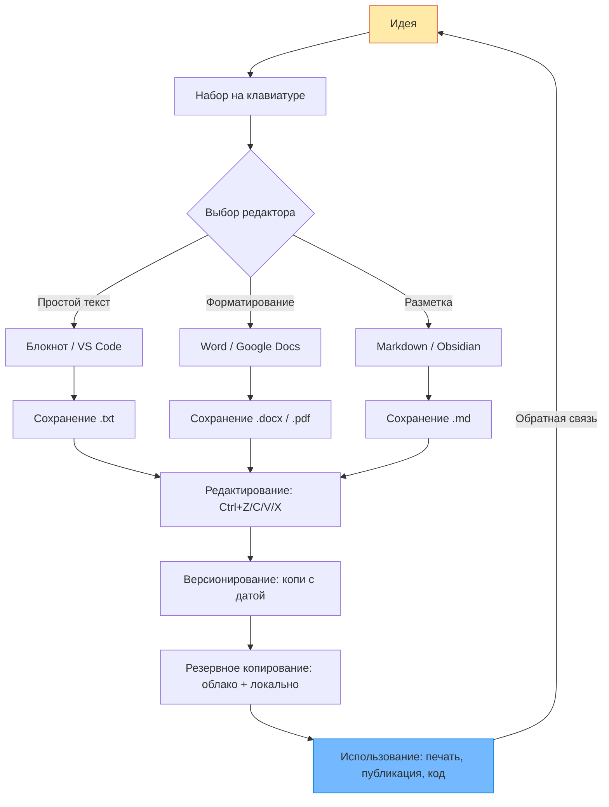

import ExternalPlayEmbed from '@site/src/components/ExternalPlayEmbed';


# Текст

<div class="article-tags">
  <span class="tag tag-required">ОБЯЗАТЕЛЬНО</span>
  <span class="tag tag-beginner">ДЛЯ НОВИЧКОВ</span>
</div>

<span class="complexity-badge">Начальный уровень</span>

<div class="callout callout--tip">
  <div class="callout-title">Интерактив</div>

  <div class="callout-body">
  Демо ниже — нажимайте кнопки и смотрите, как это устроено. Ничего на компьютере не меняется.
</div>
  </div>


<ExternalPlayEmbed example="basics/typing-play" title="Typing" />

---

## Текст

### Что такое текст?

Вы хотите рассказать другу историю про кота, который научились управлять роботом-пылесосом. Вы можете рассказать её устно — и это будет *устная речь*. А можете записать на бумаге или в компьютере — и тогда получится *текст*.

**Текст** — это последовательность слов, предложений, цифр, знаков препинания и даже специальных символов (например, `@`, `#`, `€`), выстроенных в определённом порядке, чтобы передать смысл.

Важно понимать:  
- Текст *не обязательно* должны быть литературным. Сообщение в чате — текст. Код программы — тоже текст (хотя и особенный). Даже список покупок в телефоне — это текст.  
- Текст *не привязан к бумаге*. Он может жить в компьютере, на телефоне, на сервере в облаке — везде, где есть способ хранить символы.  
- **Символ** — самая маленькая "единица" текста. Буква `А`, цифра `7`, точка `.`, пробел между словами — всё это символы.

Когда Вы печатаете на клавиатуре, каждое нажатие клавиши заставляет компьютер *запомнить* определённый символ. Но компьютер "помнит" не саму букву, а её *код* — число, по которому можно понять, что это за символ. Например, в системе кодировки UTF-8 (самой распространённой сегодня) буква `А` — это число `1040`, а `a` (латинская) — `97`. Это как если бы у каждого игрока в команде был свой номер на футболке: номер не *есть* игрок, но по нему его легко найти.

Таким образом, **текст в компьютере — это последовательность чисел**, которые программа умеет *отображать* как привычные нам буквы и знаки. Именно поэтому один и тот же файл может "сломаться", если открыть его в программе, которая не знает, какую кодировку использовать: числа на месте, а "футболки" перепутаны.

---

### Как писать текст, в чём писать и как открывать

Чтобы создать текст, Вам понадобится **текстовый редактор** — программа, предназначенная для ввода, редактирования и сохранения текста.

Самый простой редактор — **Блокнот** (Windows) или **TextEdit** (macOS в режиме "Plain Text"). Он умеет только одно — хранить символы, один за другим, без украшений. Это как чистый лист бумаги в тетради — без рамочек, без цветных заголовков, без шрифтов. Зато он быстрый, лёгкий и никогда не "подведёт" — если что-то не работает в сложной программе, скорее всего, в Блокноте будет работать.

Но если Вам нужно сделать презентацию, реферат или оформить пост в блоге — понадобится **продвинутый редактор**, например:
- **Microsoft Word** (платный, устанавливается на компьютер),
- **Google Docs** (бесплатный, работает в браузере),
- **LibreOffice Writer** (бесплатный аналог Word),
- **Notion**, **Obsidian**, **Typora** — современные инструменВы с гибкими возможностями.

---

#### Как открыть редактор?
- В Windows: нажмите кнопку "Пуск", введите *Блокнот* → кликните по значку.
- На macOS: откройте "Finder" → "Программы" → "TextEdit" (и обязательно переключи его в меню "Формат" → "Обычный текст", иначе он будет добавлять скрытое форматирование).
- В браузере: зайди на [docs.google.com](https://docs.google.com) → "+ Пустой документ".

---

#### Как сохранить текст?

Когда Вы написали что-то важное — его нужно *сохранить*, иначе компьютер "забудет" всё при выключении.  
- Нажмите `Ctrl + S` (Windows/Linux) или `Cmd + S` (macOS).  
- В первый раз откроется окно — выберите папку (например, "Документы"), придумайте имя файла (например, `Моя_история_про_кота.txt`) — и нажмите "Сохранить".

Обратите внимание на расширение файла:
- `.txt` — простой текст, без форматирования (Блокнот);
- `.docx` — документ Word (с картинками, шрифтами, таблицами);
- `.odt` — открытый формат LibreOffice;
- `.md` — Markdown (текст с лёгкими метками форматирования, понятный и машинам, и людям);
- `.pdf` — не редактируемый документ для просмотра (как отсканированная книга).

Файл — это *упаковка* для текста. Как книга в обложке: внутри — слова, снаружи — имя и тип.

---

### Основные "волшебные" комбинации — Ctrl+C, Ctrl+V, Ctrl+X, Ctrl+Z

Почти все, кто работает с текстом, рано или поздно сталкивается с необходимостью *переместить*, *скопировать* или *исправить ошибку*. Делать это вручную — долго и неудобно. Поэтому придумали **горячие клавиши** — сочетания клавиш, которые выполняют действия быстрее мыши.

Вот четыре самых важных:

| Комбинация | Что делает | Пример |
|------------|------------|--------|
| `Ctrl + C` | **Копировать** — создаёт *вторую копию* выделенного фрагмента и кладёт её в буфер обмена (специальную "карманную память" компьютера). Оригинал остаётся на месте. | Вы выделили предложение "Кот нажали на кнопку", нажали `Ctrl+C` → теперь это предложение "лежит в кармане". Вы можете вставить его в другое место, и оригинал не исчезнет. |
| `Ctrl + V` | **Вставить** — достаёт из буфера обмена последний скопированный (или вырезанный) фрагмент и вставляет его в текущую позицию курсора. | После `Ctrl+C` Вы поставили курсор в другое место и нажали `Ctrl+V` → появилось "Кот нажали на кнопку". |
| `Ctrl + X` | **Вырезать** — *удаляет* выделенный фрагмент и одновременно кладёт его в буфер обмена. Оригинал исчезает — но его можно вставить снова. | Вы ошибся порядком предложений. Выделил лишнее, нажали `Ctrl+X`, пошёл туда, где оно должно быть, нажали `Ctrl+V` — готово. |
| `Ctrl + Z` | **Отмена** — отменяет *последнее* действие: удаление, вставка, опечатка и даже сохранение (в некоторых программах). Можно нажимать несколько раз — отменится цепочка действий. | Вы случайно удалил абзац. Не паникуй: `Ctrl+Z` — и он вернулся. |

> 🔎 **Почему именно Ctrl?**  
> Клавиша `Ctrl` (Control — "управление") — как "переключатель режима". Она говорит компьютеру: "Сейчас *команда*". Это удобно: руки почти не сдвигаются с основной позиции на клавиатуре.

> ⚠️ В macOS вместо `Ctrl` часто используется `Cmd` ("яблочко") — `Cmd+C`, `Cmd+V`, `Cmd+X`, `Cmd+Z`.

Буфер обмена — временный. Если выключить компьютер или скопировать что-то новое, старое исчезнет. Но есть программы-"буферы с историей" (например, **Ditto** на Windows или **Flycut** на macOS), которые запоминают *много* копий — как блокнот для копирований.

---

### Русская и английская раскладка. Переключение. И как вообще появляются символы?

Когда Вы смотрите на клавиатуру, может показаться, что каждая клавиша — это одна буква. Но это то, что появляется на экране, зависит от **раскладки** — набора правил, по которым компьютер решает: "Если нажата *эта* клавиша *в этом* режиме — показать *вот этот* символ".

---

#### Почему две раскладки?

Компьютер изначально "говорил" на английском — язык программирования, интернет-адреса, команды в терминале почти всегда используют латиницу (`a`, `b`, `c`…). Но люди хотят писать на своём языке — и появились *локализованные раскладки* — русская, немецкая, японская и т.д.

Русская раскладка — это *переназначение* клавиш:  
- клавиша под пальцем, где на физической клавиатуре написано `F`, при включённой русской раскладке даёт букву `А`;  
- клавиша `D` → `В`, `L` → `Д`, и так далее.

Это сделано для удобства: если Вы умеете печатать вслепую на английском, то на русском пальцы будут двигаться почти так же — просто буквы другие.

---

#### Как переключать?

Самые распространённые способы:
- `Alt + Shift` — стандарт Windows (можно изменить в настройках);  
- `Ctrl + Shift` — часто используется в Linux и настроено вручную;  
- `Cmd + Пробел` или `Ctrl + Пробел` — macOS (по умолчанию);  
- клик по значку раскладки в правом нижнем углу (Windows) или верхней панели (macOS).

> Совет: поставь значок раскладки *всегда видимым*. Тогда Вы никогда не начнёте писать "ghbdtn" вместо "привет", не заметив, что печатаете на английском.

---

#### А как получить `!`, `@`, `№`, `&` и другие "секретные" символы?

Многие символы требуют *два шага*:
1. Удержать **модификатор** — клавишу, которая "меняет поведение" других:  
   - `Shift` — временно делает буквы заглавными или "достаёт" верхний символ с клавиши;  
   - `Alt Gr` (справа от пробела, на некоторых клавиатурах) — даёт *третий* символ (часто используется в европейских раскладках);  
2. Нажать основную клавишу.

Примеры (для стандартной русской/английской клавиатуры, Windows):

| Символ | Как набрать | Примечание |
|--------|-------------|------------|
| `!` | `Shift + 1` | На клавише `1` сверху написано `!` |
| `?` | `Shift + /` | Клавиша `/` обычно внизу справа, рядом с правым `Shift` |
| `№` | `Shift + 3` (в русской раскладке) | Только в русской! В английской там `#` |
| `@` | `Alt Gr + 2` **или** `Shift + 2` (в английской) | В русской раскладке `@` часто на `2` с `Shift`, но зависит от настройки |
| `€` | `Alt Gr + 4` (на многих европейских клавиатурах) | В русской — может не быть; тогда `Alt + 0128` на цифровом блоке |
| `→` (стрелка) | Не на клавиатуре. В Word: `Вставка → Символ`, или `Alt + 26` (цифровой блок) | Специальные символы хранятся в таблицах Unicode |

> 🔍 **Unicode** — это огромная таблица, где каждому символу во всех языках мира (и даже смайликам!) назначен уникальный номер. Сегодня почти все системы используют Unicode (в частности, его форму UTF-8), поэтому текст, написанный в Москве, корректно отобразится в Токио или Буэнос-Айресе.

> ✅ Практика: откройте Блокнот и попробуйте набрать:  
> `[ { "имя" — "Кот", "действие": "нажали", "объект": "кнопку №1" } ]`  
> Обратите внимание — каждая скобка, кавычка, двоеточие — это отдельный символ, и каждая требует своего способа ввода.

---

### Редакторы текста — от Блокнота до Google Docs. Форматирование — "одежда для слов"

Слова — это актёры на сцене. Сам текст — это сценарий: кто что говорит, в каком порядке. А **форматирование** — это костюмы, причёски, освещение и музыка. Оно не меняет *суть* слов, но влияет на то, **как их воспринимают**.

---

#### Типы редакторов — по "уровню ответственности"

| Тип | Примеры | Особенности | Когда использовать |
|-----|---------|-------------|---------------------|
| **Простые текстовые редакторы** | Блокнот (Windows), TextEdit (в plain mode), Notepad++ (расширенный), VS Code (для кода) | Хранят *только символы*. Никаких скрытых инструкций. Файл `.txt` — универсален: откроется на любом устройстве за 50 лет. | Когда важна чистота: код программ, конфигурационные файлы, черновики, обмен текстом без "мусора". |
| **Редакторы с форматированием (WYSIWYG)** | Microsoft Word, Google Docs, LibreOffice Writer | Позволяют менять: шрифт, размер, цвет, выравнивание, отступы, добавлять картинки, таблицы, оглавления. Формат хранится *внутри файла* (в `.docx` это XML-структура). | Когда текст — для людей: доклады, письма, книги, презентации. |
| **Редакторы с разметкой** | Obsidian (Markdown), Typora, Notion (гибрид) | Вы пишете *обычный текст*, но добавляете *лёгкие метки*: `# Заголовок`, `**жирный**`, `- список`. Программа превращает их в красивый вид. Исходник остаётся чистым `.md`. | Для тех, кто ценит и структуру, и простоту: заметки, техническая документация, веб-контент. |

> 🧵 **Как устроено форматирование внутри?**  
> В Word, когда Вы делаете слово *курсивом*, программа не просто "наклоняет буквы". Она добавляет *служебную разметку*:  
> ```xml
> <i>курсив</i>
> ```  
> — это XML-тег, как ярлык на вещи: "Этот фрагмент — курсив". При копировании в Блокнот эти теги исчезают — остаётся только `курсив`. Поэтому, если вставить текст из Word в программу кода, могут прийти "невидимые гости" — и программа сломается.

> 🎨 **Форматирование — инструмент понимания:**  
> - **Заголовки** (`#`, `##`) — создают структуру, как главы в книге.  
> - **Моноширинный шрифт** (`код`) — говорит: "Это команда или имя переменной".  
> - **Списки** — показывают порядок или равноправие пунктов.  
> - **Цитаты** (`>`) — выделяют чужую мысль.  
> Хорошо оформленный текст читается на 30–50% быстрее — мозг распознаёт шаблоны.

---

### Правила работы с текстом

Работа с текстом — это дисциплина. Ошибки здесь могут стоить часов времени, нервов — и даже оценки. Вот проверенные правила, которые спасают даже профессионалов.

---

#### Правило 1. **Сохраняй часто — и с версиями**
- `Ctrl + S` — каждые 2–3 минуты, как привычка чихать в локоть.  
- Раз в день (или перед крупным изменением) — **сохраняй копию с датой**:  
`Рассказ_про_кота_2025-11-09.docx`  
  Это "точка возврата", если вдруг всё пошло не так.

---

#### Правило 2. **Именуй файлы осмысленно**

Плохо: `новый23.docx`, `final_v3_really.docx`  
Хорошо: `Кот_и_робопылесос_черновик_2025-11-09.md`  
— Через подчёркивания (не пробелы — пробелы могут сломать скрипты),  
— С датой в формате `ГГГГ-ММ-ДД` (тогда сортировка по имени = сортировка по времени),  
— С расширением, соответствующим содержимому.

---

#### Правило 3. **Разделяй содержание и оформление**

Если пишете книгу — сначала доведи до конца *текст*. Только потом — шрифты, картинки, обложка. Это как строить дом: сначала стены и крыша, потом обои.

---

#### Правило 4. **Копируй — проверяй**

Вставляя текст из интернета:  
1. Вставьте сначала в **Блокнот** (чтобы сбросить всё форматирование),  
2. Потом скопируйте *оттуда* в свой документ.  
Так Вы избежите "призрачных" отступов, шрифтов и скрытых тегов.

---

#### Правило 5. **Резервное копирование**
- Локальная копия на компьютере,  
- Облачная копия (Google Drive, Яндекс.Диск, Dropbox),  
- Опционально — архив на внешнем носителе (флешка, диск).  
Три копи — золотое правило архивистов.

> **Зная, что ничего не потеряется, Вы смелее экспериментируете.

---

### Жизненный цикл текста

Ниже — визуализация пути текста от идеи до финального документа. Её можно вставить в любой современный редактор, поддерживающий Mermaid (Obsidian, Typora, Notion с плагинами, GitHub README).



**Как читать схему:**  
- Текст начинается с **идеи** — мысли, которую хочется выразить.  
- Затем — **набор**, зависящий от инструмента.  
- Далее — **сохранение** в подходящем формате.  
- Потом — цикл **редактирования**, где работают горячие клавиши и правила.  
- Ключевой узел — **версионирование и резервирование** (предотвращает катастрофы).  
- В конце — **использование**, после которого может родиться новая идея.

---
