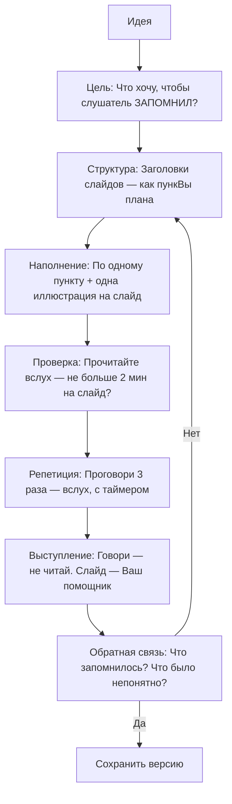

import ExternalPlayEmbed from '@site/src/components/ExternalPlayEmbed';

# Презентаци

  ОБЯЗАТЕЛЬНО
  ДЛЯ НОВИЧКОВ

Начальный уровень

  
Интерактив

  

  Демо ниже — нажимайте кнопки и смотрите, как это устроено. Ничего на компьютере не меняется.

  

<ExternalPlayEmbed example="code-dev/desktop-window-play" title="Окно десктоп-приложения" minHeight={480} />

---

## Презентаци

У Вас есть отличная идея — например, как сделать школьный двор удобнее для игр, или как построить робота, который поливает цветы. Вы можете долго рассказывать об этом словами — и, возможно, Вас поймут. Но что, если Вы покажете эту идею? Добавите картинки, схемы, короткие фразы, стрелочки между этапами — и вдруг всё становится ясно, как карта метро? Это и есть **презентация**.

---

### Что такое презентация?

**Презентация** — это способ *показать* информацию. Это не просто текст. Это *визуальная поддержка* рассказа.  
Презентация — не замена выступающему. Она — как светофор на дороге — не едет сама, но помогает всем двигаться в правильном направлении, без аварий и путаницы.

Исторически первые презентации делали на доске мелом, потом — на плакатах, диапозитивах (помните слайд-проекторы?). Сегодня презентации создаются в программах — PowerPoint, Google Slides, Canva, Keynote — но суть остаётся одной:  
> **Презентация — это структурированное визуальное сопровождение устного рассказа, помогающее слушателю быстрее понять, глубже запомнить и легче следить за логикой.**

Важно понимать:  
- Презентация **не читается вслух** — это не бумажный доклад.  
- Она **не перегружена текстом** — иначе зритель будет читать, а не слушать вас.  
- Она **не существует сама по себе** — без рассказчика она "немая" и часто неполная.

---

### Из чего состоит презентация? (Структура)

Представьте презентацию как путешествие. У любого путешествия есть начало, путь и прибытие. Так и здесь.

---

#### 1. Заголовок слайда

Это как название остановки на карте. Он короткий, ясный и отвечает на вопрос: *"О чём сейчас пойдёт речь?"*  
Хороший заголовок — не "Введение" или "Информация", а, например:  
→ *"Как работает солнечная батарея?"*  
→ *"Три шага к чистому школьному двору"*  

Он помогает мозгу слушателя "включить нужную программу" — подготовиться к теме.

---

#### 2. Пункт (или пункты) содержания

Это **ключевые мысли**, логически выстроенные. Каждый пункт — как шаг в объяснении.  
Идеальный пункт:  
- Не длиннее 1–2 строк  
- Написан простыми словами  
- Использует глаголы действия ("сравним", "построим", "увидим")  
- Избегает жаргона (если термин нужен — его объясняют отдельно)

Пример:  
*"Процесс фотосинтеза включает поглощение фотонов хлорофиллом…"*  
*"Растение ловит солнечный свет — как ладошкой ловит мячик"*

---

#### 3. Иллюстрация
  
Это визуальная опора — картинка, схема, график, фото, анимация, значок.  
Мозг человека обрабатывает изображения в **60 000 раз быстрее**, чем текст. Поэтому хорошая иллюстрация может заменить абзац — и сделать его понятнее.  
Но! Иллюстрация должны быть **релевантной** — то есть прямо связанной с пунктом.  
→ Если Вы говорите о цикле воды — покажите схему "испарение → облака → дождь → река".  
→ Если объясняете, как работает алгоритм — нарисуйте блок-схему или пошаговую стрелочную диаграмму.

---

### Почему структура "заголовок → пункт → иллюстрация" работает?

Потому что она уважает **рабочую память** человека.  
Рабочая память — это то, что удерживает информацию "прямо сейчас". У взрослого она вмещает ~7 элементов, у ребёнка — ещё меньше. Если на слайде 5 абзацев текста, мозг перегружается и "отключает приём".  
Но если:  
- заголовок задаёт тему (1 элемент),  
- пункт — одну мысль (2-й элемент),  
- иллюстрация — визуальную модель (3-й элемент, но обрабатывается в другом канале — зрительном),  

то нагрузка распределяется, и понимание растёт.

Это называется **принципом модальности** (из теори когнитивной нагрузки) — когда текст и изображение работают вместе, а не дублируют друг друга, обучение эффективнее.

---

### Презентация, Доклад, Плакат

|                     | Презентация | Доклад (текст) | Плакат |
|---------------------|-------------|----------------|--------|
| **Формат**          | Слайды + речь | Только текст | Статичное изображение |
| **Цель**            | Помочь *рассказать* | Дать *прочитать* | Привлечь внимание в проходе |
| **Текста на единицу** | Минимум (ключевые слова) | Максимум | Средне (заголовки + подписи) |
| **Автономность**    | Низкая (нужен рассказчик) | Высокая | Средняя |

Презентация — это **диалог через экран**. Вы говорите — слайд поддерживает. Вы замолкаете — слайд молчит. Они идут в паре.

---

## Как строить презентацию, чтобы она *работала*

### Правила работы с презентациями  

(или: Почему некоторые презентации "засыпают", а другие — цепляют?)

Вы смотрите на экран. Что происходит в Вашей голове?

- Если на слайде **много текста** — Вы начинаете читать.  
- Если текст **мелкий или бледный** — Вы напрягаете глаза.  
- Если цвета **сливаются** (жёлтый на белом, синий на чёрном) — Вы отводите взгляд.  
- Если слайды **одинаковые** — мозг решает: "Здесь ничего нового", и переключается на TikTok в голове.

Чтобы этого не случилось, существуют проверенные правила. Они не "законы", но скорее — **законы восприятия человека**. Нарушать их можно — но тогда Вы рискуете, что вашу идею *не услышат*.

---

#### Правило 1. Один слайд — одна мысль  

Не пытайтесь "втиснуть всё сразу". Это как пытаться засунуть в рюкзак одновременно велосипед, палатку и холодильник. Лучше сделать три отдельных похода.

→ Пример плохого слайда:  
*Заголовок: "Экология"*  
*Текст — Проблемы загрязнения, виды отходов, переработка, законы, инициативы школ, личный вклад…*  

→ Пример хорошего подхода:  
- Слайд 1 — *"Откуда берётся мусор?"* + фото свалки + 3 источника (дом, школа, магазин)  
- Слайд 2: *"Что происходит с пластиком?"* + анимация разложения за 450 лет  
- Слайд 3 — *"Как мы можем помочь?"* + 3 простых действия (раздельный сбор, отказ от трубочек, ремонт вместо замены)

Каждый слайд — как кадр в фильме: сам по себе неполный, но в цепочке создаёт историю.

---

#### Правило 2. Текст — только опорные слова  

Слайд — не шпаргалка для слушателя. Это **визуальная подсказка** для рассказчика *и* слушателя.  
Идеальное соотношение:  
- **10–20 слов на слайд** (максимум!)  
- Размер шрифта — не меньше **24 pt** (чтобы видно с последней парты)  
- Никаких "и т.д.", "как известно", "некоторые учёные считают…" — только суть.

**Почему?**  
Пока зритель читает, он не слушает. А речь идёт быстрее чтения. Если Вы говорите *одно*, а на слайде написано *другое* — мозг путается. Это называется **когнитивным конфликтом**.

> ✅ Хорошо:  
> *Заголовок: "Как работает Wi-Fi?"*  
> *Пункт: Радиоволны → роутер → устройство*  
> *Иллюстрация: Волны, исходящие от роутера к ноутбуку*  

> ❌ Плохо:  
> *Заголовок: "Wi-Fi"*  
> *Текст: Беспроводная локальная сеть IEEE 802.11, использующая диапазоны 2,4 и 5 ГГц, работает по принципу модуляции несущей частоты…*

---

#### Правило 3. Цвета и контраст — для ясности, не для красоВы  

Да, красиво — приятно. Но **ясно** — важнее.  
Основной принцип: **фон и текст должны контрастировать**.

| Фон        | Хороший текст | Плохой текст |
|------------|---------------|-------------|
| Белый      | Тёмно-синий, чёрный, тёмно-зелёный | Жёлтый, светло-серый, оранжевый |
| Тёмный     | Белый, жёлтый, светло-голубой | Фиолетовый, бордовый, тёмно-зелёный |

Никаких радужных градиентов на тексте. Никаких "эффектов 3D" для букв — они только мешают фокусу.

Совет: проверьте слайд, переведя его в чёрно-белый режим. Если что-то "пропало" — значит, контраст недостаточен.

---

#### Правило 4. Картинки

Фото с улыбающимися детьми "для настроения" — это декор.  
Фото ребёнка, держащего в руках мусор и стоящего у контейнера для раздельного сбора — это **объяснение**.

Хорошая иллюстрация отвечает на вопрос: *"Почему именно так?"*  
Плохая — просто "смотрит".

Где брать изображения?  
- **Бесплатные стоки** — Wikimedia Commons, Unsplash, Pixabay (ищите по ключевым словам: *"recycling process diagram"*, *"robot arm simple"*)  
- **Свои рисунки** — даже простые схемы от руки (можно сфоткать и вставить!)  
- **Скриншоты** — если объясняете, как что-то сделать на компьютере  

Важно: всегда указывай источник, если изображение не Ваше. Это — уважение к другим.

---

#### Правило 5. Анимаци и переходы — только по делу  

Анимация — это не "огоньки" и "звёздочки". Это **направление внимания**.

→ Хорошо:  
Появление стрелок **по очереди**, чтобы показать последовательность шагов:  
1. Загрузка → 2. Обработка → 3. Ответ  

→ Плохо:  
Все объекВы вылетают с треском, крутятся и исчезают. Это как если бы учитель хлопал в ладоши, кричал и прыгал, объясняя таблицу умножения.

Совет: если анимация не помогает понять логику — уберите её. Лучше чётко и статично, чем "весело" и путано.

---

### Жизненный цикл презентации

Презентация — не файл. Это **процесс**. Вот как он устроен:

Эта схема показывает:  
- Презентация начинается с вопроса: *"Что я хочу, чтобы человек унёс с собой?"*  
- Она требует **итераций** — редко получается идеально с первого раза.  
- Главный критерий успеха — то, что запомнилось слушателю.

---

### Презентационное мышление

Презентаци учат не только говорить — они учат **думать**.  
Когда Вы строите презентацию, Вы учитесь:

1. **Формулировать суть** — выделять главное из множества фактов.  
2. **Строить логику** — выстраивать "дорожку" от "я не знал" → "я понял" → "я могу повторить".  
3. **Видеть глазами другого** — предугадывать: "А здесь ему будет непонятно?"  
4. **Работать с ограничениями** — время, слайды, внимание. Это как решать головоломку.

Эти навыки важны не только для школьных проектов — они нужны программисту (объяснить архитектуру), инженеру (защитить решение), учителю, врачу, журналисту… Всем, кто работает с идеями.

---
