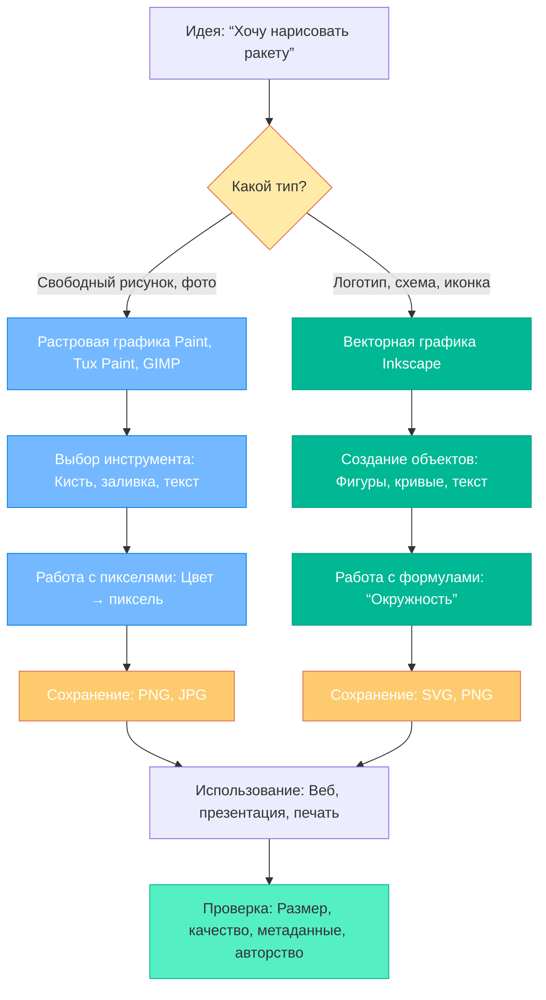

import ExternalPlayEmbed from '@site/src/components/ExternalPlayEmbed';

# Графика

  ОБЯЗАТЕЛЬНО
  ДЛЯ НОВИЧКОВ

Начальный уровень

  
Интерактив

  

  Демо ниже — нажимайте кнопки и смотрите, как это устроено. Ничего на компьютере не меняется.

  

<ExternalPlayEmbed example="basics/display-tech-play" title="Технологии дисплеев" />

---

## Графика

Вы хотите нарисовать домик. Вы берёте лист бумаги, карандаш — и начинаете — сначала квадрат, потом треугольная крыша, окно, дверь… А теперь представьте: а что, если этот лист — экран компьютера? Как тогда рисовать? И как компьютер "помнит" Ваш рисунок?  

Вот об этом и пойдёт речь в этой главе: **о компьютерной графике** — науке и практике создания изображений с помощью компьютера. Это не магия. Это — точные правила, инструменВы и немного воображения. И начнём мы с самого простого: с точек.

---

### Из чего состоит картинка? Пиксели — кирпичики изображения

Каждое изображение на экране — будь то фото кота, скриншот игры или рисунок в школьном проекте — состоит из **крошечных квадратиков**, которые называются **пиксели** (от английского *picture element* — "элемент изображения").  

Если сильно-сильно приблизить любую фотографию — например, в увеличительном стекле браузера — Вы увидите, что плавные лини и тени превращаются в мозаику из маленьких квадратиков разного цвета. Это и есть пиксели.  

Чем больше пикселей помещается на один сантиметр экрана — тем **чётче** и **реалистичнее** выглядит картинка. Это называется **разрешением** (подробнее — чуть позже), но пока запомните главное:

> **Пиксель — это самая маленькая точка, которую может нарисовать экран. Всё изображение — это упорядоченная сетка из таких точек.**

Поэтому, когда Вы рисуете в программе, Вы на самом деле управляете цветом Высяч и миллионов пикселей — только не по одному (это было бы очень долго!), а сразу целыми группами, с помощью кисточек, линий, фигур и других инструментов.

---

### Paint и Tux Paint

Самая известная и простая программа для рисования в Windows — **Paint** ("Кисть"). В Linux и на многих школьных компьютерах часто используется **Tux Paint** — версия, специально созданная для детей. Обе программы работают по одному принципу: они управляют **растровой графикой** — то есть рисуют, закрашивая пиксели.

---

#### Что такое *растровая* графика?

Это способ хранения картинки как таблицы: каждая ячейка таблицы — это один пиксель, и в ней записан его цвет. Например, изображение размером 100×100 пикселей — это таблица из 10 000 ячеек. Просто? Да. Удобно для фотографий и свободного рисования? Очень. Но есть и особенности — о них позже.

---

##### Основные инструменВы в Paint / Tux Paint

| Инструмент | Как выглядит | Что делает | Пример использования |
|-----------|--------------|------------|----------------------|
| **Кисть** | 🖌️ | Рисует след, как настоящая кисточка. Толщина и форма — настраиваемы. | Нарисовать травку, облака, контуры. |
| **Карандаш** | ✏️ | Тонкая чёрная (или выбранная) линия — как в тетради. | Набросать эскиз, подписать детали. |
| **Ластик** | 🧽 | *Стирает* пиксели — то есть возвращает их к фоновому цвету (часто белому). Он не "удаляет" пиксель, а *перекрашивает* его. | Исправить ошибку, убрать лишнюю линию. |
| **Заливка** | 🪣 | Закрашивает *всю область одного цвета* вокруг точки, на которую Вы кликнули. Если контур незамкнут — краска "утечёт"! | Закрасить небо, поле, крышу дома. |
| **Прямоугольник / Овал** | ▢ / ⚪ | Рисует геометрические фигуры. Можно с заливкой (цельные) или без (только контур). | Дом — из прямоугольников, солнце — из овала. |
| **Текст** | **T** | Добавляет надпись. Шрифт, размер, цвет — можно выбрать. | Подписать героя, написать заголовок. |

> **Совет**: перед тем как рисовать — подумайте:  
> — Какой фон мне нужен? Белый, синий, прозрачный?  
> — Какой размер холста? Неудобно рисовать дом на листочке 50×50 пикселей — он просто не поместится!  
> — Какие цвета выбрать? Не стоит использовать 20 оттенков сразу — начни с 3–5.

---

### Как исправить ошибку? Отмена и история действий

Даже опытные художники ошибаются. А в компьютере — тем более! Хорошая новость: **Вы можете отменить почти любое действие**.

- В Paint и Tux Paint есть кнопка **"Назад"** (часто значок ↶ или Ctrl+Z).  
- Каждое нажатие отменяет *последнее* действие — последний штрих кистью, последнюю заливку, последнее перемещение фигуры.  
- В Tux Paint даже есть "магическая палочка отмены" — весёлый значок, который анимированно "съедает" ошибку.

> ⚠️ **Но!** Отмена работает *только до тех пор, пока Вы не сохранили и не закрыли файл*. Как только Вы сохранили — история "забывается". Поэтому не спешите сохранять, если ещё экспериментируете.

Если Вы *слишком много* отменил — есть **"Вперёд"** (→ или Ctrl+Y), чтобы вернуть отменённое. Это как две кнопки: "шаг назад" и "шаг вперёд" по лестнице действий.

---

### Прозрачность — когда фон исчезает

Иногда хочется, чтобы на картинке *не было фона*. Например:  
- Вы нарисовали звезду — и хотите вставить её в презентацию, чтобы она "парила" на любом слайде.  
- Или создал значок для игры — и он не должны быть в белом квадратике.

Для этого нужна **прозрачность** — свойство, при котором пиксель "пустой". Через него виден слой, который находится *под* изображением.

В Paint (стандартном) прозрачность **не поддерживается** — там фон всегда есть (по умолчанию — белый). Но в Tux Paint и в более продвинутых программах (например, GIMP, Krita) — можно.

---

#### Как сделать прозрачную картинку в Tux Paint
1. При создании нового холста выберите опцию **"Прозрачный фон"** (если доступно) или начни с белого фона.  
2. Нарисуйте свою фигуру (например, звезду).  
3. Перейдите в меню **"Экспорт"** → **"Сохранить как PNG"**.  
4. **Обязательно** отметь галочку **"Сохранять прозрачность"** (или "Alpha channel").  
5. Сохраните.

Формат **PNG** — один из немногих, который *умеет хранить прозрачность*. А вот JPG — не умеет: он всегда добавит белый (или другой) фон.

> 🌟 Проверьте: откройте файл в браузере или в любом просмотрщике. Если вокруг звезды — серо-белая "шахматная доска" — это признак прозрачности! Это не часть картинки — это подсказка программы: "здесь ничего нет".

---

### Размер и разрешение — сколько пикселей — и зачем?

Когда Вы создаёте новый файл, Вам предлагают выбрать **размер холста** — например, 800×600 пикселей. Это значит: ширина — 800 пикселей, высота — 600. Всего — 480 000 пикселей.

Но не путай **размер в пикселях** и **размер в сантиметрах**!  
- На одном мониторе 100 пикселей могут быть 2 см в ширину.  
- На другом — 3 см.  
Потому что разные экраны имеют разную **плотность пикселей** (PPI — *pixels per inch*: пикселей на дюйм).

---

#### Когда какой размер брать?
| Цель | Рекомендуемый размер (пример) | Почему |
|------|-------------------------------|--------|
| Рисунок для школьного сайта | 1200×800 | Поместится на экране, не будет "размытым" при увеличении. |
| Иконка для игры | 64×64 или 128×128 | Маленькая, но чёткая даже в интерфейсе. |
| Плакат или распечатка A4 | 2480×3508 при 300 DPI | Для печати нужно *высокое разрешение*: 300 точек на дюйм — стандарт качества. |

> 🔍 **Разрешение** — это "сколько пикселей" и **сколько их приходится на физическую единицу** (дюйм, сантиметр).  
> - Экран: обычно 96–144 DPI.  
> - Печать: 150–300 DPI (и выше для глянца).  
Чем выше DPI — тем детальнее изображение при печати. Но для экрана 300 DPI — избыточно: глаз не различит разницы.

---

## Векторы, формаВы и правила

### Что, если не пиксели?

Вы нарисовали в Paint идеальный круг. А теперь решите его увеличить в 10 раз. Что произойдёт? Круг станет "ступеньками", зубчатым, как пиксельный монстр — потому что компьютер просто *растянул* те же самые пиксели, не добавив новых.

А теперь представьте, что Вы описали круг как **инструкцию**:  
> *"Нарисуйте окружность с центром в точке (100, 100) и радиусом 50".*

Тогда при любом увеличении компьютер просто *пересчитает* новые пиксели по этой формуле — и круг останется гладким. Это и есть **векторная графика**.

> **Векторное изображение — это набор математических описаний** — линий, кривых, фигур, цветов и их взаимного расположения.

---

#### Где используется векторная графика?
- Логотипы компаний (должны быть чёткими и на визитке, и на билборде).  
- ШрифВы (буквы масштабируются без потерь).  
- Интерфейсы программ и игр (иконки, кнопки).  
- Схемы, чертежи, карты.

---

#### Inkscape — дружелюбный векторный редактор

**Inkscape** — бесплатная, открытая программа для векторной графики. Она мощная, но для начала хватит и базовых возможностей.

---

##### Основные инструменВы в Inkscape

| Инструмент | Что делает | Особенность |
|-----------|------------|-------------|
| **Выбор и перемещение** (стрелка) | Перетаскивает фигуры, выделяет их. | Можно двигать, вращать, масштабировать *без потерь качества*. |
| **Карандаш / Свободная линия** | Рисует кривую от руки. | Inkscape *сглаживает* дрожание руки — линия становится плавной. |
| **Фигуры** (прямоугольник, эллипс, звезда) | Создаёт идеальные формы. | После создания можно менять: скруглять углы, делать эллипс вытянутым, добавлять лучи у звезды — всё через числа, не стирая и не перерисовывая. |
| **Текст** | Добавляет надпись. | Текст остаётся *редактируемым*: можно изменить шрифт, размер, цвет — даже через неделю. |
| **Заливка и обводка** | Меняет цвет внутри фигуры (заливка) и её контур (обводка). | Можно сделать обводку толщиной 0,5 пикселя — и она останется тонкой даже при 1000% увеличении. |

> **Практическое сравнение**  
> — В Paint: нарисовал звезду → она "заморожена" в пикселях. Изменить форму — почти невозможно.  
> — В Inkscape: нарисовал звезду → она осталась *объектом*. Вы можете:  
> &nbsp;&nbsp;• изменить количество лучей (с 5 на 7),  
> &nbsp;&nbsp;• сделать лучи острее или тупее,  
> &nbsp;&nbsp;• растянуть звезду в овал — и всё это без единого артефакта.

> ⚠️ **Но!** Вектор плохо подходит для фотографий. Лицо человека — это миллионы оттенков, теней, микротекстур. Описать это формулами почти невозможно. Поэтому фото — всегда растровые (JPG, PNG), а логотипы и схемы — векторные (SVG).

---

## ФормаВы изображений

Когда Вы сохраняете файл, компьютер спрашивает: *"В каком формате?"* Выбор здесь — не формальность. Формат определяет:
- будет ли изображение **чётким** при увеличении,  
- поддерживает ли **прозрачность**,  
- занимает ли **много места**,  
- можно ли **редактировать** потом.

Рассмотрим основные — те, с которыми Вы встретитесь чаще всего.

---

### JPG (или JPEG)

- **Плюсы**:  
  — Огромная поддержка (все браузеры, телефоны, фотоаппараты).  
  — Маленький размер файла (за счёт *сжатия*).  
  — Отлично передаёт плавные переходы цвета (небо, кожа, трава).

- **Минусы**:  
  — **Сжатие с потерями**: при сохранении часть информации *удаляется навсегда*. Чем сильнее сжатие — тем больше артефактов (размытость, цветные "квадратики" в тенях).  
  — **Нет прозрачности** — фон всегда есть.  
  — Не подходит для текста и чётких линий (они становятся "мыльными").

> ✅ Используйте JPG для — фото, скриншотов с играми и видео, изображений с большим количеством цветов.

---

### PNG

- **Плюсы**:  
  — **Сжатие без потерь**: изображение остаётся *точно таким же*, как до сохранения.  
  — Поддерживает **прозрачность** (включая *полупрозрачность* — например, мягкие тени).  
  — Чётко передаёт лини, текст, иконки.

- **Минусы**:  
  — Файлы получаются **крупнее**, чем JPG (иногда в 3–5 раз).  
  — Не подходит для больших фото — быстро "съест" место на диске.

> ✅ Используйте PNG для — скриншотов с интерфейсами, логотипов, иконок, рисунков с текстом, изображений с прозрачным фоном.

---

### GIF

- **Плюсы**:  
  — Поддерживает **простую анимацию** (например, мигающая надпись, вращающийся значок).  
  — Маленький размер для *простых* изображений.  
  — Работает везде — даже в старых браузерах.

- **Минусы**:  
  — Только **256 цветов** (из 16 миллионов!). Поэтому фото в GIF выглядят "постеризованными" — с резкими переходами.  
  — Прозрачность — только "да/нет", без полупрозрачности (тень будет "ступенчатой").  
  — Анимация — только покадровая, без плавных переходов.

> ✅ Используйте GIF для — коротких анимаций (до 5 сек), мемов, значков с движением, когда важна совместимость, а не качество.

---

### SVG

- **Плюсы**:  
  — **Полностью векторный**: масштабируется без потерь до любого размера.  
  — Файл — это **текст** (XML), а не набор пикселей. Можно открыть в Блокноте и прочитать!  
  — Поддерживает анимацию, интерактивность (в браузере), стили через CSS.  
  — Очень маленький размер для простых изображений.

- **Минусы**:  
  — Не подходит для фото.  
  — Сложные векторы (тысячи узлов) могут тормозить браузер.  
  — Требует базового понимания структуры (но рисовать можно и "вслепую" через Inkscape).

> ✅ Используйте SVG для — логотипов на сайте, иконок интерфейса, диаграмм, схем, графиков.

---

### Как изменить формат и размер картинки?

Вы нарисовали в Tux Paint — сохранил как PNG. А нужно — JPG для сайта. Что делать?

---

#### Способ 1 — В редакторе (Paint, Inkscape, GIMP)
1. Откройте файл.  
2. Выберите **Файл → Сохранить как…**  
3. В поле *"Тип файла"* выберите нужный формат (JPG, PNG и т.д.).  
4. Для JPG — появится окно настройки *качества* (обычно 80–95% — хороший баланс).  
5. Нажмите *Сохранить*.

---

#### Способ 2 — Онлайн-конвертеры (осторожно!)

Есть сайВы вроде **convertio.co**, **cloudconvert.com** — они быстро меняют формат.  
**Но!**  
— Не загружай туда личные или приватные изображения (они могут сохраняться на сервере).  
— Проверяй, нет ли в готовом файле скрытых метаданных (геолокация, имя автора — см. ниже).

---

#### Как изменить размер (уменьшить)?
1. В Paint: **Изменить → Размер** → задайте % или пиксели.  
2. В Inkscape: **Файл → Свойства документа** → поменяй размер холста *или* выдели объект и масштабируй его (Ctrl+колёсико мыши).  
3. В GIMP/Krita: **Изображение → Масштабировать изображение**.

> Совет: никогда не увеличивай маленькую картинку — она станет размытой. Лучше нарисовать заново в большем размере.

---

## Правила работы с изображениями

Рисовать — весело. Но есть правила, которые делают работу *честной*.

---

### 1. Авторские права — не воруй, уважай
- Изображение в Google — **не значит**, что оно "свободное".  
- Даже если картинка без водяного знака — это не даёт права её использовать.  
- Ищите **свободные** изображения:  
  &nbsp;&nbsp;• [pixabay.com](https://pixabay.com) — всё бесплатно, без указания автора (но можно — вежливо).  
  &nbsp;&nbsp;• [unsplash.com](https://unsplash.com) — качественные фото.  
  &nbsp;&nbsp;• [openclipart.org](https://openclipart.org) — векторные иконки (формат SVG/PNG), общественное достояние.

> ✅ Правило: если не увереныыы — не используйте. Или нарисуйте сами.

---

### 2. Метаданные — что скрыто в картинке?

Цифровые фото и скриншоВы часто содержат **EXIF-данные**:  
- Дата и время съёмки,  
- Модель телефона/камеры,  
- **Геолокация** (координаты, где сделано фото!),  
- Имя программы, в которой редактировали.

Это может быть опасно — например, фото школьного двора с геометкой — покажет, где находится школа.

---

#### Как очистить?
- В Paint и Tux Paint — метаданные **не сохраняются** (они "стереть" при сохранении).  
- В Inkscape (SVG) — тоже чисто.  
- Для JPG/PNG из фотоаппарата:  
  &nbsp;&nbsp;• Используйте **GIMP**: *Файл → Экспорт как… → сними галочку "Сохранить EXIF"*.  
  &nbsp;&nbsp;• Или онлайн-очиститель: [verexif.com](https://www.verexif.com) (проверяй и удаляй).

> ✅ Перед публикацией — всегда проверяй: "А что скрыто в этом файле?"

---

### 3. Безопасность — не открывай подозрительные файлы
- Файл с расширением `.exe`, `.bat`, `.scr` — **не картинка**, даже если значок — как у фото!  
- Злоумышленники могут переименовать вирус в `cat.jpg.exe` — и Windows, если скрыВы расширения, покажет только `cat.jpg`.  
- Всегда включите отображение расширений:  
  &nbsp;&nbsp;• Проводник → Вид → Параметры → Вид → сними галочку *"Скрывать расширения…"*.

---

## Как создаётся цифровое изображение

Ниже — схема, показывающая путь от замысла до готовой картинки. Её можно вставить в Markdown-файл проекта *"Вселенная IT"* — она отрисуется автоматически.

> *Как читать схему*:  
> — Жёлтый ромб — выбор пути.  
> — Синие блоки — растровая графика.  
> — Зелёные — векторная.  
> — Оранжевые — сохранение.  
> — Светло-зелёный — финальная проверка.

---
