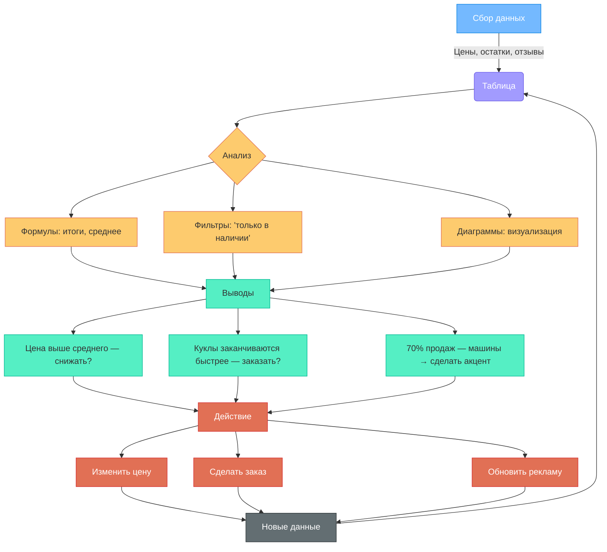

import ExternalPlayEmbed from '@site/src/components/ExternalPlayEmbed';


# Таблицы

<div class="article-tags">
  <span class="tag tag-required">ОБЯЗАТЕЛЬНО</span>
  <span class="tag tag-beginner">ДЛЯ НОВИЧКОВ</span>
</div>

<span class="complexity-badge">Начальный уровень</span>

<div class="callout callout--tip">
  <div class="callout-title">Интерактив</div>

  <div class="callout-body">
  Демо ниже — нажимайте кнопки и смотрите, как это устроено. Ничего на компьютере не меняется.
</div>
  </div>


<ExternalPlayEmbed example="about/data-types-play" title="Data Types" />

---

## Формулы, диаграммы и связи

До сих пор мы рассматривали таблицу как **статичную записную книжку**: вписали — и оно лежит. Но настоящая сила таблиц — в том, что они **считают, сравнивают и предсказывают**. Они не просто хранят информацию — они *работают* с ней.

Вы записали цены всех игрушек. Ручкой посчитать сумму — можно, но если игрушек 500? А если каждую минуту приходят новые заказы? Здесь на помощь приходят **формулы** — инструкции для компьютера: *"Сделайте это с теми данными"*.

---

### Формулы

В Google Таблицах и Excel любая ячейка может содержать число или текст, а также **формулу** — команду, начинающуюся со знака **`=`** (равно).

---

#### Самые нужные формулы для начала

| Формула | Что делает | Пример | Результат |
|--------|------------|--------|-----------|
| `=A2 + B2` | Складывает значения из ячеек A2 и B2 | A2=10, B2=20 → `=A2+B2` | 30 |
| `=СУММ(D2:D6)` | Суммирует все числа в диапазоне D2–D6 | D2=450, D3=890, D4=1200, D5=320, D6=670 | 3530 |
| `=СРЗНАЧ(D2:D6)` | Считает среднее арифметическое | Те же числа | 706 |
| `=МИН(D2:D6)` | Находит минимальное значение | — | 320 |
| `=МАКС(D2:D6)` | Находит максимальное значение | — | 1200 |
| `=ЕСЛИ(E2="Да"; "Можно купить"; "Нет в наличии")` | Проверяет условие и даёт один из двух ответов | E2="Да" | "Можно купить" |

> Обратите внимание:  
> — Диапазон `D2:D6` означает *"все ячейки от D2 до D6 включительно"*.  
> — Кавычки `" "` — только для текста внутри формулы. Числа и ссылки на ячейки — без кавычек.  
> — Функци пишутся **заглавными буквами** в русской локализации (СУММ, ЕСЛИ), но можно и строчными — Google поймёт.

---

#### Как это работает "под капотом"?

Когда Вы пишете `=СУММ(D2:D6)`, таблица:
1. Смотрит: какие ячейки входят в D2:D6?  
2. Берёт из каждой — только **числовые** значения (если в D3 оказалось слово "акция" — оно игнорируется).  
3. Складывает их.  
4. Показывает результат — и **автоматически пересчитывает**, если Вы измените любую из ячеек.

> 🌟 Это ключевое отличие от калькулятора:  
> — Калькулятор: ввёл числа → получил ответ → чтобы переделать, нужно всё заново.  
> — Таблица — изменил *одну* цену — и сумма, среднее, график — **всё обновилось мгновенно**.

---

### Диаграммы

Человеческий мозг за миллисекунды замечает: *"Вот столбик выше — значит, это важнее"*. Именно поэтому диаграммы — мощный инструмент: они делают данные **наглядными**.

---

#### Как построить диаграмму в Google Таблицах

1. Выдели диапазон: названия (B2:B6) + цены (D2:D6).  
2. Нажмите **Вставка → Диаграмма**.  
3. По умолчанию появится **столбчатая диаграмма** — идеально для сравнения.

Вы увидите:  
- По оси X (горизонталь) — названия игрушек,  
- По оси Y (вертикаль) — цена,  
- Самый высокий столбик — у "Робота-трансформера" (1200 ₽),  
- Самый низкий — у "Кота Барсика" (320 ₽).

---

#### Основные типы диаграмм и когда их использовать

| Тип | Когда подходит | Пример из жизни |
|-----|----------------|-----------------|
| **Столбчатая** | Сравнение категорий | "Какая игрушка самая дорогая?" |
| **Круговая (pie)** | Части от целого | "Какой % прибыли дают машины, куклы, плюшевые?" |
| **Линейная** | Изменение во времени | "Как росла сумма продаж по неделям?" |
| **Точечная** | Зависимость двух величин | "Есть ли связь между ценой и количеством продаж?" |

> Совет:  
> — Не используйте 3D-эффекты и разные цвета без цели — они отвлекают.  
> — Всегда подписывай оси и добавляй заголовок: *"Цены игрушек в магазине „Радуга“, ноябрь 2025"*.

---

### Связанные таблицы

Магазин расширился: теперь у каждой игрушки есть **поставщик** — компания, которая её привозит.

Можно добавить столбец "Поставщик" в основную таблицу:

| № | Название | Поставщик | Телефон поставщика | Email поставщика | Цена | … |
|---|----------|-----------|---------------------|------------------|------|---|

Но что будет, если поставщик "Игромир" изменил email? Придётся искать все строки с "Игромир" и править вручную — легко ошибиться.

**Решение: две связанные таблицы.**

---

#### Таблица 1 —*Игрушки*

| id_игрушки | название       | id_поставщика | цена |
|------------|----------------|---------------|------|
| 1          | Скорая помощь  | 103           | 450  |
| 2          | Кукла Аня      | 101           | 890  |
| 3          | Робот-трансформер | 102        | 1200 |
| …          | …              | …             | …    |

---

#### Таблица 2 —*Поставщики*

| id_поставщика | название   | телефон      | email               |
|---------------|------------|--------------|---------------------|
| 101           | Детский Мир| +7 (495) 111 | detmir@shop.ru      |
| 102           | LEGO RU    | +7 (495) 222 | lego@ru.lego.com    |
| 103           | Игромир    | +7 (495) 333 | info@igromir.ru     |

> **Ключ связи — **id_поставщика**. Это как номер телефона: по нему можно "позвонить" в другую таблицу и спросить: *"Кто с таким ID?"*

В продвинутых программах (например, в базах данных) такая связь делается автоматически. В Google Таблицах можно эмулировать её через функцию **ВПР** (вертикальный просмотр):

```excel
=ВПР(C2; Поставщики!A2:D10; 2; ЛОЖЬ)
```

— Найти в столбце A таблицы *Поставщики* значение из C2 (например, 103),  
— Вернуть содержимое **второго** столбца той же строки → "Игромир".

> ✅ Преимущество: если "Игромир" сменит телефон — правим **одну строку** в таблице *Поставщики*, и все игрушки автоматически "узнают" новую информацию.

---

### Правила безопасности и этики при работе с таблицами

Данные — это не просто цифры. Иногда за ними стоят люди, их привычки, даже тайны.

---

#### 1. Личные данные — не для публичных таблиц
- В таблице **нельзя** хранить:  
  &nbsp;&nbsp;• Полные ФИО одноклассников,  
  &nbsp;&nbsp;• ДаВы рождения,  
  &nbsp;&nbsp;• Адреса,  
  &nbsp;&nbsp;• Оценки (если таблица общедоступна).  
- Можно:  
  &nbsp;&nbsp;• Использовать номера (ученик №5),  
  &nbsp;&nbsp;• Группировать по категориям без имён ("5 человек получили „5“"),  
  &nbsp;&nbsp;• Делать таблицу **доступной только по ссылке** и ограничить права (в Google: *"Только для просмотра"*).

---

#### 2. Источники — указывай всегда

Если Вы взяли данные из интернета (например, цены на игрушки с сайта магазина), запишите в отдельную ячейку:  
> *Источник: сайт "ИгрушкиОнлайн", 05.11.2025, https://…*  

Это — уважение к чужому труду и защита от ошибок (вдруг данные устарели?).

---

#### 3. Не верьте всему, что видите в таблице
- Таблица может быть **неполной** (например, учтены только 3 из 10 магазинов),  
- Может быть **предвзятой** (владелец магазина сознательно не включил дешёвые аналоги),  
- Может содержать **опечатки** (цена 4500 вместо 450).

> 🧐 Всегда задавай вопросы:  
> — *Кто собирал эти данные?*  
> — *Когда?*  
> — *Какие категори включены, а какие — нет?*  
> Это — начало **критического мышления**.

---

## Как данные становятся решением

Ещё одна схема — на этот раз показывающая, как таблица помогает принимать решения.



> Эта схема показывает: таблица — **часть цикла**. Данные → анализ → решение → действие → новые данные → …

---
