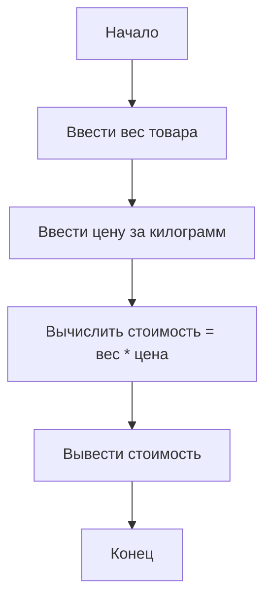
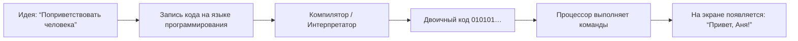

import ExternalPlayEmbed from '@site/src/components/ExternalPlayEmbed';


# Введение в программирование

<div class="article-tags">
  <span class="tag tag-required">ОБЯЗАТЕЛЬНО</span>
  <span class="tag tag-beginner">ДЛЯ НОВИЧКОВ</span>
</div>

<span class="complexity-badge">Родителям и детям</span>

<div class="callout callout--info">
  <div class="callout-title">Зачем эта глава</div>

  <div class="callout-body">
  Здесь Вы поймёте, **что такое код**, из каких "кирпичиков" он состоит и почему компьютер иногда "не понимает" — хотя Вы всё написали правильно.

  Это база перед Scratch, Python и JavaScript.

  Готовые фрагменты Scratch с разбором — [мини-проекты в Lab](/lab/Примеры/1121).
</div>
  </div>

<div class="callout callout--tip">
  <div class="callout-title">Попробуйте сами</div>

  <div class="callout-body">
  Демо ниже — нажимайте кнопки и смотрите, как устроены типы данных. Ничего на компьютере не меняется.
</div>
  </div>

<div class="callout callout--info">
  <div class="callout-title">Общая база про код</div>

  <div class="callout-body">
  Подробнее про исходный и машинный код, компиляцию и интерпретацию — в <a href="/encyclopedia/4-code-dev/4-02-chto-takoe-kod-i-kak-on-rabotaet/1">Что такое код и как он работает</a> (для старших школьников и взрослых).
</div>
  </div>

<ExternalPlayEmbed example="about/data-types-play" title="Data Types" />

---

## Словарик главы

| Слово | Простыми словами |
|-------|------------------|
| **Алгоритм** | Чёткий список шагов "сделайте А, потом Б, потом В". |
| **Код** | Запись алгоритма на языке, который понимает компьютер. |
| **Переменная** | Именованная "коробочка" для значения (число, текст, да/нет). |
| **Условие** | Развилка: "если… то… иначе…". |
| **Цикл** | Повтор одних и тех же шагов несколько раз. |
| **Ошибка** | Подсказка, что шаг или запись нужно поправить. |

---

## Введение в программирование 

**Программирование** — составление точных инструкций для компьютера. **Алгоритм** — упорядоченный набор шагов; **код** — запись алгоритма на языке, который понимает машина.

Компьютер выполняет команды **буквально**: без намёков и "само собой разумеется". Ошибка в формулировке или порядке шагов даёт неверный результат — поэтому важны ясность и проверка.

---

### Что такое код?  

Код — это **текстовые инструкции**, написанные по строгим правилам, которые понимает компьютер. Это просто список шагов, как в рецепте бутерброда:

> 1. Возьмите хлеб.  
> 2. Намажь масло.  
> 3. Положите ломтик сыра.  
> 4. Накрой вторым ломтиком хлеба.

Если перепутать шаги — например, положить сыр *до* масла — бутерброд получится странным. Так и с кодом: порядок и точность критичны. Даже одна лишняя запятая может "сломать" программу.

Мы можем понимать буквально всё через призму алгоритма:

```
1. Взять чайник и наполнить его водой до отметки
2. Поставить чайник на включенную конфорку
3. Дождаться закипания воды
4. Взять чашку и положить в неё чайную ложку заварки
5. Залить заварку кипятком из чайника
6. Накрыть чашку блюдцем и подождать три минуты
7. Добавить сахар по вкусу
8. Размешать ложкой до полного растворения сахара
9. Напиток готов к употреблению
```



Но почему компьютеру нужны текстовые инструкции, если он — машина? Ответ — в его природе.

---

### Как компьютер "думает" — язык нулей и единиц  

Внутри любого компьютера — миллиарды крошечных переключателей, называемых **транзисторами**. Они работают, как микроскопические выключатели света:  
- **"Включено"** → электричество идёт → обозначается как **1**  
- **"Выключено"** → электричество не идёт → обозначается как **0**

Такой язык из нулей и единиц называется **двоичным кодом** (binary). Всё, что Вы видите на экране — текст, картинки, видео, игра — в итоге превращается в последовательности вроде:

```
01001001 00100000 01101100 01101111 01110110 01100101 00100000 01001001 01010100
```

(Кстати, это фраза *"I love IT"* в двоичном виде.)

Компьютер "понимает" только такие последовательности. Но писать программы вручную на двоичном коде — как строить дом, откручивая каждый винтик по одному: возможно, но безумно долго и легко ошибиться.

Поэтому люди придумали **языки программирования** — промежуточные языки, ближе к человеческому, но всё ещё точные и формальные. Пример:

```python
print("Привет, Вселенная!")
```

Эту строчку легко прочитать человеку. А специальная программа — **компилятор** или **интерпретатор** — переведёт её в двоичный код, который поймёт процессор.

> **Важно**: код — это *язык общения между человеком и машиной*. Человек описывает логику — машина исполняет.

---

### Код вокруг нас — команды в повседневной жизни  

Вы уже сталкивались с кодом — даже если не знали об этом.

- **Лампочка с выключателем** — простейшая "программа":  
`ЕСЛИ нажата кнопка → ВКЛЮЧИТЬ свет`.  
  Если выключатель — двухклавишный:  
`ЕСЛИ нажата КЛАВИША_1 → включить верхний свет`  
`ЕСЛИ нажата КЛАВИША_2 → включить подсветку`

- **Робот-пылесос** получает инструкции:  
`ДВИГАТЬСЯ прямо 2 метра → ПОВЕРНУТЬ направо → ПРОВЕРИТЬ, есть ли препятствие → ЕСЛИ есть — ОСТАНОВИТЬСЯ и выбрать другой путь`

- **Игрушка на ИК-пульте** (инфракрасном): когда Вы нажимаете кнопку "Вперёд", пульт посылает *кодированный сигнал* — короткую вспышку инфракрасного света в определённом ритме. Машина "расшифровывает" этот ритм и понимает: *"двигайся вперёд"*.

Эти примеры показывают главную идею:  
> **Код — это не обязательно текст на экране. Это любая система чётких, однозначных команд, по которым что-то работает.**

---

### Как устроен процесс — от идеи до исполнения  

Рассмотрим это на схеме. Представьте, что Вы хотите написать программу, которая здоровается с пользователем по имени.



Разберём шаги:

1. **Идея** — то, что Вы хотите, чтобы программа сделала.  
2. **Код** — Вы описываете идею словами, которые понимает язык программирования (например, Python, JavaScript).  
3. **Перевод** — программа-посредник превращает ваш код в машинные команды.  
4. **Исполнение** — процессор читает эти команды (в виде импульсов тока) и заставляет память, экран, динамик — работать так, как нужно.  
5. **Результат** — человек получает то, что ожидал.

Заметьте: компьютер **не понимает смысла**. Он не знает, что такое "привет" или "Аня". Он просто копирует символы из памяти на экран — как курьер, который доставляет посылку, не зная, что внутри.

---

## Как строится код

В программе постоянно используют три базовые конструкции — **переменная**, **условие**, **цикл**.

---

### Переменная 

Вы убираете игрушки в коробки. На каждую Вы клеите этикетку — *"машинки"*, *"кубики"*, *"мягкие игрушки"*. Внутрь можно класть разное — сегодня три машинки, завтра пять. Этикетка остаётся той же, а содержимое — меняется.

**Переменная** в коде — это как такая коробка с этикеткой.  
- **Имя переменной** — это этикетка (например, `возраст`, `счёт`, `имя_игрока`).  
- **Значение** — то, что лежит внутри (например, `12`, `100500`, `"Алиса"`).

Пример на Python:

```python
имя = "Саша"
возраст = 10
счёт = 0
```

Здесь мы "наклеили" три этикетки и положили в коробки данные. Позже можно изменить содержимое:

```python
счёт = счёт + 10   # теперь в коробке "счёт" лежит 10
возраст = возраст + 1  # Саше исполнилось 11
```

> 🔍 Почему `счёт = счёт + 10` не противоречит математике?  
> В математике такое уравнение бессмысленно: `x = x + 10` → `0 = 10`.  
> Но в коде это **команда**, а не равенство:  
> *"Возьмите текущее значение из коробки `счёт`, прибавь 10, и положите результат обратно в ту же коробку".*  

Переменные — основа любого взаимодействия с пользователем. Без них невозможно запомнить, что ввёл человек, сколько очков набрал игрок или какая температура за окном.

---

### Условие — развилка на дороге  

Жизнь полна выбора:  
- *Если на улице дождь — взять зонт.*  
- *Если в холодильнике молоко закончилось — купить в магазине.*  
- *Если в игре здоровье ≤ 0 — показать экран "Game Over".*

В коде такие развилки реализуются через **условные конструкции** — чаще всего словами `ЕСЛИ` (`if`), `ИНАЧЕ` (`else`).  

Пример: программа-помощник для сбора рюкзака в поход.

```python
погода = "дождь"      # ← можно изменить на "солнечно"

ЕСЛИ погода == "дождь":
    добавить_в_рюкзак("дождевик")
    добавить_в_рюкзак("резиновые сапоги")
ИНАЧЕ:
    добавить_в_рюкзак("кепку")
    добавить_в_рюкзак("крем от солнца")
```

Обратите внимание на **два знака `=`** в `погода == "дождь"`:  
- Один `=` — это *присвоение* (положить в коробку).  
- Два `==` — это *сравнение* (проверить, совпадает ли содержимое).

Можно строить сложные условия:

```python
ЕСЛИ температура < 0 И идёт_снег:
    надеть("тёплую шапку")
ИНАЧЕ ЕСЛИ температура > 30:
    надеть("лёгкую рубашку")
ИНАЧЕ:
    надеть("ветровку")
```

Чем больше условий, тем "умнее" становится программа. Но важно не запутаться — как в лабиринте, где каждая дверь ведёт к новой развилке.

---

### Цикл  

Повторение — основа обучения и работы. Чтобы наточить карандаш, Вы крутите его в точилке 10–15 раз. Чтобы подняться на 5-й этаж, делаете ~70 шагов. В реальной жизни мы не считаем каждый шаг — просто идём. Но компьютеру нужно сказать: *"Сделайте это N раз"*.

Для этого существуют **циклы** — конструкции, которые повторяют блок команд.

---

#### Цикл `ПОВТОРИТЬ N раз` (for)

```python
ПОВТОРИТЬ 5 раз:
    сказать("Привет!")
```

→ На экране появится:  
```
Привет!  
Привет!  
Привет!  
Привет!  
Привет!
```

В более зрелых языках (например, Python) это выглядит так:

```python
for i in range(5):
    print("Привет!")
```

Здесь `i` — счётчик — он автоматически меняется от `0` до `4`, помогая отслеживать, на каком шаге мы находимся.

---

#### Цикл `ПОКА условие истинно` (while)

```python
стакан = 0  # мл воды
ПОКА стакан < 200:      # стакан вмещает 200 мл
    налить(50)          # добавляем по 50 мл
    стакан = стакан + 50
    сказать("Теперь в стакане", стакан, "мл")
```

Вывод:
```
Теперь в стакане 50 мл  
Теперь в стакане 100 мл  
Теперь в стакане 150 мл  
Теперь в стакане 200 мл  
```

На 250 мл цикл не пойдёт — условие `стакан < 200` станет ложным, и повторение остановится.

> ⚠️ Опасность: если забыть изменить условие внутри цикла — получится **бесконечный цикл**.  
> Пример авари:  
> ```python
> while температура < 100:
>     включить_нагрев()   # ← но не измеряем температуру снова!
> ```  
> Программа "застрянет", потому что `температура` никогда не обновится.

---

## Почему столько языков программирования?  

Вы, наверное, слышали названия — **Python**, **JavaScript**, **Scratch**, **C++**, **Lua**, **Rust**… Зачем их так много? Разве нельзя договориться об одном?

Представьте инструменты:  
- **Молоток** — чтобы вбить гвоздь.  
- **Отвёртка** — чтобы закрутить шуруп.  
- **Паяльник** — чтобы соединить провода в наушниках.  

Все они "делают дырки" или "соединяют", но в разных ситуациях. Так и с языками:

| Язык        | Для чего подходит | Примеры использования | "Возраст" обучения |
|-------------|-------------------|------------------------|--------------------|
| **Scratch** | Первые шаги, визуальное программирование | Анимаци, простые игры | 7–12 лет |
| **Python**  | Универсальный, простой синтаксис | Научные расчёты, веб, анализ данных, обучение ИИ | 10+ |
| **JavaScript** | Всё, что работает в браузере | Интерактивные сайты, игры онлайн | 12+ |
| **Lua**     | Встраивается в другие программы | Скрипты в Roblox; в Minecraft — моды (Lua) или встроенные [команды / datapack](/lab/Примеры/1142) без отдельного языка | 11+ |
| **C++**     | Высокая скорость и контроль над железом | Видеоигры, операционные системы | 14+ |

> ✅ **Главное** — **логика**. Освоив `переменную`, `условие`, `цикл` в Scratch, Вы легко перенесёте эти знания в Python — как научившись ездить на велосипеде, легко освоить самокат.

---

## Ошибки  

Когда Вы учитесь кататься на велосипеде, падения не означают, что Вы "не созданы для езды". Они показывают — *"Слишком резко повернул", "Ногу не поставил вовремя", "Скорость не сбавил на повороте"*.  

То же — с кодом. **Ошибки (bugs)** неизбежны. Даже у самых опытных программистов в коде бывают опечатки, логические недосмотры или неверные предположения. Разница в том, что профессионалы *умеют читать сообщения об ошибках* и превращают их в шаги к исправлению.

---

### Три основных типа ошибок  

#### Синтаксические ошибки ("опечатки")  

Это нарушения правил языка — как грамматические ошибки в письме. Компьютер не может даже начать выполнять такой код.

Пример (JavaScript):

```javascript
console.log("Привет"
```

→ пропущена закрывающая скобка и кавычка.  
**Сообщение в консоли**:  
`SyntaxError: Unexpected end of input`  
("Синтаксическая ошибка: неожиданный конец ввода")

Как исправить — внимательно сверить скобки, кавычки, точки с запятой. Браузер даже подсвечивает строку с ошибкой.

---

#### Ошибки времени выполнения ("сломалось при запуске")  

Код синтаксически верен, но "ломается" в процессе работы — например, при обращении к несуществующему объекту.

Пример:

```javascript
let возраст = "пятнадцать";  // текст, а не число
let через_год = возраст + 1;
console.log(через_год);  // → "пятнадцать1"
```

Ожидали `16`, получили `"пятнадцать1"`. Почему? Потому что в JavaScript при сложении строки и числа — число **превращается в строку**, и происходит *склеивание* (`"пятнадцать" + "1"`).

Это не ошибка в строгом смысле (программа не упала), но **логическая неточность**. Такие ошибки самые коварные — программа "работает", но даёт неверный результат.

---

#### Логические ошибки ("думал одно — сделали другое")  

Код запускается, не падает, не ругается — но ведёт себя не так, как задумано.

Пример:

```javascript
// Хотим проверить, чётное ли число
let n = 4;
if (n % 2 = 0) {   // ← ОЙ! Должно быть ==, а не =
    console.log("Чётное");
}
```

Здесь `n % 2 = 0` — синтаксическая ошибка: в условии нужно **сравнение** (`==`), а не присваивание (`=`). JavaScript остановится с `SyntaxError`, пока Вы не исправите строку.

Правильно:

```javascript
if (n % 2 === 0) {   // тройное === — строгое сравнение (значение + тип)
    console.log("Чётное");
}
```

> 🔎 **Строгий совет**: всегда используйте `===` и `!==` вместо `==`/`!=`, если не увереныыы. Это предотвращает неожиданные приведения типов.

---

### Как искать ошибки? Три приёма  

1. **Читайте сообщение**. Оно почти всегда говорит:  
   - *что пошло не так* (`Cannot read property 'x' of undefined`),  
   - *где* (файл, строка, столбец),  
   - иногда — *почему*.

2. **Выводите промежуточные значения** через `console.log()`:

```javascript
let a = 5;
let b = 0;
console.log("a =", a, "b =", b);  // ← проверяем до деления
let c = a / b;
console.log("c =", c);  // → Infinity — ага, деление на ноль!
```

3. **Разбивайте задачу на мелкие шаги**.  
   Вместо:  
```javascript
   let результат = преобразовать(получитьДанные().фильтр(x => x > 0).map(y => y * 2));
```  
   — лучше:

```javascript
let данные = получитьДанные();
console.log("Данные:", данные);

let положительные = данные.filter(x => x > 0);
console.log("Положительные:", положительные);

let удвоенные = положительные.map(y => y * 2);
console.log("Удвоенные:", удвоенные);

let результат = преобразовать(удвоенные);
```

Каждый `console.log` — как контрольный пункт на маршруте. Ошибка не пройдёт незамеченной.

> **Философия программиста**:  
> *"Код пишется один раз, а читается — сотни раз. Пишите так, чтобы через месяц (или коллега) понял вашу логику с первого взгляда".*

---

## Что дальше

| Если хотите… | Откройте |
|--------------|----------|
| Разобрать вложенность блоков | [Блоки](/encyclopedia/9-spinoff/9-11-dlya-detey/5-kod/2) |
| Справочник Scratch | [Scratch](/encyclopedia/9-spinoff/9-11-dlya-detey/5-kod/3) |
| Шесть игр по шагам | [Метод](/encyclopedia/9-spinoff/9-11-dlya-detey/5-kod/39) → [Scratch — радужные линии и первый проект](/encyclopedia/9-spinoff/9-11-dlya-detey/5-kod/33)–[Scratch — продвинутый платформер](/encyclopedia/9-spinoff/9-11-dlya-detey/5-kod/38) |
| Готовые примеры MIT (remix) | [Стартовые проекты](/encyclopedia/9-spinoff/9-11-dlya-detey/5-kod/31) |
| Платформер и демосцена | [Практика](/encyclopedia/9-spinoff/9-11-dlya-detey/5-kod/32) |
| Первую программу на Python | [Python](/encyclopedia/9-spinoff/9-11-dlya-detey/5-kod/6) |

{/* sidebar-collections */}

---

## В подборках

Статья входит в [тематические подборки](/about/collections) и блок "С чего начать?" на [главной](/). Соседние шаги того же маршрута:

**Для детей** — [Для детей — о разделе](/encyclopedia/9-spinoff/9-11-dlya-detey/forkids), [Компьютер — о разделе](/encyclopedia/9-spinoff/9-11-dlya-detey/1-computer/intro), [Видеоигры — о разделе](/encyclopedia/9-spinoff/9-11-dlya-detey/2-video-games/intro), [Развитие — о разделе](/encyclopedia/9-spinoff/9-11-dlya-detey/3-development/intro), [Программы — о разделе](/encyclopedia/9-spinoff/9-11-dlya-detey/4-programmy/intro), [Код — о разделе](/encyclopedia/9-spinoff/9-11-dlya-detey/5-kod/intro).

{/* /sidebar-collections */}

---
