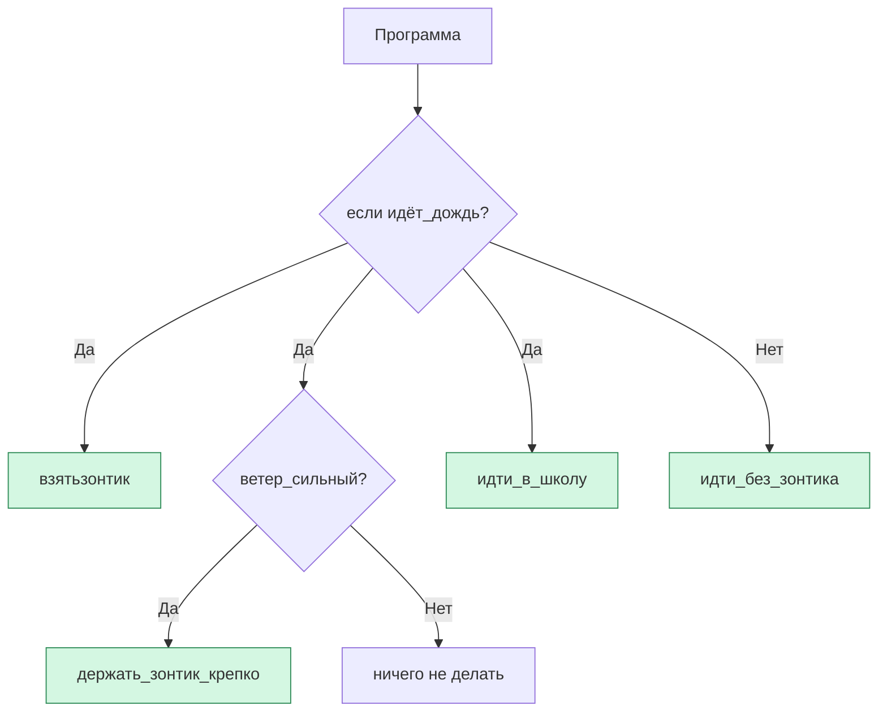

import ExternalPlayEmbed from '@site/src/components/ExternalPlayEmbed';


# Блоки

<div class="article-tags">
  <span class="tag tag-required">ОБЯЗАТЕЛЬНО</span>
  <span class="tag tag-beginner">ДЛЯ НОВИЧКОВ</span>
</div>

<span class="complexity-badge">Начальный уровень</span>

<div class="callout callout--tip">
  <div class="callout-title">Интерактив</div>

  <div class="callout-body">
  Демо ниже — нажимайте кнопки и смотрите, как это устроено. Ничего на компьютере не меняется.
</div>
  </div>


<ExternalPlayEmbed example="code-basics/block-builder" title="Конструктор блоков" minHeight={420} />

---

## Блоки

Вы хотите построить дом. Вы не начинаете с того, чтобы сразу вбить гвоздь в облако — сначала берёте кирпичи. Один кирпич — это просто кусок глины. Но когда Вы складываете кирпичи в определённом порядке, между ними появляются стены, окна, крыша… и вот уже стоит дом, в котором можно жить.

Программы устроены точно так же. Их строят из **блоков** — особых частей кода, которые группируют действия, условия или данные. Блоки помогают программисту не запутаться — они показывают, *что к чему относится*, *когда что выполняется* и *как части программы связаны между собой*.

Эта глава — про то, что такое блок, зачем он нужен, и как с ним работать. Мы поговорим и про текстовые блоки (как в настоящих языках программирования), и про графические — те, что Вы могли видеть в Scratch или Blockly. **Блочный подход** — мощный способ мышления, которым пользуются и опытные разработчики. Практика на Scratch с построчным разбором — [мини-проекты в Lab](/lab/Примеры/1121).

---

### Что такое блок кода?

В большинстве языков программирования — например, в C#, Java, JavaScript, C++ — блок кода обозначается фигурными скобками:

```csharp
{
    // здесь находится блок
}
```

> ⚠ Обратите внимание: в тексте выше мы написали `{Блок}`, но технически это не настоящий код. Настоящий блок всегда содержит **содержимое** между открывающей `{` и закрывающей `}` скобкой.

Фигурные скобки — это как двери в комнату — всё, что находится **внутри** этих дверей, принадлежит одному и тому же смысловому "помещению". Например:

```javascript
if (свет горит) {
    выключить_свет();
    сказать("Теперь темно!");
}
```

Здесь весь код между `{` и `}` — это **блок**, который выполняется *только если* условие `свет горит` истинно. Если бы не было скобок, компьютер не знал бы, какие команды относятся к условию `if`, а какие — нет.

**Важно**: блок — это не просто "кусок кода". Это **логическая единица**, внутри которой:
- работают одни и те же правила (например, видимость переменных),
- все команды выполняются последовательно (если не указано иное),
- можно легко добавить или убрать целую группу действий, не нарушая остальную программу.

Вы пишете инструкцию для робота:

> 1. Возьмите яблоко.  
> 2. Помойте его.  
> 3. Положите на тарелку.  
> 4. Скажите: "Готово!"

А теперь — добавим условие:

> Если на кухне есть яблоко,  
> то  
> 1. Возьмите яблоко.  
> 2. Помойте его.  
> 3. Положите на тарелку.  
> 4. Скажите: "Готово!"  
> Иначе  
> скажи: "Яблока нет 😢".

Здесь два блока: один — после слова *"то"*, другой — после *"иначе"*. В текстовом коде это выглядело бы так (на условном псевдокоде):

```plaintext
если (на_кухне_есть_яблоко) {
    взять_яблоко();
    помыть();
    положить_на_тарелку();
    сказать("Готово!");
} иначе {
    сказать("Яблока нет 😢");
}
```

Обратите внимание: **отступы** (пробелы в начале строк) и **скобки** работают вместе — они помогают и человеку, и компьютеру видеть границы блоков. Отступы — для нас, скобки — для машины.

---

### Графические блоки

В обучении программированию существует другой подход: вместо печати кода — **перетаскивание блоков**. Такие среды, как **Scratch**, **Blockly** (от Google) или **EduBlocks**, превращают программирование в сборку конструктора — из готовых блоков.

Вот как это устроено.

Каждая команда — это отдельный "кирпичик" с определённой формой:

- Блоки-"шляпки" (например, *"когда зелёный флаг нажат"*) — всегда в начале.
- Блоки-"команды" (например, *"двигаться на 10 шагов"*) — можно присоединять друг к другу.
- Блоки-"условия" (например, *"если … то …"*) — имеют выемку, куда вставляется условие, и "карман" — куда можно вложить другие блоки.

Визуально это выглядит примерно так (в текстовом приближении):

```
┌──────────────────────┐
│ если <кошка касается мыши> то │
├──────────────────────┤
│    сказать "Мяу!" 2 сек │
│    изменить размер на 10% │
└──────────────────────┘
```

А теперь — ключевой момент: **графические блоки — это не "игрушка" и не "ненастоящее программирование"**. Это *то же самое*, только в другой форме.

Технически Blockly, например, внутри себя хранит древовидную структуру — точно такую же, какую строит компилятор из текстового кода. Когда Вы перетаскиваете блок `если`, программа создаёт узел с типом `IfStatement`, внутрь которого вкладываются узлы `Condition` и `ThenBlock`. Это — **абстрактное синтаксическое дерево**, или AST (Abstract Syntax Tree).

Простыми словами:  
> Когда Вы собираете блоки в Scratch — Вы *не просто играете*. Вы **строите структуру программы**, учитесь правильной вложенности, понимаете, что *"то"* и *"иначе"* — это отдельные "комнаты", и что нельзя положить действие *вне* блока условия, если оно должно выполняться *только при выполнении условия*.

Это особенно важно для детей 8–12 лет: печатать на клавиатуре им трудно — руки ещё не привыкли, ошибки в раскладке или пунктуации вызывают раздражение. Но логика — она уже есть. Графические блоки **освобождают мышление** от механики ввода и позволяют сосредоточиться на главном: *на последовательности, условиях и циклах*.

---

### Как устроена вложенность

Рассмотрим типичную структуру с вложенными блоками.

В текстовом виде (на Python-подобном псевдокоде):

```python
если (идёт_дождь) {
    взять("зонтик");
    если (ветер_сильный) {
        держать_зонтик_крепко();
    }
    идти_в_школу();
}
```

Здесь у нас:
- Внешний блок — всё, что связано с дождём.
- Внутри него — ещё один блок, относящийся только к случаю сильного ветра.

То есть:  
*"идти_в_школу"* выполняется всегда, если идёт дождь.  
*"держать_зонтик_крепко"* — только если идёт дождь **и** дует сильный ветер.

Это — **иерархия блоков**, и она критически важна. Ошибка в расстановке скобок или неправильная вложенность блоков в Scratch (например, вытащить один блок из-под "если") — приведёт к тому, что программа будет вести себя не так, как ожидается.

Чтобы лучше это представить, воспользуемся схемой.

---

#### Схема

Ниже — диаграмма в формате **Mermaid**, которую можно вставить в любой современный редактор (включая Obsidian, Typora, или онлайн-редактор Mermaid Live Editor).



> Как читать:  
> - Круглые узлы — это **блоки условий** (`если`).  
> - Зелёные прямоугольники — это **действия**, выполняемые внутри блоков.  
> - Стрелки показывают, *когда* какое действие происходит.  

Обратите внимание: блок `идти_в_школу()` находится *после* вложенного `ветер_сильный`, но *всё ещё внутри* внешнего `если идёт_дождь`. Это значит — он зависит от дождя, но **не зависит** от ветра.

---

### Почему блоки — это фундамент, а не деталь

Многие думают: "Блоки — это просто скобки, их легко запомнить". Но это не так.

Блоки учат нас **структурировать мышление**. Без понимания блоков невозможно:
- писать условия правильно (иначе действия выполнятся всегда, даже когда не должны),
- использовать циклы (например, `"повторять 5 раз {…}"` — что внутри `{…}`? Только то, что Вы вложили!),
- работать с функциями (всё, что функция "делает" — находится в её блоке),
- избегать багов при копировании кода (если Вы скопируете только часть блока — программа сломается).

Даже в языках без фигурных скобок (например, Python, где блоки обозначаются **отступами**), идея остаётся той же:

```python
if идёт_дождь:
    взять("зонтик")
    if ветер_сильный:
        держать_зонтик_крепко()
    идти_в_школу()   # ← этот отступ говорит: "я всё ещё в блоке if идёт_дождь"
```

Здесь отступ в 4 пробела — это и есть "невидимая скобка". И если Вы случайно уберёте пробелы перед `идти_в_школу()`, эта команда окажется *вне* условия — и будет выполняться **всегда**, даже в солнечный день.

Так что блоки — это не синтаксис. Это **границы ответственности**: что за что отвечает, и когда это происходит.

---

### Циклы

Мы уже знаем, что блок — это логическая "комната", внутри которой живут команды. А что, если эту комнату нужно пройти не один раз, а десять? Или пока не выполнится какое-то условие?

Для этого существуют **циклы** — конструкции, которые *многократно выполняют один и тот же блок*.

Вот три самых распространённых типа:

| Тип цикла | Когда используется | Пример (на псевдокоде) |
|----------|---------------------|------------------------|
| `повторить N раз` | Заранее известно, сколько раз | `повторить 5 раз &#123; шаг_вперёд() &#125;` |
| `пока (условие)` | Повторять, *пока* что-то верно | `пока (не_у_стены) &#123; шаг_вперёд() &#125;` |
| `для каждого` | Обработать каждый элемент списка | `для каждого фрукта в корзине { съесть(фрукт) }` |

Важно: **все три работают с блоками**. То есть, действие, которое повторяется — всегда *целиком* находится внутри `{ }`.

Вот как это выглядит в текстовом виде (JavaScript-подобно):

```javascript
// Повторить 4 раза: нарисовать квадрат из 4 шагов
повторить(4) {
    вперёд(50);
    поворот_направо(90);
}
```

А в Blockly — это один блок `повторить`, под который "вставляется" стопка других блоков:

```
┌──────────────────────┐
│ повторить 4 раза      │
├──────────────────────┤
│    вперёд 50          │
│    поворот направо 90 │
└──────────────────────┘
```

Обратите внимание: если Вы *не вложите* команду внутрь цикла — она выполнится **только один раз**, после всех повторений.

Например, ошибка новичка:

```javascript
повторить(3) {
    сказать("Привет!");
}
сказать("Пока!");   // ← вне блока — выполнится один раз, после цикла
```

Если же нужно сказать "Пока!" *каждый* раз, то и эту команду нужно положить внутрь:

```javascript
повторить(3) {
    сказать("Привет!");
    сказать("Пока!");   // ← теперь — трижды
}
```

Это — ещё один пример того, как блоки защищают от логических ошибок — они заставляют вас *явно указать*, что относится к повторению, а что — нет.

---

### Функци

Вы научились складывать бумажный самолётик. Вы делаете это по инструкции:

> 1. Согнуть лист пополам.  
> 2. Завернуть углы к центру.  
> 3. Согнуть пополам ещё раз.  
> 4. Отогнуть крылья.

Если друг попросит: "Сделайте самолёт!" — Вы не будете пересказывать всю инструкцию. Вы просто скажете: *"Сейчас сложу самолёт"* — и сделаете всё, что уже знаете.

В программировании то же самое делают **функции**.

Функция — это **именованный блок кода**, который можно вызывать по имени, сколько угодно раз.

Пример:

```python
функция сложить_самолёт() {
    согнуть_пополам();
    завернуть_углы();
    согнуть_ещё_раз();
    отогнуть_крылья();
}
```

А потом — использовать:

```python
сложить_самолёт();   // один самолёт
сложить_самолёт();   // второй
```

В Blockly функции тоже есть — они называются *"сделать блок"* или *"определить процедуру"*. Там Вы буквально **создаёте свой блок**, перетаскивая внутрь другие блоки, а потом этот "суперблок" появляется в палитре и его можно использовать как обычную команду.

Зачем использовать блоки

- **Экономия усилий**: не нужно копировать одни и те же действия.
- **Читаемость**: вместо 10 строк кода — одна строка `включить_режим_ночь()`.
- **Ошибки легче исправлять**: если в самолёте ошибка — её исправляют *в одном месте*, а не в десяти копиях.
- **Абстракция** — появляется возможность думать на уровне *целей* ("взлететь"), а не *действий* ("вперёд, вверх, вперёд…").

> Интересный факт: в Scratch 3.0 есть "Мои блоки" — и дети часто создают функции вроде `танцевать_по_кругу`, `мерцать_цветом`, `прыгать_три_раза`. Это — их первые шаги в инженерном мышлении: *проектировать повторяющиеся решения*.

---

### Отладка по блокам

Одна из самых сложных задач в программировании — найти, *почему* программа работает не так. Особенно когда код длинный.

Здесь блоки снова помогают — потому что их можно **проверять по одному**.

Робот не доходит до цели. Вместо того чтобы перечитывать всю программу, Вы мысленно "закрываете двери" в одни блоки и смотрите, что происходит внутри других.

Пример:

```javascript
идти_в_школу() {
    если (идёт_дождь) {
        взять("зонтик");     // ← работает?
        надеть("капюшон");   // ← а это?
    }
    открыть_дверь();         // ← выполняется?
    спуститься_по_лестнице(); // ← и это?
}
```

Если робот не выходит из дома — возможно, `открыть_дверь()` находится *внутри* блока `если`, хотя должны быть снаружи. Проверяя **границы блоков**, Вы быстро локализуете проблему.

В графических средах отладка ещё проще: Blockly и Scratch позволяют **запускать по шагам** — и видеть, какой блок сейчас "горит" (выполняется). Это как смотреть, как по конвейеру движутся детали: если где-то застряло — сразу видно.

---

### От графики к тексту

Многие думают: "Scratch — это игра, а настоящий код — совсем другой". Но это миф.

Рассмотрим, как один и тот же алгоритм выглядит в трёх форматах:

---

#### 1. Blockly (визуально)
```
┌───────────────────────────────┐
│ повторить пока (x < 200)       │
├───────────────────────────────┤
│    изменить x на 10            │
│    сказать x                   │
└───────────────────────────────┘
```

---

#### 2. Псевдокод (понятный человеку)
```plaintext
пока (координата x меньше 200) {
    увеличить x на 10;
    вывести x на экран;
}
```

---

#### 3. Настоящий код (JavaScript)
```javascript
while (x < 200) {
    x = x + 10;
    console.log(x);
}
```

Разница — лишь в "обёртке". Смысл одинаковый:
- условие проверяется **перед** каждым выполнением блока,
- содержимое блока — то, что повторяется,
- границы блока чётко обозначены.

Для **рисования** (как "опустить перо" в Scratch) в JavaScript часто используют библиотеку **p5.js** — те же циклы и углы, но сразу картинка на экране. Готовые скетчи: [Примеры фигур на Processing/p5.js](/lab/Примеры/1114); на Python — [Turtle](/lab/Примеры/111); в школьном **Кумир** — [Чертёжник и Черепаха](/lab/Примеры/1115) ([теория](/encyclopedia/9-spinoff/9-11-dlya-detey/5-kod/11)).

Задание для размышления:  
Попробуйте "перевести" следующий Scratch-блок в JavaScript:

```
┌────────────────────────────────┐
│ если <нажата клавиша [пробел]> то │
├────────────────────────────────┤
│    создать клон [себя]          │
│    если <y > 100> то            │
│    ├──────────────────────────┤
│    │    сказать "Высоко!" 2 сек │
│    └──────────────────────────┘
└────────────────────────────────┘
```

> Не нужно знать синтаксис точно — попробуйте передать структуру. Где открываются `{`, где закрываются? Какие блоки вложены?

---

### Когда текст встречает графику — "перевод" без потерь

Многие педагоги сталкиваются с проблемой: дети отлично справляются в Scratch, но "теряются" при переходе к Python или JavaScript. Причина не в сложности синтаксиса — а в том, что **связь между формами не сделана явной**.

Связь с текстовым кодом — этот разрыв — на конкретном примере.

Возьмём задачу:  
> "Когда нажимаете на кота — он мяукает. Если нажать 5 раз — он устаёт и засыпает".

---

#### Шаг 1. Blockly / Scratch (визуальная версия)

В Scratch это три блока, соединённых в стек:

```
┌───────────────────────────────────┐
│ когда щёлкнуть по [кот]           │
├───────────────────────────────────┤
│ изменить [счётчик] на 1            │
│ сказать "Мяу!" 1 сек               │
│ если <(счётчик) = 5> то            │
│ ├────────────────────────────────┤
│ │    переключиться на костюм [спит] │
│ │    остановить [все]              │
│ └────────────────────────────────┘
└───────────────────────────────────┘
```

Обратите внимание на структуру:
- Есть **глобальное действие** (увеличить счётчик, сказать "Мяу"),
- Есть **условный блок**, вложенный внутрь,
- Внутри условия — два действия.

---

#### Шаг 2. Псевдокод ("язык мышления")
```plaintext
при_щелчке_по_коту() {
    счётчик = счётчик + 1;
    сказать("Мяу!");

    если (счётчик == 5) {
        сменить_костюм("спит");
        остановить_всё();
    }
}
```

Здесь:
- `при_щелчке_по_коту()` — это **функция-обработчик события** (о событиях — в следующей главе),
- Все действия, относящиеся к щелчку, — внутри одного блока.

---

#### Шаг 3. JavaScript (реальный код в браузере)
```javascript
let счётчик = 0;

кот.addEventListener("click", function() {
    счётчик = счётчик + 1;
    кот.сказать("Мяу!");

    if (счётчик === 5) {
        кот.сменитьКостюм("спит");
        кот.остановить();
    }
});
```

Что изменилось?
- Появились *точки* (`кот.сказать`), *скобки* (`function() { … }`), *ключевые слова* (`let`, `if`, `addEventListener`).
- Но **структура блоков осталась неизменной**:
  - Весь код обработчика — внутри `{ }` после `function`,
  - Условие `if` — со своим блоком внутри.

> ✅ Вывод:  
> Переход от Scratch к JavaScript — это **замена обёртки при сохранении скелета**.  
> Если ребёнок умеет *видеть блоки* — синтаксис осваивается как словарь к уже известной грамматике.

---

### Ошибки, которые учат — "лишняя скобка" как учитель

Все делают ошибки. Но в программировании ошибки — *диалог с машиной*. Особенно если понимать, **какого рода ошибка произошла**.

Разберём три типичные "детские" ошибки с блоками — и чему они учат.

---

#### Ошибка 1. "Скобка потерялась"
```javascript
если (голоден) {
    съесть("бутерброд");
// ← забыли }
сказать("Спасибо!");
```

**Что делает компьютер?**  
Он ищет закрывающую `}`, и если не находит — выдаёт ошибку:  
`SyntaxError: Unexpected end of input` ("Неожиданный конец файла").

**Урок**:
  
Скобки — как скобки в математике: `(2 + 3)` — правильно, `(2 + 3` — бессмысленно.  
Программа *должны* знать, где кончается условие.

🛠 Совет: используйте редактор с **подсветкой парных скобок** (например, VS Code). Когда Вы ставите курсор на `{`, он подсвечивает соответствующую `}`.

---

#### Ошибка 2. "Блок выехал наружу"
```javascript
если (голоден) {
    съесть("бутерброд");
}
сказать("Спасибо!");   // ← отступа нет, но в Python это критично!
```

В Python отступы — часть синтаксиса. Без отступа `сказать` окажется *вне* блока `if` → будет выполняться всегда.

**Урок**:
  
Блоки — это **пространство**. Отступ — это "невидимая скобка".

🛠 Совет: настройте редактор на отображение пробелов (в VS Code: `View → Render Whitespace`). Тогда Вы *увидите*, где заканчивается блок.

---

#### Ошибка 3. "Вложил не туда"

В Scratch: перетащили `остановить всё` *снаружи* блока `если`, но хотели — внутрь.

**Что происходит?**  
Кот засыпает после *первой* Выковки, а не после пятой.

**Урок**:
  
Вложенность — это **логическая принадлежность**. Действие выполняется *тогда и только тогда*, когда оно внутри нужного блока.

🛠 Совет: проговаривайте вслух:  
> "Если счётчик равен 5, *тогда* — спать. А "Мяу!" — *каждый раз*, даже если не 5".

Это — **вербализация структуры**, и она мощнее любого правила.

---

### Блоки в реальном мире

Понимание блоков — это основа **инженерного мышления**, применимого везде:

| Сфера | Аналог блока |
|------|---------------|
| Кулинария | Рецепт: "Если тесто липкое → добавить муку" — это блок условия внутри шага "замесить тесто" |
| Музыка | Такт — это блок времени; в нём — ноВы (действия), разбитые на доли (вложенные блоки) |
| Архитектура | Этаж — блок; комната внутри этажа — вложенный блок; шкаф в комнате — ещё глубже |
| Планирование дня | "Утро" → блок; внутри — "зарядка", "завтрак"; в "завтраке" — "если есть йогурт → добавить фрукты" |

Когда ребёнок учится *выделять блоки*, он учится:
- **Декомпозиции** — делить сложное на управляемые части,
- **Иерархии** — понимать, что главное, а что — деталь,
- **Границам** — чётко видеть, где заканчивается зона ответственности одного решения и начинается другого.

Это — то, что делает из "исполнителя" — **проектировщика**.

---

### Практика — стартовые проекты MIT

Теорию блоков удобно закреплять **готовыми remix** с [scratch.mit.edu/starter-projects](https://scratch.mit.edu/starter-projects):

| Уже поняли | Откройте проект |
|------------|-----------------|
| Вложенность `если` внутри `если` | [Hide and Seek](https://scratch.mit.edu/projects/10128368) |
| Цикл `повторить` | [Walk Cycle](https://scratch.mit.edu/projects/1105114015) |
| Клоны | [Make a Mouse Trail](https://scratch.mit.edu/projects/1105118803) |
| Переменная-счётчик | [Pong Starter](https://scratch.mit.edu/projects/10128515) |

Полный каталог — в главе [Стартовые проекты MIT](/encyclopedia/9-spinoff/9-11-dlya-detey/5-kod/31). Платформер с гравитацией — в [практике из курса](/encyclopedia/9-spinoff/9-11-dlya-detey/5-kod/32).

---
