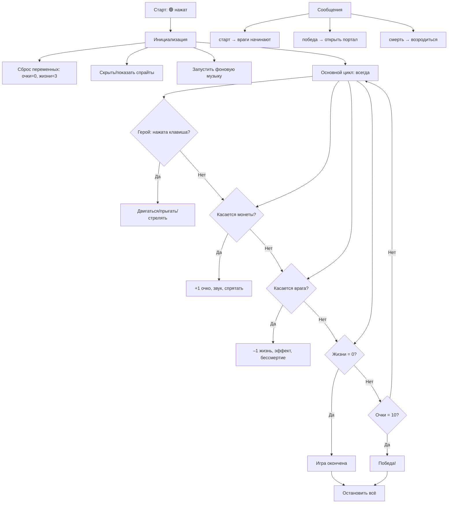

import ExternalPlayEmbed from '@site/src/components/ExternalPlayEmbed';


# Scratch

<div class="article-tags">
  <span class="tag tag-required">ОБЯЗАТЕЛЬНО</span>
  <span class="tag tag-beginner">ДЛЯ НОВИЧКОВ</span>
</div>

<span class="complexity-badge">Начальный уровень</span>

<div class="callout callout--tip">
  <div class="callout-title">С чего начать практику</div>

  <div class="callout-body">
  Справочник удобно держать открытым параллельно с пошаговыми играми: [метод обучения](/encyclopedia/9-spinoff/9-11-dlya-detey/5-kod/39) → [Scratch — радужные линии и первый проект](/encyclopedia/9-spinoff/9-11-dlya-detey/5-kod/33)–[Scratch — продвинутый платформер](/encyclopedia/9-spinoff/9-11-dlya-detey/5-kod/38) (шесть проектов от простого к сложному).

  Короткие примеры с разбором блоков — [мини-проекты Scratch](/lab/Примеры/1121).
</div>
  </div>


<div class="callout callout--tip">
  <div class="callout-title">Интерактив</div>

  <div class="callout-body">
  Демо ниже — нажимайте кнопки и смотрите, как это устроено. Ничего на компьютере не меняется.
</div>
  </div>


<ExternalPlayEmbed example="code-basics/block-builder" title="Конструктор блоков" minHeight={420} />

<div class="callout callout--info">
  <div class="callout-title">Готовые примеры MIT</div>

  <div class="callout-body">
  Каталог <a href="/encyclopedia/9-spinoff/9-11-dlya-detey/5-kod/31">стартовых проектов</a> (анимация, игры, музыка), пошаговые игры <a href="/encyclopedia/9-spinoff/9-11-dlya-detey/5-kod/33">33</a>–<a href="/encyclopedia/9-spinoff/9-11-dlya-detey/5-kod/38">38</a> и <a href="/encyclopedia/9-spinoff/9-11-dlya-detey/5-kod/32">практика "платформер и демосцена"</a> — с прямыми ссылками на remix на scratch.mit.edu.
</div>
  </div>


---

## Scratch

**Scratch** — это полноценная среда программирования, разработанная в MIT (Массачусетском технологическом институте), где учат самых разных людей — от первоклассников до исследователей. В Scratch Вы **собираете программы из цветных блоков**, как из пазлов. Блоки подходят друг к другу только тогда, когда это логично — например, к блоку "если …" можно подключить только условие, а не звук. Это называется *визуальным программированием*.

И да — на Scratch можно создать настоящую игру, мультфильм, музыкальный инструмент, тест или даже простого чат-бота. Всё, что Вы сейчас держите в руках (планшет, телефон, компьютер), тоже когда-то начиналось с таких "конструкторов".

---

### 1. Как устроен Scratch и как в него войти  

#### 1.1. Что такое Scratch?  

Scratch — это веб-платформа: чтобы начать, достаточно открыть браузер и перейти на сайт **[https://scratch.mit.edu](https://scratch.mit.edu)**. Там Вы увидите большую зелёную кнопку **"Создать"** (или "Создавай", "Начни создавать") — она и откроет редактор.


Редактор разделён на несколько областей:  

- **Сцена** — это "экран" вашей программы. Тут всё происходит — персонажи двигаются, появляются вспышки, играют звуки.  
- **Спрайты** — это персонажи, предметы, кнопки. У каждой игры может быть один или сто спрайтов.  
- **Область кода** — сюда Вы перетаскиваете блоки, чтобы составить программу.  
- **Палитра блоков** — "ящик с деталями", разделённый по темам — движение, внешний вид, звук, события и т.д.  
- **Список спрайтов** — справа внизу: тут Вы выбираете, кому из героев Вы сейчас пишете инструкции.  

Ниже — наглядно:


- 1 - Основная панель, на которой можно создать новый проект, перейти в руководство, авторизоваться.
- 2 - Палитра блоков
- 3 - Область кода
- 4 - Сцена
- 5 - Флажок для запуска сцены и кнопка остановки
- 6 - Список спрайтов (а выше - параметры спрайта)
- 7 - Управление фоном

> **Важно**: Scratch работает **в браузере**, и ничего устанавливать не нужно. Но чтобы сохранять свои проекты, нужно *зарегистрироваться*.  

---

#### 1.2. Как зарегистрироваться 

1. Нажмите **"Присоединиться к Scratch"** в правом верхнем углу на основной панели.  
2. Придумайте **имя пользователя** — оно будет видно другим, но не показывает ваше настоящее имя. Выбирайте что-то вроде "КосмоКот_2025" или "Робо_Алиса".  
3. Укажите **дату рождения** — это нужно только для того, чтобы платформа понимала, что Вы моложе 13 лет (тогда включаются особые правила защиты).  
4. Выберите пароль — пусть он будет надёжным (например, `Пароль7!Звезда`).  
5. Подтвердите почту: на неё придёт письмо с ссылкой. Перейдите по ней — и готово!  

> ✅ **Безопасность** — Scratch запрещает публиковать личные данные (номера телефонов, адреса школы, фото с лицом). Всё, что Вы опубликуете, проходит модератор. Можно работать *только в личном режиме* — тогда никто, кроме вас, не увидит проекты.

---

### 2. События и сообщения

#### 2.1. Что такое событие?  

Вы идёте по улице и внезапно слышите: *"Тимур, подожди!"* — Вы останавливаетесь. Это **событие** (вас окликнули) → **реакция** (Вы остановились).  

В Scratch программы тоже работают по принципу:  
> **Когда что-то произошло → сделать что-то.**

Эти "что-то произошло" и есть **события**.

По сути, спрайВы посылают друг другу сигналы, как будто шлют письмо. Для событий есть целый раздел "События" желтого цвета.


---

#### 2.2. Основные события в Scratch  

| Блок | Что значит | Пример использования |
|------|-------------|----------------------|
| `Когда 🟢 нажат` | При нажатии на зелёный флажок в углу сцены | Запуск всей игры |
| `Когда нажата клавиша [пробел]` | После нажатия клавиши | Прыжок, выстрел |
| `Когда получил сообщение [старт]` | Когда другой спрайт *отправил* это сообщение | Запуск врагов после таймера |


---

#### 2.3. Как работают сообщения?  

Сообщения — это способ **организовать порядок действий** между спрайтами, даже если они "не видят друг друга".  


Например:  
> Главный герой приходит к двери → отправляет сообщение `"открыть дверь"` → дверь слышит это сообщение и начинает анимацию открытия.

Это важнее, чем кажется — если бы каждый спрайт сам решал, *в какой момент* начинать действие, игра быстро стала бы хаотичной.

---

#### 2.4. Пример — "Старт игры по команде"  

**Цель**: при нажатии на зелёный флаг герой ждёт 2 секунды, затем кричит "Поехали!" и отправляет сигнал — и только тогда враги начинают двигаться.

**Шаги**:  
1. У героя:  
```scratch
   [Когда 🟢 нажат]
   ждать (2) сек.
   сказать [Поехали!] в течение (1) сек.
   отправить сообщение [старт]
```

2. У врага:  
```scratch
   [Когда получил сообщение [старт]]
   повторять
     изменить x на (-5)
     ждать (0.1) сек.
```

Так герой *управляет временем старта* — враги не пойдут, пока не услышат сигнал.

> **Примеры с разбором:** [меню и сообщения в Lab](/lab/Примеры/1121#soobshcheniya-menu) · [Примеры скриптов Scratch — скрипты](/lab/Примеры/112#события-и-сообщения)

---

### 3. Внешний вид, анимация и звуки  


---

#### 3.1. Костюмы

У каждого спрайта может быть несколько **костюмов** — это как кадры в мультфильме. Например, кот может иметь:  
- `кот_стоит`  
- `кот_бежит_1`  
- `кот_бежит_2`  
- `кот_прыгает`


Чтобы создать иллюзию движения, мы быстро переключаем костюмы.


**Основные блоки**:  
- `следующий костюм`  
- `включить костюм [имя]`  
- `ждать (0.1) сек.` — чтобы кадры не мелькали слишком быстро  

---

#### 3.2. Эффекты

Scratch позволяет менять **визуальные свойства** спрайта без смены костюма:  

| Эффект | Значение | Пример |
|--------|----------|--------|
| `цвет` | 0–200 (красный → фиолетовый → снова красный) | Плавное мерцание |
| `яркость` | -100 (тёмный) до 100 (светлый) | Вспышка при ударе |
| `размытие` | 0–100 | "туман", переходы |
| `размер` | % от исходного | Увеличение при усилении |

> 🎨 Совет: эффекты можно "накапливать". Чтобы сбросить — используйте `установить эффект [...] в (0)`.

---

#### 3.3. Звуки


Scratch имеет встроенную **библиотеку звуков** (звуки животных, шагов, выстрелов, музыки). Можно также загрузить свой (формат `.mp3` или `.wav`).  

Важные блоки:  
- `воспроизвести звук [мяу]` — запускает звук и сразу продолжает выполнение скрипта  
- `воспроизвести звук [мяу] и ждать` — ждёт, пока звук закончится  
- `остановить все звуки` — полезно при рестарте игры


---

#### 3.4. Пример — "Кот прыгает с эффектом"  

```scratch
[Когда нажата клавиша [пробел]]
установить эффект [яркость] в (50)
воспроизвести звук [прыжок] и ждать
изменить y на (80)   // вверх
ждать (0.2) сек.
повторить (8)
  изменить y на (-10)
  ждать (0.05) сек.
установить эффект [яркость] в (0)
```

Так прыжок выглядит ярче и "веселее".

---

### 4. Перемещение спрайтов — координаты, как в географи  

#### 4.1. Система координат в Scratch  

Экран в Scratch — это **координатная плоскость**.

  

- Центр сцены — точка **(0, 0)**  
- **X** — горизонталь: слева от центра — отрицательные числа (до -240), справа — положительные (до +240)  
- **Y** — вертикаль: внизу — отрицательные (до -180), вверху — положительные (до +180)  

> 📏 Размер сцены: 480×360 пикселей. 

```
          y = +180
              ↑
              │
              │
x = -240 ◄────┼────► x = +240
              │
              │
              ↓
          y = -180
```

- **Центр сцены**: `(0, 0)`  
- **Ширина сцены**: 480 пикселей (`-240` → `+240`)  
- **Высота сцены**: 360 пикселей (`-180` → `+180`)  
- **Направление по умолчанию**: `90°` — вправо  
  - `0°` — вверх  
  - `180°` — вниз  
  - `-90°` или `270°` — влево  

Как быстро переместиться в угол?

```scratch
перейти в x: (240) y: (180)   // правый верхний
перейти в x: (-240) y: (-180) // левый нижний
``` 

---

#### 4.2. Как двигаться? 

 

| Блок | Что делает |
|------|------------|
| `идти на (10) шагов` | Двигается в текущем направлении |
| `изменить x на (5)` | Сдвинуться вправо на 5 пикселей |
| `изменить y на (-10)` | Сдвинуться вниз на 10 |
| `направить в сторону (90)` | Повернуть вправо (0° — вверх, 90° — вправо, 180° — вниз, -90° — влево) |
| `направить в сторону [спрайт]` | "Смотреть на" другой объект |

---

#### 4.3. Отскоки — как в пинг-понге  

Чтобы мяч отскакивал от стен, используйте:  
```scratch
[Когда 🟢 нажат]
направить в сторону (случайное от (-45) до (45))
повторять
  идти на (5) шагов
  если <касается края?> то
    отскочить от края
  конец
```

> `отскочить от края` — это не просто разворот. Scratch автоматически меняет направление, как настоящий мяч: угол падения = углу отражения.

Например, благодаря этому, можно реализовать полноценное управление через клавиши.

 

---

## 5. Условия и условный оператор — учим программу думать

   

---

### 5.1. Что такое условие?  

Вы выходите из дома. Вы смотрите в окно и *задаёте себе вопрос*:  
> **"Идёт ли дождь?"**  

Если **да** → Вы берёте зонт.  
Если **нет** → оставляете его дома.

Это и есть **условное решение**: действие зависит от проверки.

В Scratch условия выглядят так:

```scratch
если <...> то
  ...
конец
```

А если нужно предусмотреть оба варианта:

```scratch
если <...> то
  ...
иначе
  ...
конец
```


---

### 5.2. Где "..."? — логические условия  

 

Scratch позволяет проверять самые разные ситуации. Вот основные:

| Тип условия | Блок | Пример использования |
|-------------|------|-----------------------|
| **Касание** | `<касается [спрайт/мышка/край]?>` | Поймал монетку? Ударился о врага? |
| **Сравнение чисел** | `<(очки) > (10)>` | Достаточно очков для перехода? |
| **Сравнение строк** | `<(имя) = [Макс]>` | Проверка пароля или имени |
| **Логические связки** | `< <A> и <B> >`, `< <A> или <B> >`, `<не <C&gt;&gt;` | "Касается земли **и** не летит" → можно прыгать |

> 🔍 Обратите внимание: условия всегда дают **ответ — да (истина) или нет (ложь)**. Именно поэтому они подходят *только* в "шестиугольные" разъёмы блоков `если` и `пока`.

 

---

### 5.3. Пример — "Сбор монет и жизнь"  

Герой собирает монеВы (+1 очко), но если касается врага — теряет жизнь.  

```scratch
[Когда 🟢 нажат]
установить [жизни v] в (3)
установить [очки v] в (0)

всегда
  если <касается [монета]?> то
    изменить [очки v] на (1)
    спрятать  // монета исчезает
    воспроизвести звук [звон]
  конец
  
  если <касается [враг]?> то
    изменить [жизни v] на (-1)
    сказать [Ай!] в течение (0.5) сек.
    ждать (1) сек.  // бессмертие на 1 сек
  конец
  
  если <(жизни) = (0)> то
    остановить [все v]
    сказать [Игра окончена.] в течение (3) сек.
  конец
```

Здесь три независимых условия работают *одновременно* — как три стражника, каждый следит за своим.

> **Lab:** [игра "Собери монеты"](/lab/Примеры/1121#sobira-monety)

---

## 6. Циклы


---

### 6.1. Почему циклы нужны?  

Вам нужно нарисовать забор из 20 досок.  
Можно 20 раз написать:  
> *"Поставить доску. Сдвинуться вправо."*  

А можно сказать один раз:  
> **"Повтори 20 раз: поставить доску и сдвинуться."**

Это и есть **цикл** — повторение блока кода заданное число раз или *пока выполняется условие*.


---

### 6.2. Три типа циклов в Scratch  

| Тип | Блок | Когда использовать |
|-----|------|---------------------|
| **Повтори N раз** | `повторить (10)` | Точно известно, сколько раз: шаги, взмахи крыльями |
| **Всегда** | `всегда` | Непрерывные действия: движение, проверка касаний |
| **Пока** | `повторять пока <...>` | Действие до тех пор, пока условие *истинно*: "бежать, пока не дойдёте до финиша" |

---

### 6.3. Пример — "Черепашка рисует квадрат"  

```scratch
[Когда 🟢 нажат]
опустить перо  // из модуля "Перо"
повторить (4)
  идти на (100) шагов
  повернуть направо на (90) градусов
конец
поднять перо
```

Один цикл — и готово. Без него пришлось бы 4 раза копировать одни и те же два блока.

> **Lab:** [квадрат и радуга с разбором блоков](/lab/Примеры/1121#kvadrat-scratch)


---

### 6.4. Важно — "всегда" ≠ "зависание"  

Цикл `всегда` — не ошибка. Он работает *параллельно* с другими скриптами. Но если внутри `всегда` нет `ждать`, Scratch может "захлебнуться" — поэтому **всегда добавляйте небольшую паузу** (0.01–0.1 сек), особенно при проверках.

---

## 7. Переменные и типы данных

 

---

### 7.1. Что такое переменная?  

У вас есть **ящики**, на каждом — этикетка:  
- `очки`  
- `имя`  
- `игра_активна`  

В ящик `очки` Вы кладёте число — **5**, **100**, **-3**.  
В `имя` — слово: **"Алиса"**, **"Робо-23"**.  
В `игра_активна` — флажок: **да** / **нет**.

 

В программировании такой "ящик" называют **переменной** — потому что то, что в нём лежит, может *меняться* со временем.

---

### 7.2. Как создать переменную?  

В Scratch:  
1. Вкладка **"Переменные"** → **"Создать переменную"**  
2. Название: `очки`  
3. Выбор:  
   - **Для всех спрайтов** (глобальная) — если всем нужно знать счёт  
   - **Только для этого спрайта** (локальная) — например, `здоровье` у каждого врага своё  

После создания появляются блоки:  
- `установить [очки v] в (0)`  
- `изменить [очки v] на (1)`  
- `(очки)` — *значение* переменной (можно подставлять в условия и формулы)

---

### 7.3. Типы данных


| Тип | Что хранит | Примеры | Как определяется в Scratch |
|-----|-------------|---------|-----------------------------|
| **Число** | Целые и дробные | `5`, `3.14`, `-10` | Автоматически, если ввести число |
| **Строка** | Текст | `"Привет"`, `"Level 2"` | Всё в кавычках — или через `спросить` |
| **Булево** | Да/Нет, Истина/Ложь | `истина`, `ложь` | Результат условий: `<5 > 3>` → `истина` |

> ⚠️ Scratch **не требует** указывать тип вручную — он определяет его по значению. Но важно *помнить*:  
> - `"5" + "3"` → `"53"` (склеивание строк)  
> - `(5) + (3)` → `8` (сложение чисел)  
> — разница в скобках и кавычках!


Комбинирование разных типов данных позволяет даже формировать сложные проекты, вроде калькулятора:


---

### 7.4. Пример — "Суперсила на время"  

Герой подбирает бустер → `сила = истина` на 5 секунд:  

```scratch
[Когда касается [бустер] и <не <сила>>]
установить [сила v] в (истина)
надеть эффект [цвет] на (100)
воспроизвести звук [усиление]
ждать (5) сек.
установить [сила v] в (ложь)
сбросить эффекты
```

А в атаке:  
```scratch
если <(сила) = истина> то
  воспроизвести звук [взрыв]
  сказать [БАМ!] в течение (0.3) сек.
иначе
  сказать [Тук.] 
конец
```

---

## 8. Случайные числа и диапазоны


---

### 8.1. Зачем нужна случайность?  

В реальной жизни многое происходит случайно:  
- Где упадёт монетка?  
- Какой вопрос выпадет в викторине?  
- Где появится враг?  

Без случайности игра быстро станет скучной — всё предсказуемо.

---

### 8.2. Блок `случайное от () до ()`  

Находится в категори **"Операторы"**. Примеры:  
- `случайное от (1) до (6)` — бросок кубика  
- `случайное от (-200) до (200)` — позиция по X  
- `случайное от (1) до (100) < 20` — 20% шанс события (ложь/истина)


---

### 8.3. Пример — "Появление врагов"  

```scratch
[Когда 🟢 нажат]
всегда
  ждать (случайное от (2) до (5)) сек.
  создать клон от [враг v]
конец

[Когда я начинаю как клон]
перейти в x: (240) y: (случайное от (-150) до (150))
показать
повторять пока <x > (-250)>
  изменить x на (-3)
  ждать (0.02) сек.
конец
удалить этого клона
```

Здесь:  
- Враги появляются через 2–5 секунд (не ритмично!)  
- Каждый — на случайной высоте  
- Движутся слева направо и исчезают за краем

---

### 8.4. Как создать "5% шанс"?  

```scratch
если <(случайное от (1) до (100)) < (6)> то
  сказать [Редкий предмет!] 
  показать спрайт [бриллиант]
конец
```

Почему `< 6`? Потому что 1, 2, 3, 4, 5 — это 5 значений из 100 → 5%.

---

## 9. Клоны


---

### 9.1. Что такое клон?  

Клон — это **точная копия спрайта в момент создания**, но с собственной "жизнью":  
- Может быть в другом месте  
- Может иметь свои переменные (если использовать *локальные*)  
- Выполняет скрипт `Когда я начинаю как клон` независимо от других  

Это как клонирование ниндзя: все выглядят одинаково, но каждый бежит по своей тропе.

---

### 9.2. Как создать клон?  

1. У спрайта должны быть скрипт:  
```scratch
   [Когда я начинаю как клон]
   ... // что делать клону
   удалить этого клона  // обязательно в конце!
```
2. Где-то (например, по таймеру):  
```scratch
   создать клон от [этот спрайт v]
```

> ❗ Без `удалить этого клона` клоны будут накапливаться — и игра замедлится.

---

### 9.3. Индивидуальные свойства клонов  

Хотя клоны создаются от одного спрайта, каждый может "помнить" своё:  

```scratch
[Когда я начинаю как клон]
установить [скорость v] в (случайное от (2) до (6))
установить [урон v] в (округлить ((скорость) / 2))
показать
...
```

Здесь у каждого клона — своя `скорость` и `урон`, даже если переменные *локальные* (только для спрайта).


---

### 9.4. Пример — "Шутер с пулями"  

**У героя**:  
```scratch
[Когда нажата клавиша [пробел]]
создать клон от [пуля v]
```

**У пули**:  
```scratch
[Когда я начинаю как клон]
перейти в x: (x героя) y: (y героя)
показать
повторять пока <не <касается края? или касается врага?>>
  изменить x на (10)
  ждать (0.02) сек.
конец
удалить этого клона
```

Так можно стрелять много раз — каждая пуля живёт своей жизнью.

> **Lab:** [дождь и салют из клонов](/lab/Примеры/1121#klony-dozhd) · [Примеры скриптов Scratch — клон по пробелу](/lab/Примеры/112#клоны)

---

## 10. Операторы строк 


---

### 10.1. Строки  

В Scratch можно **работать с текстом**:  
- Склеивать  
- Измерять длину  
- Искать части  
- Сравнивать  

---

### 10.2. Основные строковые операции  

| Блок | Что делает | Пример |
|------|------------|--------|
| `объединить [Привет, ] и (имя)` | Склеивает строки | `"Привет, Алиса"` |
| `длина строки (имя)` | Считает символы | `"Кот" → 3` |
| `<(имя) = [Кот]>` | Проверка на точное совпадение | Учитывает регистр и пробелы! |
| `буква (1) от (имя)` | Берёт первую букву | `"Алиса" → "А"` |

> `"кот"` ≠ `"Кот"` — Scratch чувствителен к заглавным буквам.

---

### 10.3. Пример — "Пароль с подсказкой"  

```scratch
спросить [Введите пароль (3 буквы, начинается с "С")] и ждать
если <(длина строки (ответ)) = (3)> и <(буква (1) от (ответ)) = [С]> то
  сказать [Подходит!] 
иначе
  сказать [Подсказка: 3 буквы, первая — С]
конец
```

---

## 11. Чат-бот


---

### 11.1. Как устроен простой бот?  

Он **реагирует на ключевые слова** по заранее написанным правилам.  

Алгоритм:  
1. Спросить что-то  
2. Ждать ответа  
3. Проверить ответ:  
   - совпадает с `да`? → ответить "Отлично!"  
   - совпадает с `нет`? → "Жаль…"  
   - иначе → "Не понял. Повтори?"
   


---

### 11.2. Пример — "Друг-помощник"  

```scratch
[Когда 🟢 нажат]
сказать [Привет! Я — Бот. О чём поговорим?] в течение (2) сек.
спросить [Можно задать вопрос?] и ждать

если <(ответ) содержит [погода]> то
  сказать [Сегодня солнечно!] 
иначе
  если <(ответ) содержит [имя]> то
    сказать [Меня зовут Бот-2025!]
  иначе
    сказать [Интересно! Расскажите ещё.]
  конец
конец
```

> 🔍 Блок `содержит` — из расширения **"Текстовые операции"** (нужно включить внизу палитры блоков).

---

### 11.3. Как добавить память?  

Используем переменную `настроение`:  
- Если ответ `спасибо` → `установить [настроение v] в [хорошее]`  
- Потом:  
```scratch
  если <(настроение) = [хорошее]> то
    сказать [Рад был помочь!] 
  конец
```

---

## 12. Списки


---

### 12.1. Что такое список?  

Представьте **столбик в тетради**:  
```
1. Яблоко  
2. Хлеб  
3. Молоко  
```

Это **список покупок**. В программировании — **список**.

В Scratch:  
- Список может хранить числа, строки, даже результаВы условий  
- Каждый элемент имеет **номер** (индекс) — 1, 2, 3…  
- Можно добавлять, удалять, заменять, искать


---

### 12.2. Основные операции  

| Действие | Блок |
|---------|------|
| Создать | `создать список [инвентарь]` |
| Добавить в конец | `добавить [ключ] в [инвентарь v]` |
| Вставить на место 2 | `вставить [факел] в (2) в [инвентарь v]` |
| Удалить №3 | `удалить (3) из [инвентарь v]` |
| Длина списка | `(длина списка [инвентарь v])` |
| Перебор | `для каждого [предмет] в [инвентарь v]` → `сказать (предмет)` |

---

### 12.3. Пример — "Инвентарь и проверка"  

```scratch
[Когда касается [ключ]]
добавить [ключ] в [инвентарь v]
сказать [Ключ добавлен!] в течение (1) сек.

[Когда касается [дверь]]
если <[инвентарь v] содержит [ключ]> то
  сказать [Открыто!] 
  удалить [ключ] из [инвентарь v]
иначе
  сказать [Нужен ключ!] 
конец
```

---

## 13. Модуль "Перо"


---

### 13.1. Что даёт модуль "Перо"?  

Без модуля спрайВы только *двигаются*. С модулем — они могут **оставлять след**, как карандаш на бумаге. Это открывает мир:  
- Графиков и диаграмм  
- Рисовалок и песочниц  
- Визуализаци алгоритмов (например, сортировки)  
- Следов от пуль, трасс в гонках, линий телепортации  

---

### 13.2. Основные блоки  

| Группа | Блок | Назначение |
|--------|------|------------|
| **Управление** | `опустить перо` / `поднять перо` | Включить/выключить рисование |
| **Цвет** | `установить цвет пера в (75)` | 0—200 (как эффект "цвет") |
| **Толщина** | `установить размер пера в (2)` | Толщина лини в пикселях |
| **Заливка** | `заполнить` | Закрасить замкнутую область текущим цветом |
| **Очистка** | `очистить` | Стереть ВСЁ, что нарисовано пером на сцене |


> ⚠️ **Важно**:  
> - "Перо" рисует **на сцене**, а не на спрайте.  
> - Рисунок остаётся, даже если спрайт исчезает.  
> - `очистить` убирает только то, что нарисовано пером — не спрайВы и фон.

---

### 13.3. Пример 1 — "Художник-робот"  

```scratch
[Когда 🟢 нажат]
установить размер пера в (3)
установить цвет пера в (120)
опустить перо

всегда
  идти на (5) шагов
  если <нажата клавиша [влево]?> то
    повернуть влево на (15) градусов
  конец
  если <нажата клавиша [вправо]?> то
    повернуть вправо на (15) градусов
  конец
конец
```

Теперь при управлении стрелками робот рисует траекторию — как в игре *"Лабиринт с памятью"*.

> **Lab:** [рисовалка и квадрат](/lab/Примеры/1121#kvadrat-scratch) · [радужные линии](/lab/Примеры/1121#raduzhnye-linii) · [Scratch — радужные линии и первый проект — полный проект](/encyclopedia/9-spinoff/9-11-dlya-detey/5-kod/33)

---

### 13.4. Пример 2 — "Гистограмма очков"  

Допустим, у нас есть 4 игрока, и их очки хранятся в списке `[очки]` — `[12, 7, 20, 15]`.

```scratch
[Когда 🟢 нажат]
очистить
установить цвет пера в (90)
установить x в (-150)

для каждого [значение] в [очки v]
  опустить перо
  изменить y на ((значение) * 2)   // масштаб: 1 очко = 2 пикселя
  изменить x на (20)
  изменить y на ((-значение) * 2)
  поднять перо
  изменить x на (10)  // промежуток
конец
```

Получаем столбчатую диаграмму — без спрайтов, только лини.

---

## 14. Модуль "Музыка" 

 

---

### 14.1. Что можно делать?  

Scratch позволяет не просто *воспроизводить* звуки, но и **создавать музыку нота за нотой**, как на пианино.  

Модуль добавляет новые блоки:  
- `играть ноту (60) в течение (0.5) долей`  
- `установить темп в (60) ударов в минуту`  
- `установить инструмент в (1)` (1–20 — фортепиано, скрипка, барабаны и др.)

> 🎼 НоВы кодируются числами:  
> - До первой октавы = 60  
> - Ре = 62, Ми = 64, Фа = 65, Соль = 67, Ля = 69, Си = 71  
> - До второй = 72  
> — шаг = 2 для целых тонов, 1 для полутонов.

---

### 14.2. Пример — "Мелодия „В лесу родилась ёлочка“"  

```scratch
установить инструмент в (1)  // фортепиано
установить темп в (120)

играть ноту (67) в течение (0.5) долей  // соль
играть ноту (67) в течение (0.5) долей
играть ноту (69) в течение (1) долей    // ля
играть ноту (67) в течение (0.5) долей
играть ноту (72) в течение (0.5) долей  // до
играть ноту (71) в течение (1) долей    // си
```

Можно записать всю мелодию — и получить **музыкальную открытку**.

---

### 14.3. Интерактивное пианино  

Создайте 8 спрайтов-клавиш (белых).  
У каждой — скрипт:  

```scratch
[Когда щёлкнут по этому спрайту]
установить эффект [яркость] в (50)
играть ноту (60 + (номер * 2)) в течение (0.4) долей
ждать (0.1) сек.
установить эффект [яркость] в (0)
```

Где `номер` — от 0 до 7 (можно задать через переменную при клонировани или отдельно для каждой клавиши).  

Добавьте чёрные клавиши со смещением +1 — и будет настоящая октава.

---

## 15. Свои блоки — как создавать "функции"  


---

### 15.1. Зачем нужны свои блоки?  

Вы часто пишете:  
> *"Повернуть направо на 90°, сделать 100 шагов, повернуть на 90°, сделать 100 шагов…"*  

Это утомительно. Лучше один раз определить:  
> **"Нарисовать сторону квадрата"**  

— и использовать эту команду как готовый блок.

В Scratch это называется **"Создать блок"** (в категори *"Ещё"* → *"Создать блок"*).

---

### 15.2. Как создать блок?  

1. Нажмите *"Создать блок"*  
2. Название: `нарисовать_квадрат`  
3. ✅ *"Добавить входные данные"* → `размер` (число), `цвет` (число)  
4. Нажмите *"ОК"* → появится **заготовка**:  
```scratch
   определить нарисовать_квадрат (размер) (цвет)
```
5. Внутрь добавьте код:  
```scratch
   установить цвет пера в (цвет)
   опустить перо
   повторить (4)
     идти на (размер) шагов
     повернуть направо на (90)
   конец
   поднять перо
```

Теперь в палитре — новый блок `нарисовать_квадрат (100) (120)`, как будто он всегда был.


---

### 15.3. Пример — "Анимация прыжка" как блок  

```scratch
определить прыжок (высота)
установить [прыгать v] в (высота)
повторять пока <(прыгать) > (-высота)>
  изменить y на (прыгать)
  изменить [прыгать v] на (-1)
  ждать (0.02) сек.
конец
установить y в (пол)  // возврат на землю
```

Теперь герой прыгает одной командой:  
```scratch
[Когда нажата [пробел]]
прыжок (15)
```

> **Lab:** [свой блок "прыжок" с разбором](/lab/Примеры/1121#svoi-blok-pryzhok)

---

## 16. Как устроена игра на Scratch  

Чтобы понять структуру проекта, полезно нарисовать **блок-схему**. В книге можно вставить схему в формате **Mermaid** — её легко генерировать и встраивать в Markdown.

Вот обобщённая схема типичного Scratch-проекта:



> Эту схему можно показать детям как **"карту проекта"** перед началом кодирования. Она помогает спланировать логику, не погружаясь в блоки.

---

## 17. Проектирование и отладка  

### 17.1. Планирование перед кодом  

Перед тем как брать блоки, задайте вопросы:  
1. **Какая цель игры?** ("Собрать 10 монет, не касаясь врагов")  
2. **Кто участвует?** (герой, монеты, враги, дверь)  
3. **Какие правила?**  
   - Смерть при касани врага  
   - Победа при 10 монетах  
4. **Какие переменные нужны?** (`очки`, `жизни`, `игра_активна`)  
5. **Какие события?** (`🟢`, `пробел`, `получено сообщение [старт]`)

Можно нарисовать **эскиз на бумаге** — даже от руки.

---

### 17.2. Отладка — как искать ошибки  

| Симптом | Возможная причина | Как проверить |
|---------|-------------------|---------------|
| Герой не двигается | Нет `всегда`, или нет `ждать` | Посмотреть: есть ли бесконечный цикл? |
| Монета не исчезает | Забыли `спрятать` | Проверить скрипт монеты: есть ли реакция на касание? |
| Очки не растут | Переменная не глобальная / опечатка в названи | Кликнуть по `(очки)` — показывает ли текущее значение? |
| Клоны не удаляются | Нет `удалить этого клона` | Открыть монитор клона: их слишком много? |

---

### 17.3. СовеВы по отладке  

- **Включите показ переменных** на сцене — следите за изменениями в реальном времени.  
- **Добавьте `сказать` на 0.5 сек** в ключевые места — *"Проверяю касание"*, *"Добавляю очко"* — чтобы видеть, доходит ли код до этого места.  
- **Тестируйте по частям** — сначала движение, потом сбор монет, потом враги.  
- **Комментарии**: в Scratch есть блок *"комментарий"* (серый, без разъёмов) — пишите пояснения прямо в коде.

---

## 18. Облачные переменные и онлайн-возможности  

### 18.1. Что такое облачная переменная?  

Обычная переменная сохраняется **только на этом компьютере**.  
**Облачная** — сохраняется на серверах Scratch и видна **всем**, кто открывает проект.  

Примеры использования:  
- 🏆 **Лидерборд** (топ-3 игроков)  
- 🌍 **Мультиплеер (очень простой)**: один меняет `ход_игрока`, другой реагирует  
- **Голосование**: каждый клик — +1 к варианту  

---

### 18.2. Как создать?  

1. Создайте переменную  
2. Поставьте ✅ **"Облачная переменная"**  
3. Готово — рядом появится значок ☁️  

> ⚠️ Ограничения:  
> - Только **числа** (строки и списки — нельзя)  
> - Медленнее обычных (обновление с задержкой ~1 сек)  
> - Защита от спама: нельзя менять чаще ~1 раза в секунду  

---

### 18.3. Пример — "Онлайн-счётчик посетителей"  

```scratch
[Когда 🟢 нажат]
изменить [посетители ☁ v] на (1)
сказать (объединить [Вы — посетитель № ] и (посетители)) в течение (2) сек.
```

Первый запуск: `1`, второй — `2` и т.д., даже с другого компьютера.

---

### 18.4. Облачные списки?  

Scratch **не поддерживает** облачные списки. Но можно *имитировать*:  
- `рекорд1 ☁`, `рекорд2 ☁`, `рекорд3 ☁`  
- При новом рекорде:  
```scratch
  если <(очки) > (рекорд3 ☁)> то
    установить [рекорд3 ☁ v] в (очки)
    если <(очки) > (рекорд2 ☁)> то
      установить [рекорд2 ☁ v] в (рекорд3 ☁)
      ... и т.д.
    конец
  конец
```

> 🔮 Более гибкие решения — в других средах — **Snap!**, **Python + Flask**, но это — следующий уровень.

---

## 19. Хитбокс

В Scratch коллизия считается по **контуру костюма**. У героя с большой головой "лишняя" часть задевает платформу сверху или стену сбоку — игра ведёт себя несправедливо.

**Хитбокс** — отдельный костюм с маленьким прозрачным овалом у ног (или у центра корпуса). Перед проверкой `касается` переключите костюм на хитбокс, выполните проверку, верните обычный вид.

| Шаг | Действие |
|-----|----------|
| 1 | Дублировать костюм → нарисовать маленький овал внизу |
| 2 | Имя `хитбокс` |
| 3 | В коде: `включить костюм [хитбокс]` → `если касается …` → `включить костюм [обычный]` |

Пошаговая сборка в игре — [35 баскетбол](/encyclopedia/9-spinoff/9-11-dlya-detey/5-kod/35), [38 платформер](/encyclopedia/9-spinoff/9-11-dlya-detey/5-kod/38).

---

## 20. Склоны и потолок

Платформеры часто используют **разные цвета** на спрайте `Земля`:

| Цвет на рисунке | Типичная логика |
|-----------------|-----------------|
| Основной зелёный | обычный пол, `на_земле = истина` |
| Светлый зелёный | склон: при касании сдвигать x и y вверх по склону |
| Коричневый | потолок: остановить подъём, сбросить `скорость_y` |

Проверка — блок **касается цвета** с пипеткой по рисунку. Полный уровень со склоном и крабом — [Scratch — продвинутый платформер](/encyclopedia/9-spinoff/9-11-dlya-detey/5-kod/38).

---

## Что дальше

| Если хотите… | Откройте |
|--------------|----------|
| Пошаговые игры | [Scratch — как учиться по проектам — метод](/encyclopedia/9-spinoff/9-11-dlya-detey/5-kod/39), затем [Scratch — радужные линии и первый проект](/encyclopedia/9-spinoff/9-11-dlya-detey/5-kod/33)–[Scratch — продвинутый платформер](/encyclopedia/9-spinoff/9-11-dlya-detey/5-kod/38) |
| Remix от MIT | [Стартовые проекты MIT Scratch — каталог](/encyclopedia/9-spinoff/9-11-dlya-detey/5-kod/31) |
| Платформер из курса | [Scratch: платформер и демосцена](/encyclopedia/9-spinoff/9-11-dlya-detey/5-kod/32) |
| Текстовый код | [Python](/encyclopedia/9-spinoff/9-11-dlya-detey/5-kod/6), [JavaScript](/encyclopedia/9-spinoff/9-11-dlya-detey/5-kod/7) |

---
