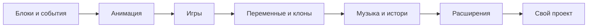

# Стартовые проекты MIT Scratch

  ОБЯЗАТЕЛЬНО
  ДЛЯ НОВИЧКОВ

Начальный уровень

  
Зачем эта глава

  

  На <a href="https://scratch.mit.edu/starter-projects" target="_blank" rel="noopener noreferrer">scratch.mit.edu/starter-projects</a> MIT собрал **готовые проекты с подсказками внутри кода**.

  Их удобно открывать после [главы про Scratch](/encyclopedia/9-spinoff/9-11-dlya-detey/5-kod/3) — с рабочим примером.

  

  
Как учиться по проекту

  

  <ol>
    <li>Откройте ссылку → нажмите <strong>Remix</strong> (Создать ремикс).</li>
    <li>Нажмите <strong>Смотреть внутри</strong> — откроется редактор с блоками.</li>
    <li>Читайте серые комментари в коде и меняйте по одному параметру (цвет, скорость, звук).</li>
    <li>Сохраните свой вариант под своим именем пользователя Scratch.</li>
  </ol>

  

Каждый проект на Scratch начинается с **Кота Scratch**. Стартовые шаблоны показывают, как из нескольких блоков получаются истории, игры, анимация и музыка. Ниже — каталог с прямыми ссылками (актуально для [официальной страницы starter projects](https://scratch.mit.edu/starter-projects)).

> **Новичкам:** сначала [руководство "Начало работы"](https://scratch.mit.edu/projects/editor/?tutorial=getStarted), затем 2–3 проекта из раздела "Анимация" или "Игры".

---

## Анимация

| Проект | Чему учит | Открыть |
|--------|-----------|---------|
| Dance Party | События, смена костюмов, ритм | [Dance Party](https://scratch.mit.edu/projects/1105113583) |
| Animate the Crab | Покадровая анимация персонажа | [Animate the Crab](https://scratch.mit.edu/projects/1105114913) |
| Walk Cycle | Цикл ходьбы из костюмов | [Walk Cycle](https://scratch.mit.edu/projects/1105114015) |
| Make a Mouse Trail | Клоны, след за мышью, эффекты | [Make a Mouse Trail](https://scratch.mit.edu/projects/1105118803) |
| Food Truck Animation | Сцена, несколько спрайтов, диалог | [Food Truck Animation](https://scratch.mit.edu/projects/1105114421) |
| Make It Fly | Движение по осям, фон, полёт | [Make It Fly](https://scratch.mit.edu/projects/1110545496) |

**Маршрут на неделю:** Mouse Trail → Walk Cycle → Make It Fly. Так Вы проходите клоны, костюмы и координаты без отдельной "теори".

---

## Игры

| Проект | Чему учит | Открыть |
|--------|-----------|---------|
| Maze Starter | Управление, стены, цель уровня | [Maze Starter](https://scratch.mit.edu/projects/10128431) |
| Dress Up Tera | Переключение костюмов, клики | [Dress Up Tera](https://scratch.mit.edu/projects/1105678528) |
| Pong Starter | Отскок от края, счёт, два игрока | [Pong Starter](https://scratch.mit.edu/projects/10128515) |
| Hide and Seek | Таймер, поиск объектов на сцене | [Hide and Seek](https://scratch.mit.edu/projects/10128368) |

После теори из [главы Scratch](/encyclopedia/9-spinoff/9-11-dlya-detey/5-kod/3) (условия, переменные, клоны) эти четыре проекта закрепляют **игровой цикл**: старт → действие → победа или проигрыш.

---

## Интерактивное искусство

| Проект | Чему учит | Открыть |
|--------|-----------|---------|
| Stamp Studio | Штампы, клоны, рисование на сцене | [Stamp Studio](https://scratch.mit.edu/projects/1111541829) |
| Interactive Parallax | Слои фона, движение мыши | [Interactive Parallax](https://scratch.mit.edu/projects/1105131011) |
| Soundflower | Звук и визуал вместе | [Soundflower](https://scratch.mit.edu/projects/1111537402) |
| Make Art Come Alive | Эффекты, реакция на клик | [Make Art Come Alive](https://scratch.mit.edu/projects/1106198418) |
| Spin Art | Перо, поворот, узоры | [Spin Art](https://scratch.mit.edu/projects/1105521187) |

Связь с разделом про [модуль "Перо"](/encyclopedia/9-spinoff/9-11-dlya-detey/5-kod/3#13-модуль-перо) в большой главе Scratch.

---

## Музыка

| Проект | Чему учит | Открыть |
|--------|-----------|---------|
| DJ Scratch Cat | Звуковые блоки, ритм | [DJ Scratch Cat](https://scratch.mit.edu/projects/11640429) |
| Piano | Ноты, клавиши-спрайВы | [Piano](https://scratch.mit.edu/projects/1106245381) |
| Catch the Fish, Increase the Pitch | Высота звука и координаты | [Catch the Fish](https://scratch.mit.edu/projects/1106268602) |
| Fur Elise with Music Blocks | Свои блоки для мелоди | [Fur Elise](https://scratch.mit.edu/projects/1106259376) |
| Drum Sequencer | Последовательность ударов | [Drum Sequencer](https://scratch.mit.edu/projects/1111562971) |

---

## Истори и мультфильмы

| Проект | Чему учит | Открыть |
|--------|-----------|---------|
| Story Starter | Сцены, диалог, переключение фона | [Story Starter](https://scratch.mit.edu/projects/1110565816) |
| 5 Random Facts About Me | Списки, случайный выбор | [5 Random Facts](https://scratch.mit.edu/projects/10014866) |
| Fill in the Blanks | Строки, ввод ответа | [Fill in the Blanks](https://scratch.mit.edu/projects/1110571119) |
| Stop Motion Animation | Покадровая съёмка костюмов | [Stop Motion](https://scratch.mit.edu/projects/1105521591) |
| Adventure with Scratch Cat | Квест, подсказки, поиск объектов | [Adventure with Scratch Cat](https://scratch.mit.edu/projects/1107181129) |

---

## Математика и наука

| Проект | Чему учит | Открыть |
|--------|-----------|---------|
| Gravity Example | Гравитация, прыжок, платформа | [Gravity Example](https://scratch.mit.edu/projects/1111567332) |
| Sound Graph | График и звук | [Sound Graph](https://scratch.mit.edu/projects/1105532968) |
| Math Game | Счёт, вопросы, переменные | [Math Game](https://scratch.mit.edu/projects/1106220358) |
| Simple Circuit Simulation | Логика "вкл / выкл" | [Simple Circuit](https://scratch.mit.edu/projects/1106279050) |
| X and Y Coordinates | Оси, перемещение, подписи | [X and Y Coordinates](https://scratch.mit.edu/projects/1106739913) |

**Gravity Example** и **X and Y Coordinates** — лучшая пара перед [практикой "платформер"](/encyclopedia/9-spinoff/9-11-dlya-detey/5-kod/32) из нашего курса.

---

## Расширения Scratch

В редакторе внизу слева нажмите **"Добавить расширение"**, затем откройте проект и смотрите, какие блоки добавились.

| Проект | Расширение / идея | Открыть |
|--------|-------------------|---------|
| Text to Speech | Озвучка текста | [Text to Speech](https://scratch.mit.edu/projects/1106234816) |
| Pen Flower | Перо, узоры | [Pen Flower](https://scratch.mit.edu/projects/1106765499) |
| Musical Droplets | Музыка + движение | [Musical Droplets](https://scratch.mit.edu/projects/1111576868) |
| Translate This! | Перевод строк | [Translate This!](https://scratch.mit.edu/projects/1110579465) |
| Face Filter | Видео с камеры | [Face Filter](https://scratch.mit.edu/projects/1208621527) |
| Greeting Card | Сцены и сообщения | [Greeting Card](https://scratch.mit.edu/projects/11806234) |
| Community Quiz | Вопросы и отвеВы | [Community Quiz](https://scratch.mit.edu/projects/1106806960) |
| Small Wins Trophy | Переменные, награда | [Small Wins Trophy](https://scratch.mit.edu/projects/1106823880) |

---

## Сообщество и доброжелательность

| Проект | Идея | Открыть |
|--------|------|---------|
| Random Acts of Kindness | Интерактивные пожелания | [Random Acts of Kindness](https://scratch.mit.edu/projects/1110573738) |
| Folding a Paper Plane Tutorial | Пошаговый мультфильм-инструкция | [Folding a Paper Plane](https://scratch.mit.edu/projects/1111552152) |

---

## Демосцена (продвинутый уровень)

Когда освоите клоны, перо и эффекты, можно разобрать **демо-проекты** — короткие визуальные "ролики" на чистом Scratch:

| Проект | Автор / стиль |
|--------|----------------|
| [Bezier Curve Generator](https://scratch.mit.edu/projects/28496264/) | Кривые Безье |
| [Plasma PG2](https://scratch.mit.edu/projects/18991290/) | Плазменный эффект |
| [Opac3tyD v1.4](https://scratch.mit.edu/projects/61991330/) | 3D-иллюзия |
| [dodecagon Sierpinski](https://scratch.mit.edu/projects/69320262/) | Фрактал |

Подробнее — в [практике из курса](/encyclopedia/9-spinoff/9-11-dlya-detey/5-kod/32#демосцена).

---

## Карта навыков

| Уже умеете | Следующий starter project |
|------------|---------------------------|
| Зелёный флаг, движение | Walk Cycle, Make a Mouse Trail |
| `если` и касание | Pong Starter, Hide and Seek |
| Переменные `очки` | Math Game, Maze Starter |
| Клоны | Catch the Fish, Stamp Studio |
| Координаты x/y | X and Y Coordinates → Gravity Example |

---

## Что дальше

- [Scratch — полный учебник](/encyclopedia/9-spinoff/9-11-dlya-detey/5-kod/3) — теория по всем темам  
- [Lab — мини-проекты с разбором](/lab/Примеры/1121) — короткие фрагменты для копирования  
- [Платформер: прыжок и гравитация](/encyclopedia/9-spinoff/9-11-dlya-detey/5-kod/32) — разбор из материалов курса  
- [Блоки](/encyclopedia/9-spinoff/9-11-dlya-detey/5-kod/2) — вложенность и переход к текстовому коду  
- [Edublocks](/encyclopedia/9-spinoff/9-11-dlya-detey/5-kod/4) — те же идеи, но с показом Python

---
