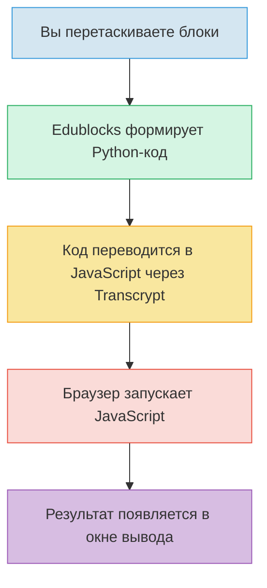

import ExternalPlayEmbed from '@site/src/components/ExternalPlayEmbed';


# Edublocks

<div class="article-tags">
  <span class="tag tag-required">ОБЯЗАТЕЛЬНО</span>
  <span class="tag tag-beginner">ДЛЯ НОВИЧКОВ</span>
</div>

<span class="complexity-badge">Начальный уровень</span>

<div class="callout callout--tip">
  <div class="callout-title">Интерактив</div>

  <div class="callout-body">
  Демо ниже — нажимайте кнопки и смотрите, как это устроено. Ничего на компьютере не меняется.
</div>
  </div>


<ExternalPlayEmbed example="code-basics/block-builder" title="Конструктор блоков" minHeight={420} />

---

## Edublocks

### 1. Что такое Edublocks?

Вы хотите собрать домик из конструктора LEGO®. У вас есть много разных деталей — кирпичики, окна, двери, крыша. Вы не придумываете их сами — они уже готовы. Вам нужно только правильно выбрать нужные детали и соединить их в правильном порядке. Всё! Домик готов.

**Edublocks — это такой же конструктор, только для программирования.**
  
Вместо кирпичиков — *блоки*. Каждый блок — это одна команда, одна идея, одно слово из языка программирования Python. А Вы — архитектор программы. Вы *собираете* код, как пазл.

Это особенно удобно, когда Вы только начинаете. Потому что:
- не нужно запоминать, как пишется каждая команда — блок уже написан за вас;
- нельзя ошибиться в скобках или двоеточиях — блоки просто не соединятся, если что-то не так;
- видно структуру программы целиком — как устроена логика, где что происходит.

> **Запомните:** Edublocks — *визуальное представление* настоящего Python-кода. Когда Вы перетаскиваете блок `print("Привет!")`, Edublocks "про себя" генерирует настоящую строку кода `print("Привет!")` и запускает её. То есть — это *обучающая оболочка* для реального языка.

---

### 2. Как устроен сайт Edublocks?

Открыв сайт Edublocks (например, `https://edublocks.org`), Вы сразу увидите три основные зоны. Они работают вместе, как три части одного механизма.

---

#### 🟦 Левая панель — "Ящик с блоками"
  
Здесь хранятся все команды, которые можно использовать. Блоки сгруппированы по категориям — как инструменВы в ящиках на верстаке механика:
- **Ввод и вывод** — команды `print` и `input`;
- **Логика** — `if`, `else`, сравнения (`>`, `<`, `==`);
- **Циклы** — `for`, `while`;
- **Математика** — сложение, умножение, случайные числа;
- **Звуки и рисование** — для анимаций и игр.

Каждый блок выглядит как фигурная деталь: у него есть "выступы" и "впадины", чтобы его можно было "защёлкнуть" к другому блоку. Например, блок с `if` имеет "карман" под условие, а внутри него может быть целая "вкладка" из других блоков — тело условия.

---

#### 🟥 Центр — "Рабочая область"
  
Это ваша "верстак-стол", куда Вы перетаскиваете блоки и собираете из них программу. Вы можете:
- перетаскивать блоки мышкой;
- соединять их — кликнули на один, "прицепили" к другому;
- выделять группу блоков и двигать их все сразу;
- удалять блок — просто перетащите его в корзину или нажмите Delete.

Важно — порядок блоков имеет значение! Компьютер выполняет их *строго сверху вниз*, как рецепт — сначала вымыть руки, потом налить муку, потом добавить яйцо… Если перепутать — торт не получится.

---

#### 🟩 Правая панель — "Окно вывода"
  
Здесь появляется то, что "говорит" программа. Если Вы написали `print("Здравствуй, мир!")`, то после запуска именно здесь появится фраза *Здравствуй, мир!* 
 
Если программа спрашивает `input("Как Вас зовут?")`, то в этом окне появится поле для ввода — и Вы можете напечатать свой ответ. А дальше программа продолжит работу, используя то, что Вы ввели.

А ещё здесь выводятся ошибки. Но не пугайтесь! В Edublocks ошибки показываются понятно — не "SyntaxError — invalid syntax", а, например:  
> *"Не хватает условия после if — добавьте блок сравнения, например: 5 > 3".*

---

### 3. Что такое онлайн-интерпретатор? И почему он "онлайн"?

Когда Вы пишете программу, компьютер не понимает её сразу. Ему нужно *перевести* человеческие команды в язык машин — нули и единицы. Этим занимается **интерпретатор** — специальная программа, которая:
1. читает ваш код (или блоки),
2. проверяет, правильно ли он устроен,
3. выполняет команды по одной, как дирижёр оркестром.

В Edublocks интерпретатор встроен прямо в сайт — и работает **в браузере**, без установки программ на компьютер. Это и значит *"онлайн"*:
- не нужно скачивать Python;
- не нужно настраивать среду;
- открыл вкладку — и готов программировать.

> 🔬 **Интересный факт:** Edublocks использует технологию *Transcrypt* — это инструмент, который превращает Python-код в JavaScript, чтобы он мог работать в браузере. То есть ваша программа сначала "собирается" из блоков в Python, потом переводится в JavaScript — и уже *этот* код запускается прямо у вас в окне браузера. Как переводчик на конференции: сначала фраза на русском → перевод на английский → слушатели понимают.

---

### 4. Python-подобный синтаксис — почему "подобный"?

Edublocks следует правилам Python, но немного адаптирует их ради ясности. Например:

| В настоящем Python | В Edublocks | Зачем изменено? |
|-------------------|-------------|----------------|
| `print("Привет")` | блок `напечатать "Привет"` | Чтобы не путать кавычки, скобки — в блоке текст уже "встроен". |
| `if x > 5:` | блок `если` → "карман" для `x > 5` → "тело" под ним | Визуально показано: условие отдельно, действие — внутри. |
| `for i in range(5):` | блок `повторить 5 раз` | Сразу ясно, *сколько* раз, без `range`, `i`, двоеточий. |

Это не упрощение — это *выделение сути*. Ребёнок сначала понимает:  
→ *"если" — значит, проверка;*  
→ *"повторить" — значит, цикл;*  
→ *"напечатать" — значит, вывод на экран.*  

Когда базовая логика усвоена, переход к настоящему Python происходит почти без боли: ведь структура уже знакома.

---

### 5. Простые структуры

В Edublocks можно начать с четырёх базовых блоков — и уже создавать работающие программы. Это как четыре стихи — земля, вода, огонь, воздух. Без них — никак.

---

#### `напечатать` (`print`)  

Самая первая команда любого программиста. Она ничего не вычисляет — просто *выводит* сообщение.
  
Пример:  
```
напечатать "Добро пожаловать в Edublocks!"
напечатать 7 * 6
```  

→ Выведет:  
```
Добро пожаловать в Edublocks!
42
``` 
 
Обратите внимание: текст в кавычках — как надпись на плакате, а число без кавычек — как результат расчёта.

---

#### `спросить` (`input`)  

Это "разговор" с программой. Она останавливается и ждёт, пока Вы что-то напечатаете.
  
Пример:  
```
имя = спросить "Как Вас зовут?"
напечатать "Рад(а) Вас видеть,", имя
```  

→ Если Вы введёте *Аня*, программа ответит:  
```
Рад(а) Вас видеть, Аня
```  

Знак `=` здесь "запомните под именем". Как надпись на коробке: *здесь лежит то, что ввёл пользователь*.

---

#### `если ... то ...` (`if`)  

Это мозг программы. Она смотрит на условие — и решает, что делать дальше. 
 
Пример:  
```
возраст = спросить "Сколько Вам лет?"
возраст = число(возраст)      // ← превращаем текст в число
если возраст >= 12:
    напечатать "Вы уже почти взрослый!"
иначе:
    напечатать "У Вас впереди столько интересного!"
```  

Важно: `>=` значит "больше или равно", а `число(...)` — специальный блок, который "переводит" текст `"12"` в число `12`, с которым можно сравнивать.

---

#### `повторить N раз` (`for`)  

Когда нужно сделать одно и то же много раз — использовать цикл.
  
Пример:  
```
повторить 3 раза:
    напечатать "Бип!"
```  
→ Выведет:  
```
Бип!
Бип!
Бип!
```  

А можно сделать счётчик:  
```
для i от 1 до 5:
    напечатать "Шаг", i
```  
→ Выведет:  
```
Шаг 1  
Шаг 2  
Шаг 3  
Шаг 4  
Шаг 5
```  
Буква `i` — просто имя переменной. Можно назвать `шаг`, `номер`, `счётчик` — главное, чтобы в блоке `напечатать` использовалось то же имя.

---

### 6. Схема

Вот как Edublocks превращает ваши блоки в работающую программу:



Обратите внимание: на каждом этапе ничего не теряется. Это как копировальный аппарат: оригинал → прозрачная плёнка → печать → готовый лист. Точность сохраняется.

---
