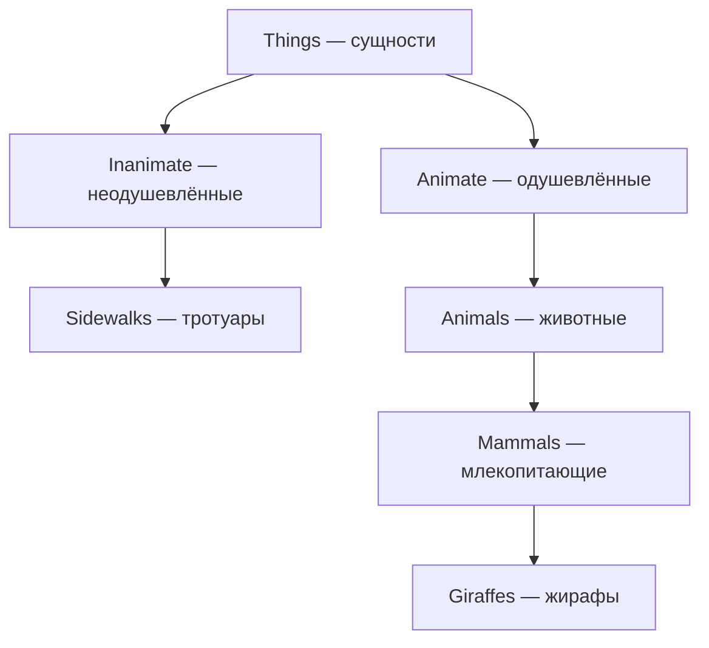

# Классы и объекты в Python

<div class="article-tags">
  <span class="tag tag-beginner">ДЛЯ НОВИЧКОВ</span>
</div>

<span class="complexity-badge">Родителям и детям</span>

<div class="callout callout--info">
  <div class="callout-title">Откуда материал</div>

  <div class="callout-body">
  Глава 8 книги Дж. Бриггса "Python для детей". Статья идёт перед играми <a href="/encyclopedia/9-spinoff/9-11-dlya-detey/5-kod/40">"Прыг-скок"</a> и <a href="/encyclopedia/9-spinoff/9-11-dlya-detey/5-kod/44">"Человечек спешит к выходу"</a> — там классы <code>Ball</code>, <code>Paddle</code> и <code>Game</code>.
</div>
  </div>

**Класс** — описание типа вещи в программе. **Объект** (или **экземпляр**) — одна конкретная вещь, созданная по этому описанию.

Аналогия из книги:

- класс **Giraffes** (жирафы) — общее понятие
- объект **reginald** — один конкретный жираф по имени Реджинальд

Тот же приём в turtle: класс `Pen`, объект `avery = turtle.Pen()` — см. [Черепашка turtle](/encyclopedia/9-spinoff/9-11-dlya-detey/5-kod/42).

---

## Примеры классов и объектов

| Что в игре или программе | Класс | Объект |
|--------------------------|-------|--------|
| Жираф Реджинальд | `Giraffes` | `reginald = Giraffes()` |
| Черепашка Эвери | `Pen` | `avery = turtle.Pen()` |
| Красный мяч | `Ball` | `ball = Ball(canvas, 'red')` |

Один класс порождает **много объектов**. Команда `harold.move()` двигает только Гарольда — у каждого объекта своё состояние.

---

## Иерархия и наследование

**Наследование** — когда один класс получает методы другого, "родительского". В книге это показано на шутливом дереве:



**Метод** — функция, привязанная к объекту. Класс **Giraffes** наследует метод `move()` от **Animals**, хотя код `move()` написан "выше" по дереву.

```python
class Animals:
    def move(self):
        print('двигается')

class Giraffes(Animals):
    def eat_leaves(self):
        print('ест листья')

reginald = Giraffes()
reginald.move()          # метод родителя Animals
reginald.eat_leaves()    # свой метод Giraffes
```

Запись `class Giraffes(Animals)` означает: Giraffes **наследует** от Animals.

---

## Параметр self

**self** — ссылка на **текущий объект**. Методы класса почти всегда принимают `self` первым аргументом.

```python
class Giraffes:
    def dance(self):
        self.move()
        self.move()
        print('танцует!')
```

- внутри класса пишут `self.move()`
- снаружи вызывают `reginald.move()` — Python сам подставляет объект вместо `self`

---

## Конструктор __init__

**`__init__`** — специальный метод, который Python вызывает **при создании** объекта. В нём задают начальные **свойства** (атрибуты):

```python
class Giraffes:
    def __init__(self, spots):
        self.giraffe_spots = spots

ozwald = Giraffes(100)
gertrude = Giraffes(150)
print(ozwald.giraffe_spots)    # 100
print(gertrude.giraffe_spots)  # 150
```

`self.giraffe_spots` — свойство объекта. У Озвальда 100 пятен, у Гертруды — 150, хотя класс один.

---

## Данные и действия в одном объекте

**Функция** выполняет действие. **Класс** объединяет **данные** (координаты, цвет, скорость) и **действия** (двигаться, отскакивать, рисовать) в одной "коробке".

В игре [Прыг-скок](/encyclopedia/9-spinoff/9-11-dlya-detey/5-kod/40) класс `Ball` хранит:

- `self.id` — номер фигуры на холсте
- `self.x`, `self.y` — скорость по осям
- `self.hit_bottom` — флаг проигрыша

Класс `Paddle` хранит положение ракетки и обработчики клавиш. Классы группируют переменные по смыслу — отдельно данные мяча, отдельно данные ракетки.

---

## Мини-проект — два мяча

Упрощённый фрагмент из главы 13 (без полного tkinter):

```python
class Ball:
    def __init__(self, color, x, y):
        self.color = color
        self.x = x
        self.y = y

    def draw(self):
        print(f'мяч {self.color} в ({self.x}, {self.y})')

red = Ball('красный', 10, 20)
blue = Ball('синий', 50, 30)
red.draw()
blue.draw()
```

Позже метод `draw()` будет двигать фигуру на **холсте** (Canvas) — см. [Прыг-скок](/encyclopedia/9-spinoff/9-11-dlya-detey/5-kod/40). **Canvas** — область на экране, куда tkinter рисует фигуры.

---

## Упражнения из книги

- **Жирафий танец** — методы `left_foot_forward`, `right_foot_back` и общий `dance()`, который их вызывает
- **Черепашьи вилы** — четыре `Pen()`, четыре независимые линии от одной точки

---

## Связанные материалы

- [Прыг-скок](/encyclopedia/9-spinoff/9-11-dlya-detey/5-kod/40) — классы `Ball` и `Paddle` в работе  
- [Человечек спешит к выходу](/encyclopedia/9-spinoff/9-11-dlya-detey/5-kod/44) — класс `Game`, спрайты, столкновения  
- [Черепашка turtle](/encyclopedia/9-spinoff/9-11-dlya-detey/5-kod/42) — объект `Pen`  
- [Паттерны проектирования](/encyclopedia/7-project/7-06-proektirovanie-i-arhitektura/design-patterns/123) — для старших школьников, когда классы станут привычными

---
