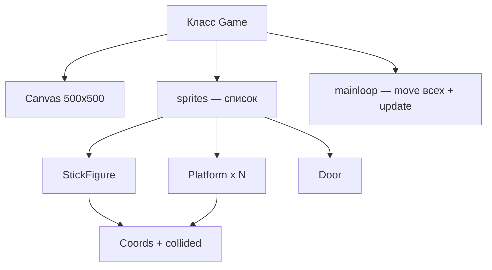

# Игра "Человечек спешит к выходу"

<div class="article-tags">
  <span class="tag tag-beginner">ДЛЯ НОВИЧКОВ</span>
</div>

<span class="complexity-badge">Родителям и детям 12+</span>

<div class="callout callout--info">
  <div class="callout-title">Откуда материал</div>

  <div class="callout-body">
  Главы 15–18 книги Дж. Бриггса "Python для детей". Вторая большая игра в том же цикле, что и <a href="/encyclopedia/9-spinoff/9-11-dlya-detey/5-kod/40">"Прыг-скок"</a>. Полный исходный код — на <a href="https://www.mann-ivanov-ferber.ru/" target="_blank" rel="noopener noreferrer">сайте издательства</a> и python-for-kids.com. Ниже — пошаговый план и ключевые фрагменты.
</div>
  </div>

<div class="callout callout--tip">
  <div class="callout-title">Что понадобится</div>

  <div class="callout-body">
  <ul>
    <li>Python 3 и IDLE (или VS Code)</li>
    <li>папка <code>stickman</code> с GIF-спрайтами рядом с файлом <code>.py</code></li>
    <li><a href="https://www.gimp.org/">GIMP</a> или другой редактор с прозрачным фоном</li>
    <li>основы классов — <a href="/encyclopedia/9-spinoff/9-11-dlya-detey/5-kod/43">Классы и объекты</a></li>
  </ul>
</div>
  </div>

**Платформер** — игра, где персонаж прыгает по платформам. **Сюжет** из книги: человечек в плену, нужно допрыгать к **двери выхода** наверху.

**Управление**

- стрелки ← → — бег
- пробел — прыжок

---

## Элементы игры

| Элемент | Файлы и поведение |
|---------|-------------------|
| Человечек | `figure-R1.gif` … `figure-R3.gif` (бег вправо), зеркальные `figure-L1` … `L3` (влево); 3 кадра на направление |
| Платформы | `platform1.gif`, `platform2.gif`, `platform3.gif` — три размера |
| Дверь | `door1.gif` (закрыта), `door2.gif` (открыта при победе) |
| Фон | `background.gif` 100×100 px, замостить холст 500×500 |
| Физика | гравитация, прыжок, проверка столкновений с платформами |
| Победа | герой коснулся двери на верхнем уровне |

**Спрайт** — готовая картинка персонажа или предмета. В [Прыг-скоке](/encyclopedia/9-spinoff/9-11-dlya-detey/5-kod/40) фигуры рисуют командами `create_oval` и `create_rectangle`. Здесь используют **готовые GIF**.

---

## Этап 1. Графика в GIMP

1. Создайте папку `stickman` рядом с будущим `stickmangame.py`.
2. Для персонажа и платформ включите **прозрачный фон** (Layer → Transparency → Add Alpha Channel).
3. Размер человечка — 27×30 px. Кадры бега вправо: `figure-R1.gif`, `figure-R2.gif`, `figure-R3.gif`. Для бега влево — зеркальные `figure-L1` … `L3`.
4. Экспортируйте в **GIF**. Стандартный `PhotoImage` в tkinter читает GIF без дополнительных библиотек.
5. Фон `background.gif` делайте **без** прозрачности. Его повторяют плиткой по всему холсту.

**Альфа-канал** — слой прозрачности. Если его нет, вокруг героя остаётся белый прямоугольник, который перекрывает платформы.

Похожий приём с костюмами — в Scratch-платформере [статья 38](/encyclopedia/9-spinoff/9-11-dlya-detey/5-kod/38).

---

## Этап 2. Каркас программы

Файл `stickmangame.py`:

```python
from tkinter import *
import time


class Game:
    def __init__(self):
        self.tk = Tk()
        self.tk.title("Человечек спешит к выходу")
        self.tk.resizable(0, 0)
        self.canvas = Canvas(self.tk, width=500, height=500, highlightthickness=0)
        self.canvas.pack()
        self.tk.update()

        self.bg = PhotoImage(file="background.gif")
        w, h = self.bg.width(), self.bg.height()
        for x in range(5):
            for y in range(5):
                self.canvas.create_image(x * w, y * h, image=self.bg, anchor='nw')

        self.sprites = []
        self.running = True

    def mainloop(self):
        while True:
            if self.running:
                for sprite in self.sprites:
                    sprite.move()
            self.tk.update_idletasks()
            self.tk.update()
            time.sleep(0.01)


g = Game()
g.mainloop()
```

**tkinter** — библиотека Python для окон и кнопок. **Canvas** — холст для рисования. **PhotoImage** загружает GIF с диска.

После запуска появится замощенный фон. Список `self.sprites` пока пуст — персонажей добавим позже.

---

## Этап 3. Координаты и столкновения

Класс **Coords** хранит прямоугольник спрайта:

- `(x1, y1)` — левый верхний угол
- `(x2, y2)` — правый нижний угол

Три функции из книги проверяют пересечение двух прямоугольников:

- `within_x(co1, co2)` — совпадают ли проекции по **горизонтали**
- `within_y(co1, co2)` — совпадают ли проекции по **вертикали**
- `collided(co1, co2)` — оба условия выполнены, прямоугольники пересекаются

Тот же приём, что метод `hit_paddle` в [Прыг-скоке](/encyclopedia/9-spinoff/9-11-dlya-detey/5-kod/40), только для **любых** прямоугольных спрайтов.

---

## Этап 4. Спрайты и анимация

Базовая структура класса спрайта:

```python
class Sprite:
    def __init__(self, game):
        self.game = game
        self.images = []      # кадры анимации
        self.coords = Coords()
        self.falling = True   # включена гравитация

    def move(self):
        # сдвиг, смена кадра, проверка collided с платформами
        pass
```

Типы спрайтов в игре:

- **StickFigure** — слушает клавиши, переключает кадры бега
- **Platform** — стоит на месте (в расширенной версии может двигаться)
- **Door** — при контакте на верхнем уровне показывает `door2.gif` и завершает игру

Класс **Game** хранит список `self.sprites`. Метод **mainloop** каждые 0,01 с вызывает `move()` у каждого элемента списка — это **игровой цикл**.

---

## Этап 5. Гравитация и прыжок

**Гравитация** в коде — увеличение координаты `y` каждый кадр, пока `falling = True`.

Порядок проверок:

1. Если `falling`, увеличить `y` (падение вниз).
2. Если `collided` с платформой сверху — `falling = False`, герой стоит на платформе.
3. По нажатию пробела задать отрицательную скорость по `y` (прыжок вверх), `falling = True`.
4. Если `y` вышел за нижний край экрана — проигрыш.

Скорость подбирают экспериментом. В "Прыг-скоке" мяч стартует с `self.y = -3` — здесь те же принципы.

---

## Схема программы



---

## Две игры из одной книги

**"Прыг-скок"**

- графика через `create_oval` и `create_rectangle`
- цель — отбивать мяч ракеткой
- мяч движется сам, игрок двигает только ракетку
- один экран без уровней

**"Человечек спешит к выходу"**

- графика через GIF-спрайты
- цель — дойти до двери
- игрок управляет героем
- несколько платформ, расположенных этажами

---

## Если что-то не работает

| Симптом | Что проверить |
|---------|---------------|
| Ошибка `PhotoImage` | GIF лежит в **той же папке**, что и `.py` |
| Белые квадраты вокруг героя | В GIMP не включён альфа-канал — переделайте экспорт |
| Проваливается сквозь платформу | Шаг падения слишком большой; проверяйте `within_y` на **полосу** высотой в несколько пикселей |
| Клавиши не реагируют | Кликните по окну игры, чтобы фокус перешёл на canvas |

---

## Дальше по книге и на сайте

- таймер, звуки, дополнительные уровни — упражнения в конце глав
- **Pygame** — библиотека для 2D-игр (послесловие книги)
- готовый код на сайте издательства — сравните со своей версией построчно

---

## Маршрут обучения

1. [Turtle](/encyclopedia/9-spinoff/9-11-dlya-detey/5-kod/42)  
2. [Классы](/encyclopedia/9-spinoff/9-11-dlya-detey/5-kod/43)  
3. [Прыг-скок](/encyclopedia/9-spinoff/9-11-dlya-detey/5-kod/40)  
4. **Эта статья**  
5. Свой уровень в Scratch — [платформер](/encyclopedia/9-spinoff/9-11-dlya-detey/5-kod/38)

---
