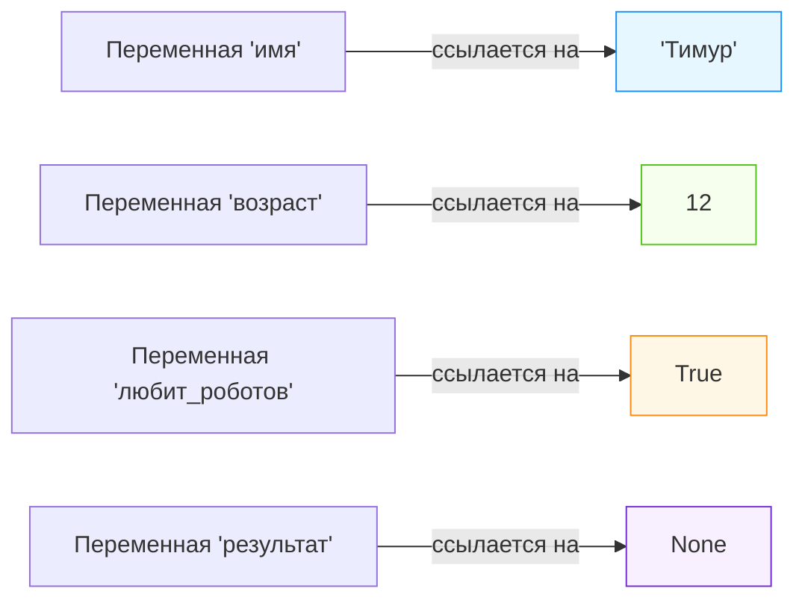

import ExternalCodeEmbed from '@site/src/components/ExternalCodeEmbed';


import ExternalPlayEmbed from '@site/src/components/ExternalPlayEmbed';


# Типы данных

<div class="article-tags">
  <span class="tag tag-required">ОБЯЗАТЕЛЬНО</span>
  <span class="tag tag-beginner">ДЛЯ НОВИЧКОВ</span>
</div>

<span class="complexity-badge">Начальный уровень</span>

<div class="callout callout--tip">
  <div class="callout-title">Интерактив</div>

  <div class="callout-body">
  Демо ниже — нажимайте кнопки и смотрите, как это устроено. Ничего на компьютере не меняется.
</div>
  </div>


<ExternalPlayEmbed example="about/data-types-play" title="Data Types" />

<div class="callout callout--info">
  <div class="callout-title">Примеры из «Python для детей»</div>

  <div class="callout-body">
  Волшебный список ингредиентов, словарь спортсменов и правила строк — в отдельной главе <a href="/encyclopedia/9-spinoff/9-11-dlya-detey/5-kod/41">Строки, списки и словари</a> (книга Дж. Бриггса, гл. 3).
</div>
  </div>

---

## Типы данных

Вы пришли в большую библиотеку. Там тысячи книг, но каждая лежит на своём месте — художественные — в одном зале, учебники — в другом, энциклопедии — в третьем. Если бы книги лежали просто вперемешку, искать нужную было бы почти невозможно. Компьютер устроен похоже — когда он работает с информацией, ему важно *понимать*, **с чем именно** он имеет дело — с текстом, числом, правдой или ложью. Иначе он не сможет правильно это использовать.

Это и есть **типы данных** — правила, которые помогают программе понимать, *какого рода* информация хранится в том или ином месте. Без них компьютер был бы как ребёнок, которому дали пульт от телевизора и сказали: "Нажмите на кнопку" — но не объяснили, *какую* кнопку и *зачем*.

Ниже — по порядку — от простого к чуть более сложному, но всё равно понятному.

---

### Что такое переменная?

Прежде чем говорить о типах, нужно понять, **куда** вообще попадает информация. Ответ — в **переменную**.

Переменная — это как ярлык на коробке. Сама коробка — это участок памяти компьютера. А ярлык — имя переменной, например `возраст`, `имя`, `лайкнуто`. В коробку можно положить что-то одно — число, слово, галочку "да/нет" — и потом обращаться к этому содержимому через ярлык.

Пример:
```python
имя = "Алиса"
возраст = 12
любит_роботов = True
```

Здесь:
- `имя` — переменная, в которой лежит текст `"Алиса"`;
- `возраст` — переменная со значением `12`;
- `любит_роботов` — переменная, в которой записан ответ на вопрос "любит ли Алиса роботов?" — и ответ `True` ("да").

Важно: переменная — это *не* то же самое, что значение. Это *контейнер* для значения. И как контейнеры бывают разного размера и назначения (стакан для воды, банка для варенья, чемодан для вещей), так и переменные бывают разного типа — потому что хранят разное.

---

### А что такое *память*? Зачем программе вообще что-то запоминать?

Компьютер — это гигантский, очень быстрый счётчик и сортировщик. Он ничего не "помнит" сам по себе — как стиральная машина не помнит, какую программу Вы запускали вчера, пока Вы снова не нажмёте кнопку.

Когда программа запускается, ей нужно где-то хранить промежуточные результаты:  
- что ввёл пользователь;  
- сколько очков набрал игрок;  
- как зовут персонажа;  
- завершилась ли игра.

Для этого выделяется **оперативная память (RAM)** — временный склад данных. Пока программа работает, информация живёт там. Когда программа закрывается — память освобождается, как будто Вы вынесли весь мусор из мастерской после ремонта.

Каждая переменная — это *запрос* на бронирование кусочка этой памяти. Но важно:  
компьютер не может просто "отрезать кусок памяти на глаз" — он должны знать, *сколько* именно байтов нужно;  
и *как* эти байВы потом интерпретировать — как текст? как число? как да/нет?

Именно поэтому **тип данных** — это не просто ярлык вроде "число" или "текст". Это техническое указание:  
- сколько памяти занять (например, целое число от −2 млрд до +2 млрд требует 4 байта);  
- как хранить биВы внутри (например, число 65 и буква `A` — это одни и те же 8 бит — `01000001`, но в одном случае это число, в другом — символ);  
- какие операции с этим можно делать (складывать числа — можно, складывать тексты — тоже, но по-другому; а к `True` прибавить `"кот"` — нельзя вообще — будет ошибка).

Это и есть **типизация** — система правил, по которым компьютер понимает: *что здесь лежит и что с этим можно делать*.

---

### Основные типы данных

#### 1. Текст (строка) — `str`, `string`

**Что это?** Любая последовательность символов внутри кавычек — `"Привет!"`, `'123'`, `"🚀🤖🔥"`.

Обратите внимание: даже если внутри кавычек стоит число — это *текст*. `"100"` + `"5"` даст `"1005"`, а не `105`. Нельзя умножить `"кот"` на 3 (в большинстве языков), но можно повторить его три раза: `"кот" * 3 → "коткоткот"` — и это уже не арифметика, а *операция над строками*.

**Как хранится?** Каждый символ кодируется числом (чаще всего по стандарту UTF-8). Буква `А` — это 192, `a` — 97, пробел — 32, смайлик 🤖 — 4 байта. Чем длиннее строка — тем больше памяти она занимает.

**Примеры использования:**
- Имя пользователя: `"Тимур"`  
- Сообщение в чате: `"Готово! Задание выполнено."`  
- Слово в игре "Поле чудес": `"ЭЛЕКТРИЧЕСТВО"`

---

#### 2. Целое число — `int`, `integer`

**Что это?** Число без дробной части — ни запятых, ни точек. Может быть отрицательным — `-17`, `0`, `42`, `1000000`.

Важно: не все целые числа равны с точки зрения памяти. Некоторые языки (например, Python) позволяют хранить *огромные* целые числа, но платят за это гибкостью и скоростью. Другие (например, C# или Java) выделяют строго фиксированный размер — и если число "не влезает", возникает ошибка переполнения.

**Как хранится?** В двоичной системе. Например, число `13` в 4-байтовом формате выглядит как `00000000 00000000 00000000 00001101`. Первый бит — знак: `0` = положительное, `1` = отрицательное (но для отрицательных чисел используется дополнительный код — это уже детали, пока можно не запоминать).

**Примеры использования:**
- Счётчик жизней в игре: `3`  
- Возврат индекса элемента в списке — `0`, `1`, `2`…  
- Год выпуска: `2025`

---

#### 3. Число с запятой (с плавающей точкой) — `float`

**Что это?** Число, у которого есть дробная часть: `3.14`, `-0.001`, `2.0`, `6.02e23` (это научная запись: 6.02 × 10²³).

В программировании *всегда* используется **точка**: `3.14`, а не `3,14`. Это международный стандарт — запятая могла бы восприниматься как разделитель аргументов.

**Но!** Числа с плавающей точкой — *приближённые*. Компьютер хранит их не как точные дроби (типа ⅓), а как сумму степеней двойки. Поэтому иногда возникает "странное" поведение:

```python
0.1 + 0.2  # → 0.30000000000000004
```

Это не ошибка. Это как если бы Вы пытались записать 1/3 в десятичной системе: `0.333...` — бесконечно. Так и компьютер: не может точно представить `0.1` в двоичной системе, поэтому накапливается погрешность.

**Примеры использования:**
- Температура: `36.6`  
- Координаты объекта на экране: `x = 102.5`, `y = 204.75`  
- Вероятность события: `0.75`

---

#### 4. Булево значение — `bool`, `boolean` — `True` и `False`

**Что это?** Ответ на вопрос "да/нет", "включено/выключено", "выполнено/не выполнено". Только два возможных значения:
- `True` — правда, истина, "да";
- `False` — ложь, "нет".

Названо в честь Джорджа Буля — математика XIX века, заложившего основы логики, которую сейчас используют все компьютеры.

**Как хранится?** Чаще всего — 1 бит (минимум), но на практике — 1 байт (из соображений выравнивания памяти). `False` = `0`, `True` = `1`.

**Где используется?** Везде, где нужна проверка:
- Условия: `if пользователь_вошёл:`  
- Циклы: `while игра_идёт:`  
- Флаги: `готово = False`

Интересный факт: в Python почти всё можно привести к `bool`. Пустая строка `""` → `False`, ноль `0` → `False`, `None` → `False`. А `" "` (пробел), `1`, `"False"` (это текст!) → `True`. Это называется *истинность объекта* — но это уже продвинутая тема.

---

#### 5. Ничего — `None` (Python), `null` (JavaScript, Java и др.)

**Что это?** Не "пусто", не "ноль", не "ошибка" — а специальное значение, означающее *отсутствие значения*.

У вас есть конверт с надписью "Подарок". Если конверт пуст — это не значит, что там лежит "ноль подарков". Просто *ничего не положили*. `None` — как такой пустой конверт.

**Зачем нужно?**
- Чтобы показать, что переменная *ещё не заполнена*:  
```python
  результат_поиска = None  # пока не искали
```
- Чтобы вернуть из функции "ничего полезного":  
```python
  def вывести_приветствие():
      print("Привет!")
      return None  # можно не писать — по умолчанию
```

Опасность: если попытаться использовать `None`, как число или текст — будет ошибка. Например: `None + 5` → `TypeError`.

---

### Как это всё работает вместе? Диаграмма памяти

Вот как это может выглядеть "под капотом":



**Что здесь происходит?**
- Каждая переменная — это *имя* (ярлык), привязанное к участку памяти.
- Размер участка зависит от типа: строки динамичны (чем длиннее — тем больше), числа и bool — фиксированы (в рамках одного языка).
- `None` тоже занимает место — потому что компьютер должны *знать*, что там "ничего", а не "мусор от прошлой программы".

---

## Составные типы и работа с коллекциями

Вы уже умеете хранить *одно* значение — имя, возраст, ответ "да/нет". Но реальная программа редко работает с единичными данными. Она управляет *наборами* — списком друзей, перечнем уровней в игре, каталогом книг, таблицей рекордов.

Для этого существуют **составные (коллекционные) типы данных** — контейнеры, которые могут держать *много* значений *одновременно*. Их называют по-разному — *структуры данных*, *коллекции*, *последовательности*. Мы рассмотрим самые распространённые.

> **Важно: составные типы — это не "новая магия". Это всего лите *способы организовать простые типы* (числа, строки, bool и т.д.) в удобные группы. Как ящики, разделённые на ячейки.

---

### 1. Список — `list`  

*"Коробка с пронумерованными отделениями"*

**Что это?** Упорядоченная последовательность элементов. Можно добавлять, удалять, менять — список *изменяем*.

Пример:
```python
друзья = ["Алиса", "Борис", "Вика"]
оценки = [5, 4, 5, 3, 5]
смешанное = ["Тимур", 12, True, None]
```

**Особенности:**
- ЭлеменВы нумеруются **с нуля**:  
`друзья[0] → "Алиса"`,  
`друзья[2] → "Вика"`.
- Длина может меняться:  
`друзья.append("Глеб")` → список стал длиннее.
- Внутри могут быть *любые типы* — даже другие списки:  
```python
  класс = [
      ["Алиса", 12, "математика"],
      ["Борис", 13, "физика"]
  ]
```

**Как хранится?**  
Внутри — массив ссылок (в Python) или непрерывный блок памяти (в C++). При добавлении в конец — быстро. При вставке в середину — медленнее: нужно "сдвинуть" все последующие элементы.

**Аналогия:**  
Представьте книжную полку, где каждая книга имеет номер (0, 1, 2…). Вы можете:
- Взять книгу №1 — быстро;
- Поставить новую книгу в конец — быстро;
- Вставить книгу между №1 и №2 — придётся сдвинуть все справа.

**Где используется:**  
- История сообщений в чате;  
- Список уровней в игре;  
- Результаты поиска (10 первых ссылок);  
- Корзина товаров.

---

### 2. Кортеж — `tuple`  

*"Коробка с запаянными отделениями"*

**Что это?** Тоже упорядоченная последовательность — но **неизменяемая**. После создания нельзя ни добавить, ни заменить, ни удалить элемент.

Пример:
```python
координаты = (100, 200)
цвет = (255, 128, 0)  # RGB: оранжевый
дата = (2025, 11, 10)  # год, месяц, день
```

**Особенности:**
- Записывается в **круглых скобках** (но можно и без — главное, запятая: `x = 5,` — это кортеж из одного элемента!);
- ЭлеменВы тоже индексируются с нуля: `координаты[0] → 100`;
- Быстрее списка при чтени (меньше служебной информации);
- Можно использовать как *ключ* в словаре (список — нельзя!).

**Почему неизменяемость — это хорошо?**  
Потому что гарантирует **целостность данных**. Если Вы передаёте координаты точки в функцию, Вы уверены: её никто "случайно" не сдвинет внутри. Это как отправить посылку в запломбированной коробке, а не в рюкзаке с молнией.

**Аналогия:**  
GPS-координаты места: широта и долгота — фиксированная пара. Изменить их нельзя — можно только *получить новую пару* для другого места.

---

### 3. Словарь — `dict`  

*"Телефонная книга"*

**Что это?** Набор пар **"ключ → значение"**. Порядок *не гарантируется* (в старых версиях Python), но в новых — сохраняется (как побочный эффект реализации).

Пример:
```python
профиль = {
    "имя": "Алиса",
    "возраст": 12,
    "город": "Казань",
    "хобби": ["роботы", "математика"]
}
```

**Особенности:**
- Доступ — по *ключу*, а не по номеру:  
`профиль["имя"] → "Алиса"`  
  (а не `профиль[0]` — это было бы ненадёжно: вдруг порядок поменяется?);
- Ключами могут быть только *неизменяемые* типы — строки, числа, кортежи. Списки — нельзя;
- Очень быстро ищет по ключу — даже если в словаре миллион записей.

**Как это работает?**  
Компьютер вычисляет **хеш** от ключа — как "отпечаток пальца" строки `"имя"` — и по нему находит ячейку в памяти. Это как если бы в телефонной книге не листали страницы, а сразу шли в нужную ячейку по первым буквам фамили.

**Где используется:**  
- Настройки программы (`настройки["звук"] = True`);  
- JSON-данные (почти все API в интернете отдают данные именно в виде словарей);  
- Счётчики: `{ "кот": 5, "собака": 3 }`.

---

### 4. Множество — `set`  

*"Мешок с уникальными фишками"*

**Что это?** Неупорядоченная коллекция **уникальных** элементов. Нет дубликатов. Нет порядка. Можно быстро проверять: "есть ли такой элемент?"

Пример:
```python
теги = {"роботы", "математика", "программирование"}
теги.add("игры")  # добавит, если ещё нет
теги.add("роботы")  # ничего не сделает — уже есть!
```

**Особенности:**
- Записывается в **фигурных скобках**, но без `ключ: значение`;
- Поддерживает операции из теории множеств:  
`A ∪ B` — объединение (`|`),  
`A ∩ B` — пересечение (`&`),  
`A − B` — разность (`-`).
- Проверка принадлежности (`"роботы" in теги`) работает за *постоянное* время — O(1), даже для миллиона элементов.

**Аналогия:**  
Мешок с буквами из игры "Эрудит". Вы не знаете, в каком порядке они лежат. Но Вы легко можете:
- проверить, есть ли буква `К`;
- высыпать все буквы из двух мешков и убрать повторы — это объединение;
- оставить только те, что есть в обоих — пересечение.

**Где используется:**  
- Удаление дубликатов из списка: `list(set(список))`;  
- Быстрая проверка "уже видели этот URL?" при парсинге сайтов;  
- Поиск общих друзей: `друзья_Алисы ∩ друзья_Бориса`.

---

### Как выбирать подходящий тип?

| Задача | Подходит | Почему |
|--------|----------|--------|
| Хочу хранить последовательность и менять её | `list` | Можно добавлять, удалять, менять |
| Хочу передать координаты и быть уверенным, что их не исказят | `tuple` | Неизменяемость = безопасность |
| Хочу обращаться к данным по смысловому имени (`"город"`, а не `[2]`) | `dict` | Читаемо, надёжно, быстро |
| Хочу быстро проверять наличие и избегать дублей | `set` | Уникальность + скорость поиска |

Совет: начинайте со списка или словаря — они самые "дружелюбные". Переходите к кортежам и множествам, когда появится *конкретная причина*: безопасность данных или производительность.

---

### Приведение типов

Иногда данные приходят в "неправильной" упаковке. Например, пользователь ввёл возраст как текст `"12"`, а вам нужно прибавить 1 — но `"12" + 1` не сработает.

Для этого существуют **функции приведения типов**:

| Из → В | Функция | Пример |
|--------|---------|--------|
| `str` → `int` | `int()` | `int("12") → 12` |
| `str` → `float` | `float()` | `float("3.14") → 3.14` |
| `int`/`float` → `str` | `str()` | `str(42) → "42"` |
| `любой` → `bool` | `bool()` | `bool(0) → False`, `bool("0") → True` |

**Опасные места:**
- `int("3.14")` — ошибка! Надо сначала в `float`, потом в `int`: `int(float("3.14"))`;
- `int("")` — ошибка. Пустая строка не число;
- `bool("False")` → `True`, потому что `"False"` — *не пустая строка*.

**Правило безопасности:**  
> Перед приведением — *проверяйте*, можно ли это сделать.  
> В Python:  
> ```python
> текст = input("Возраст: ")
> if текст.isdigit():  # состоит только из цифр?
>     возраст = int(текст)
> else:
>     print("Нужно ввести число!")
> ```

---

### Типизация в разных языках

Вы уже видели, что в Python можно написать:
```python
x = 5
x = "пять"
```
— и это нормально. А в Java так нельзя. Почему?

---

#### Динамическая типизация (Python, JavaScript, PHP)
- Тип "приклеен" к *значению*, а не к переменной;
- Переменная — просто ярлык, который можно переклеить на другую коробку;
- Гибко, быстро для прототипов — но ошибки выявляются *во время выполнения*.

---

#### Статическая типизация (C#, Java, TypeScript, Rust)
- Тип "приклеен" к *переменной* при объявлении:
```csharp
  int возраст = 12;
  // возраст = "двенадцать";  ← ошибка на этапе компиляции!
```
- Компилятор проверяет соответствие *до запуска*;
- Требует чуть больше кода, но даёт уверенность и подсказки в редакторе.

**TypeScript** — интересный гибрид: JavaScript + *опциональная* статическая типизация. Можно начать без типов, а потом постепенно добавлять — как ремень безопасности в машине.

---

### Как это всё складывается в реальном проекте?

Представим игру "Космический зоопарк" для 10-летних. Вот как могут выглядеть данные:


<ExternalCodeEmbed example="python/sp-9-9-11-dlya-detey-5-kod-5-001" title="Как это всё складывается в реальном проекте?" minHeight={480} />


Здесь:
- Простые типы (`int`, `float`, `bool`) — для состояний;
- `str` — для всего, что "читает человек";
- `list` — для упорядоченных, изменяемых наборов;
- `tuple` — для неизменяемых пар/троек (координаты, размеры);
- `dict` — для объектов с именованными свойствами;
- `set` — для флагов "уже сделано".

Это и есть **архитектура данных** — даже в детской игре.

---
